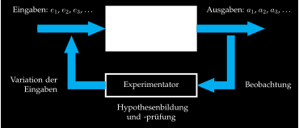

# Didactics
## black-box.svg
 [[PDF]](didactics/black-box/black-box.pdf) [[PNG]](didactics/black-box/black-box.png) [[SVG]](didactics/black-box/black-box.svg)
~~~.tex
\documentclass[crop,tikz]{standalone}

\usepackage{palatino}
\tikzset{>=latex}
\usetikzlibrary{calc,shapes,arrows}

\newcommand{\recth}{2}
\newcommand{\rectw}{4}

\begin{document}
\begin{tikzpicture}
  \tikzstyle{thickarrow}=[line width=1.5mm, draw=blue, -triangle 45, postaction={draw, line width=3.5mm, shorten >=6mm, -}]
  \draw[fill] (-2,-1) rectangle node[text=white, text width=4cm, align=center]{abgeschlossenes System\\ (Black-Box)} ++(\rectw,\recth);
  \draw[line width=2pt] (-2,-3) rectangle node[text width=4cm, align=center]{Experimentator} ++(\rectw,\recth/2);
  \coordinate (in) at (-2,0);
  \coordinate (out) at (-2+\rectw,0);
  \draw[thickarrow] ($(in)+(-3,0)$) -- (in);
  \draw[thickarrow] (out) -- ($(out)+(3,0)$);
  \coordinate (outin) at (-2+\rectw+1.5,-0.3);
  \draw[thickarrow] (outin)   -- ++(0,-2.2) coordinate (ur) -- ++(-1.5,0);
  \draw[thickarrow] (-2,-2.5) -- ++(-1.5,0) coordinate (ul) -- ++(0,2.2);
  \node[left =0.5cm, text width=2.2cm, align=right] at (ul) {Variation der\\ Eingaben};
  \node[right=0.5cm, text width=2cm, align=left ] at (ur) {Beobachtung};
  \node[above=0.5cm] at ($(in)+(-2.3,0)$) {Eingaben: $e_1$, $e_2$, $e_3$, \ldots};
  \node[above=0.5cm] at ($(out)+(2.3,0)$) {Ausgaben: $a_1$, $a_2$, $a_3$, \ldots};
  \node[below=0.2cm, text width=3cm, align=center] at (0,-3) {Hypothesenbildung\\ und -prüfung};
\end{tikzpicture}
\end{document}
~~~
## black-box_inverted.svg
 [[PDF]](didactics/black-box/black-box_inverted.pdf) [[PNG]](didactics/black-box/black-box_inverted.png) [[SVG]](didactics/black-box/black-box_inverted.svg)
~~~.tex
\documentclass[crop,tikz]{standalone}
\usetikzlibrary{backgrounds}
\colorlet{blue}{cyan}
\tikzset{
  inverted/.style = {
    color=white,
    background rectangle/.style={fill},
    show background rectangle
  }
}

\usepackage{palatino}
\tikzset{>=latex}
\usetikzlibrary{calc,shapes,arrows}

\newcommand{\recth}{2}
\newcommand{\rectw}{4}

\begin{document}
\begin{tikzpicture}[inverted,inverted]
  \tikzstyle{thickarrow}=[line width=1.5mm, draw=blue, -triangle 45, postaction={draw, line width=3.5mm, shorten >=6mm, -}]
  \draw[fill] (-2,-1) rectangle node[text=white, text width=4cm, align=center]{abgeschlossenes System\\ (Black-Box)} ++(\rectw,\recth);
  \draw[line width=2pt] (-2,-3) rectangle node[text width=4cm, align=center]{Experimentator} ++(\rectw,\recth/2);
  \coordinate (in) at (-2,0);
  \coordinate (out) at (-2+\rectw,0);
  \draw[thickarrow] ($(in)+(-3,0)$) -- (in);
  \draw[thickarrow] (out) -- ($(out)+(3,0)$);
  \coordinate (outin) at (-2+\rectw+1.5,-0.3);
  \draw[thickarrow] (outin)   -- ++(0,-2.2) coordinate (ur) -- ++(-1.5,0);
  \draw[thickarrow] (-2,-2.5) -- ++(-1.5,0) coordinate (ul) -- ++(0,2.2);
  \node[left =0.5cm, text width=2.2cm, align=right] at (ul) {Variation der\\ Eingaben};
  \node[right=0.5cm, text width=2cm, align=left ] at (ur) {Beobachtung};
  \node[above=0.5cm] at ($(in)+(-2.3,0)$) {Eingaben: $e_1$, $e_2$, $e_3$, \ldots};
  \node[above=0.5cm] at ($(out)+(2.3,0)$) {Ausgaben: $a_1$, $a_2$, $a_3$, \ldots};
  \node[below=0.2cm, text width=3cm, align=center] at (0,-3) {Hypothesenbildung\\ und -prüfung};
\end{tikzpicture}
\end{document}
~~~
