# Electrodynamics
## capacity-bodies.svg
 [[PDF]](electrodynamics/capacity-bodies/capacity-bodies.pdf) [[PNG]](electrodynamics/capacity-bodies/capacity-bodies.png) [[SVG]](electrodynamics/capacity-bodies/capacity-bodies.svg) [[TEX]](electrodynamics/capacity-bodies/capacity-bodies.tex)
## capacity-cylinder.svg
 [[PDF]](electrodynamics/capacity-cylinder/capacity-cylinder.pdf) [[PNG]](electrodynamics/capacity-cylinder/capacity-cylinder.png) [[SVG]](electrodynamics/capacity-cylinder/capacity-cylinder.svg) [[TEX]](electrodynamics/capacity-cylinder/capacity-cylinder.tex)
## capacity-cylinder-half.svg
 [[PDF]](electrodynamics/capacity-cylinder-half/capacity-cylinder-half.pdf) [[PNG]](electrodynamics/capacity-cylinder-half/capacity-cylinder-half.png) [[SVG]](electrodynamics/capacity-cylinder-half/capacity-cylinder-half.svg) [[TEX]](electrodynamics/capacity-cylinder-half/capacity-cylinder-half.tex)
## capacity-cylinder-quarter.svg
 [[PDF]](electrodynamics/capacity-cylinder-quarter/capacity-cylinder-quarter.pdf) [[PNG]](electrodynamics/capacity-cylinder-quarter/capacity-cylinder-quarter.png) [[SVG]](electrodynamics/capacity-cylinder-quarter/capacity-cylinder-quarter.svg) [[TEX]](electrodynamics/capacity-cylinder-quarter/capacity-cylinder-quarter.tex)
## capacity-parallel.svg
 [[PDF]](electrodynamics/capacity-parallel/capacity-parallel.pdf) [[PNG]](electrodynamics/capacity-parallel/capacity-parallel.png) [[SVG]](electrodynamics/capacity-parallel/capacity-parallel.svg) [[TEX]](electrodynamics/capacity-parallel/capacity-parallel.tex)
## capacity-plate-finite.svg
 [[PDF]](electrodynamics/capacity-plate-finite/capacity-plate-finite.pdf) [[PNG]](electrodynamics/capacity-plate-finite/capacity-plate-finite.png) [[SVG]](electrodynamics/capacity-plate-finite/capacity-plate-finite.svg) [[TEX]](electrodynamics/capacity-plate-finite/capacity-plate-finite.tex)
## capacity-plates.svg
 [[PDF]](electrodynamics/capacity-plates/capacity-plates.pdf) [[PNG]](electrodynamics/capacity-plates/capacity-plates.png) [[SVG]](electrodynamics/capacity-plates/capacity-plates.svg) [[TEX]](electrodynamics/capacity-plates/capacity-plates.tex)
## capacity-plates-sphere.svg
 [[PDF]](electrodynamics/capacity-plates-sphere/capacity-plates-sphere.pdf) [[PNG]](electrodynamics/capacity-plates-sphere/capacity-plates-sphere.png) [[SVG]](electrodynamics/capacity-plates-sphere/capacity-plates-sphere.svg) [[TEX]](electrodynamics/capacity-plates-sphere/capacity-plates-sphere.tex)
## capacity-series.svg
 [[PDF]](electrodynamics/capacity-series/capacity-series.pdf) [[PNG]](electrodynamics/capacity-series/capacity-series.png) [[SVG]](electrodynamics/capacity-series/capacity-series.svg) [[TEX]](electrodynamics/capacity-series/capacity-series.tex)
## capacity-slit-finite.svg
 [[PDF]](electrodynamics/capacity-slit-finite/capacity-slit-finite.pdf) [[PNG]](electrodynamics/capacity-slit-finite/capacity-slit-finite.png) [[SVG]](electrodynamics/capacity-slit-finite/capacity-slit-finite.svg) [[TEX]](electrodynamics/capacity-slit-finite/capacity-slit-finite.tex)
## characteristic-lamp.svg
 [[PDF]](electrodynamics/characteristic-lamp/characteristic-lamp.pdf) [[PNG]](electrodynamics/characteristic-lamp/characteristic-lamp.png) [[SVG]](electrodynamics/characteristic-lamp/characteristic-lamp.svg) [[TEX]](electrodynamics/characteristic-lamp/characteristic-lamp.tex)
## characteristic-lamp-R.svg
[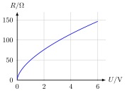](electrodynamics/characteristic-lamp-R/characteristic-lamp-R.svg) [[PDF]](electrodynamics/characteristic-lamp-R/characteristic-lamp-R.pdf) [[PNG]](electrodynamics/characteristic-lamp-R/characteristic-lamp-R.png) [[SVG]](electrodynamics/characteristic-lamp-R/characteristic-lamp-R.svg) [[TEX]](electrodynamics/characteristic-lamp-R/characteristic-lamp-R.tex)
## characteristic-resistor.svg
 [[PDF]](electrodynamics/characteristic-resistor/characteristic-resistor.pdf) [[PNG]](electrodynamics/characteristic-resistor/characteristic-resistor.png) [[SVG]](electrodynamics/characteristic-resistor/characteristic-resistor.svg) [[TEX]](electrodynamics/characteristic-resistor/characteristic-resistor.tex)
## characteristic-resistor-R.svg
 [[PDF]](electrodynamics/characteristic-resistor-R/characteristic-resistor-R.pdf) [[PNG]](electrodynamics/characteristic-resistor-R/characteristic-resistor-R.png) [[SVG]](electrodynamics/characteristic-resistor-R/characteristic-resistor-R.svg) [[TEX]](electrodynamics/characteristic-resistor-R/characteristic-resistor-R.tex)
## circuit-complex.svg
 [[PDF]](electrodynamics/circuit-complex/circuit-complex.pdf) [[PNG]](electrodynamics/circuit-complex/circuit-complex.png) [[SVG]](electrodynamics/circuit-complex/circuit-complex.svg) [[TEX]](electrodynamics/circuit-complex/circuit-complex.tex)
## circuit-inductivity.svg
 [[PDF]](electrodynamics/circuit-inductivity/circuit-inductivity.pdf) [[PNG]](electrodynamics/circuit-inductivity/circuit-inductivity.png) [[SVG]](electrodynamics/circuit-inductivity/circuit-inductivity.svg) [[TEX]](electrodynamics/circuit-inductivity/circuit-inductivity.tex)
## circuit-mixed.svg
 [[PDF]](electrodynamics/circuit-mixed/circuit-mixed.pdf) [[PNG]](electrodynamics/circuit-mixed/circuit-mixed.png) [[SVG]](electrodynamics/circuit-mixed/circuit-mixed.svg) [[TEX]](electrodynamics/circuit-mixed/circuit-mixed.tex)
## circuit-parallel.svg
 [[PDF]](electrodynamics/circuit-parallel/circuit-parallel.pdf) [[PNG]](electrodynamics/circuit-parallel/circuit-parallel.png) [[SVG]](electrodynamics/circuit-parallel/circuit-parallel.svg) [[TEX]](electrodynamics/circuit-parallel/circuit-parallel.tex)
## circuit-physical-current.svg
 [[PDF]](electrodynamics/circuit-physical-current/circuit-physical-current.pdf) [[PNG]](electrodynamics/circuit-physical-current/circuit-physical-current.png) [[SVG]](electrodynamics/circuit-physical-current/circuit-physical-current.svg) [[TEX]](electrodynamics/circuit-physical-current/circuit-physical-current.tex)
## circuit-resonant.svg
 [[PDF]](electrodynamics/circuit-resonant/circuit-resonant.pdf) [[PNG]](electrodynamics/circuit-resonant/circuit-resonant.png) [[SVG]](electrodynamics/circuit-resonant/circuit-resonant.svg) [[TEX]](electrodynamics/circuit-resonant/circuit-resonant.tex)
## circuit-resonant-labels.svg
 [[PDF]](electrodynamics/circuit-resonant-labels/circuit-resonant-labels.pdf) [[PNG]](electrodynamics/circuit-resonant-labels/circuit-resonant-labels.png) [[SVG]](electrodynamics/circuit-resonant-labels/circuit-resonant-labels.svg) [[TEX]](electrodynamics/circuit-resonant-labels/circuit-resonant-labels.tex)
## circuit-resonant-steps.svg
[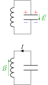](electrodynamics/circuit-resonant-steps/circuit-resonant-steps.svg) [[PDF]](electrodynamics/circuit-resonant-steps/circuit-resonant-steps.pdf) [[PNG]](electrodynamics/circuit-resonant-steps/circuit-resonant-steps.png) [[SVG]](electrodynamics/circuit-resonant-steps/circuit-resonant-steps.svg) [[TEX]](electrodynamics/circuit-resonant-steps/circuit-resonant-steps.tex)
## circuit-resonant-transformation.svg
 [[PDF]](electrodynamics/circuit-resonant-transformation/circuit-resonant-transformation.pdf) [[PNG]](electrodynamics/circuit-resonant-transformation/circuit-resonant-transformation.png) [[SVG]](electrodynamics/circuit-resonant-transformation/circuit-resonant-transformation.svg) [[TEX]](electrodynamics/circuit-resonant-transformation/circuit-resonant-transformation.tex)
## circuit-series.svg
 [[PDF]](electrodynamics/circuit-series/circuit-series.pdf) [[PNG]](electrodynamics/circuit-series/circuit-series.png) [[SVG]](electrodynamics/circuit-series/circuit-series.svg) [[TEX]](electrodynamics/circuit-series/circuit-series.tex)
## circuit-series-positions.svg
 [[PDF]](electrodynamics/circuit-series-positions/circuit-series-positions.pdf) [[PNG]](electrodynamics/circuit-series-positions/circuit-series-positions.png) [[SVG]](electrodynamics/circuit-series-positions/circuit-series-positions.svg) [[TEX]](electrodynamics/circuit-series-positions/circuit-series-positions.tex)
## circuit-series-potential.svg
 [[PDF]](electrodynamics/circuit-series-potential/circuit-series-potential.pdf) [[PNG]](electrodynamics/circuit-series-potential/circuit-series-potential.png) [[SVG]](electrodynamics/circuit-series-potential/circuit-series-potential.svg) [[TEX]](electrodynamics/circuit-series-potential/circuit-series-potential.tex)
## circuit-technical-current.svg
 [[PDF]](electrodynamics/circuit-technical-current/circuit-technical-current.pdf) [[PNG]](electrodynamics/circuit-technical-current/circuit-technical-current.png) [[SVG]](electrodynamics/circuit-technical-current/circuit-technical-current.svg) [[TEX]](electrodynamics/circuit-technical-current/circuit-technical-current.tex)
## circular-polarized-wave.svg
 [[PDF]](electrodynamics/circular-polarized-wave/circular-polarized-wave.pdf) [[PNG]](electrodynamics/circular-polarized-wave/circular-polarized-wave.png) [[SVG]](electrodynamics/circular-polarized-wave/circular-polarized-wave.svg) [[TEX]](electrodynamics/circular-polarized-wave/circular-polarized-wave.tex)
## coulomb-force-neg.svg
[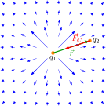](electrodynamics/coulomb-force-neg/coulomb-force-neg.svg) [[PDF]](electrodynamics/coulomb-force-neg/coulomb-force-neg.pdf) [[PNG]](electrodynamics/coulomb-force-neg/coulomb-force-neg.png) [[SVG]](electrodynamics/coulomb-force-neg/coulomb-force-neg.svg) [[TEX]](electrodynamics/coulomb-force-neg/coulomb-force-neg.tex)
## coulomb-force-pos.svg
 [[PDF]](electrodynamics/coulomb-force-pos/coulomb-force-pos.pdf) [[PNG]](electrodynamics/coulomb-force-pos/coulomb-force-pos.png) [[SVG]](electrodynamics/coulomb-force-pos/coulomb-force-pos.svg) [[TEX]](electrodynamics/coulomb-force-pos/coulomb-force-pos.tex)
## dipole.svg
[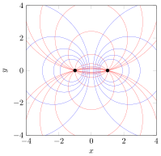](electrodynamics/dipole/dipole.svg) [[PDF]](electrodynamics/dipole/dipole.pdf) [[PNG]](electrodynamics/dipole/dipole.png) [[SVG]](electrodynamics/dipole/dipole.svg) [[TEX]](electrodynamics/dipole/dipole.tex)
## dipole-point.svg
 [[PDF]](electrodynamics/dipole-point/dipole-point.pdf) [[PNG]](electrodynamics/dipole-point/dipole-point.png) [[SVG]](electrodynamics/dipole-point/dipole-point.svg) [[TEX]](electrodynamics/dipole-point/dipole-point.tex)
## drude.svg
 [[PDF]](electrodynamics/drude/drude.pdf) [[PNG]](electrodynamics/drude/drude.png) [[SVG]](electrodynamics/drude/drude.svg) [[TEX]](electrodynamics/drude/drude.tex)
## electric-field-neg.svg
 [[PDF]](electrodynamics/electric-field-neg/electric-field-neg.pdf) [[PNG]](electrodynamics/electric-field-neg/electric-field-neg.png) [[SVG]](electrodynamics/electric-field-neg/electric-field-neg.svg) [[TEX]](electrodynamics/electric-field-neg/electric-field-neg.tex)
## electric-field-pos.svg
 [[PDF]](electrodynamics/electric-field-pos/electric-field-pos.pdf) [[PNG]](electrodynamics/electric-field-pos/electric-field-pos.png) [[SVG]](electrodynamics/electric-field-pos/electric-field-pos.svg) [[TEX]](electrodynamics/electric-field-pos/electric-field-pos.tex)
## helmholtz-inductivities.svg
 [[PDF]](electrodynamics/helmholtz-inductivities/helmholtz-inductivities.pdf) [[PNG]](electrodynamics/helmholtz-inductivities/helmholtz-inductivities.png) [[SVG]](electrodynamics/helmholtz-inductivities/helmholtz-inductivities.svg) [[TEX]](electrodynamics/helmholtz-inductivities/helmholtz-inductivities.tex)
## induction.svg
[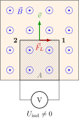](electrodynamics/induction/induction.svg) [[PDF]](electrodynamics/induction/induction.pdf) [[PNG]](electrodynamics/induction/induction.png) [[SVG]](electrodynamics/induction/induction.svg) [[TEX]](electrodynamics/induction/induction.tex)
## joukowski-circle-circulation.svg
 [[PDF]](electrodynamics/joukowski-circle-circulation/joukowski-circle-circulation.pdf) [[PNG]](electrodynamics/joukowski-circle-circulation/joukowski-circle-circulation.png) [[SVG]](electrodynamics/joukowski-circle-circulation/joukowski-circle-circulation.svg) [[TEX]](electrodynamics/joukowski-circle-circulation/joukowski-circle-circulation.tex)
## joukowski-circle-uniform.svg
 [[PDF]](electrodynamics/joukowski-circle-uniform/joukowski-circle-uniform.pdf) [[PNG]](electrodynamics/joukowski-circle-uniform/joukowski-circle-uniform.png) [[SVG]](electrodynamics/joukowski-circle-uniform/joukowski-circle-uniform.svg) [[TEX]](electrodynamics/joukowski-circle-uniform/joukowski-circle-uniform.tex)
## joukowski-profile-circulation.svg
 [[PDF]](electrodynamics/joukowski-profile-circulation/joukowski-profile-circulation.pdf) [[PNG]](electrodynamics/joukowski-profile-circulation/joukowski-profile-circulation.png) [[SVG]](electrodynamics/joukowski-profile-circulation/joukowski-profile-circulation.svg) [[TEX]](electrodynamics/joukowski-profile-circulation/joukowski-profile-circulation.tex)
## lightning-conductor.svg
 [[PDF]](electrodynamics/lightning-conductor/lightning-conductor.pdf) [[PNG]](electrodynamics/lightning-conductor/lightning-conductor.png) [[SVG]](electrodynamics/lightning-conductor/lightning-conductor.svg) [[TEX]](electrodynamics/lightning-conductor/lightning-conductor.tex)
## linear-polarized-wave.svg
 [[PDF]](electrodynamics/linear-polarized-wave/linear-polarized-wave.pdf) [[PNG]](electrodynamics/linear-polarized-wave/linear-polarized-wave.png) [[SVG]](electrodynamics/linear-polarized-wave/linear-polarized-wave.svg) [[TEX]](electrodynamics/linear-polarized-wave/linear-polarized-wave.tex)
## magnetic-field-curl-2d.svg
 [[PDF]](electrodynamics/magnetic-field-curl-2d/magnetic-field-curl-2d.pdf) [[PNG]](electrodynamics/magnetic-field-curl-2d/magnetic-field-curl-2d.png) [[SVG]](electrodynamics/magnetic-field-curl-2d/magnetic-field-curl-2d.svg) [[TEX]](electrodynamics/magnetic-field-curl-2d/magnetic-field-curl-2d.tex)
## magnetic-field-curl-2d-scaled.svg
 [[PDF]](electrodynamics/magnetic-field-curl-2d-scaled/magnetic-field-curl-2d-scaled.pdf) [[PNG]](electrodynamics/magnetic-field-curl-2d-scaled/magnetic-field-curl-2d-scaled.png) [[SVG]](electrodynamics/magnetic-field-curl-2d-scaled/magnetic-field-curl-2d-scaled.svg) [[TEX]](electrodynamics/magnetic-field-curl-2d-scaled/magnetic-field-curl-2d-scaled.tex)
## magnetic-field-curl-3d.svg
[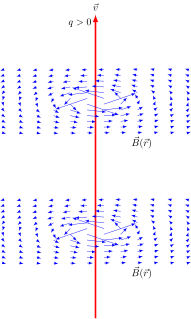](electrodynamics/magnetic-field-curl-3d/magnetic-field-curl-3d.svg) [[PDF]](electrodynamics/magnetic-field-curl-3d/magnetic-field-curl-3d.pdf) [[PNG]](electrodynamics/magnetic-field-curl-3d/magnetic-field-curl-3d.png) [[SVG]](electrodynamics/magnetic-field-curl-3d/magnetic-field-curl-3d.svg) [[TEX]](electrodynamics/magnetic-field-curl-3d/magnetic-field-curl-3d.tex)
## magnetic-field-curl-3d-scaled.svg
 [[PDF]](electrodynamics/magnetic-field-curl-3d-scaled/magnetic-field-curl-3d-scaled.pdf) [[PNG]](electrodynamics/magnetic-field-curl-3d-scaled/magnetic-field-curl-3d-scaled.png) [[SVG]](electrodynamics/magnetic-field-curl-3d-scaled/magnetic-field-curl-3d-scaled.svg) [[TEX]](electrodynamics/magnetic-field-curl-3d-scaled/magnetic-field-curl-3d-scaled.tex)
## magnetic-fieldlines-3d.svg
[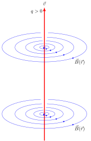](electrodynamics/magnetic-fieldlines-3d/magnetic-fieldlines-3d.svg) [[PDF]](electrodynamics/magnetic-fieldlines-3d/magnetic-fieldlines-3d.pdf) [[PNG]](electrodynamics/magnetic-fieldlines-3d/magnetic-fieldlines-3d.png) [[SVG]](electrodynamics/magnetic-fieldlines-3d/magnetic-fieldlines-3d.svg) [[TEX]](electrodynamics/magnetic-fieldlines-3d/magnetic-fieldlines-3d.tex)
## magnetic-flux-voltage.svg
 [[PDF]](electrodynamics/magnetic-flux-voltage/magnetic-flux-voltage.pdf) [[PNG]](electrodynamics/magnetic-flux-voltage/magnetic-flux-voltage.png) [[SVG]](electrodynamics/magnetic-flux-voltage/magnetic-flux-voltage.svg) [[TEX]](electrodynamics/magnetic-flux-voltage/magnetic-flux-voltage.tex)
## motion-in-homogenous-magnetic-field.svg
 [[PDF]](electrodynamics/motion-in-homogenous-magnetic-field/motion-in-homogenous-magnetic-field.pdf) [[PNG]](electrodynamics/motion-in-homogenous-magnetic-field/motion-in-homogenous-magnetic-field.png) [[SVG]](electrodynamics/motion-in-homogenous-magnetic-field/motion-in-homogenous-magnetic-field.svg) [[TEX]](electrodynamics/motion-in-homogenous-magnetic-field/motion-in-homogenous-magnetic-field.tex)
## ohms-law.svg
 [[PDF]](electrodynamics/ohms-law/ohms-law.pdf) [[PNG]](electrodynamics/ohms-law/ohms-law.png) [[SVG]](electrodynamics/ohms-law/ohms-law.svg) [[TEX]](electrodynamics/ohms-law/ohms-law.tex)
## potential-dipole-neg-neg.svg
 [[PDF]](electrodynamics/potential-dipole-neg-neg/potential-dipole-neg-neg.pdf) [[PNG]](electrodynamics/potential-dipole-neg-neg/potential-dipole-neg-neg.png) [[SVG]](electrodynamics/potential-dipole-neg-neg/potential-dipole-neg-neg.svg) [[TEX]](electrodynamics/potential-dipole-neg-neg/potential-dipole-neg-neg.tex)
## potential-dipole-pos-pos.svg
 [[PDF]](electrodynamics/potential-dipole-pos-pos/potential-dipole-pos-pos.pdf) [[PNG]](electrodynamics/potential-dipole-pos-pos/potential-dipole-pos-pos.png) [[SVG]](electrodynamics/potential-dipole-pos-pos/potential-dipole-pos-pos.svg) [[TEX]](electrodynamics/potential-dipole-pos-pos/potential-dipole-pos-pos.tex)
## potential-dipole.svg
 [[PDF]](electrodynamics/potential-dipole/potential-dipole.pdf) [[PNG]](electrodynamics/potential-dipole/potential-dipole.png) [[SVG]](electrodynamics/potential-dipole/potential-dipole.svg) [[TEX]](electrodynamics/potential-dipole/potential-dipole.tex)
## potential-neg-1d.svg
 [[PDF]](electrodynamics/potential-neg-1d/potential-neg-1d.pdf) [[PNG]](electrodynamics/potential-neg-1d/potential-neg-1d.png) [[SVG]](electrodynamics/potential-neg-1d/potential-neg-1d.svg) [[TEX]](electrodynamics/potential-neg-1d/potential-neg-1d.tex)
## potential-neg-flat.svg
[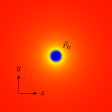](electrodynamics/potential-neg-flat/potential-neg-flat.svg) [[PDF]](electrodynamics/potential-neg-flat/potential-neg-flat.pdf) [[PNG]](electrodynamics/potential-neg-flat/potential-neg-flat.png) [[SVG]](electrodynamics/potential-neg-flat/potential-neg-flat.svg) [[TEX]](electrodynamics/potential-neg-flat/potential-neg-flat.tex)
## potential-neg.svg
 [[PDF]](electrodynamics/potential-neg/potential-neg.pdf) [[PNG]](electrodynamics/potential-neg/potential-neg.png) [[SVG]](electrodynamics/potential-neg/potential-neg.svg) [[TEX]](electrodynamics/potential-neg/potential-neg.tex)
## potential-pos-1d.svg
 [[PDF]](electrodynamics/potential-pos-1d/potential-pos-1d.pdf) [[PNG]](electrodynamics/potential-pos-1d/potential-pos-1d.png) [[SVG]](electrodynamics/potential-pos-1d/potential-pos-1d.svg) [[TEX]](electrodynamics/potential-pos-1d/potential-pos-1d.tex)
## potential-pos-flat.svg
 [[PDF]](electrodynamics/potential-pos-flat/potential-pos-flat.pdf) [[PNG]](electrodynamics/potential-pos-flat/potential-pos-flat.png) [[SVG]](electrodynamics/potential-pos-flat/potential-pos-flat.svg) [[TEX]](electrodynamics/potential-pos-flat/potential-pos-flat.tex)
## potential-positive-positions.svg
 [[PDF]](electrodynamics/potential-positive-positions/potential-positive-positions.pdf) [[PNG]](electrodynamics/potential-positive-positions/potential-positive-positions.png) [[SVG]](electrodynamics/potential-positive-positions/potential-positive-positions.svg) [[TEX]](electrodynamics/potential-positive-positions/potential-positive-positions.tex)
## potential-pos.svg
[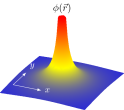](electrodynamics/potential-pos/potential-pos.svg) [[PDF]](electrodynamics/potential-pos/potential-pos.pdf) [[PNG]](electrodynamics/potential-pos/potential-pos.png) [[SVG]](electrodynamics/potential-pos/potential-pos.svg) [[TEX]](electrodynamics/potential-pos/potential-pos.tex)
## solid-dipole.svg
[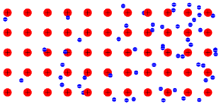](electrodynamics/solid-dipole/solid-dipole.svg) [[PDF]](electrodynamics/solid-dipole/solid-dipole.pdf) [[PNG]](electrodynamics/solid-dipole/solid-dipole.png) [[SVG]](electrodynamics/solid-dipole/solid-dipole.svg) [[TEX]](electrodynamics/solid-dipole/solid-dipole.tex)
## solid.svg
 [[PDF]](electrodynamics/solid/solid.pdf) [[PNG]](electrodynamics/solid/solid.png) [[SVG]](electrodynamics/solid/solid.svg) [[TEX]](electrodynamics/solid/solid.tex)
## capacity-bodies_inverted.svg
[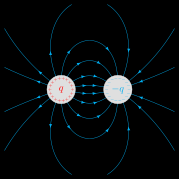](electrodynamics/capacity-bodies/capacity-bodies_inverted.svg) [[PDF]](electrodynamics/capacity-bodies/capacity-bodies_inverted.pdf) [[PNG]](electrodynamics/capacity-bodies/capacity-bodies_inverted.png) [[SVG]](electrodynamics/capacity-bodies/capacity-bodies_inverted.svg) [[TEX]](electrodynamics/capacity-bodies/capacity-bodies_inverted.tex)
## capacity-cylinder_inverted.svg
[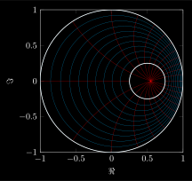](electrodynamics/capacity-cylinder/capacity-cylinder_inverted.svg) [[PDF]](electrodynamics/capacity-cylinder/capacity-cylinder_inverted.pdf) [[PNG]](electrodynamics/capacity-cylinder/capacity-cylinder_inverted.png) [[SVG]](electrodynamics/capacity-cylinder/capacity-cylinder_inverted.svg) [[TEX]](electrodynamics/capacity-cylinder/capacity-cylinder_inverted.tex)
## capacity-cylinder-half_inverted.svg
 [[PDF]](electrodynamics/capacity-cylinder-half/capacity-cylinder-half_inverted.pdf) [[PNG]](electrodynamics/capacity-cylinder-half/capacity-cylinder-half_inverted.png) [[SVG]](electrodynamics/capacity-cylinder-half/capacity-cylinder-half_inverted.svg) [[TEX]](electrodynamics/capacity-cylinder-half/capacity-cylinder-half_inverted.tex)
## capacity-cylinder-quarter_inverted.svg
 [[PDF]](electrodynamics/capacity-cylinder-quarter/capacity-cylinder-quarter_inverted.pdf) [[PNG]](electrodynamics/capacity-cylinder-quarter/capacity-cylinder-quarter_inverted.png) [[SVG]](electrodynamics/capacity-cylinder-quarter/capacity-cylinder-quarter_inverted.svg) [[TEX]](electrodynamics/capacity-cylinder-quarter/capacity-cylinder-quarter_inverted.tex)
## capacity-parallel_inverted.svg
 [[PDF]](electrodynamics/capacity-parallel/capacity-parallel_inverted.pdf) [[PNG]](electrodynamics/capacity-parallel/capacity-parallel_inverted.png) [[SVG]](electrodynamics/capacity-parallel/capacity-parallel_inverted.svg) [[TEX]](electrodynamics/capacity-parallel/capacity-parallel_inverted.tex)
## capacity-plate-finite_inverted.svg
 [[PDF]](electrodynamics/capacity-plate-finite/capacity-plate-finite_inverted.pdf) [[PNG]](electrodynamics/capacity-plate-finite/capacity-plate-finite_inverted.png) [[SVG]](electrodynamics/capacity-plate-finite/capacity-plate-finite_inverted.svg) [[TEX]](electrodynamics/capacity-plate-finite/capacity-plate-finite_inverted.tex)
## capacity-plates_inverted.svg
 [[PDF]](electrodynamics/capacity-plates/capacity-plates_inverted.pdf) [[PNG]](electrodynamics/capacity-plates/capacity-plates_inverted.png) [[SVG]](electrodynamics/capacity-plates/capacity-plates_inverted.svg) [[TEX]](electrodynamics/capacity-plates/capacity-plates_inverted.tex)
## capacity-plates-sphere_inverted.svg
[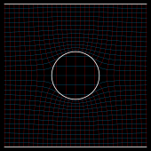](electrodynamics/capacity-plates-sphere/capacity-plates-sphere_inverted.svg) [[PDF]](electrodynamics/capacity-plates-sphere/capacity-plates-sphere_inverted.pdf) [[PNG]](electrodynamics/capacity-plates-sphere/capacity-plates-sphere_inverted.png) [[SVG]](electrodynamics/capacity-plates-sphere/capacity-plates-sphere_inverted.svg) [[TEX]](electrodynamics/capacity-plates-sphere/capacity-plates-sphere_inverted.tex)
## capacity-series_inverted.svg
 [[PDF]](electrodynamics/capacity-series/capacity-series_inverted.pdf) [[PNG]](electrodynamics/capacity-series/capacity-series_inverted.png) [[SVG]](electrodynamics/capacity-series/capacity-series_inverted.svg) [[TEX]](electrodynamics/capacity-series/capacity-series_inverted.tex)
## capacity-slit-finite_inverted.svg
 [[PDF]](electrodynamics/capacity-slit-finite/capacity-slit-finite_inverted.pdf) [[PNG]](electrodynamics/capacity-slit-finite/capacity-slit-finite_inverted.png) [[SVG]](electrodynamics/capacity-slit-finite/capacity-slit-finite_inverted.svg) [[TEX]](electrodynamics/capacity-slit-finite/capacity-slit-finite_inverted.tex)
## characteristic-lamp_inverted.svg
 [[PDF]](electrodynamics/characteristic-lamp/characteristic-lamp_inverted.pdf) [[PNG]](electrodynamics/characteristic-lamp/characteristic-lamp_inverted.png) [[SVG]](electrodynamics/characteristic-lamp/characteristic-lamp_inverted.svg) [[TEX]](electrodynamics/characteristic-lamp/characteristic-lamp_inverted.tex)
## characteristic-lamp-R_inverted.svg
 [[PDF]](electrodynamics/characteristic-lamp-R/characteristic-lamp-R_inverted.pdf) [[PNG]](electrodynamics/characteristic-lamp-R/characteristic-lamp-R_inverted.png) [[SVG]](electrodynamics/characteristic-lamp-R/characteristic-lamp-R_inverted.svg) [[TEX]](electrodynamics/characteristic-lamp-R/characteristic-lamp-R_inverted.tex)
## characteristic-resistor_inverted.svg
 [[PDF]](electrodynamics/characteristic-resistor/characteristic-resistor_inverted.pdf) [[PNG]](electrodynamics/characteristic-resistor/characteristic-resistor_inverted.png) [[SVG]](electrodynamics/characteristic-resistor/characteristic-resistor_inverted.svg) [[TEX]](electrodynamics/characteristic-resistor/characteristic-resistor_inverted.tex)
## characteristic-resistor-R_inverted.svg
 [[PDF]](electrodynamics/characteristic-resistor-R/characteristic-resistor-R_inverted.pdf) [[PNG]](electrodynamics/characteristic-resistor-R/characteristic-resistor-R_inverted.png) [[SVG]](electrodynamics/characteristic-resistor-R/characteristic-resistor-R_inverted.svg) [[TEX]](electrodynamics/characteristic-resistor-R/characteristic-resistor-R_inverted.tex)
## circuit-complex_inverted.svg
 [[PDF]](electrodynamics/circuit-complex/circuit-complex_inverted.pdf) [[PNG]](electrodynamics/circuit-complex/circuit-complex_inverted.png) [[SVG]](electrodynamics/circuit-complex/circuit-complex_inverted.svg) [[TEX]](electrodynamics/circuit-complex/circuit-complex_inverted.tex)
## circuit-inductivity_inverted.svg
 [[PDF]](electrodynamics/circuit-inductivity/circuit-inductivity_inverted.pdf) [[PNG]](electrodynamics/circuit-inductivity/circuit-inductivity_inverted.png) [[SVG]](electrodynamics/circuit-inductivity/circuit-inductivity_inverted.svg) [[TEX]](electrodynamics/circuit-inductivity/circuit-inductivity_inverted.tex)
## circuit-mixed_inverted.svg
 [[PDF]](electrodynamics/circuit-mixed/circuit-mixed_inverted.pdf) [[PNG]](electrodynamics/circuit-mixed/circuit-mixed_inverted.png) [[SVG]](electrodynamics/circuit-mixed/circuit-mixed_inverted.svg) [[TEX]](electrodynamics/circuit-mixed/circuit-mixed_inverted.tex)
## circuit-parallel_inverted.svg
 [[PDF]](electrodynamics/circuit-parallel/circuit-parallel_inverted.pdf) [[PNG]](electrodynamics/circuit-parallel/circuit-parallel_inverted.png) [[SVG]](electrodynamics/circuit-parallel/circuit-parallel_inverted.svg) [[TEX]](electrodynamics/circuit-parallel/circuit-parallel_inverted.tex)
## circuit-physical-current_inverted.svg
 [[PDF]](electrodynamics/circuit-physical-current/circuit-physical-current_inverted.pdf) [[PNG]](electrodynamics/circuit-physical-current/circuit-physical-current_inverted.png) [[SVG]](electrodynamics/circuit-physical-current/circuit-physical-current_inverted.svg) [[TEX]](electrodynamics/circuit-physical-current/circuit-physical-current_inverted.tex)
## circuit-resonant_inverted.svg
 [[PDF]](electrodynamics/circuit-resonant/circuit-resonant_inverted.pdf) [[PNG]](electrodynamics/circuit-resonant/circuit-resonant_inverted.png) [[SVG]](electrodynamics/circuit-resonant/circuit-resonant_inverted.svg) [[TEX]](electrodynamics/circuit-resonant/circuit-resonant_inverted.tex)
## circuit-resonant-labels_inverted.svg
 [[PDF]](electrodynamics/circuit-resonant-labels/circuit-resonant-labels_inverted.pdf) [[PNG]](electrodynamics/circuit-resonant-labels/circuit-resonant-labels_inverted.png) [[SVG]](electrodynamics/circuit-resonant-labels/circuit-resonant-labels_inverted.svg) [[TEX]](electrodynamics/circuit-resonant-labels/circuit-resonant-labels_inverted.tex)
## circuit-resonant-steps_inverted.svg
 [[PDF]](electrodynamics/circuit-resonant-steps/circuit-resonant-steps_inverted.pdf) [[PNG]](electrodynamics/circuit-resonant-steps/circuit-resonant-steps_inverted.png) [[SVG]](electrodynamics/circuit-resonant-steps/circuit-resonant-steps_inverted.svg) [[TEX]](electrodynamics/circuit-resonant-steps/circuit-resonant-steps_inverted.tex)
## circuit-resonant-transformation_inverted.svg
 [[PDF]](electrodynamics/circuit-resonant-transformation/circuit-resonant-transformation_inverted.pdf) [[PNG]](electrodynamics/circuit-resonant-transformation/circuit-resonant-transformation_inverted.png) [[SVG]](electrodynamics/circuit-resonant-transformation/circuit-resonant-transformation_inverted.svg) [[TEX]](electrodynamics/circuit-resonant-transformation/circuit-resonant-transformation_inverted.tex)
## circuit-series_inverted.svg
 [[PDF]](electrodynamics/circuit-series/circuit-series_inverted.pdf) [[PNG]](electrodynamics/circuit-series/circuit-series_inverted.png) [[SVG]](electrodynamics/circuit-series/circuit-series_inverted.svg) [[TEX]](electrodynamics/circuit-series/circuit-series_inverted.tex)
## circuit-series-positions_inverted.svg
 [[PDF]](electrodynamics/circuit-series-positions/circuit-series-positions_inverted.pdf) [[PNG]](electrodynamics/circuit-series-positions/circuit-series-positions_inverted.png) [[SVG]](electrodynamics/circuit-series-positions/circuit-series-positions_inverted.svg) [[TEX]](electrodynamics/circuit-series-positions/circuit-series-positions_inverted.tex)
## circuit-series-potential_inverted.svg
 [[PDF]](electrodynamics/circuit-series-potential/circuit-series-potential_inverted.pdf) [[PNG]](electrodynamics/circuit-series-potential/circuit-series-potential_inverted.png) [[SVG]](electrodynamics/circuit-series-potential/circuit-series-potential_inverted.svg) [[TEX]](electrodynamics/circuit-series-potential/circuit-series-potential_inverted.tex)
## circuit-technical-current_inverted.svg
[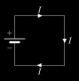](electrodynamics/circuit-technical-current/circuit-technical-current_inverted.svg) [[PDF]](electrodynamics/circuit-technical-current/circuit-technical-current_inverted.pdf) [[PNG]](electrodynamics/circuit-technical-current/circuit-technical-current_inverted.png) [[SVG]](electrodynamics/circuit-technical-current/circuit-technical-current_inverted.svg) [[TEX]](electrodynamics/circuit-technical-current/circuit-technical-current_inverted.tex)
## circular-polarized-wave_inverted.svg
 [[PDF]](electrodynamics/circular-polarized-wave/circular-polarized-wave_inverted.pdf) [[PNG]](electrodynamics/circular-polarized-wave/circular-polarized-wave_inverted.png) [[SVG]](electrodynamics/circular-polarized-wave/circular-polarized-wave_inverted.svg) [[TEX]](electrodynamics/circular-polarized-wave/circular-polarized-wave_inverted.tex)
## coulomb-force-neg_inverted.svg
 [[PDF]](electrodynamics/coulomb-force-neg/coulomb-force-neg_inverted.pdf) [[PNG]](electrodynamics/coulomb-force-neg/coulomb-force-neg_inverted.png) [[SVG]](electrodynamics/coulomb-force-neg/coulomb-force-neg_inverted.svg) [[TEX]](electrodynamics/coulomb-force-neg/coulomb-force-neg_inverted.tex)
## coulomb-force-pos_inverted.svg
 [[PDF]](electrodynamics/coulomb-force-pos/coulomb-force-pos_inverted.pdf) [[PNG]](electrodynamics/coulomb-force-pos/coulomb-force-pos_inverted.png) [[SVG]](electrodynamics/coulomb-force-pos/coulomb-force-pos_inverted.svg) [[TEX]](electrodynamics/coulomb-force-pos/coulomb-force-pos_inverted.tex)
## dipole_inverted.svg
[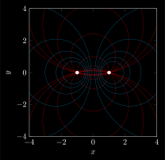](electrodynamics/dipole/dipole_inverted.svg) [[PDF]](electrodynamics/dipole/dipole_inverted.pdf) [[PNG]](electrodynamics/dipole/dipole_inverted.png) [[SVG]](electrodynamics/dipole/dipole_inverted.svg) [[TEX]](electrodynamics/dipole/dipole_inverted.tex)
## dipole-point_inverted.svg
 [[PDF]](electrodynamics/dipole-point/dipole-point_inverted.pdf) [[PNG]](electrodynamics/dipole-point/dipole-point_inverted.png) [[SVG]](electrodynamics/dipole-point/dipole-point_inverted.svg) [[TEX]](electrodynamics/dipole-point/dipole-point_inverted.tex)
## drude_inverted.svg
 [[PDF]](electrodynamics/drude/drude_inverted.pdf) [[PNG]](electrodynamics/drude/drude_inverted.png) [[SVG]](electrodynamics/drude/drude_inverted.svg) [[TEX]](electrodynamics/drude/drude_inverted.tex)
## electric-field-neg_inverted.svg
 [[PDF]](electrodynamics/electric-field-neg/electric-field-neg_inverted.pdf) [[PNG]](electrodynamics/electric-field-neg/electric-field-neg_inverted.png) [[SVG]](electrodynamics/electric-field-neg/electric-field-neg_inverted.svg) [[TEX]](electrodynamics/electric-field-neg/electric-field-neg_inverted.tex)
## electric-field-pos_inverted.svg
 [[PDF]](electrodynamics/electric-field-pos/electric-field-pos_inverted.pdf) [[PNG]](electrodynamics/electric-field-pos/electric-field-pos_inverted.png) [[SVG]](electrodynamics/electric-field-pos/electric-field-pos_inverted.svg) [[TEX]](electrodynamics/electric-field-pos/electric-field-pos_inverted.tex)
## helmholtz-inductivities_inverted.svg
 [[PDF]](electrodynamics/helmholtz-inductivities/helmholtz-inductivities_inverted.pdf) [[PNG]](electrodynamics/helmholtz-inductivities/helmholtz-inductivities_inverted.png) [[SVG]](electrodynamics/helmholtz-inductivities/helmholtz-inductivities_inverted.svg) [[TEX]](electrodynamics/helmholtz-inductivities/helmholtz-inductivities_inverted.tex)
## induction_inverted.svg
 [[PDF]](electrodynamics/induction/induction_inverted.pdf) [[PNG]](electrodynamics/induction/induction_inverted.png) [[SVG]](electrodynamics/induction/induction_inverted.svg) [[TEX]](electrodynamics/induction/induction_inverted.tex)
## joukowski-circle-circulation_inverted.svg
 [[PDF]](electrodynamics/joukowski-circle-circulation/joukowski-circle-circulation_inverted.pdf) [[PNG]](electrodynamics/joukowski-circle-circulation/joukowski-circle-circulation_inverted.png) [[SVG]](electrodynamics/joukowski-circle-circulation/joukowski-circle-circulation_inverted.svg) [[TEX]](electrodynamics/joukowski-circle-circulation/joukowski-circle-circulation_inverted.tex)
## joukowski-circle-uniform_inverted.svg
 [[PDF]](electrodynamics/joukowski-circle-uniform/joukowski-circle-uniform_inverted.pdf) [[PNG]](electrodynamics/joukowski-circle-uniform/joukowski-circle-uniform_inverted.png) [[SVG]](electrodynamics/joukowski-circle-uniform/joukowski-circle-uniform_inverted.svg) [[TEX]](electrodynamics/joukowski-circle-uniform/joukowski-circle-uniform_inverted.tex)
## joukowski-profile-circulation_inverted.svg
 [[PDF]](electrodynamics/joukowski-profile-circulation/joukowski-profile-circulation_inverted.pdf) [[PNG]](electrodynamics/joukowski-profile-circulation/joukowski-profile-circulation_inverted.png) [[SVG]](electrodynamics/joukowski-profile-circulation/joukowski-profile-circulation_inverted.svg) [[TEX]](electrodynamics/joukowski-profile-circulation/joukowski-profile-circulation_inverted.tex)
## lightning-conductor_inverted.svg
 [[PDF]](electrodynamics/lightning-conductor/lightning-conductor_inverted.pdf) [[PNG]](electrodynamics/lightning-conductor/lightning-conductor_inverted.png) [[SVG]](electrodynamics/lightning-conductor/lightning-conductor_inverted.svg) [[TEX]](electrodynamics/lightning-conductor/lightning-conductor_inverted.tex)
## linear-polarized-wave_inverted.svg
 [[PDF]](electrodynamics/linear-polarized-wave/linear-polarized-wave_inverted.pdf) [[PNG]](electrodynamics/linear-polarized-wave/linear-polarized-wave_inverted.png) [[SVG]](electrodynamics/linear-polarized-wave/linear-polarized-wave_inverted.svg) [[TEX]](electrodynamics/linear-polarized-wave/linear-polarized-wave_inverted.tex)
## magnetic-field-curl-2d_inverted.svg
 [[PDF]](electrodynamics/magnetic-field-curl-2d/magnetic-field-curl-2d_inverted.pdf) [[PNG]](electrodynamics/magnetic-field-curl-2d/magnetic-field-curl-2d_inverted.png) [[SVG]](electrodynamics/magnetic-field-curl-2d/magnetic-field-curl-2d_inverted.svg) [[TEX]](electrodynamics/magnetic-field-curl-2d/magnetic-field-curl-2d_inverted.tex)
## magnetic-field-curl-2d-scaled_inverted.svg
 [[PDF]](electrodynamics/magnetic-field-curl-2d-scaled/magnetic-field-curl-2d-scaled_inverted.pdf) [[PNG]](electrodynamics/magnetic-field-curl-2d-scaled/magnetic-field-curl-2d-scaled_inverted.png) [[SVG]](electrodynamics/magnetic-field-curl-2d-scaled/magnetic-field-curl-2d-scaled_inverted.svg) [[TEX]](electrodynamics/magnetic-field-curl-2d-scaled/magnetic-field-curl-2d-scaled_inverted.tex)
## magnetic-field-curl-3d_inverted.svg
[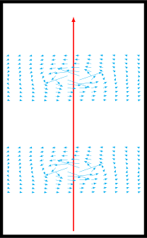](electrodynamics/magnetic-field-curl-3d/magnetic-field-curl-3d_inverted.svg) [[PDF]](electrodynamics/magnetic-field-curl-3d/magnetic-field-curl-3d_inverted.pdf) [[PNG]](electrodynamics/magnetic-field-curl-3d/magnetic-field-curl-3d_inverted.png) [[SVG]](electrodynamics/magnetic-field-curl-3d/magnetic-field-curl-3d_inverted.svg) [[TEX]](electrodynamics/magnetic-field-curl-3d/magnetic-field-curl-3d_inverted.tex)
## magnetic-field-curl-3d-scaled_inverted.svg
 [[PDF]](electrodynamics/magnetic-field-curl-3d-scaled/magnetic-field-curl-3d-scaled_inverted.pdf) [[PNG]](electrodynamics/magnetic-field-curl-3d-scaled/magnetic-field-curl-3d-scaled_inverted.png) [[SVG]](electrodynamics/magnetic-field-curl-3d-scaled/magnetic-field-curl-3d-scaled_inverted.svg) [[TEX]](electrodynamics/magnetic-field-curl-3d-scaled/magnetic-field-curl-3d-scaled_inverted.tex)
## magnetic-fieldlines-3d_inverted.svg
 [[PDF]](electrodynamics/magnetic-fieldlines-3d/magnetic-fieldlines-3d_inverted.pdf) [[PNG]](electrodynamics/magnetic-fieldlines-3d/magnetic-fieldlines-3d_inverted.png) [[SVG]](electrodynamics/magnetic-fieldlines-3d/magnetic-fieldlines-3d_inverted.svg) [[TEX]](electrodynamics/magnetic-fieldlines-3d/magnetic-fieldlines-3d_inverted.tex)
## magnetic-flux-voltage_inverted.svg
[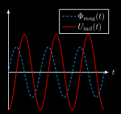](electrodynamics/magnetic-flux-voltage/magnetic-flux-voltage_inverted.svg) [[PDF]](electrodynamics/magnetic-flux-voltage/magnetic-flux-voltage_inverted.pdf) [[PNG]](electrodynamics/magnetic-flux-voltage/magnetic-flux-voltage_inverted.png) [[SVG]](electrodynamics/magnetic-flux-voltage/magnetic-flux-voltage_inverted.svg) [[TEX]](electrodynamics/magnetic-flux-voltage/magnetic-flux-voltage_inverted.tex)
## motion-in-homogenous-magnetic-field_inverted.svg
 [[PDF]](electrodynamics/motion-in-homogenous-magnetic-field/motion-in-homogenous-magnetic-field_inverted.pdf) [[PNG]](electrodynamics/motion-in-homogenous-magnetic-field/motion-in-homogenous-magnetic-field_inverted.png) [[SVG]](electrodynamics/motion-in-homogenous-magnetic-field/motion-in-homogenous-magnetic-field_inverted.svg) [[TEX]](electrodynamics/motion-in-homogenous-magnetic-field/motion-in-homogenous-magnetic-field_inverted.tex)
## ohms-law_inverted.svg
[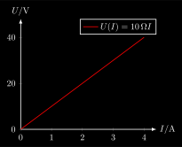](electrodynamics/ohms-law/ohms-law_inverted.svg) [[PDF]](electrodynamics/ohms-law/ohms-law_inverted.pdf) [[PNG]](electrodynamics/ohms-law/ohms-law_inverted.png) [[SVG]](electrodynamics/ohms-law/ohms-law_inverted.svg) [[TEX]](electrodynamics/ohms-law/ohms-law_inverted.tex)
## potential-dipole-neg-neg_inverted.svg
 [[PDF]](electrodynamics/potential-dipole-neg-neg/potential-dipole-neg-neg_inverted.pdf) [[PNG]](electrodynamics/potential-dipole-neg-neg/potential-dipole-neg-neg_inverted.png) [[SVG]](electrodynamics/potential-dipole-neg-neg/potential-dipole-neg-neg_inverted.svg) [[TEX]](electrodynamics/potential-dipole-neg-neg/potential-dipole-neg-neg_inverted.tex)
## potential-dipole-pos-pos_inverted.svg
 [[PDF]](electrodynamics/potential-dipole-pos-pos/potential-dipole-pos-pos_inverted.pdf) [[PNG]](electrodynamics/potential-dipole-pos-pos/potential-dipole-pos-pos_inverted.png) [[SVG]](electrodynamics/potential-dipole-pos-pos/potential-dipole-pos-pos_inverted.svg) [[TEX]](electrodynamics/potential-dipole-pos-pos/potential-dipole-pos-pos_inverted.tex)
## potential-dipole_inverted.svg
 [[PDF]](electrodynamics/potential-dipole/potential-dipole_inverted.pdf) [[PNG]](electrodynamics/potential-dipole/potential-dipole_inverted.png) [[SVG]](electrodynamics/potential-dipole/potential-dipole_inverted.svg) [[TEX]](electrodynamics/potential-dipole/potential-dipole_inverted.tex)
## potential-neg-1d_inverted.svg
 [[PDF]](electrodynamics/potential-neg-1d/potential-neg-1d_inverted.pdf) [[PNG]](electrodynamics/potential-neg-1d/potential-neg-1d_inverted.png) [[SVG]](electrodynamics/potential-neg-1d/potential-neg-1d_inverted.svg) [[TEX]](electrodynamics/potential-neg-1d/potential-neg-1d_inverted.tex)
## potential-neg-flat_inverted.svg
 [[PDF]](electrodynamics/potential-neg-flat/potential-neg-flat_inverted.pdf) [[PNG]](electrodynamics/potential-neg-flat/potential-neg-flat_inverted.png) [[SVG]](electrodynamics/potential-neg-flat/potential-neg-flat_inverted.svg) [[TEX]](electrodynamics/potential-neg-flat/potential-neg-flat_inverted.tex)
## potential-neg_inverted.svg
 [[PDF]](electrodynamics/potential-neg/potential-neg_inverted.pdf) [[PNG]](electrodynamics/potential-neg/potential-neg_inverted.png) [[SVG]](electrodynamics/potential-neg/potential-neg_inverted.svg) [[TEX]](electrodynamics/potential-neg/potential-neg_inverted.tex)
## potential-pos-1d_inverted.svg
 [[PDF]](electrodynamics/potential-pos-1d/potential-pos-1d_inverted.pdf) [[PNG]](electrodynamics/potential-pos-1d/potential-pos-1d_inverted.png) [[SVG]](electrodynamics/potential-pos-1d/potential-pos-1d_inverted.svg) [[TEX]](electrodynamics/potential-pos-1d/potential-pos-1d_inverted.tex)
## potential-pos-flat_inverted.svg
 [[PDF]](electrodynamics/potential-pos-flat/potential-pos-flat_inverted.pdf) [[PNG]](electrodynamics/potential-pos-flat/potential-pos-flat_inverted.png) [[SVG]](electrodynamics/potential-pos-flat/potential-pos-flat_inverted.svg) [[TEX]](electrodynamics/potential-pos-flat/potential-pos-flat_inverted.tex)
## potential-positive-positions_inverted.svg
 [[PDF]](electrodynamics/potential-positive-positions/potential-positive-positions_inverted.pdf) [[PNG]](electrodynamics/potential-positive-positions/potential-positive-positions_inverted.png) [[SVG]](electrodynamics/potential-positive-positions/potential-positive-positions_inverted.svg) [[TEX]](electrodynamics/potential-positive-positions/potential-positive-positions_inverted.tex)
## potential-pos_inverted.svg
 [[PDF]](electrodynamics/potential-pos/potential-pos_inverted.pdf) [[PNG]](electrodynamics/potential-pos/potential-pos_inverted.png) [[SVG]](electrodynamics/potential-pos/potential-pos_inverted.svg) [[TEX]](electrodynamics/potential-pos/potential-pos_inverted.tex)
## solid-dipole_inverted.svg
[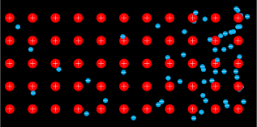](electrodynamics/solid-dipole/solid-dipole_inverted.svg) [[PDF]](electrodynamics/solid-dipole/solid-dipole_inverted.pdf) [[PNG]](electrodynamics/solid-dipole/solid-dipole_inverted.png) [[SVG]](electrodynamics/solid-dipole/solid-dipole_inverted.svg) [[TEX]](electrodynamics/solid-dipole/solid-dipole_inverted.tex)
## solid_inverted.svg
[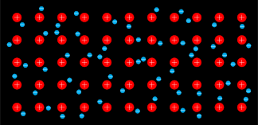](electrodynamics/solid/solid_inverted.svg) [[PDF]](electrodynamics/solid/solid_inverted.pdf) [[PNG]](electrodynamics/solid/solid_inverted.png) [[SVG]](electrodynamics/solid/solid_inverted.svg) [[TEX]](electrodynamics/solid/solid_inverted.tex)
