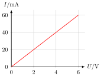
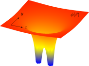
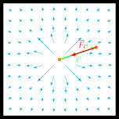
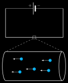

# Electrodynamics
## characteristic-lamp.svg
 [[PDF]](electrodynamics/characteristic-lamp/characteristic-lamp.pdf) [[PNG]](electrodynamics/characteristic-lamp/characteristic-lamp.png) [[SVG]](electrodynamics/characteristic-lamp/characteristic-lamp.svg)
~~~.tex
\documentclass[crop,tikz]{standalone}

\usepackage{pgfplots}
\usepackage{siunitx}
\tikzset{>=latex}

\pgfplotsset{
  inverted/.style = {
    every axis legend/.append style={
      draw=white,
      fill=hardblack,
      text=white
    }
  },
  every non boxed x axis/.append style={
    axis line style={-latex}
  },
  every non boxed y axis/.append style={
    axis line style={-latex}
  }
}

\begin{document}
\begin{tikzpicture}
\begin{axis}[
  width=6cm,
  height=5cm,
  domain=0:6,
  samples=200,
  axis y line=middle,
  axis x line=middle,
  xlabel={$U/\si{\V}$},
  ylabel={$I/\si{\milli\A}$},
  xlabel style={right},
  ylabel style={above},
  extra x ticks={0},
  extra x tick style={grid=none},
  extra y ticks={0},
  extra y tick style={grid=none},
  xmin=0, xmax=6.6,
  ymin=0, ymax=44,
  grid,
  thick,
  smooth
  ]
  \addplot[red] { 20*x^(2/5) };
\end{axis}
\end{tikzpicture}
\end{document}
~~~
## characteristic-lamp-R.svg
 [[PDF]](electrodynamics/characteristic-lamp-R/characteristic-lamp-R.pdf) [[PNG]](electrodynamics/characteristic-lamp-R/characteristic-lamp-R.png) [[SVG]](electrodynamics/characteristic-lamp-R/characteristic-lamp-R.svg)
~~~.tex
\documentclass[crop,tikz]{standalone}

\usepackage{pgfplots}
\usepackage{siunitx}
\tikzset{>=latex}

\pgfplotsset{
  inverted/.style = {
    every axis legend/.append style={
      draw=white,
      fill=hardblack,
      text=white
    }
  },
  every non boxed x axis/.append style={
    axis line style={-latex}
  },
  every non boxed y axis/.append style={
    axis line style={-latex}
  }
}

\begin{document}
\begin{tikzpicture}
\begin{axis}[
  width=6cm,
  height=5cm,
  domain=0:6,
  samples=200,
  axis y line=middle,
  axis x line=middle,
  xlabel={$U/\si{\V}$},
  ylabel={$R/\si{\ohm}$},
  xlabel style={right},
  ylabel style={above},
  extra x ticks={0},
  extra x tick style={grid=none},
  extra y ticks={0},
  extra y tick style={grid=none},
  xmin=0, xmax=6.6,
  ymin=0, ymax=170,
  grid,
  thick,
  smooth
  ]
  \addplot[blue] { 50*x^(3/5) };
\end{axis}
\end{tikzpicture}
\end{document}
~~~
## characteristic-resistor.svg
 [[PDF]](electrodynamics/characteristic-resistor/characteristic-resistor.pdf) [[PNG]](electrodynamics/characteristic-resistor/characteristic-resistor.png) [[SVG]](electrodynamics/characteristic-resistor/characteristic-resistor.svg)
~~~.tex
\documentclass[crop,tikz]{standalone}

\usepackage{pgfplots}
\usepackage{siunitx}
\tikzset{>=latex}

\pgfplotsset{
  inverted/.style = {
    every axis legend/.append style={
      draw=white,
      fill=hardblack,
      text=white
    }
  },
  every non boxed x axis/.append style={
    axis line style={-latex}
  },
  every non boxed y axis/.append style={
    axis line style={-latex}
  }
}

\begin{document}
\begin{tikzpicture}
\begin{axis}[
  width=6cm,
  height=5cm,
  domain=0:6,
  samples=200,
  axis y line=middle,
  axis x line=middle,
  xlabel={$U/\si{\V}$},
  ylabel={$I/\si{\milli\A}$},
  xlabel style={right},
  ylabel style={above},
  extra x ticks={0},
  extra x tick style={grid=none},
  extra y ticks={0},
  extra y tick style={grid=none},
  xmin=0, xmax=6.6,
  ymin=0, ymax=66,
  grid,
  thick,
  smooth
  ]
  \addplot[red] { 10*x };
\end{axis}
\end{tikzpicture}
\end{document}
~~~
## characteristic-resistor-R.svg
 [[PDF]](electrodynamics/characteristic-resistor-R/characteristic-resistor-R.pdf) [[PNG]](electrodynamics/characteristic-resistor-R/characteristic-resistor-R.png) [[SVG]](electrodynamics/characteristic-resistor-R/characteristic-resistor-R.svg)
~~~.tex
\documentclass[crop,tikz]{standalone}

\usepackage{pgfplots}
\usepackage{siunitx}
\tikzset{>=latex}

\pgfplotsset{
  inverted/.style = {
    every axis legend/.append style={
      draw=white,
      fill=hardblack,
      text=white
    }
  },
  every non boxed x axis/.append style={
    axis line style={-latex}
  },
  every non boxed y axis/.append style={
    axis line style={-latex}
  }
}

\begin{document}
\begin{tikzpicture}
\begin{axis}[
  width=6cm,
  height=5cm,
  domain=0:6,
  samples=10,
  axis y line=middle,
  axis x line=middle,
  xlabel={$U/\si{\V}$},
  ylabel={$R/\si{\ohm}$},
  xlabel style={right},
  ylabel style={above},
  extra x ticks={0},
  extra x tick style={grid=none},
  extra y ticks={0},
  extra y tick style={grid=none},
  xmin=0, xmax=6.6,
  ymin=0, ymax=170,
  grid,
  thick,
  ]
  \addplot[blue] { 100 };
\end{axis}
\end{tikzpicture}
\end{document}
~~~
## circuit-complex.svg
 [[PDF]](electrodynamics/circuit-complex/circuit-complex.pdf) [[PNG]](electrodynamics/circuit-complex/circuit-complex.png) [[SVG]](electrodynamics/circuit-complex/circuit-complex.svg)
~~~.tex
\documentclass[crop,tikz]{standalone}

\usepackage[european]{circuitikz}

\begin{document}
\begin{tikzpicture}[scale=2]
  \draw[thick]
    (1.5,0) to (6,0)
    (1.5,2) to[V] (1.5,0)
    (1.5,2) to[C] (1.5,3) -| (5,3)
    (2.2,2) to[R] (2.2,3)
    (2.2,2) to[red] (2.6,2)
    (2.2,3) to[C, *-] (2.2,5) -| (3,5)
    (3,0) to[R,*-*] (3,1.5) to[Tnpn,n=npn1] (3,2.5)
    (4,0) to[C, *-] (4, 1.5)--(3,1.5)
    (2.2,0) to[R, *-*] (2.2,2)
    (3,2.5) to node[short] {} (3,3)
    (3,5) to[pR, n=pot1, *-] (3,3)
    (3,5) to[R, *-] (5,5)
    (5,3) to[Tnigfetd,n=mos1] (5,5)
    (pot1.wiper) to[R] (4.5,4) -| (mos1.G)
    (5,1.5) to[Tpigfetd,n=mos2] (5,2.5)
    (5,0) to[short,*-] (mos2.D)
    (3,2.5) to[R, *-] (4.5,2.5) -| (mos2.G)
    (5,3) to[C,*-] (6,3) to[V] (6,0)
    (mos1.S)--(mos2.S)
    ;
\end{tikzpicture}
\end{document}
~~~
## circuit-mixed.svg
 [[PDF]](electrodynamics/circuit-mixed/circuit-mixed.pdf) [[PNG]](electrodynamics/circuit-mixed/circuit-mixed.png) [[SVG]](electrodynamics/circuit-mixed/circuit-mixed.svg)
~~~.tex
\documentclass[crop,tikz]{standalone}

\usepackage[european]{circuitikz}

\begin{document}
\begin{tikzpicture}
  \draw (-2,0)
    to[battery2] ++(4,0)
    to[short,-*] ++(0,2)
    to[R] ++(-4,0)
    to[R,*-] ++(0,-2);
  \draw (2,2)
    to ++(0,2)
    to[R] ++(-4,0)
    to ++(0,-2);
\end{tikzpicture}
\end{document}
~~~
## circuit-parallel.svg
 [[PDF]](electrodynamics/circuit-parallel/circuit-parallel.pdf) [[PNG]](electrodynamics/circuit-parallel/circuit-parallel.png) [[SVG]](electrodynamics/circuit-parallel/circuit-parallel.svg)
~~~.tex
\documentclass[crop,tikz]{standalone}

\usepackage[european]{circuitikz}

\begin{document}
\begin{tikzpicture}
  \draw (-2,0)
    to[battery2] ++(4,0)
    to[short,-*] ++(0,2)
    to[R] ++(-4,0)
    to[short,*-] ++(0,-2);
  \draw (2,2)
    to ++(0,2)
    to[R] ++(-4,0)
    to ++(0,-2);
\end{tikzpicture}
\end{document}
~~~
## circuit-physical-current.svg
 [[PDF]](electrodynamics/circuit-physical-current/circuit-physical-current.pdf) [[PNG]](electrodynamics/circuit-physical-current/circuit-physical-current.png) [[SVG]](electrodynamics/circuit-physical-current/circuit-physical-current.svg)
~~~.tex
\documentclass[crop,tikz]{standalone}

\usepackage[european]{circuitikz}

\tikzset{>=latex}

\begin{document}
\begin{tikzpicture}
  \draw (0,1) to[battery2] ++(0,-2)
    to[short,i>_=$I$] ++(2,0)
    to[short,i>_=$I$] ++(0,2)
    to[short,i>_=$I$] ++(-2,0);
  \node at (-0.2,-0.3) { \footnotesize $-$};
  \node at (-0.2,+0.3) { \footnotesize $+$};
\end{tikzpicture}
\end{document}
~~~
## circuit-series.svg
 [[PDF]](electrodynamics/circuit-series/circuit-series.pdf) [[PNG]](electrodynamics/circuit-series/circuit-series.png) [[SVG]](electrodynamics/circuit-series/circuit-series.svg)
~~~.tex
\documentclass[crop,tikz]{standalone}

\usepackage[european]{circuitikz}

\begin{document}
\begin{tikzpicture}
  \draw (-3,0)
    to[battery2,i_>=$I$] ++(6,0)
    to[short,i_>=$I$] ++(0,2)
    to[R,i_>=$I$] ++(-3,0)
    to[R] ++(-3,0)
    to[short,i_>=$I$] ++(0,-2);
\end{tikzpicture}
\end{document}
~~~
## circuit-technical-current.svg
 [[PDF]](electrodynamics/circuit-technical-current/circuit-technical-current.pdf) [[PNG]](electrodynamics/circuit-technical-current/circuit-technical-current.png) [[SVG]](electrodynamics/circuit-technical-current/circuit-technical-current.svg)
~~~.tex
\documentclass[crop,tikz]{standalone}

\usepackage[european]{circuitikz}

\tikzset{>=latex}

\begin{document}
\begin{tikzpicture}
  \draw (0,1) to[battery2] ++(0,-2)
    to[short,i<_=$I$] ++(2,0)
    to[short,i<_=$I$] ++(0,2)
    to[short,i<_=$I$] ++(-2,0);
  \node at (-0.2,-0.3) { \footnotesize $-$};
  \node at (-0.2,+0.3) { \footnotesize $+$};
\end{tikzpicture}
\end{document}
~~~
## circular-polarized-wave.svg
 [[PDF]](electrodynamics/circular-polarized-wave/circular-polarized-wave.pdf) [[PNG]](electrodynamics/circular-polarized-wave/circular-polarized-wave.png) [[SVG]](electrodynamics/circular-polarized-wave/circular-polarized-wave.svg)
~~~.tex
\documentclass[crop,tikz]{standalone}

\tikzset{>=latex}

\begin{document}
\begin{tikzpicture}[x={(-10:1cm)},y={(90:1cm)},z={(210:1cm)}]
  % axis
  \draw[->] (-1,0,0) -- (5,  0,0) node[above] {$z$};
  \draw[->] ( 0,0,0) -- (0,1.5,0) node[above] {$x$};
  \draw[->] ( 0,0,0) -- (0,0,1.5) node[left ] {$y$};
  % propagation
  \draw[->,ultra thick] (6,0,0) -- (7,0,0);
  % waves
  \draw[blue,thick] plot[domain=0:4.5,samples=200] (\x,{cos(deg(pi*\x))},{-sin(deg(pi*\x))});
  \draw[red ,thick] plot[domain=0:4.5,samples=200] (\x,{sin(deg(pi*\x))},{cos(deg(pi*\x))});
  % arrows
  \foreach \x in {0.1,0.2,...,4.4} {
    \draw[->,help lines,blue] (\x,0,0) -- (\x,{cos(deg(pi*\x))},{-sin(deg(pi*\x))});
    \draw[->,help lines,red ] (\x,0,0) -- (\x,{sin(deg(pi*\x))},{cos(deg(pi*\x))});
  }
  % labels
  \node[blue,above right] at (0,1.2,0) {$\vec{E}$};
  \node[red,below] at (0,0,1) {$\vec{B}$};
\end{tikzpicture}
\end{document}
~~~
## coulomb-force-neg.svg
 [[PDF]](electrodynamics/coulomb-force-neg/coulomb-force-neg.pdf) [[PNG]](electrodynamics/coulomb-force-neg/coulomb-force-neg.png) [[SVG]](electrodynamics/coulomb-force-neg/coulomb-force-neg.svg)
~~~.tex
\documentclass[crop,tikz]{standalone}

\usepackage{pgfplots}
\tikzset{>=latex}
\usetikzlibrary{calc}

\colorlet{green}{black!40!green}

\begin{document}
\begin{tikzpicture}
  \begin{axis}[
    xmin = -2, xmax = 2,
    ymin = -2, ymax = 2,
    axis equal image,
    xtick = {\empty},
    xticklabels = {\empty},
    ytick = {\empty},
    yticklabels = {\empty},
    view = {0}{90},
    height=6cm,
    samples = 10,
    color = blue,
    domain = -2:2,
    hide axis,
    clip = false,
    ]
    \addplot3[
      point meta = {pow(x^2+y^2,-0.05)},
      quiver = {
        u = {x/(x^2+y^2)},
        v = {y/(x^2+y^2)},
        scale arrows = 0.3,
        % every arrow/.append style={%
        %    -{Latex[scale={max(0.3,\pgfplotspointmetatransformed/1000)}]},
        % },
      },
      ->,
    ] {0};
    \coordinate (o) at (axis cs: 0,0);
    \coordinate (r) at (axis cs: 1.5,0.5);
    \draw[fill,orange] (o) circle[radius=2pt] node[below,black] {$q_1$};
    \draw[fill,orange] (r) circle[radius=2pt] node[right,black] {$q_2$};
    \draw[->,green,very thick] (o) -- node[below]{$\vec{r}$} (r);
    \begin{scope}[shift={(-0.1,0.1)}]
      \draw[->,red,very thick] (r) -- node[above] {$\vec{F}_C$} ($(o)!0.3!(r)$);
    \end{scope}
  \end{axis}
\end{tikzpicture}
\end{document}
~~~
## coulomb-force-pos.svg
 [[PDF]](electrodynamics/coulomb-force-pos/coulomb-force-pos.pdf) [[PNG]](electrodynamics/coulomb-force-pos/coulomb-force-pos.png) [[SVG]](electrodynamics/coulomb-force-pos/coulomb-force-pos.svg)
~~~.tex
\documentclass[crop,tikz]{standalone}

\usepackage{pgfplots}
\tikzset{>=latex}
\usetikzlibrary{calc}

\colorlet{green}{black!40!green}

\begin{document}
\begin{tikzpicture}
  \begin{axis}[
    xmin = -2, xmax = 2,
    ymin = -2, ymax = 2,
    axis equal image,
    xtick = {\empty},
    xticklabels = {\empty},
    ytick = {\empty},
    yticklabels = {\empty},
    view = {0}{90},
    height=6cm,
    samples = 10,
    color = blue,
    domain = -2:2,
    hide axis,
    clip = false,
    ]
    \addplot3[
      point meta = {pow(x^2+y^2,-0.05)},
      quiver = {
        u = {x/(x^2+y^2)},
        v = {y/(x^2+y^2)},
        scale arrows = 0.3,
        % every arrow/.append style={%
        %    -{Latex[scale={max(0.1,\pgfplotspointmetatransformed/1000)}]},
        % },
      },
      ->,
    ] {0};
    \coordinate (o) at (axis cs: 0,0);
    \coordinate (r) at (axis cs: 1.5,0.5);
    \draw[fill,orange] (axis cs: 0,0) circle[radius=2pt] node[below,black] {$q_1$};
    \draw[fill,orange] (r) circle[radius=2pt] node[below,black] {$q_2$};
    \draw[->,red,very thick] (r) -- ($(o)!1.7!(r)$) node[above] {$\vec{F}_C$};
    \draw[->,green,very thick] (o) -- node[below]{$\vec{r}$} (r);
  \end{axis}
\end{tikzpicture}
\end{document}
~~~
## drude.svg
 [[PDF]](electrodynamics/drude/drude.pdf) [[PNG]](electrodynamics/drude/drude.png) [[SVG]](electrodynamics/drude/drude.svg)
~~~.tex
\documentclass[crop,tikz]{standalone}

\usepackage[european]{circuitikz}

\tikzset{>=latex}
\usetikzlibrary{shapes}

\begin{document}
\begin{tikzpicture}
  % circuit
  \draw (-2,2) to[battery2] ++(4,0);
  \draw[thick] (2,2)
    to ++(0,-2)
    to ++(-4,0)
    to ++(0,2);
  \node at (-0.3,2.2) { \footnotesize $+$};
  \node at (+0.3,2.2) { \footnotesize $-$};
  % small window
  \draw (-0.1,-0.1) rectangle (0.1,0.1);
  % connection between small and large window
  \draw[dashed] (-0.1,-0.1) -- (-2,-1);
  \draw[dashed] (+0.1,-0.1) -- (+2,-1);
  \begin{scope}[yshift=-2cm]
    % cylinder
    \node[thick] (A) at (-0.2,0) [cylinder, aspect=2, shape border rotate=0, draw, minimum height=4.4cm, minimum width=2cm] {};
    % charges
    \foreach \x/\y in { -1/-0.4,-0.9/0.5,0/-0.2,1.1/0.4,1/-0.3 } {%
      \draw[fill,blue] (\x,\y)  circle (0.1) coordinate (t);
      \draw[->] (t) -- ++(-0.6,0);
    }
  \end{scope}
\end{tikzpicture}
\end{document}
~~~
## electric-field-neg.svg
 [[PDF]](electrodynamics/electric-field-neg/electric-field-neg.pdf) [[PNG]](electrodynamics/electric-field-neg/electric-field-neg.png) [[SVG]](electrodynamics/electric-field-neg/electric-field-neg.svg)
~~~.tex
\documentclass[crop,tikz]{standalone}

\usepackage{pgfplots}
\tikzset{>=latex}

\begin{document}
\begin{tikzpicture}
  \begin{axis}[
    xmin = -2, xmax = 2,
    ymin = -2, ymax = 2,
    axis equal image,
    xtick = {\empty},
    xticklabels = {\empty},
    ytick = {\empty},
    yticklabels = {\empty},
    view = {0}{90},
    height=6cm,
    samples = 10,
    color = blue,
    domain = -2:2,
    hide axis,
    clip = false,
    ]
    \addplot3[
      point meta = {pow(x^2+y^2,-0.1)},
      quiver = {
        u = {-x/(x^2+y^2)},
        v = {-y/(x^2+y^2)},
        scale arrows = 0.1,
        every arrow/.append style={%
           -{latex[scale={max(0.7,\pgfplotspointmetatransformed/1000)}]},
        },
      },
      ->,
    ] {0};
    \draw[fill,orange] (axis cs: 0,0) circle[radius=2pt] node[below=0.5em,black] {$q_1$};
  \end{axis}
\end{tikzpicture}
\end{document}
~~~
## electric-field-pos.svg
 [[PDF]](electrodynamics/electric-field-pos/electric-field-pos.pdf) [[PNG]](electrodynamics/electric-field-pos/electric-field-pos.png) [[SVG]](electrodynamics/electric-field-pos/electric-field-pos.svg)
~~~.tex
\documentclass[crop,tikz]{standalone}

\usepackage{pgfplots}
\tikzset{>=latex}

\begin{document}
\begin{tikzpicture}
  \begin{axis}[
    xmin = -2, xmax = 2,
    ymin = -2, ymax = 2,
    axis equal image,
    xtick = {\empty},
    xticklabels = {\empty},
    ytick = {\empty},
    yticklabels = {\empty},
    view = {0}{90},
    height=6cm,
    samples = 10,
    color = blue,
    domain = -2:2,
    hide axis,
    clip = false,
    ]
    \addplot3[
      point meta = {pow(x^2+y^2,-0.05)},
      quiver = {
        u = {x/(x^2+y^2)},
        v = {y/(x^2+y^2)},
        scale arrows = 0.3,
        % every arrow/.append style={%
        %    -{Latex[scale={max(0.3,\pgfplotspointmetatransformed/1000)}]},
        % },
      },
      ->,
    ] {0};
    \draw[fill,orange] (axis cs: 0,0) circle[radius=2pt] node[below,black] {$q_1$};
  \end{axis}
\end{tikzpicture}
\end{document}
~~~
## linear-polarized-wave.svg
 [[PDF]](electrodynamics/linear-polarized-wave/linear-polarized-wave.pdf) [[PNG]](electrodynamics/linear-polarized-wave/linear-polarized-wave.png) [[SVG]](electrodynamics/linear-polarized-wave/linear-polarized-wave.svg)
~~~.tex
\documentclass[crop,tikz]{standalone}

\tikzset{>=latex}

\begin{document}
\begin{tikzpicture}[x={(-10:1cm)},y={(90:1cm)},z={(210:1cm)}]
  % axis
  \draw[->] (-1,0,0) -- (5,  0,0) node[above] {$z$};
  \draw[->] ( 0,0,0) -- (0,1.5,0) node[above] {$x$};
  \draw[->] ( 0,0,0) -- (0,0,1.5) node[left ] {$y$};
  % propagation
  \draw[->,ultra thick] (6,0,0) -- (7,0,0);
  % waves
  \draw[blue,thick] plot[domain=0:4.5,samples=200] (\x,{cos(deg(pi*\x))},0);
  \draw[red ,thick] plot[domain=0:4.5,samples=200] (\x,0,{cos(deg(pi*\x))});
  % arrows
  \foreach \x in {0.1,0.3,...,4.4} {
    \draw[->,help lines,blue] (\x,0,0) -- (\x,{cos(deg(pi*\x))},0);
    \draw[->,help lines,red ] (\x,0,0) -- (\x,0,{cos(deg(pi*\x))});
  }
  % labels
  \node[blue,above right] at (0,1,0) {$\vec{E}$};
  \node[red,below] at (0,0,1) {$\vec{B}$};
\end{tikzpicture}
\end{document}
~~~
## potential-dipole-neg-neg.svg
 [[PDF]](electrodynamics/potential-dipole-neg-neg/potential-dipole-neg-neg.pdf) [[PNG]](electrodynamics/potential-dipole-neg-neg/potential-dipole-neg-neg.png) [[SVG]](electrodynamics/potential-dipole-neg-neg/potential-dipole-neg-neg.svg)
~~~.tex
\documentclass[crop,tikz]{standalone}

\usepackage{pgfplots}
\tikzset{>=latex}
\usepgfplotslibrary{colormaps}

\begin{document}
\begin{tikzpicture}
  \begin{axis}[
    width=8cm,
    height=8cm,
    domain=-5:5,
    shader=interp,
    colormap/hot,
    point meta min=-3,
    point meta max=0,
    hide axis,
    zmin=-3, zmax=0,
    clip=false,
    declare function = { f(\x,\y) = -1/sqrt((\x+1)^2 + (\y)^2) - 1/sqrt((\x-1)^2 + (\y)^2); },
    ]
    \addplot3[
       restrict z to domain* = -3:0,
       surf,
       samples=70,
    ]{ f(x,y) };
    \node[white] at (axis cs: 4.2, 1.8, 0) { $\phi(\vec{r})$ };
    \coordinate (O) at (axis cs: -3, -5.5, 0); % origin
    \draw[->, white] (O) -- (axis cs: -1, -5.5, 0) node[right] { \small $x$ };
    \draw[->, white] (O) -- (axis cs: -3, -2.5, 0) node[above right] { \small $y$ };
  \end{axis}
\end{tikzpicture}
\end{document}
~~~
## potential-dipole-pos-pos.svg
 [[PDF]](electrodynamics/potential-dipole-pos-pos/potential-dipole-pos-pos.pdf) [[PNG]](electrodynamics/potential-dipole-pos-pos/potential-dipole-pos-pos.png) [[SVG]](electrodynamics/potential-dipole-pos-pos/potential-dipole-pos-pos.svg)
~~~.tex
\documentclass[crop,tikz]{standalone}

\usepackage{pgfplots}
\tikzset{>=latex}
\usepgfplotslibrary{colormaps}

\begin{document}
\begin{tikzpicture}
  \begin{axis}[
    width=8cm,
    height=8cm,
    domain=-5:5,
    shader=interp,
    colormap/hot,
    point meta min=0,
    point meta max=3,
    hide axis,
    zmin=0, zmax=3,
    clip=false,
    declare function = { f(\x,\y) = 1/sqrt((\x+1)^2 + (\y)^2) + 1/sqrt((\x-1)^2 + (\y)^2); },
    ]
    \addplot3[
       restrict z to domain* = 0:3,
       surf,
       samples=70,
    ]{ f(x,y) };
    \node[white] at (axis cs: 3, 5, 0) { $\phi(\vec{r})$ };
    \coordinate (O) at (axis cs: -5, -1.5, 0); % origin
    \draw[->, white] (O) -- (axis cs: -3, -1.5, 0) node[right] { \small $x$ };
    \draw[->, white] (O) -- (axis cs: -5, 0, 0) node[above right] { \small $y$ };
  \end{axis}
\end{tikzpicture}
\end{document}
~~~
## potential-dipole.svg
 [[PDF]](electrodynamics/potential-dipole/potential-dipole.pdf) [[PNG]](electrodynamics/potential-dipole/potential-dipole.png) [[SVG]](electrodynamics/potential-dipole/potential-dipole.svg)
~~~.tex
\documentclass[crop,tikz]{standalone}

\usepackage{pgfplots}
\tikzset{>=latex}
\usepgfplotslibrary{colormaps}

\begin{document}
\begin{tikzpicture}
  \begin{axis}[
    width=8cm,
    height=8cm,
    domain=-4:4,
    shader=interp,
    colormap/hot,
    point meta min=-3,
    point meta max=3,
    hide axis,
    zmin=-3, zmax=3,
    clip=false,
    declare function = { f(\x,\y) = - 1/sqrt((\x+1)^2 + (\y+1)^2) + 1/sqrt((\x-1)^2 + (\y-1)^2); },
    ]
    \addplot3[
       restrict z to domain* = -3:3,
       surf,
       samples=70,
    ]{ f(x,y) };
    \node at (axis cs: 3, 3, 0) { $\phi(\vec{r})$ };
    \coordinate (O) at (axis cs: -3, -3.5, 0); % origin
    \draw[->] (O) -- (axis cs: -1, -3.5, 0) node[right] { \small $x$ };
    \draw[->] (O) -- (axis cs: -3, -0.5, 0) node[above right] { \small $y$ };
  \end{axis}
\end{tikzpicture}
\end{document}
~~~
## potential-neg-1d.svg
 [[PDF]](electrodynamics/potential-neg-1d/potential-neg-1d.pdf) [[PNG]](electrodynamics/potential-neg-1d/potential-neg-1d.png) [[SVG]](electrodynamics/potential-neg-1d/potential-neg-1d.svg)
~~~.tex
\documentclass[crop,tikz]{standalone}

\usepackage{pgfplots}
\tikzset{>=latex}
\usepgfplotslibrary{colormaps}

\pgfplotsset{
  compat=1.16,
  every non boxed x axis/.append style={
    axis line style={-latex}
  },
  every non boxed y axis/.append style={
    axis line style={-latex}
  },
  inverted/.style = {
    every axis legend/.append style={
      draw=white,
      fill=hardblack,
      text=white
    }
  }
}

\begin{document}
\begin{tikzpicture}
  \begin{axis}[
    width=6cm,
    height=5cm,
    colormap/hot,
    point meta max=0,
    point meta min=-10,
    point meta=y,
    xmin=-2, xmax=4,
    ymin=-10, ymax=2,
    axis x line=middle,
    axis y line=middle,
    xlabel={$x$},
    ylabel={$\phi$},
    xlabel style={right},
    ylabel style={above},
    xtick={\empty},
    ytick={\empty},
    declare function = { f(\x,\y,\xo,\yo) = -1/sqrt((\x-\xo)^2 + (\y-\yo)^2); },
    samples=1000,
    clip=false,
    ]
    \addplot[mesh,thick,domain=-2:0.9] { f(x,0,1,0) };
    \addplot[mesh,thick,domain=1.1:4] { f(x,0,1,0) };
    \draw[dashed] (axis cs: 1,0.3) node[above] {$x_0$} -- (axis cs: 1,-10);
  \end{axis}
\end{tikzpicture}
\end{document}
~~~
## potential-neg-flat.svg
 [[PDF]](electrodynamics/potential-neg-flat/potential-neg-flat.pdf) [[PNG]](electrodynamics/potential-neg-flat/potential-neg-flat.png) [[SVG]](electrodynamics/potential-neg-flat/potential-neg-flat.svg)
~~~.tex
\documentclass[crop,tikz]{standalone}

\usepackage{pgfplots}
\tikzset{>=latex}
\usepgfplotslibrary{colormaps}

\begin{document}
\begin{tikzpicture}
  \begin{axis}[
    width=6cm,
    height=6cm,
    domain=-3:3,
    shader=interp,
    colormap/hot,
    point meta max=0,
    point meta min=-4,
    hide axis,
    zmin=-4, zmax=0,
    clip=false,
    declare function = { f(\x,\y) = -1/sqrt(\x^2 + \y^2); },
    view={0}{90},
    ]
    \addplot3[
       restrict z to domain* = -4:0,
       surf,
       samples=70,
    ]{ f(x,y) };
    \addplot3[only marks, mark=*, mark size=1pt, white] coordinates { (0, 0, 4) } node[above right, xshift=0.4em, yshift=0.4em] { $\vec{r}_0$ };
    \coordinate (O) at (axis cs: -2, -2, 0); % origin
    \draw[->, white] (O) -- (axis cs: -1, -2, 0) node[right] { \small $x$ };
    \draw[->, white] (O) -- (axis cs: -2, -1, 0) node[above] { \small $y$ };
  \end{axis}
\end{tikzpicture}
\end{document}
~~~
## potential-neg.svg
 [[PDF]](electrodynamics/potential-neg/potential-neg.pdf) [[PNG]](electrodynamics/potential-neg/potential-neg.png) [[SVG]](electrodynamics/potential-neg/potential-neg.svg)
~~~.tex
\documentclass[crop,tikz]{standalone}

\usepackage{pgfplots}
\tikzset{>=latex}
\usepgfplotslibrary{colormaps}

\begin{document}
\begin{tikzpicture}
  \begin{axis}[
    width=6cm,
    height=6cm,
    domain=-3:3,
    shader=interp,
    colormap/hot,
    point meta max=0,
    point meta min=-4,
    hide axis,
    zmin=-4, zmax=0,
    clip=false,
    declare function = { f(\x,\y) = -1/sqrt(\x^2 + \y^2); },
    ]
    \addplot3[
       restrict z to domain* = -4:0,
       surf,
       samples=70,
    ]{ f(x,y) };
    \node[below] at (axis cs: 0, 0, -4) { $\phi(\vec{r})$ };
    \coordinate (O) at (axis cs: -2, -3, 0); % origin
    \draw[->, white] (O) -- (axis cs: 0, -3, 0) node[right] { \small $x$ };
    \draw[->, white] (O) -- (axis cs: -2, -1, 0) node[above right] { \small $y$ };
  \end{axis}
\end{tikzpicture}
\end{document}
~~~
## potential-pos-1d.svg
 [[PDF]](electrodynamics/potential-pos-1d/potential-pos-1d.pdf) [[PNG]](electrodynamics/potential-pos-1d/potential-pos-1d.png) [[SVG]](electrodynamics/potential-pos-1d/potential-pos-1d.svg)
~~~.tex
\documentclass[crop,tikz]{standalone}

\usepackage{pgfplots}
\tikzset{>=latex}
\usepgfplotslibrary{colormaps}

\pgfplotsset{
  compat=1.16,
  every non boxed x axis/.append style={
    axis line style={-latex}
  },
  every non boxed y axis/.append style={
    axis line style={-latex}
  },
  inverted/.style = {
    every axis legend/.append style={
      draw=white,
      fill=hardblack,
      text=white
    }
  }
}

\begin{document}
\begin{tikzpicture}
  \begin{axis}[
    width=6cm,
    height=5cm,
    colormap/hot,
    point meta max=10,
    point meta min=0,
    point meta=y,
    xmin=-2, xmax=4,
    ymin=0, ymax=10,
    axis x line=middle,
    axis y line=middle,
    xlabel={$x$},
    ylabel={$\phi$},
    xlabel style={right},
    ylabel style={above},
    xtick={\empty},
    ytick={\empty},
    declare function = { f(\x,\y,\xo,\yo) = 1/sqrt((\x-\xo)^2 + (\y-\yo)^2); },
    samples=1000,
    clip=false,
    ]
    \addplot[mesh,thick,domain=-2:0.9] { f(x,0,1,0) };
    \addplot[mesh,thick,domain=1.1:4] { f(x,0,1,0) };
    \draw[dashed] (axis cs: 1,10) -- (axis cs: 1,-0.3) node[below] {$x_0$};
  \end{axis}
\end{tikzpicture}
\end{document}
~~~
## potential-pos-flat.svg
 [[PDF]](electrodynamics/potential-pos-flat/potential-pos-flat.pdf) [[PNG]](electrodynamics/potential-pos-flat/potential-pos-flat.png) [[SVG]](electrodynamics/potential-pos-flat/potential-pos-flat.svg)
~~~.tex
\documentclass[crop,tikz]{standalone}

\usepackage{pgfplots}
\tikzset{>=latex}
\usepgfplotslibrary{colormaps}

\begin{document}
\begin{tikzpicture}
  \begin{axis}[
    width=6cm,
    height=6cm,
    domain=-3:3,
    shader=interp,
    colormap/hot,
    point meta max=4,
    point meta min=0,
    hide axis,
    zmin=0, zmax=4,
    clip=false,
    declare function = { f(\x,\y) = 1/sqrt(\x^2 + \y^2); },
    view={0}{90},
    ]
    \addplot3[
       restrict z to domain* = 0:4,
       surf,
       samples=70,
    ]{ f(x,y) };
    \addplot3[only marks, mark=*, mark size=1pt] coordinates { (0, 0, 4) } node[right] { $\vec{r}_0$ };
    \coordinate (O) at (axis cs: -2, -2, 0); % origin
    \draw[->, white] (O) -- (axis cs: -1, -2, 0) node[right] { \small $x$ };
    \draw[->, white] (O) -- (axis cs: -2, -1, 0) node[above] { \small $y$ };
  \end{axis}
\end{tikzpicture}
\end{document}
~~~
## potential-positive-positions.svg
 [[PDF]](electrodynamics/potential-positive-positions/potential-positive-positions.pdf) [[PNG]](electrodynamics/potential-positive-positions/potential-positive-positions.png) [[SVG]](electrodynamics/potential-positive-positions/potential-positive-positions.svg)
~~~.tex
\documentclass[crop,tikz]{standalone}

\usepackage{pgfplots}
\tikzset{>=latex}
\usepgfplotslibrary{colormaps}

\begin{document}
\begin{tikzpicture}
  \begin{axis}[
    width=6cm,
    height=6cm,
    domain=-3:3,
    shader=interp,
    colormap/hot,
    point meta max=4,
    point meta min=0,
    hide axis,
    zmin=0, zmax=4,
    clip=false,
    declare function = { f(\x,\y) = 1/sqrt(\x^2 + \y^2); },
    ]
    \addplot3[
       restrict z to domain* = 0:4,
       surf,
       samples=70,
    ]{ f(x,y) };
    \addplot3[only marks, mark=*, mark size=1pt] coordinates { (0.25, -0.25, { f(0.25, -0.25) }) } node[right] { $\vec{r}_1$ };
    \addplot3[only marks, mark=*, mark size=1pt] coordinates { (0.5, -0.5, { f(0.5, -0.5) }) } node[right] { $\vec{r}_2$ };
    \node[above] at (axis cs: 0, 0, 4) { $\phi(\vec{r})$ };
    \coordinate (O) at (axis cs: -3, -1, 0); % origin
    \draw[->, white] (O) -- (axis cs: -1, -1, 0) node[right] { \small $x$ };
    \draw[->, white] (O) -- (axis cs: -3, 1, 0) node[above right] { \small $y$ };
  \end{axis}
\end{tikzpicture}
\end{document}
~~~
## potential-pos.svg
 [[PDF]](electrodynamics/potential-pos/potential-pos.pdf) [[PNG]](electrodynamics/potential-pos/potential-pos.png) [[SVG]](electrodynamics/potential-pos/potential-pos.svg)
~~~.tex
\documentclass[crop,tikz]{standalone}

\usepackage{pgfplots}
\tikzset{>=latex}
\usepgfplotslibrary{colormaps}

\begin{document}
\begin{tikzpicture}
  \begin{axis}[
    width=6cm,
    height=6cm,
    domain=-3:3,
    shader=interp,
    colormap/hot,
    point meta max=4,
    point meta min=0,
    hide axis,
    zmin=0, zmax=4,
    clip=false,
    declare function = { f(\x,\y) = 1/sqrt(\x^2 + \y^2); },
    ]
    \addplot3[
       restrict z to domain* = 0:4,
       surf,
       samples=70,
    ]{ f(x,y) };
    \node[above] at (axis cs: 0, 0, 4) { $\phi(\vec{r})$ };
    \coordinate (O) at (axis cs: -3, -1, 0); % origin
    \draw[->, white] (O) -- (axis cs: -1, -1, 0) node[right] { \small $x$ };
    \draw[->, white] (O) -- (axis cs: -3, 1, 0) node[above right] { \small $y$ };
  \end{axis}
\end{tikzpicture}
\end{document}
~~~
## characteristic-lamp_inverted.svg
 [[PDF]](electrodynamics/characteristic-lamp/characteristic-lamp_inverted.pdf) [[PNG]](electrodynamics/characteristic-lamp/characteristic-lamp_inverted.png) [[SVG]](electrodynamics/characteristic-lamp/characteristic-lamp_inverted.svg)
~~~.tex
\documentclass[crop,tikz]{standalone}
\usetikzlibrary{backgrounds}
\colorlet{blue}{cyan}
\tikzset{
  inverted/.style = {
    color=white,
    background rectangle/.style={fill},
    show background rectangle
  }
}

\usepackage{pgfplots}
\usepackage{siunitx}
\tikzset{>=latex}

\pgfplotsset{
  inverted/.style = {
    every axis legend/.append style={
      draw=white,
      fill=black,
      text=white
    }
  },
  every non boxed x axis/.append style={
    axis line style={-latex}
  },
  every non boxed y axis/.append style={
    axis line style={-latex}
  }
}

\begin{document}
\begin{tikzpicture}[inverted,inverted]
\begin{axis}[inverted,
  width=6cm,
  height=5cm,
  domain=0:6,
  samples=200,
  axis y line=middle,
  axis x line=middle,
  xlabel={$U/\si{\V}$},
  ylabel={$I/\si{\milli\A}$},
  xlabel style={right},
  ylabel style={above},
  extra x ticks={0},
  extra x tick style={grid=none},
  extra y ticks={0},
  extra y tick style={grid=none},
  xmin=0, xmax=6.6,
  ymin=0, ymax=44,
  grid,
  thick,
  smooth
  ]
  \addplot[red] { 20*x^(2/5) };
\end{axis}
\end{tikzpicture}
\end{document}
~~~
## characteristic-lamp-R_inverted.svg
 [[PDF]](electrodynamics/characteristic-lamp-R/characteristic-lamp-R_inverted.pdf) [[PNG]](electrodynamics/characteristic-lamp-R/characteristic-lamp-R_inverted.png) [[SVG]](electrodynamics/characteristic-lamp-R/characteristic-lamp-R_inverted.svg)
~~~.tex
\documentclass[crop,tikz]{standalone}
\usetikzlibrary{backgrounds}
\colorlet{blue}{cyan}
\tikzset{
  inverted/.style = {
    color=white,
    background rectangle/.style={fill},
    show background rectangle
  }
}

\usepackage{pgfplots}
\usepackage{siunitx}
\tikzset{>=latex}

\pgfplotsset{
  inverted/.style = {
    every axis legend/.append style={
      draw=white,
      fill=black,
      text=white
    }
  },
  every non boxed x axis/.append style={
    axis line style={-latex}
  },
  every non boxed y axis/.append style={
    axis line style={-latex}
  }
}

\begin{document}
\begin{tikzpicture}[inverted,inverted]
\begin{axis}[inverted,
  width=6cm,
  height=5cm,
  domain=0:6,
  samples=200,
  axis y line=middle,
  axis x line=middle,
  xlabel={$U/\si{\V}$},
  ylabel={$R/\si{\ohm}$},
  xlabel style={right},
  ylabel style={above},
  extra x ticks={0},
  extra x tick style={grid=none},
  extra y ticks={0},
  extra y tick style={grid=none},
  xmin=0, xmax=6.6,
  ymin=0, ymax=170,
  grid,
  thick,
  smooth
  ]
  \addplot[blue] { 50*x^(3/5) };
\end{axis}
\end{tikzpicture}
\end{document}
~~~
## characteristic-resistor_inverted.svg
 [[PDF]](electrodynamics/characteristic-resistor/characteristic-resistor_inverted.pdf) [[PNG]](electrodynamics/characteristic-resistor/characteristic-resistor_inverted.png) [[SVG]](electrodynamics/characteristic-resistor/characteristic-resistor_inverted.svg)
~~~.tex
\documentclass[crop,tikz]{standalone}
\usetikzlibrary{backgrounds}
\colorlet{blue}{cyan}
\tikzset{
  inverted/.style = {
    color=white,
    background rectangle/.style={fill},
    show background rectangle
  }
}

\usepackage{pgfplots}
\usepackage{siunitx}
\tikzset{>=latex}

\pgfplotsset{
  inverted/.style = {
    every axis legend/.append style={
      draw=white,
      fill=black,
      text=white
    }
  },
  every non boxed x axis/.append style={
    axis line style={-latex}
  },
  every non boxed y axis/.append style={
    axis line style={-latex}
  }
}

\begin{document}
\begin{tikzpicture}[inverted,inverted]
\begin{axis}[inverted,
  width=6cm,
  height=5cm,
  domain=0:6,
  samples=200,
  axis y line=middle,
  axis x line=middle,
  xlabel={$U/\si{\V}$},
  ylabel={$I/\si{\milli\A}$},
  xlabel style={right},
  ylabel style={above},
  extra x ticks={0},
  extra x tick style={grid=none},
  extra y ticks={0},
  extra y tick style={grid=none},
  xmin=0, xmax=6.6,
  ymin=0, ymax=66,
  grid,
  thick,
  smooth
  ]
  \addplot[red] { 10*x };
\end{axis}
\end{tikzpicture}
\end{document}
~~~
## characteristic-resistor-R_inverted.svg
 [[PDF]](electrodynamics/characteristic-resistor-R/characteristic-resistor-R_inverted.pdf) [[PNG]](electrodynamics/characteristic-resistor-R/characteristic-resistor-R_inverted.png) [[SVG]](electrodynamics/characteristic-resistor-R/characteristic-resistor-R_inverted.svg)
~~~.tex
\documentclass[crop,tikz]{standalone}
\usetikzlibrary{backgrounds}
\colorlet{blue}{cyan}
\tikzset{
  inverted/.style = {
    color=white,
    background rectangle/.style={fill},
    show background rectangle
  }
}

\usepackage{pgfplots}
\usepackage{siunitx}
\tikzset{>=latex}

\pgfplotsset{
  inverted/.style = {
    every axis legend/.append style={
      draw=white,
      fill=black,
      text=white
    }
  },
  every non boxed x axis/.append style={
    axis line style={-latex}
  },
  every non boxed y axis/.append style={
    axis line style={-latex}
  }
}

\begin{document}
\begin{tikzpicture}[inverted,inverted]
\begin{axis}[inverted,
  width=6cm,
  height=5cm,
  domain=0:6,
  samples=10,
  axis y line=middle,
  axis x line=middle,
  xlabel={$U/\si{\V}$},
  ylabel={$R/\si{\ohm}$},
  xlabel style={right},
  ylabel style={above},
  extra x ticks={0},
  extra x tick style={grid=none},
  extra y ticks={0},
  extra y tick style={grid=none},
  xmin=0, xmax=6.6,
  ymin=0, ymax=170,
  grid,
  thick,
  ]
  \addplot[blue] { 100 };
\end{axis}
\end{tikzpicture}
\end{document}
~~~
## circuit-complex_inverted.svg
 [[PDF]](electrodynamics/circuit-complex/circuit-complex_inverted.pdf) [[PNG]](electrodynamics/circuit-complex/circuit-complex_inverted.png) [[SVG]](electrodynamics/circuit-complex/circuit-complex_inverted.svg)
~~~.tex
\documentclass[crop,tikz]{standalone}
\usetikzlibrary{backgrounds}
\colorlet{blue}{cyan}
\tikzset{
  inverted/.style = {
    color=white,
    background rectangle/.style={fill},
    show background rectangle
  }
}

\usepackage[european]{circuitikz}

\begin{document}
\begin{tikzpicture}[inverted,scale=2]
  \draw[thick]
    (1.5,0) to (6,0)
    (1.5,2) to[V] (1.5,0)
    (1.5,2) to[C] (1.5,3) -| (5,3)
    (2.2,2) to[R] (2.2,3)
    (2.2,2) to[red] (2.6,2)
    (2.2,3) to[C, *-] (2.2,5) -| (3,5)
    (3,0) to[R,*-*] (3,1.5) to[Tnpn,n=npn1] (3,2.5)
    (4,0) to[C, *-] (4, 1.5)--(3,1.5)
    (2.2,0) to[R, *-*] (2.2,2)
    (3,2.5) to node[short] {} (3,3)
    (3,5) to[pR, n=pot1, *-] (3,3)
    (3,5) to[R, *-] (5,5)
    (5,3) to[Tnigfetd,n=mos1] (5,5)
    (pot1.wiper) to[R] (4.5,4) -| (mos1.G)
    (5,1.5) to[Tpigfetd,n=mos2] (5,2.5)
    (5,0) to[short,*-] (mos2.D)
    (3,2.5) to[R, *-] (4.5,2.5) -| (mos2.G)
    (5,3) to[C,*-] (6,3) to[V] (6,0)
    (mos1.S)--(mos2.S)
    ;
\end{tikzpicture}
\end{document}
~~~
## circuit-mixed_inverted.svg
 [[PDF]](electrodynamics/circuit-mixed/circuit-mixed_inverted.pdf) [[PNG]](electrodynamics/circuit-mixed/circuit-mixed_inverted.png) [[SVG]](electrodynamics/circuit-mixed/circuit-mixed_inverted.svg)
~~~.tex
\documentclass[crop,tikz]{standalone}
\usetikzlibrary{backgrounds}
\colorlet{blue}{cyan}
\tikzset{
  inverted/.style = {
    color=white,
    background rectangle/.style={fill},
    show background rectangle
  }
}

\usepackage[european]{circuitikz}

\begin{document}
\begin{tikzpicture}[inverted,inverted]
  \draw (-2,0)
    to[battery2] ++(4,0)
    to[short,-*] ++(0,2)
    to[R] ++(-4,0)
    to[R,*-] ++(0,-2);
  \draw (2,2)
    to ++(0,2)
    to[R] ++(-4,0)
    to ++(0,-2);
\end{tikzpicture}
\end{document}
~~~
## circuit-parallel_inverted.svg
 [[PDF]](electrodynamics/circuit-parallel/circuit-parallel_inverted.pdf) [[PNG]](electrodynamics/circuit-parallel/circuit-parallel_inverted.png) [[SVG]](electrodynamics/circuit-parallel/circuit-parallel_inverted.svg)
~~~.tex
\documentclass[crop,tikz]{standalone}
\usetikzlibrary{backgrounds}
\colorlet{blue}{cyan}
\tikzset{
  inverted/.style = {
    color=white,
    background rectangle/.style={fill},
    show background rectangle
  }
}

\usepackage[european]{circuitikz}

\begin{document}
\begin{tikzpicture}[inverted,inverted]
  \draw (-2,0)
    to[battery2] ++(4,0)
    to[short,-*] ++(0,2)
    to[R] ++(-4,0)
    to[short,*-] ++(0,-2);
  \draw (2,2)
    to ++(0,2)
    to[R] ++(-4,0)
    to ++(0,-2);
\end{tikzpicture}
\end{document}
~~~
## circuit-physical-current_inverted.svg
 [[PDF]](electrodynamics/circuit-physical-current/circuit-physical-current_inverted.pdf) [[PNG]](electrodynamics/circuit-physical-current/circuit-physical-current_inverted.png) [[SVG]](electrodynamics/circuit-physical-current/circuit-physical-current_inverted.svg)
~~~.tex
\documentclass[crop,tikz]{standalone}
\usetikzlibrary{backgrounds}
\colorlet{blue}{cyan}
\tikzset{
  inverted/.style = {
    color=white,
    background rectangle/.style={fill},
    show background rectangle
  }
}

\usepackage[european]{circuitikz}

\tikzset{>=latex}

\begin{document}
\begin{tikzpicture}[inverted,inverted]
  \draw (0,1) to[battery2] ++(0,-2)
    to[short,i>_=$I$] ++(2,0)
    to[short,i>_=$I$] ++(0,2)
    to[short,i>_=$I$] ++(-2,0);
  \node at (-0.2,-0.3) { \footnotesize $-$};
  \node at (-0.2,+0.3) { \footnotesize $+$};
\end{tikzpicture}
\end{document}
~~~
## circuit-series_inverted.svg
 [[PDF]](electrodynamics/circuit-series/circuit-series_inverted.pdf) [[PNG]](electrodynamics/circuit-series/circuit-series_inverted.png) [[SVG]](electrodynamics/circuit-series/circuit-series_inverted.svg)
~~~.tex
\documentclass[crop,tikz]{standalone}
\usetikzlibrary{backgrounds}
\colorlet{blue}{cyan}
\tikzset{
  inverted/.style = {
    color=white,
    background rectangle/.style={fill},
    show background rectangle
  }
}

\usepackage[european]{circuitikz}

\begin{document}
\begin{tikzpicture}[inverted,inverted]
  \draw (-3,0)
    to[battery2,i_>=$I$] ++(6,0)
    to[short,i_>=$I$] ++(0,2)
    to[R,i_>=$I$] ++(-3,0)
    to[R] ++(-3,0)
    to[short,i_>=$I$] ++(0,-2);
\end{tikzpicture}
\end{document}
~~~
## circuit-technical-current_inverted.svg
 [[PDF]](electrodynamics/circuit-technical-current/circuit-technical-current_inverted.pdf) [[PNG]](electrodynamics/circuit-technical-current/circuit-technical-current_inverted.png) [[SVG]](electrodynamics/circuit-technical-current/circuit-technical-current_inverted.svg)
~~~.tex
\documentclass[crop,tikz]{standalone}
\usetikzlibrary{backgrounds}
\colorlet{blue}{cyan}
\tikzset{
  inverted/.style = {
    color=white,
    background rectangle/.style={fill},
    show background rectangle
  }
}

\usepackage[european]{circuitikz}

\tikzset{>=latex}

\begin{document}
\begin{tikzpicture}[inverted,inverted]
  \draw (0,1) to[battery2] ++(0,-2)
    to[short,i<_=$I$] ++(2,0)
    to[short,i<_=$I$] ++(0,2)
    to[short,i<_=$I$] ++(-2,0);
  \node at (-0.2,-0.3) { \footnotesize $-$};
  \node at (-0.2,+0.3) { \footnotesize $+$};
\end{tikzpicture}
\end{document}
~~~
## circular-polarized-wave_inverted.svg
 [[PDF]](electrodynamics/circular-polarized-wave/circular-polarized-wave_inverted.pdf) [[PNG]](electrodynamics/circular-polarized-wave/circular-polarized-wave_inverted.png) [[SVG]](electrodynamics/circular-polarized-wave/circular-polarized-wave_inverted.svg)
~~~.tex
\documentclass[crop,tikz]{standalone}
\usetikzlibrary{backgrounds}
\colorlet{blue}{cyan}
\tikzset{
  inverted/.style = {
    color=white,
    background rectangle/.style={fill},
    show background rectangle
  }
}

\tikzset{>=latex}

\begin{document}
\begin{tikzpicture}[inverted,x={(-10:1cm)},y={(90:1cm)},z={(210:1cm)}]
  % axis
  \draw[->] (-1,0,0) -- (5,  0,0) node[above] {$z$};
  \draw[->] ( 0,0,0) -- (0,1.5,0) node[above] {$x$};
  \draw[->] ( 0,0,0) -- (0,0,1.5) node[left ] {$y$};
  % propagation
  \draw[->,ultra thick] (6,0,0) -- (7,0,0);
  % waves
  \draw[blue,thick] plot[domain=0:4.5,samples=200] (\x,{cos(deg(pi*\x))},{-sin(deg(pi*\x))});
  \draw[red ,thick] plot[domain=0:4.5,samples=200] (\x,{sin(deg(pi*\x))},{cos(deg(pi*\x))});
  % arrows
  \foreach \x in {0.1,0.2,...,4.4} {
    \draw[->,help lines,blue] (\x,0,0) -- (\x,{cos(deg(pi*\x))},{-sin(deg(pi*\x))});
    \draw[->,help lines,red ] (\x,0,0) -- (\x,{sin(deg(pi*\x))},{cos(deg(pi*\x))});
  }
  % labels
  \node[blue,above right] at (0,1.2,0) {$\vec{E}$};
  \node[red,below] at (0,0,1) {$\vec{B}$};
\end{tikzpicture}
\end{document}
~~~
## coulomb-force-neg_inverted.svg
 [[PDF]](electrodynamics/coulomb-force-neg/coulomb-force-neg_inverted.pdf) [[PNG]](electrodynamics/coulomb-force-neg/coulomb-force-neg_inverted.png) [[SVG]](electrodynamics/coulomb-force-neg/coulomb-force-neg_inverted.svg)
~~~.tex
\documentclass[crop,tikz]{standalone}
\usetikzlibrary{backgrounds}
\colorlet{blue}{cyan}
\tikzset{
  inverted/.style = {
    color=white,
    background rectangle/.style={fill},
    show background rectangle
  }
}

\usepackage{pgfplots}
\tikzset{>=latex}
\usetikzlibrary{calc}

\colorlet{green}{green}

\begin{document}
\begin{tikzpicture}[inverted,inverted]
  \begin{axis}[inverted,
    xmin = -2, xmax = 2,
    ymin = -2, ymax = 2,
    axis equal image,
    xtick = {\empty},
    xticklabels = {\empty},
    ytick = {\empty},
    yticklabels = {\empty},
    view = {0}{90},
    height=6cm,
    samples = 10,
    color = blue,
    domain = -2:2,
    hide axis,
    clip = false,
    ]
    \addplot3[
      point meta = {pow(x^2+y^2,-0.05)},
      quiver = {
        u = {x/(x^2+y^2)},
        v = {y/(x^2+y^2)},
        scale arrows = 0.3,
        % every arrow/.append style={%
        %    -{Latex[scale={max(0.3,\pgfplotspointmetatransformed/1000)}]},
        % },
      },
      ->,
    ] {0};
    \coordinate (o) at (axis cs: 0,0);
    \coordinate (r) at (axis cs: 1.5,0.5);
    \draw[fill,orange] (o) circle[radius=2pt] node[below,white] {$q_1$};
    \draw[fill,orange] (r) circle[radius=2pt] node[right,white] {$q_2$};
    \draw[->,green,very thick] (o) -- node[below]{$\vec{r}$} (r);
    \begin{scope}[shift={(-0.1,0.1)}]
      \draw[->,red,very thick] (r) -- node[above] {$\vec{F}_C$} ($(o)!0.3!(r)$);
    \end{scope}
  \end{axis}
\end{tikzpicture}
\end{document}
~~~
## coulomb-force-pos_inverted.svg
 [[PDF]](electrodynamics/coulomb-force-pos/coulomb-force-pos_inverted.pdf) [[PNG]](electrodynamics/coulomb-force-pos/coulomb-force-pos_inverted.png) [[SVG]](electrodynamics/coulomb-force-pos/coulomb-force-pos_inverted.svg)
~~~.tex
\documentclass[crop,tikz]{standalone}
\usetikzlibrary{backgrounds}
\colorlet{blue}{cyan}
\tikzset{
  inverted/.style = {
    color=white,
    background rectangle/.style={fill},
    show background rectangle
  }
}

\usepackage{pgfplots}
\tikzset{>=latex}
\usetikzlibrary{calc}

\colorlet{green}{green}

\begin{document}
\begin{tikzpicture}[inverted,inverted]
  \begin{axis}[inverted,
    xmin = -2, xmax = 2,
    ymin = -2, ymax = 2,
    axis equal image,
    xtick = {\empty},
    xticklabels = {\empty},
    ytick = {\empty},
    yticklabels = {\empty},
    view = {0}{90},
    height=6cm,
    samples = 10,
    color = blue,
    domain = -2:2,
    hide axis,
    clip = false,
    ]
    \addplot3[
      point meta = {pow(x^2+y^2,-0.05)},
      quiver = {
        u = {x/(x^2+y^2)},
        v = {y/(x^2+y^2)},
        scale arrows = 0.3,
        % every arrow/.append style={%
        %    -{Latex[scale={max(0.1,\pgfplotspointmetatransformed/1000)}]},
        % },
      },
      ->,
    ] {0};
    \coordinate (o) at (axis cs: 0,0);
    \coordinate (r) at (axis cs: 1.5,0.5);
    \draw[fill,orange] (axis cs: 0,0) circle[radius=2pt] node[below,white] {$q_1$};
    \draw[fill,orange] (r) circle[radius=2pt] node[below,white] {$q_2$};
    \draw[->,red,very thick] (r) -- ($(o)!1.7!(r)$) node[above] {$\vec{F}_C$};
    \draw[->,green,very thick] (o) -- node[below]{$\vec{r}$} (r);
  \end{axis}
\end{tikzpicture}
\end{document}
~~~
## drude_inverted.svg
 [[PDF]](electrodynamics/drude/drude_inverted.pdf) [[PNG]](electrodynamics/drude/drude_inverted.png) [[SVG]](electrodynamics/drude/drude_inverted.svg)
~~~.tex
\documentclass[crop,tikz]{standalone}
\usetikzlibrary{backgrounds}
\colorlet{blue}{cyan}
\tikzset{
  inverted/.style = {
    color=white,
    background rectangle/.style={fill},
    show background rectangle
  }
}

\usepackage[european]{circuitikz}

\tikzset{>=latex}
\usetikzlibrary{shapes}

\begin{document}
\begin{tikzpicture}[inverted,inverted]
  % circuit
  \draw (-2,2) to[battery2] ++(4,0);
  \draw[thick] (2,2)
    to ++(0,-2)
    to ++(-4,0)
    to ++(0,2);
  \node at (-0.3,2.2) { \footnotesize $+$};
  \node at (+0.3,2.2) { \footnotesize $-$};
  % small window
  \draw (-0.1,-0.1) rectangle (0.1,0.1);
  % connection between small and large window
  \draw[dashed] (-0.1,-0.1) -- (-2,-1);
  \draw[dashed] (+0.1,-0.1) -- (+2,-1);
  \begin{scope}[yshift=-2cm]
    % cylinder
    \node[thick] (A) at (-0.2,0) [cylinder, aspect=2, shape border rotate=0, draw, minimum height=4.4cm, minimum width=2cm] {};
    % charges
    \foreach \x/\y in { -1/-0.4,-0.9/0.5,0/-0.2,1.1/0.4,1/-0.3 } {%
      \draw[fill,blue] (\x,\y)  circle (0.1) coordinate (t);
      \draw[->] (t) -- ++(-0.6,0);
    }
  \end{scope}
\end{tikzpicture}
\end{document}
~~~
## electric-field-neg_inverted.svg
 [[PDF]](electrodynamics/electric-field-neg/electric-field-neg_inverted.pdf) [[PNG]](electrodynamics/electric-field-neg/electric-field-neg_inverted.png) [[SVG]](electrodynamics/electric-field-neg/electric-field-neg_inverted.svg)
~~~.tex
\documentclass[crop,tikz]{standalone}
\usetikzlibrary{backgrounds}
\colorlet{blue}{cyan}
\tikzset{
  inverted/.style = {
    color=white,
    background rectangle/.style={fill},
    show background rectangle
  }
}

\usepackage{pgfplots}
\tikzset{>=latex}

\begin{document}
\begin{tikzpicture}[inverted,inverted]
  \begin{axis}[inverted,
    xmin = -2, xmax = 2,
    ymin = -2, ymax = 2,
    axis equal image,
    xtick = {\empty},
    xticklabels = {\empty},
    ytick = {\empty},
    yticklabels = {\empty},
    view = {0}{90},
    height=6cm,
    samples = 10,
    color = blue,
    domain = -2:2,
    hide axis,
    clip = false,
    ]
    \addplot3[
      point meta = {pow(x^2+y^2,-0.1)},
      quiver = {
        u = {-x/(x^2+y^2)},
        v = {-y/(x^2+y^2)},
        scale arrows = 0.1,
        every arrow/.append style={%
           -{latex[scale={max(0.7,\pgfplotspointmetatransformed/1000)}]},
        },
      },
      ->,
    ] {0};
    \draw[fill,orange] (axis cs: 0,0) circle[radius=2pt] node[below=0.5em,white] {$q_1$};
  \end{axis}
\end{tikzpicture}
\end{document}
~~~
## electric-field-pos_inverted.svg
 [[PDF]](electrodynamics/electric-field-pos/electric-field-pos_inverted.pdf) [[PNG]](electrodynamics/electric-field-pos/electric-field-pos_inverted.png) [[SVG]](electrodynamics/electric-field-pos/electric-field-pos_inverted.svg)
~~~.tex
\documentclass[crop,tikz]{standalone}
\usetikzlibrary{backgrounds}
\colorlet{blue}{cyan}
\tikzset{
  inverted/.style = {
    color=white,
    background rectangle/.style={fill},
    show background rectangle
  }
}

\usepackage{pgfplots}
\tikzset{>=latex}

\begin{document}
\begin{tikzpicture}[inverted,inverted]
  \begin{axis}[inverted,
    xmin = -2, xmax = 2,
    ymin = -2, ymax = 2,
    axis equal image,
    xtick = {\empty},
    xticklabels = {\empty},
    ytick = {\empty},
    yticklabels = {\empty},
    view = {0}{90},
    height=6cm,
    samples = 10,
    color = blue,
    domain = -2:2,
    hide axis,
    clip = false,
    ]
    \addplot3[
      point meta = {pow(x^2+y^2,-0.05)},
      quiver = {
        u = {x/(x^2+y^2)},
        v = {y/(x^2+y^2)},
        scale arrows = 0.3,
        % every arrow/.append style={%
        %    -{Latex[scale={max(0.3,\pgfplotspointmetatransformed/1000)}]},
        % },
      },
      ->,
    ] {0};
    \draw[fill,orange] (axis cs: 0,0) circle[radius=2pt] node[below,white] {$q_1$};
  \end{axis}
\end{tikzpicture}
\end{document}
~~~
## linear-polarized-wave_inverted.svg
 [[PDF]](electrodynamics/linear-polarized-wave/linear-polarized-wave_inverted.pdf) [[PNG]](electrodynamics/linear-polarized-wave/linear-polarized-wave_inverted.png) [[SVG]](electrodynamics/linear-polarized-wave/linear-polarized-wave_inverted.svg)
~~~.tex
\documentclass[crop,tikz]{standalone}
\usetikzlibrary{backgrounds}
\colorlet{blue}{cyan}
\tikzset{
  inverted/.style = {
    color=white,
    background rectangle/.style={fill},
    show background rectangle
  }
}

\tikzset{>=latex}

\begin{document}
\begin{tikzpicture}[inverted,x={(-10:1cm)},y={(90:1cm)},z={(210:1cm)}]
  % axis
  \draw[->] (-1,0,0) -- (5,  0,0) node[above] {$z$};
  \draw[->] ( 0,0,0) -- (0,1.5,0) node[above] {$x$};
  \draw[->] ( 0,0,0) -- (0,0,1.5) node[left ] {$y$};
  % propagation
  \draw[->,ultra thick] (6,0,0) -- (7,0,0);
  % waves
  \draw[blue,thick] plot[domain=0:4.5,samples=200] (\x,{cos(deg(pi*\x))},0);
  \draw[red ,thick] plot[domain=0:4.5,samples=200] (\x,0,{cos(deg(pi*\x))});
  % arrows
  \foreach \x in {0.1,0.3,...,4.4} {
    \draw[->,help lines,blue] (\x,0,0) -- (\x,{cos(deg(pi*\x))},0);
    \draw[->,help lines,red ] (\x,0,0) -- (\x,0,{cos(deg(pi*\x))});
  }
  % labels
  \node[blue,above right] at (0,1,0) {$\vec{E}$};
  \node[red,below] at (0,0,1) {$\vec{B}$};
\end{tikzpicture}
\end{document}
~~~
## potential-dipole-neg-neg_inverted.svg
 [[PDF]](electrodynamics/potential-dipole-neg-neg/potential-dipole-neg-neg_inverted.pdf) [[PNG]](electrodynamics/potential-dipole-neg-neg/potential-dipole-neg-neg_inverted.png) [[SVG]](electrodynamics/potential-dipole-neg-neg/potential-dipole-neg-neg_inverted.svg)
~~~.tex
\documentclass[crop,tikz]{standalone}
\usetikzlibrary{backgrounds}
\colorlet{blue}{cyan}
\tikzset{
  inverted/.style = {
    color=white,
    background rectangle/.style={fill},
    show background rectangle
  }
}

\usepackage{pgfplots}
\tikzset{>=latex}
\usepgfplotslibrary{colormaps}

\begin{document}
\begin{tikzpicture}[inverted,inverted]
  \begin{axis}[inverted,
    width=8cm,
    height=8cm,
    domain=-5:5,
    shader=interp,
    colormap/hot,
    point meta min=-3,
    point meta max=0,
    hide axis,
    zmin=-3, zmax=0,
    clip=false,
    declare function = { f(\x,\y) = -1/sqrt((\x+1)^2 + (\y)^2) - 1/sqrt((\x-1)^2 + (\y)^2); },
    ]
    \addplot3[
       restrict z to domain* = -3:0,
       surf,
       samples=70,
    ]{ f(x,y) };
    \node[white] at (axis cs: 4.2, 1.8, 0) { $\phi(\vec{r})$ };
    \coordinate (O) at (axis cs: -3, -5.5, 0); % origin
    \draw[->, white] (O) -- (axis cs: -1, -5.5, 0) node[right] { \small $x$ };
    \draw[->, white] (O) -- (axis cs: -3, -2.5, 0) node[above right] { \small $y$ };
  \end{axis}
\end{tikzpicture}
\end{document}
~~~
## potential-dipole-pos-pos_inverted.svg
 [[PDF]](electrodynamics/potential-dipole-pos-pos/potential-dipole-pos-pos_inverted.pdf) [[PNG]](electrodynamics/potential-dipole-pos-pos/potential-dipole-pos-pos_inverted.png) [[SVG]](electrodynamics/potential-dipole-pos-pos/potential-dipole-pos-pos_inverted.svg)
~~~.tex
\documentclass[crop,tikz]{standalone}
\usetikzlibrary{backgrounds}
\colorlet{blue}{cyan}
\tikzset{
  inverted/.style = {
    color=white,
    background rectangle/.style={fill},
    show background rectangle
  }
}

\usepackage{pgfplots}
\tikzset{>=latex}
\usepgfplotslibrary{colormaps}

\begin{document}
\begin{tikzpicture}[inverted,inverted]
  \begin{axis}[inverted,
    width=8cm,
    height=8cm,
    domain=-5:5,
    shader=interp,
    colormap/hot,
    point meta min=0,
    point meta max=3,
    hide axis,
    zmin=0, zmax=3,
    clip=false,
    declare function = { f(\x,\y) = 1/sqrt((\x+1)^2 + (\y)^2) + 1/sqrt((\x-1)^2 + (\y)^2); },
    ]
    \addplot3[
       restrict z to domain* = 0:3,
       surf,
       samples=70,
    ]{ f(x,y) };
    \node[white] at (axis cs: 3, 5, 0) { $\phi(\vec{r})$ };
    \coordinate (O) at (axis cs: -5, -1.5, 0); % origin
    \draw[->, white] (O) -- (axis cs: -3, -1.5, 0) node[right] { \small $x$ };
    \draw[->, white] (O) -- (axis cs: -5, 0, 0) node[above right] { \small $y$ };
  \end{axis}
\end{tikzpicture}
\end{document}
~~~
## potential-dipole_inverted.svg
 [[PDF]](electrodynamics/potential-dipole/potential-dipole_inverted.pdf) [[PNG]](electrodynamics/potential-dipole/potential-dipole_inverted.png) [[SVG]](electrodynamics/potential-dipole/potential-dipole_inverted.svg)
~~~.tex
\documentclass[crop,tikz]{standalone}
\usetikzlibrary{backgrounds}
\colorlet{blue}{cyan}
\tikzset{
  inverted/.style = {
    color=white,
    background rectangle/.style={fill},
    show background rectangle
  }
}

\usepackage{pgfplots}
\tikzset{>=latex}
\usepgfplotslibrary{colormaps}

\begin{document}
\begin{tikzpicture}[inverted,inverted]
  \begin{axis}[inverted,
    width=8cm,
    height=8cm,
    domain=-4:4,
    shader=interp,
    colormap/hot,
    point meta min=-3,
    point meta max=3,
    hide axis,
    zmin=-3, zmax=3,
    clip=false,
    declare function = { f(\x,\y) = - 1/sqrt((\x+1)^2 + (\y+1)^2) + 1/sqrt((\x-1)^2 + (\y-1)^2); },
    ]
    \addplot3[
       restrict z to domain* = -3:3,
       surf,
       samples=70,
    ]{ f(x,y) };
    \node at (axis cs: 3, 3, 0) { $\phi(\vec{r})$ };
    \coordinate (O) at (axis cs: -3, -3.5, 0); % origin
    \draw[->] (O) -- (axis cs: -1, -3.5, 0) node[right] { \small $x$ };
    \draw[->] (O) -- (axis cs: -3, -0.5, 0) node[above right] { \small $y$ };
  \end{axis}
\end{tikzpicture}
\end{document}
~~~
## potential-neg-1d_inverted.svg
 [[PDF]](electrodynamics/potential-neg-1d/potential-neg-1d_inverted.pdf) [[PNG]](electrodynamics/potential-neg-1d/potential-neg-1d_inverted.png) [[SVG]](electrodynamics/potential-neg-1d/potential-neg-1d_inverted.svg)
~~~.tex
\documentclass[crop,tikz]{standalone}
\usetikzlibrary{backgrounds}
\colorlet{blue}{cyan}
\tikzset{
  inverted/.style = {
    color=white,
    background rectangle/.style={fill},
    show background rectangle
  }
}

\usepackage{pgfplots}
\tikzset{>=latex}
\usepgfplotslibrary{colormaps}

\pgfplotsset{
  compat=1.16,
  every non boxed x axis/.append style={
    axis line style={-latex}
  },
  every non boxed y axis/.append style={
    axis line style={-latex}
  },
  inverted/.style = {
    every axis legend/.append style={
      draw=white,
      fill=black,
      text=white
    }
  }
}

\begin{document}
\begin{tikzpicture}[inverted,inverted]
  \begin{axis}[inverted,
    width=6cm,
    height=5cm,
    colormap/hot,
    point meta max=0,
    point meta min=-10,
    point meta=y,
    xmin=-2, xmax=4,
    ymin=-10, ymax=2,
    axis x line=middle,
    axis y line=middle,
    xlabel={$x$},
    ylabel={$\phi$},
    xlabel style={right},
    ylabel style={above},
    xtick={\empty},
    ytick={\empty},
    declare function = { f(\x,\y,\xo,\yo) = -1/sqrt((\x-\xo)^2 + (\y-\yo)^2); },
    samples=1000,
    clip=false,
    ]
    \addplot[mesh,thick,domain=-2:0.9] { f(x,0,1,0) };
    \addplot[mesh,thick,domain=1.1:4] { f(x,0,1,0) };
    \draw[dashed] (axis cs: 1,0.3) node[above] {$x_0$} -- (axis cs: 1,-10);
  \end{axis}
\end{tikzpicture}
\end{document}
~~~
## potential-neg-flat_inverted.svg
 [[PDF]](electrodynamics/potential-neg-flat/potential-neg-flat_inverted.pdf) [[PNG]](electrodynamics/potential-neg-flat/potential-neg-flat_inverted.png) [[SVG]](electrodynamics/potential-neg-flat/potential-neg-flat_inverted.svg)
~~~.tex
\documentclass[crop,tikz]{standalone}
\usetikzlibrary{backgrounds}
\colorlet{blue}{cyan}
\tikzset{
  inverted/.style = {
    color=white,
    background rectangle/.style={fill},
    show background rectangle
  }
}

\usepackage{pgfplots}
\tikzset{>=latex}
\usepgfplotslibrary{colormaps}

\begin{document}
\begin{tikzpicture}[inverted,inverted]
  \begin{axis}[inverted,
    width=6cm,
    height=6cm,
    domain=-3:3,
    shader=interp,
    colormap/hot,
    point meta max=0,
    point meta min=-4,
    hide axis,
    zmin=-4, zmax=0,
    clip=false,
    declare function = { f(\x,\y) = -1/sqrt(\x^2 + \y^2); },
    view={0}{90},
    ]
    \addplot3[
       restrict z to domain* = -4:0,
       surf,
       samples=70,
    ]{ f(x,y) };
    \addplot3[only marks, mark=*, mark size=1pt, white] coordinates { (0, 0, 4) } node[above right, xshift=0.4em, yshift=0.4em] { $\vec{r}_0$ };
    \coordinate (O) at (axis cs: -2, -2, 0); % origin
    \draw[->, white] (O) -- (axis cs: -1, -2, 0) node[right] { \small $x$ };
    \draw[->, white] (O) -- (axis cs: -2, -1, 0) node[above] { \small $y$ };
  \end{axis}
\end{tikzpicture}
\end{document}
~~~
## potential-neg_inverted.svg
 [[PDF]](electrodynamics/potential-neg/potential-neg_inverted.pdf) [[PNG]](electrodynamics/potential-neg/potential-neg_inverted.png) [[SVG]](electrodynamics/potential-neg/potential-neg_inverted.svg)
~~~.tex
\documentclass[crop,tikz]{standalone}
\usetikzlibrary{backgrounds}
\colorlet{blue}{cyan}
\tikzset{
  inverted/.style = {
    color=white,
    background rectangle/.style={fill},
    show background rectangle
  }
}

\usepackage{pgfplots}
\tikzset{>=latex}
\usepgfplotslibrary{colormaps}

\begin{document}
\begin{tikzpicture}[inverted,inverted]
  \begin{axis}[inverted,
    width=6cm,
    height=6cm,
    domain=-3:3,
    shader=interp,
    colormap/hot,
    point meta max=0,
    point meta min=-4,
    hide axis,
    zmin=-4, zmax=0,
    clip=false,
    declare function = { f(\x,\y) = -1/sqrt(\x^2 + \y^2); },
    ]
    \addplot3[
       restrict z to domain* = -4:0,
       surf,
       samples=70,
    ]{ f(x,y) };
    \node[below] at (axis cs: 0, 0, -4) { $\phi(\vec{r})$ };
    \coordinate (O) at (axis cs: -2, -3, 0); % origin
    \draw[->, white] (O) -- (axis cs: 0, -3, 0) node[right] { \small $x$ };
    \draw[->, white] (O) -- (axis cs: -2, -1, 0) node[above right] { \small $y$ };
  \end{axis}
\end{tikzpicture}
\end{document}
~~~
## potential-pos-1d_inverted.svg
 [[PDF]](electrodynamics/potential-pos-1d/potential-pos-1d_inverted.pdf) [[PNG]](electrodynamics/potential-pos-1d/potential-pos-1d_inverted.png) [[SVG]](electrodynamics/potential-pos-1d/potential-pos-1d_inverted.svg)
~~~.tex
\documentclass[crop,tikz]{standalone}
\usetikzlibrary{backgrounds}
\colorlet{blue}{cyan}
\tikzset{
  inverted/.style = {
    color=white,
    background rectangle/.style={fill},
    show background rectangle
  }
}

\usepackage{pgfplots}
\tikzset{>=latex}
\usepgfplotslibrary{colormaps}

\pgfplotsset{
  compat=1.16,
  every non boxed x axis/.append style={
    axis line style={-latex}
  },
  every non boxed y axis/.append style={
    axis line style={-latex}
  },
  inverted/.style = {
    every axis legend/.append style={
      draw=white,
      fill=black,
      text=white
    }
  }
}

\begin{document}
\begin{tikzpicture}[inverted,inverted]
  \begin{axis}[inverted,
    width=6cm,
    height=5cm,
    colormap/hot,
    point meta max=10,
    point meta min=0,
    point meta=y,
    xmin=-2, xmax=4,
    ymin=0, ymax=10,
    axis x line=middle,
    axis y line=middle,
    xlabel={$x$},
    ylabel={$\phi$},
    xlabel style={right},
    ylabel style={above},
    xtick={\empty},
    ytick={\empty},
    declare function = { f(\x,\y,\xo,\yo) = 1/sqrt((\x-\xo)^2 + (\y-\yo)^2); },
    samples=1000,
    clip=false,
    ]
    \addplot[mesh,thick,domain=-2:0.9] { f(x,0,1,0) };
    \addplot[mesh,thick,domain=1.1:4] { f(x,0,1,0) };
    \draw[dashed] (axis cs: 1,10) -- (axis cs: 1,-0.3) node[below] {$x_0$};
  \end{axis}
\end{tikzpicture}
\end{document}
~~~
## potential-pos-flat_inverted.svg
 [[PDF]](electrodynamics/potential-pos-flat/potential-pos-flat_inverted.pdf) [[PNG]](electrodynamics/potential-pos-flat/potential-pos-flat_inverted.png) [[SVG]](electrodynamics/potential-pos-flat/potential-pos-flat_inverted.svg)
~~~.tex
\documentclass[crop,tikz]{standalone}
\usetikzlibrary{backgrounds}
\colorlet{blue}{cyan}
\tikzset{
  inverted/.style = {
    color=white,
    background rectangle/.style={fill},
    show background rectangle
  }
}

\usepackage{pgfplots}
\tikzset{>=latex}
\usepgfplotslibrary{colormaps}

\begin{document}
\begin{tikzpicture}[inverted,inverted]
  \begin{axis}[inverted,
    width=6cm,
    height=6cm,
    domain=-3:3,
    shader=interp,
    colormap/hot,
    point meta max=4,
    point meta min=0,
    hide axis,
    zmin=0, zmax=4,
    clip=false,
    declare function = { f(\x,\y) = 1/sqrt(\x^2 + \y^2); },
    view={0}{90},
    ]
    \addplot3[
       restrict z to domain* = 0:4,
       surf,
       samples=70,
    ]{ f(x,y) };
    \addplot3[only marks, mark=*, mark size=1pt] coordinates { (0, 0, 4) } node[right] { $\vec{r}_0$ };
    \coordinate (O) at (axis cs: -2, -2, 0); % origin
    \draw[->, white] (O) -- (axis cs: -1, -2, 0) node[right] { \small $x$ };
    \draw[->, white] (O) -- (axis cs: -2, -1, 0) node[above] { \small $y$ };
  \end{axis}
\end{tikzpicture}
\end{document}
~~~
## potential-positive-positions_inverted.svg
 [[PDF]](electrodynamics/potential-positive-positions/potential-positive-positions_inverted.pdf) [[PNG]](electrodynamics/potential-positive-positions/potential-positive-positions_inverted.png) [[SVG]](electrodynamics/potential-positive-positions/potential-positive-positions_inverted.svg)
~~~.tex
\documentclass[crop,tikz]{standalone}
\usetikzlibrary{backgrounds}
\colorlet{blue}{cyan}
\tikzset{
  inverted/.style = {
    color=white,
    background rectangle/.style={fill},
    show background rectangle
  }
}

\usepackage{pgfplots}
\tikzset{>=latex}
\usepgfplotslibrary{colormaps}

\begin{document}
\begin{tikzpicture}[inverted,inverted]
  \begin{axis}[inverted,
    width=6cm,
    height=6cm,
    domain=-3:3,
    shader=interp,
    colormap/hot,
    point meta max=4,
    point meta min=0,
    hide axis,
    zmin=0, zmax=4,
    clip=false,
    declare function = { f(\x,\y) = 1/sqrt(\x^2 + \y^2); },
    ]
    \addplot3[
       restrict z to domain* = 0:4,
       surf,
       samples=70,
    ]{ f(x,y) };
    \addplot3[only marks, mark=*, mark size=1pt] coordinates { (0.25, -0.25, { f(0.25, -0.25) }) } node[right] { $\vec{r}_1$ };
    \addplot3[only marks, mark=*, mark size=1pt] coordinates { (0.5, -0.5, { f(0.5, -0.5) }) } node[right] { $\vec{r}_2$ };
    \node[above] at (axis cs: 0, 0, 4) { $\phi(\vec{r})$ };
    \coordinate (O) at (axis cs: -3, -1, 0); % origin
    \draw[->, white] (O) -- (axis cs: -1, -1, 0) node[right] { \small $x$ };
    \draw[->, white] (O) -- (axis cs: -3, 1, 0) node[above right] { \small $y$ };
  \end{axis}
\end{tikzpicture}
\end{document}
~~~
## potential-pos_inverted.svg
 [[PDF]](electrodynamics/potential-pos/potential-pos_inverted.pdf) [[PNG]](electrodynamics/potential-pos/potential-pos_inverted.png) [[SVG]](electrodynamics/potential-pos/potential-pos_inverted.svg)
~~~.tex
\documentclass[crop,tikz]{standalone}
\usetikzlibrary{backgrounds}
\colorlet{blue}{cyan}
\tikzset{
  inverted/.style = {
    color=white,
    background rectangle/.style={fill},
    show background rectangle
  }
}

\usepackage{pgfplots}
\tikzset{>=latex}
\usepgfplotslibrary{colormaps}

\begin{document}
\begin{tikzpicture}[inverted,inverted]
  \begin{axis}[inverted,
    width=6cm,
    height=6cm,
    domain=-3:3,
    shader=interp,
    colormap/hot,
    point meta max=4,
    point meta min=0,
    hide axis,
    zmin=0, zmax=4,
    clip=false,
    declare function = { f(\x,\y) = 1/sqrt(\x^2 + \y^2); },
    ]
    \addplot3[
       restrict z to domain* = 0:4,
       surf,
       samples=70,
    ]{ f(x,y) };
    \node[above] at (axis cs: 0, 0, 4) { $\phi(\vec{r})$ };
    \coordinate (O) at (axis cs: -3, -1, 0); % origin
    \draw[->, white] (O) -- (axis cs: -1, -1, 0) node[right] { \small $x$ };
    \draw[->, white] (O) -- (axis cs: -3, 1, 0) node[above right] { \small $y$ };
  \end{axis}
\end{tikzpicture}
\end{document}
~~~
