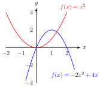
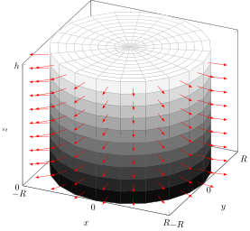
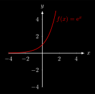
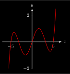
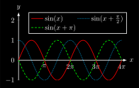
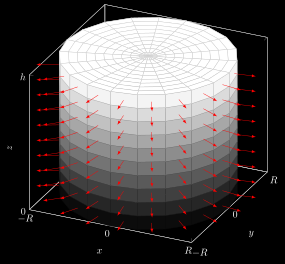

# Mathematics
## constant.svg
 [[PDF]](mathematics/constant/constant.pdf) [[PNG]](mathematics/constant/constant.png) [[SVG]](mathematics/constant/constant.svg) [[TEX]](mathematics/constant/constant.tex)
## cylinder-space-vector.svg
 [[PDF]](mathematics/cylinder-space-vector/cylinder-space-vector.pdf) [[PNG]](mathematics/cylinder-space-vector/cylinder-space-vector.png) [[SVG]](mathematics/cylinder-space-vector/cylinder-space-vector.svg) [[TEX]](mathematics/cylinder-space-vector/cylinder-space-vector.tex)
## derivative.svg
 [[PDF]](mathematics/derivative/derivative.pdf) [[PNG]](mathematics/derivative/derivative.png) [[SVG]](mathematics/derivative/derivative.svg) [[TEX]](mathematics/derivative/derivative.tex)
## derivative-tangent.svg
 [[PDF]](mathematics/derivative-tangent/derivative-tangent.pdf) [[PNG]](mathematics/derivative-tangent/derivative-tangent.png) [[SVG]](mathematics/derivative-tangent/derivative-tangent.svg) [[TEX]](mathematics/derivative-tangent/derivative-tangent.tex)
## differentiation_parametric.svg
 [[PDF]](mathematics/differentiation_parametric/differentiation_parametric.pdf) [[PNG]](mathematics/differentiation_parametric/differentiation_parametric.png) [[SVG]](mathematics/differentiation_parametric/differentiation_parametric.svg) [[TEX]](mathematics/differentiation_parametric/differentiation_parametric.tex)
## exp-2.svg
 [[PDF]](mathematics/exp-2/exp-2.pdf) [[PNG]](mathematics/exp-2/exp-2.png) [[SVG]](mathematics/exp-2/exp-2.svg) [[TEX]](mathematics/exp-2/exp-2.tex)
## exp2.svg
 [[PDF]](mathematics/exp2/exp2.pdf) [[PNG]](mathematics/exp2/exp2.png) [[SVG]](mathematics/exp2/exp2.svg) [[TEX]](mathematics/exp2/exp2.tex)
## exp.svg
 [[PDF]](mathematics/exp/exp.pdf) [[PNG]](mathematics/exp/exp.png) [[SVG]](mathematics/exp/exp.svg) [[TEX]](mathematics/exp/exp.tex)
## exponentials.svg
 [[PDF]](mathematics/exponentials/exponentials.pdf) [[PNG]](mathematics/exponentials/exponentials.png) [[SVG]](mathematics/exponentials/exponentials.svg) [[TEX]](mathematics/exponentials/exponentials.tex)
## hyperbel.svg
 [[PDF]](mathematics/hyperbel/hyperbel.pdf) [[PNG]](mathematics/hyperbel/hyperbel.png) [[SVG]](mathematics/hyperbel/hyperbel.svg) [[TEX]](mathematics/hyperbel/hyperbel.tex)
## inverse-function.svg
 [[PDF]](mathematics/inverse-function/inverse-function.pdf) [[PNG]](mathematics/inverse-function/inverse-function.png) [[SVG]](mathematics/inverse-function/inverse-function.svg) [[TEX]](mathematics/inverse-function/inverse-function.tex)
## linear-2.svg
 [[PDF]](mathematics/linear-2/linear-2.pdf) [[PNG]](mathematics/linear-2/linear-2.png) [[SVG]](mathematics/linear-2/linear-2.svg) [[TEX]](mathematics/linear-2/linear-2.tex)
## linear.svg
 [[PDF]](mathematics/linear/linear.pdf) [[PNG]](mathematics/linear/linear.png) [[SVG]](mathematics/linear/linear.svg) [[TEX]](mathematics/linear/linear.tex)
## ln-2.svg
 [[PDF]](mathematics/ln-2/ln-2.pdf) [[PNG]](mathematics/ln-2/ln-2.png) [[SVG]](mathematics/ln-2/ln-2.svg) [[TEX]](mathematics/ln-2/ln-2.tex)
## ln.svg
 [[PDF]](mathematics/ln/ln.pdf) [[PNG]](mathematics/ln/ln.png) [[SVG]](mathematics/ln/ln.svg) [[TEX]](mathematics/ln/ln.tex)
## logarithms.svg
 [[PDF]](mathematics/logarithms/logarithms.pdf) [[PNG]](mathematics/logarithms/logarithms.png) [[SVG]](mathematics/logarithms/logarithms.svg) [[TEX]](mathematics/logarithms/logarithms.tex)
## polynom.svg
 [[PDF]](mathematics/polynom/polynom.pdf) [[PNG]](mathematics/polynom/polynom.png) [[SVG]](mathematics/polynom/polynom.svg) [[TEX]](mathematics/polynom/polynom.tex)
## quadratic.svg
 [[PDF]](mathematics/quadratic/quadratic.pdf) [[PNG]](mathematics/quadratic/quadratic.png) [[SVG]](mathematics/quadratic/quadratic.svg) [[TEX]](mathematics/quadratic/quadratic.tex)
## regression-minmax.svg
 [[PDF]](mathematics/regression-minmax/regression-minmax.pdf) [[PNG]](mathematics/regression-minmax/regression-minmax.png) [[SVG]](mathematics/regression-minmax/regression-minmax.svg) [[TEX]](mathematics/regression-minmax/regression-minmax.tex)
## regression.svg
 [[PDF]](mathematics/regression/regression.pdf) [[PNG]](mathematics/regression/regression.png) [[SVG]](mathematics/regression/regression.svg) [[TEX]](mathematics/regression/regression.tex)
## right-angle-triangle.svg
 [[PDF]](mathematics/right-angle-triangle/right-angle-triangle.pdf) [[PNG]](mathematics/right-angle-triangle/right-angle-triangle.png) [[SVG]](mathematics/right-angle-triangle/right-angle-triangle.svg) [[TEX]](mathematics/right-angle-triangle/right-angle-triangle.tex)
## sin-amplitude.svg
 [[PDF]](mathematics/sin-amplitude/sin-amplitude.pdf) [[PNG]](mathematics/sin-amplitude/sin-amplitude.png) [[SVG]](mathematics/sin-amplitude/sin-amplitude.svg) [[TEX]](mathematics/sin-amplitude/sin-amplitude.tex)
## sin-cos.svg
 [[PDF]](mathematics/sin-cos/sin-cos.pdf) [[PNG]](mathematics/sin-cos/sin-cos.png) [[SVG]](mathematics/sin-cos/sin-cos.svg) [[TEX]](mathematics/sin-cos/sin-cos.tex)
## sin-cos-unit-circle.svg
 [[PDF]](mathematics/sin-cos-unit-circle/sin-cos-unit-circle.pdf) [[PNG]](mathematics/sin-cos-unit-circle/sin-cos-unit-circle.png) [[SVG]](mathematics/sin-cos-unit-circle/sin-cos-unit-circle.svg) [[TEX]](mathematics/sin-cos-unit-circle/sin-cos-unit-circle.tex)
## sin-frequency.svg
 [[PDF]](mathematics/sin-frequency/sin-frequency.pdf) [[PNG]](mathematics/sin-frequency/sin-frequency.png) [[SVG]](mathematics/sin-frequency/sin-frequency.svg) [[TEX]](mathematics/sin-frequency/sin-frequency.tex)
## sin-phase.svg
 [[PDF]](mathematics/sin-phase/sin-phase.pdf) [[PNG]](mathematics/sin-phase/sin-phase.png) [[SVG]](mathematics/sin-phase/sin-phase.svg) [[TEX]](mathematics/sin-phase/sin-phase.tex)
## sin.svg
 [[PDF]](mathematics/sin/sin.pdf) [[PNG]](mathematics/sin/sin.png) [[SVG]](mathematics/sin/sin.svg) [[TEX]](mathematics/sin/sin.tex)
## sphere-space-vector.svg
 [[PDF]](mathematics/sphere-space-vector/sphere-space-vector.pdf) [[PNG]](mathematics/sphere-space-vector/sphere-space-vector.png) [[SVG]](mathematics/sphere-space-vector/sphere-space-vector.svg) [[TEX]](mathematics/sphere-space-vector/sphere-space-vector.tex)
## sqr.svg
 [[PDF]](mathematics/sqr/sqr.pdf) [[PNG]](mathematics/sqr/sqr.png) [[SVG]](mathematics/sqr/sqr.svg) [[TEX]](mathematics/sqr/sqr.tex)
## sqrt.svg
 [[PDF]](mathematics/sqrt/sqrt.pdf) [[PNG]](mathematics/sqrt/sqrt.png) [[SVG]](mathematics/sqrt/sqrt.svg) [[TEX]](mathematics/sqrt/sqrt.tex)
## surface-element.svg
 [[PDF]](mathematics/surface-element/surface-element.pdf) [[PNG]](mathematics/surface-element/surface-element.png) [[SVG]](mathematics/surface-element/surface-element.svg) [[TEX]](mathematics/surface-element/surface-element.tex)
## surface-integral-cylinder.svg
 [[PDF]](mathematics/surface-integral-cylinder/surface-integral-cylinder.pdf) [[PNG]](mathematics/surface-integral-cylinder/surface-integral-cylinder.png) [[SVG]](mathematics/surface-integral-cylinder/surface-integral-cylinder.svg) [[TEX]](mathematics/surface-integral-cylinder/surface-integral-cylinder.tex)
## surface-integral-sphere.svg
 [[PDF]](mathematics/surface-integral-sphere/surface-integral-sphere.pdf) [[PNG]](mathematics/surface-integral-sphere/surface-integral-sphere.png) [[SVG]](mathematics/surface-integral-sphere/surface-integral-sphere.svg) [[TEX]](mathematics/surface-integral-sphere/surface-integral-sphere.tex)
## surface-integral.svg
 [[PDF]](mathematics/surface-integral/surface-integral.pdf) [[PNG]](mathematics/surface-integral/surface-integral.png) [[SVG]](mathematics/surface-integral/surface-integral.svg) [[TEX]](mathematics/surface-integral/surface-integral.tex)
## total_differential.svg
 [[PDF]](mathematics/total_differential/total_differential.pdf) [[PNG]](mathematics/total_differential/total_differential.png) [[SVG]](mathematics/total_differential/total_differential.svg) [[TEX]](mathematics/total_differential/total_differential.tex)
## constant_inverted.svg
 [[PDF]](mathematics/constant/constant_inverted.pdf) [[PNG]](mathematics/constant/constant_inverted.png) [[SVG]](mathematics/constant/constant_inverted.svg) [[TEX]](mathematics/constant/constant_inverted.tex)
## cylinder-space-vector_inverted.svg
 [[PDF]](mathematics/cylinder-space-vector/cylinder-space-vector_inverted.pdf) [[PNG]](mathematics/cylinder-space-vector/cylinder-space-vector_inverted.png) [[SVG]](mathematics/cylinder-space-vector/cylinder-space-vector_inverted.svg) [[TEX]](mathematics/cylinder-space-vector/cylinder-space-vector_inverted.tex)
## derivative_inverted.svg
 [[PDF]](mathematics/derivative/derivative_inverted.pdf) [[PNG]](mathematics/derivative/derivative_inverted.png) [[SVG]](mathematics/derivative/derivative_inverted.svg) [[TEX]](mathematics/derivative/derivative_inverted.tex)
## derivative-tangent_inverted.svg
 [[PDF]](mathematics/derivative-tangent/derivative-tangent_inverted.pdf) [[PNG]](mathematics/derivative-tangent/derivative-tangent_inverted.png) [[SVG]](mathematics/derivative-tangent/derivative-tangent_inverted.svg) [[TEX]](mathematics/derivative-tangent/derivative-tangent_inverted.tex)
## differentiation_parametric_inverted.svg
 [[PDF]](mathematics/differentiation_parametric/differentiation_parametric_inverted.pdf) [[PNG]](mathematics/differentiation_parametric/differentiation_parametric_inverted.png) [[SVG]](mathematics/differentiation_parametric/differentiation_parametric_inverted.svg) [[TEX]](mathematics/differentiation_parametric/differentiation_parametric_inverted.tex)
## exp-2_inverted.svg
 [[PDF]](mathematics/exp-2/exp-2_inverted.pdf) [[PNG]](mathematics/exp-2/exp-2_inverted.png) [[SVG]](mathematics/exp-2/exp-2_inverted.svg) [[TEX]](mathematics/exp-2/exp-2_inverted.tex)
## exp2_inverted.svg
 [[PDF]](mathematics/exp2/exp2_inverted.pdf) [[PNG]](mathematics/exp2/exp2_inverted.png) [[SVG]](mathematics/exp2/exp2_inverted.svg) [[TEX]](mathematics/exp2/exp2_inverted.tex)
## exp_inverted.svg
 [[PDF]](mathematics/exp/exp_inverted.pdf) [[PNG]](mathematics/exp/exp_inverted.png) [[SVG]](mathematics/exp/exp_inverted.svg) [[TEX]](mathematics/exp/exp_inverted.tex)
## exponentials_inverted.svg
 [[PDF]](mathematics/exponentials/exponentials_inverted.pdf) [[PNG]](mathematics/exponentials/exponentials_inverted.png) [[SVG]](mathematics/exponentials/exponentials_inverted.svg) [[TEX]](mathematics/exponentials/exponentials_inverted.tex)
## hyperbel_inverted.svg
 [[PDF]](mathematics/hyperbel/hyperbel_inverted.pdf) [[PNG]](mathematics/hyperbel/hyperbel_inverted.png) [[SVG]](mathematics/hyperbel/hyperbel_inverted.svg) [[TEX]](mathematics/hyperbel/hyperbel_inverted.tex)
## inverse-function_inverted.svg
 [[PDF]](mathematics/inverse-function/inverse-function_inverted.pdf) [[PNG]](mathematics/inverse-function/inverse-function_inverted.png) [[SVG]](mathematics/inverse-function/inverse-function_inverted.svg) [[TEX]](mathematics/inverse-function/inverse-function_inverted.tex)
## linear-2_inverted.svg
 [[PDF]](mathematics/linear-2/linear-2_inverted.pdf) [[PNG]](mathematics/linear-2/linear-2_inverted.png) [[SVG]](mathematics/linear-2/linear-2_inverted.svg) [[TEX]](mathematics/linear-2/linear-2_inverted.tex)
## linear_inverted.svg
 [[PDF]](mathematics/linear/linear_inverted.pdf) [[PNG]](mathematics/linear/linear_inverted.png) [[SVG]](mathematics/linear/linear_inverted.svg) [[TEX]](mathematics/linear/linear_inverted.tex)
## ln-2_inverted.svg
 [[PDF]](mathematics/ln-2/ln-2_inverted.pdf) [[PNG]](mathematics/ln-2/ln-2_inverted.png) [[SVG]](mathematics/ln-2/ln-2_inverted.svg) [[TEX]](mathematics/ln-2/ln-2_inverted.tex)
## ln_inverted.svg
 [[PDF]](mathematics/ln/ln_inverted.pdf) [[PNG]](mathematics/ln/ln_inverted.png) [[SVG]](mathematics/ln/ln_inverted.svg) [[TEX]](mathematics/ln/ln_inverted.tex)
## logarithms_inverted.svg
 [[PDF]](mathematics/logarithms/logarithms_inverted.pdf) [[PNG]](mathematics/logarithms/logarithms_inverted.png) [[SVG]](mathematics/logarithms/logarithms_inverted.svg) [[TEX]](mathematics/logarithms/logarithms_inverted.tex)
## polynom_inverted.svg
 [[PDF]](mathematics/polynom/polynom_inverted.pdf) [[PNG]](mathematics/polynom/polynom_inverted.png) [[SVG]](mathematics/polynom/polynom_inverted.svg) [[TEX]](mathematics/polynom/polynom_inverted.tex)
## quadratic_inverted.svg
 [[PDF]](mathematics/quadratic/quadratic_inverted.pdf) [[PNG]](mathematics/quadratic/quadratic_inverted.png) [[SVG]](mathematics/quadratic/quadratic_inverted.svg) [[TEX]](mathematics/quadratic/quadratic_inverted.tex)
## regression-minmax_inverted.svg
 [[PDF]](mathematics/regression-minmax/regression-minmax_inverted.pdf) [[PNG]](mathematics/regression-minmax/regression-minmax_inverted.png) [[SVG]](mathematics/regression-minmax/regression-minmax_inverted.svg) [[TEX]](mathematics/regression-minmax/regression-minmax_inverted.tex)
## regression_inverted.svg
 [[PDF]](mathematics/regression/regression_inverted.pdf) [[PNG]](mathematics/regression/regression_inverted.png) [[SVG]](mathematics/regression/regression_inverted.svg) [[TEX]](mathematics/regression/regression_inverted.tex)
## right-angle-triangle_inverted.svg
 [[PDF]](mathematics/right-angle-triangle/right-angle-triangle_inverted.pdf) [[PNG]](mathematics/right-angle-triangle/right-angle-triangle_inverted.png) [[SVG]](mathematics/right-angle-triangle/right-angle-triangle_inverted.svg) [[TEX]](mathematics/right-angle-triangle/right-angle-triangle_inverted.tex)
## sin-amplitude_inverted.svg
 [[PDF]](mathematics/sin-amplitude/sin-amplitude_inverted.pdf) [[PNG]](mathematics/sin-amplitude/sin-amplitude_inverted.png) [[SVG]](mathematics/sin-amplitude/sin-amplitude_inverted.svg) [[TEX]](mathematics/sin-amplitude/sin-amplitude_inverted.tex)
## sin-cos_inverted.svg
 [[PDF]](mathematics/sin-cos/sin-cos_inverted.pdf) [[PNG]](mathematics/sin-cos/sin-cos_inverted.png) [[SVG]](mathematics/sin-cos/sin-cos_inverted.svg) [[TEX]](mathematics/sin-cos/sin-cos_inverted.tex)
## sin-cos-unit-circle_inverted.svg
 [[PDF]](mathematics/sin-cos-unit-circle/sin-cos-unit-circle_inverted.pdf) [[PNG]](mathematics/sin-cos-unit-circle/sin-cos-unit-circle_inverted.png) [[SVG]](mathematics/sin-cos-unit-circle/sin-cos-unit-circle_inverted.svg) [[TEX]](mathematics/sin-cos-unit-circle/sin-cos-unit-circle_inverted.tex)
## sin-frequency_inverted.svg
 [[PDF]](mathematics/sin-frequency/sin-frequency_inverted.pdf) [[PNG]](mathematics/sin-frequency/sin-frequency_inverted.png) [[SVG]](mathematics/sin-frequency/sin-frequency_inverted.svg) [[TEX]](mathematics/sin-frequency/sin-frequency_inverted.tex)
## sin-phase_inverted.svg
 [[PDF]](mathematics/sin-phase/sin-phase_inverted.pdf) [[PNG]](mathematics/sin-phase/sin-phase_inverted.png) [[SVG]](mathematics/sin-phase/sin-phase_inverted.svg) [[TEX]](mathematics/sin-phase/sin-phase_inverted.tex)
## sin_inverted.svg
 [[PDF]](mathematics/sin/sin_inverted.pdf) [[PNG]](mathematics/sin/sin_inverted.png) [[SVG]](mathematics/sin/sin_inverted.svg) [[TEX]](mathematics/sin/sin_inverted.tex)
## sphere-space-vector_inverted.svg
 [[PDF]](mathematics/sphere-space-vector/sphere-space-vector_inverted.pdf) [[PNG]](mathematics/sphere-space-vector/sphere-space-vector_inverted.png) [[SVG]](mathematics/sphere-space-vector/sphere-space-vector_inverted.svg) [[TEX]](mathematics/sphere-space-vector/sphere-space-vector_inverted.tex)
## sqr_inverted.svg
 [[PDF]](mathematics/sqr/sqr_inverted.pdf) [[PNG]](mathematics/sqr/sqr_inverted.png) [[SVG]](mathematics/sqr/sqr_inverted.svg) [[TEX]](mathematics/sqr/sqr_inverted.tex)
## sqrt_inverted.svg
 [[PDF]](mathematics/sqrt/sqrt_inverted.pdf) [[PNG]](mathematics/sqrt/sqrt_inverted.png) [[SVG]](mathematics/sqrt/sqrt_inverted.svg) [[TEX]](mathematics/sqrt/sqrt_inverted.tex)
## surface-element_inverted.svg
 [[PDF]](mathematics/surface-element/surface-element_inverted.pdf) [[PNG]](mathematics/surface-element/surface-element_inverted.png) [[SVG]](mathematics/surface-element/surface-element_inverted.svg) [[TEX]](mathematics/surface-element/surface-element_inverted.tex)
## surface-integral-cylinder_inverted.svg
 [[PDF]](mathematics/surface-integral-cylinder/surface-integral-cylinder_inverted.pdf) [[PNG]](mathematics/surface-integral-cylinder/surface-integral-cylinder_inverted.png) [[SVG]](mathematics/surface-integral-cylinder/surface-integral-cylinder_inverted.svg) [[TEX]](mathematics/surface-integral-cylinder/surface-integral-cylinder_inverted.tex)
## surface-integral-sphere_inverted.svg
 [[PDF]](mathematics/surface-integral-sphere/surface-integral-sphere_inverted.pdf) [[PNG]](mathematics/surface-integral-sphere/surface-integral-sphere_inverted.png) [[SVG]](mathematics/surface-integral-sphere/surface-integral-sphere_inverted.svg) [[TEX]](mathematics/surface-integral-sphere/surface-integral-sphere_inverted.tex)
## surface-integral_inverted.svg
 [[PDF]](mathematics/surface-integral/surface-integral_inverted.pdf) [[PNG]](mathematics/surface-integral/surface-integral_inverted.png) [[SVG]](mathematics/surface-integral/surface-integral_inverted.svg) [[TEX]](mathematics/surface-integral/surface-integral_inverted.tex)
## total_differential_inverted.svg
 [[PDF]](mathematics/total_differential/total_differential_inverted.pdf) [[PNG]](mathematics/total_differential/total_differential_inverted.png) [[SVG]](mathematics/total_differential/total_differential_inverted.svg) [[TEX]](mathematics/total_differential/total_differential_inverted.tex)
