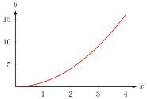
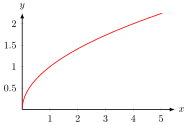
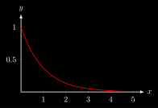

# Mathematics
## differentiation_parametric.svg
 [[PDF]](mathematics/differentiation_parametric/differentiation_parametric.pdf) [[PNG]](mathematics/differentiation_parametric/differentiation_parametric.png) [[SVG]](mathematics/differentiation_parametric/differentiation_parametric.svg)
~~~.tex
\documentclass[crop,tikz]{standalone}

\usetikzlibrary{decorations.markings}
\usepackage{pgfplots}
\pgfplotsset{compat=1.17}
\tikzset{>=latex}

\pgfplotsset{
  inverted/.style = {
    every axis legend/.append style={
      draw=white,
      fill=hardblack,
      text=white
    }
  },
  every non boxed x axis/.append style={
    axis line style={-latex}
  },
  every non boxed y axis/.append style={
    axis line style={-latex}
  },
}

\begin{document}
\begin{tikzpicture}
  \pgfmathsetmacro{\px}{pi/2}; % start x coordinate
  \pgfmathsetmacro{\py}{pi/2}; % start y coordinate
  \pgfmathsetmacro{\qx}{3*pi/2}; % end x coordinate
  \pgfmathsetmacro{\qy}{3*pi/2}; % end y coordinate
  \begin{axis}[
    view={0}{90},
    xlabel={$x$},
    ylabel={$y$},
    axis equal image,
    xtick=\empty,
    ytick=\empty,
    xmin=0,xmax={2*pi},
    ymin=0,ymax={2*pi},
    declare function = {
      f(\x,\y) = sin(deg(x))*sin(deg(y));
    },
    samples=40, samples y=40,
    domain=0:{2*pi}, domain y=0:{2*pi},
    ]
    \addplot3[surf,colormap/blackwhite] { f(x, y) };
    \addplot[red,
      very thick,
      domain={-pi/2}:{0},
      samples=50,
      decoration={markings, mark=at position 0.5 with {\arrow{>}}},
      postaction={decorate}] ({\px+pi*cos(deg(x))},{\qx+pi*sin(deg(x))});
    % marks
    \addplot[only marks, mark=*, mark size=1pt, red] coordinates { ({\px}, {\py}) } node[below] { $(x_0, y_0)$ };
    \addplot[only marks, mark=*, mark size=1pt, red] coordinates { ({\qx}, {\qy}) } node[above] { $(x_1, y_1)$ };
  \end{axis}
\end{tikzpicture}
\end{document}
~~~
## exp2.svg
 [[PDF]](mathematics/exp2/exp2.pdf) [[PNG]](mathematics/exp2/exp2.png) [[SVG]](mathematics/exp2/exp2.svg)
~~~.tex
\documentclass[crop,tikz]{standalone}

\usepackage{pgfplots}
\tikzset{>=latex}

\pgfplotsset{
  every non boxed x axis/.append style={
    axis line style={-latex}
  },
  every non boxed y axis/.append style={
    axis line style={-latex}
  },
  inverted/.style = {
    every axis legend/.append style={
      draw=white,
      fill=black,
      text=white
    }
  }
}

\begin{document}
\begin{tikzpicture}
\begin{axis}[
  thick,
  width=7cm,
  height=5cm,
  domain={0}:{5},
  samples=50,
  axis y line=middle,
  axis x line=middle,
  xlabel={$x$},
  ylabel={$y$},
  xlabel style={right},
  ylabel style={above},
  xmin=0, xmax={5.5},
  ymin=0, ymax=1.2
  ]
  \addplot[red,smooth] { exp(-x) };
\end{axis}
\end{tikzpicture}
\end{document}
~~~
## exp.svg
 [[PDF]](mathematics/exp/exp.pdf) [[PNG]](mathematics/exp/exp.png) [[SVG]](mathematics/exp/exp.svg)
~~~.tex
\documentclass[crop,tikz]{standalone}

\usepackage{pgfplots}
\tikzset{>=latex}

\pgfplotsset{
  every non boxed x axis/.append style={
    axis line style={-latex}
  },
  every non boxed y axis/.append style={
    axis line style={-latex}
  },
  inverted/.style = {
    every axis legend/.append style={
      draw=white,
      fill=black,
      text=white
    }
  }
}

\begin{document}
\begin{tikzpicture}
\begin{axis}[
  thick,
  width=7cm,
  height=5cm,
  domain={0}:{5},
  samples=50,
  axis y line=middle,
  axis x line=middle,
  xlabel={$x$},
  ylabel={$y$},
  xlabel style={right},
  ylabel style={above},
  xmin=0, xmax={5.5},
  ymin=0,
  ]
  \addplot[red,smooth] { exp(x) };
\end{axis}
\end{tikzpicture}
\end{document}
~~~
## hyperbel.svg
 [[PDF]](mathematics/hyperbel/hyperbel.pdf) [[PNG]](mathematics/hyperbel/hyperbel.png) [[SVG]](mathematics/hyperbel/hyperbel.svg)
~~~.tex
\documentclass[crop,tikz]{standalone}

\usepackage{pgfplots}
\tikzset{>=latex}

\pgfplotsset{
  every non boxed x axis/.append style={
    axis line style={-latex}
  },
  every non boxed y axis/.append style={
    axis line style={-latex}
  },
  inverted/.style = {
    every axis legend/.append style={
      draw=white,
      fill=black,
      text=white
    }
  }
}

\begin{document}
\begin{tikzpicture}
\begin{axis}[
  thick,
  width=7cm,
  height=5cm,
  domain={0.1}:{5},
  samples=50,
  axis y line=middle,
  axis x line=middle,
  xlabel={$x$},
  ylabel={$y$},
  xlabel style={right},
  ylabel style={above},
  xmin=0, xmax={5.5},
  ymin=0, ymax={5.5}
  ]
  \addplot[red,smooth] { 1/x };
\end{axis}
\end{tikzpicture}
\end{document}
~~~
## ln.svg
 [[PDF]](mathematics/ln/ln.pdf) [[PNG]](mathematics/ln/ln.png) [[SVG]](mathematics/ln/ln.svg)
~~~.tex
\documentclass[crop,tikz]{standalone}

\usepackage{pgfplots}
\tikzset{>=latex}

\pgfplotsset{
  every non boxed x axis/.append style={
    axis line style={-latex}
  },
  every non boxed y axis/.append style={
    axis line style={-latex}
  },
  inverted/.style = {
    every axis legend/.append style={
      draw=white,
      fill=black,
      text=white
    }
  }
}

\begin{document}
\begin{tikzpicture}
\begin{axis}[
  thick,
  width=7cm,
  height=5cm,
  domain={0.1}:{5},
  samples=50,
  axis y line=middle,
  axis x line=middle,
  xlabel={$x$},
  ylabel={$y$},
  xlabel style={right},
  ylabel style={above},
  xmin=0, xmax={5.5},
  % ymin=0,
  ]
  \addplot[red,smooth] { ln(x) };
\end{axis}
\end{tikzpicture}
\end{document}
~~~
## sin.svg
 [[PDF]](mathematics/sin/sin.pdf) [[PNG]](mathematics/sin/sin.png) [[SVG]](mathematics/sin/sin.svg)
~~~.tex
\documentclass[crop,tikz]{standalone}

\usepackage{pgfplots}
\tikzset{>=latex}

\pgfplotsset{
  every non boxed x axis/.append style={
    axis line style={-latex}
  },
  every non boxed y axis/.append style={
    axis line style={-latex}
  },
  inverted/.style = {
    every axis legend/.append style={
      draw=white,
      fill=black,
      text=white
    }
  }
}

\begin{document}
\begin{tikzpicture}
\begin{axis}[
  thick,
  width=7cm,
  height=5cm,
  domain={0}:{4*pi},
  samples=50,
  axis y line=middle,
  axis x line=middle,
  xlabel={$x$},
  ylabel={$y$},
  xlabel style={right},
  ylabel style={above},
  xmin=0, xmax={4.2*pi},
  ymin=-1, ymax=1.2,
  xtick={0, pi, 2*pi, 3*pi, 4*pi},
  xticklabels={$0$, $\pi$, $2\pi$, $3\pi$, $4\pi$},
  ytick={-1, 0, 1},
  ]
  \addplot[red,smooth] { sin(deg(x)) };
\end{axis}
\end{tikzpicture}
\end{document}
~~~
## sqr.svg
 [[PDF]](mathematics/sqr/sqr.pdf) [[PNG]](mathematics/sqr/sqr.png) [[SVG]](mathematics/sqr/sqr.svg)
~~~.tex
\documentclass[crop,tikz]{standalone}

\usepackage{pgfplots}
\tikzset{>=latex}

\pgfplotsset{
  every non boxed x axis/.append style={
    axis line style={-latex}
  },
  every non boxed y axis/.append style={
    axis line style={-latex}
  },
  inverted/.style = {
    every axis legend/.append style={
      draw=white,
      fill=black,
      text=white
    }
  }
}

\begin{document}
\begin{tikzpicture}
\begin{axis}[
  thick,
  width=7cm,
  height=5cm,
  domain={0}:{4},
  samples=50,
  axis y line=middle,
  axis x line=middle,
  xlabel={$x$},
  ylabel={$y$},
  xlabel style={right},
  ylabel style={above},
  xmin=0, xmax={4.4},
  ymin=0, ymax=17,
  ]
  \addplot[red,smooth] { x^2 };
\end{axis}
\end{tikzpicture}
\end{document}
~~~
## sqrt.svg
 [[PDF]](mathematics/sqrt/sqrt.pdf) [[PNG]](mathematics/sqrt/sqrt.png) [[SVG]](mathematics/sqrt/sqrt.svg)
~~~.tex
\documentclass[crop,tikz]{standalone}

\usepackage{pgfplots}
\tikzset{>=latex}

\pgfplotsset{
  every non boxed x axis/.append style={
    axis line style={-latex}
  },
  every non boxed y axis/.append style={
    axis line style={-latex}
  },
  inverted/.style = {
    every axis legend/.append style={
      draw=white,
      fill=black,
      text=white
    }
  }
}

\begin{document}
\begin{tikzpicture}
\begin{axis}[
  thick,
  width=7cm,
  height=5cm,
  domain={0}:{5},
  samples=50,
  axis y line=middle,
  axis x line=middle,
  xlabel={$x$},
  ylabel={$y$},
  xlabel style={right},
  ylabel style={above},
  xmin=0, xmax={5.5},
  ymin=0,
  ]
  \addplot[red,smooth] (x^2, x);
\end{axis}
\end{tikzpicture}
\end{document}
~~~
## total_differential.svg
 [[PDF]](mathematics/total_differential/total_differential.pdf) [[PNG]](mathematics/total_differential/total_differential.png) [[SVG]](mathematics/total_differential/total_differential.svg)
~~~.tex
\documentclass[crop,tikz]{standalone}

\usepackage{pgfplots}
\usepackage{physics}
\pgfplotsset{compat=1.17}
\tikzset{>=latex}

\colorlet{green}{black!40!green}

\pgfplotsset{
  inverted/.style = {
    every axis legend/.append style={
      draw=white,
      fill=hardblack,
      text=white
    }
  },
  every non boxed x axis/.append style={
    axis line style={-latex}
  },
  every non boxed y axis/.append style={
    axis line style={-latex}
  },
  every non boxed z axis/.append style={
    axis line style={-latex}
  }
}

\begin{document}
\begin{tikzpicture}
  \pgfmathsetmacro{\px}{1};
  \pgfmathsetmacro{\py}{1};
  \pgfmathsetmacro{\dx}{2};
  \pgfmathsetmacro{\dy}{2};
  \begin{axis}[
    axis x line=middle,
    axis y line=middle,
    axis z line=middle,
    xlabel={$x$},
    xlabel style={right},
    ylabel={$y$},
    ylabel style={above},
    zlabel={$z$},
    zlabel style={above},
    xtick={1, 3},
    xticklabels={$x_0$, $x_0+\dd{x}$},
    xticklabel style={font=\small},
    ytick={1, 3},
    yticklabels={$y_0$, $y_0+\dd{y}$},
    yticklabel style={font=\small, above, anchor=east},
    ztick=\empty,
    xmin=0,xmax=4,
    ymin=0,ymax=4,
    zmin=0,zmax={2*3*3},
    declare function = {
      f(\x,\y) = \x^2 + \y^2;
      t(\x,\y) = f(\px,\py) + 2*\px*(\x-\px) + 2*\py*(\y-\py);
    },
    samples=10, samples y=10,
    domain={\px}:{\px+\dx}, domain y={\py}:{\py+\dy},
    clip=false,
    ]
    % help lines
    \draw[gray, dashed, thin]
      (\px, 0, 0) -- (\px, {\py+\dy}, 0)
      (\px, \py, 0) -- (\px, \py, {f(\px, \py)})
      ({\px+\dx}, \py, 0) -- ({\px+\dx}, \py, {f(\px, \py)})
      ({\px+\dx}, 0, 0) -- ({\px+\dx}, {\py+\dy}, 0) -- ({\px+\dx}, {\py+\dy}, {f(\px, \py)})
      (0, \py, 0) -- ({\px+\dx}, \py, 0)
      (0, {\py+\dy}, 0) -- ({\px+\dx}, {\py+\dy}, 0);
    % slope lines
    \draw[gray, thin]
         (\px, \py, {f(\px, \py)})
      -- ({\px+\dx}, \py, {f(\px, \py)})
      -- ({\px+\dx}, \py, {t(\px+\dx, \py)})
      -- ({\px+\dx}, {\py+\dy}, {t(\px+\dx, \py)})
      -- ({\px+\dx}, {\py+\dy}, {f(\px, \py)})
      -- ({\px+\dx}, {\py}, {f(\px, \py)})
         ({\px+\dx}, {\py+\dy}, {t(\px+\dx, \py)})
      -- ({\px+\dx}, {\py+\dy}, {t(\px+\dx, \py+\dy)});
    % tangential plane
    \addplot3[surf,colormap/cool] { t(x, y) };
    % function
    \addplot3[surf,colormap/blackwhite] { f(x, y) };
    % marks
    \addplot3[only marks, mark=*, mark size=1pt, red] coordinates { (\px, \py, {f(\px, \py)}) } node[below] { $f(x_0, y_0)$ };
    \addplot3[only marks, mark=*, mark size=1pt, green] coordinates { ({\px+\dx}, {\py+\dy}, {f(\px+\dx, \py+\dy)}) } node[right] { $f(x_0+\dd{x}, y_0+\dd{y})$ };
    \addplot3[only marks, mark=*, mark size=1pt, blue] coordinates { ({\px+\dx}, {\py+\dy}, {t(\px+\dx, \py+\dy)}) } node[above right] { $t(x_0+\dd{x}, y_0+\dd{y})$ };
    % braces
    \draw[decorate, decoration = {brace, amplitude=3pt}] ([xshift=0.2em]{\px+\dx}, {\py+\dy}, {t(\px+\dx, \py)}) -- ([xshift=0.2em]{\px+\dx}, {\py+\dy}, {f(\px, \py)}) coordinate (a) node[right,xshift=0.5em,midway] {$\pdv{f(x_0, y_0)}{x}\dd{x}$};
    \draw[decorate, decoration = {brace, amplitude=3pt}] ([xshift=0.2em]{\px+\dx}, {\py+\dy}, {t(\px+\dx, \py+\dy)}) -- ([xshift=0.2em]{\px+\dx}, {\py+\dy}, {t(\px+\dx, \py)}) node[right,xshift=0.5em,midway] {$\pdv{f(x_0, y_0)}{y}\dd{y}$};
    \draw[decorate, decoration = {brace, amplitude=3pt}] ([xshift=7em]{\px+\dx}, {\py+\dy}, {t(\px+\dx, \py+\dy)}) -- ([xshift=7em]{\px+\dx}, {\py+\dy}, {f(\px, \py)}) node[right,xshift=0.5em,midway] {$\dd{f(x_0, y_0)}$};
  \end{axis}
\end{tikzpicture}
\end{document}
~~~
## differentiation_parametric_inverted.svg
 [[PDF]](mathematics/differentiation_parametric/differentiation_parametric_inverted.pdf) [[PNG]](mathematics/differentiation_parametric/differentiation_parametric_inverted.png) [[SVG]](mathematics/differentiation_parametric/differentiation_parametric_inverted.svg)
~~~.tex
\documentclass[crop,tikz]{standalone}
\usetikzlibrary{backgrounds}
\colorlet{blue}{cyan}
\tikzset{
  inverted/.style = {
    color=white,
    background rectangle/.style={fill},
    show background rectangle
  }
}

\usetikzlibrary{decorations.markings}
\usepackage{pgfplots}
\pgfplotsset{compat=1.17}
\tikzset{>=latex}

\pgfplotsset{
  inverted/.style = {
    every axis legend/.append style={
      draw=white,
      fill=black,
      text=white
    }
  },
  every non boxed x axis/.append style={
    axis line style={-latex}
  },
  every non boxed y axis/.append style={
    axis line style={-latex}
  },
}

\begin{document}
\begin{tikzpicture}[inverted,inverted]
  \pgfmathsetmacro{\px}{pi/2}; % start x coordinate
  \pgfmathsetmacro{\py}{pi/2}; % start y coordinate
  \pgfmathsetmacro{\qx}{3*pi/2}; % end x coordinate
  \pgfmathsetmacro{\qy}{3*pi/2}; % end y coordinate
  \begin{axis}[inverted,
    view={0}{90},
    xlabel={$x$},
    ylabel={$y$},
    axis equal image,
    xtick=\empty,
    ytick=\empty,
    xmin=0,xmax={2*pi},
    ymin=0,ymax={2*pi},
    declare function = {
      f(\x,\y) = sin(deg(x))*sin(deg(y));
    },
    samples=40, samples y=40,
    domain=0:{2*pi}, domain y=0:{2*pi},
    ]
    \addplot3[surf,colormap/blackwhite] { f(x, y) };
    \addplot[red,
      very thick,
      domain={-pi/2}:{0},
      samples=50,
      decoration={markings, mark=at position 0.5 with {\arrow{>}}},
      postaction={decorate}] ({\px+pi*cos(deg(x))},{\qx+pi*sin(deg(x))});
    % marks
    \addplot[only marks, mark=*, mark size=1pt, red] coordinates { ({\px}, {\py}) } node[below] { $(x_0, y_0)$ };
    \addplot[only marks, mark=*, mark size=1pt, red] coordinates { ({\qx}, {\qy}) } node[above] { $(x_1, y_1)$ };
  \end{axis}
\end{tikzpicture}
\end{document}
~~~
## exp2_inverted.svg
 [[PDF]](mathematics/exp2/exp2_inverted.pdf) [[PNG]](mathematics/exp2/exp2_inverted.png) [[SVG]](mathematics/exp2/exp2_inverted.svg)
~~~.tex
\documentclass[crop,tikz]{standalone}
\usetikzlibrary{backgrounds}
\colorlet{blue}{cyan}
\tikzset{
  inverted/.style = {
    color=white,
    background rectangle/.style={fill},
    show background rectangle
  }
}

\usepackage{pgfplots}
\tikzset{>=latex}

\pgfplotsset{
  every non boxed x axis/.append style={
    axis line style={-latex}
  },
  every non boxed y axis/.append style={
    axis line style={-latex}
  },
  inverted/.style = {
    every axis legend/.append style={
      draw=white,
      fill=white,
      text=white
    }
  }
}

\begin{document}
\begin{tikzpicture}[inverted,inverted]
\begin{axis}[inverted,
  thick,
  width=7cm,
  height=5cm,
  domain={0}:{5},
  samples=50,
  axis y line=middle,
  axis x line=middle,
  xlabel={$x$},
  ylabel={$y$},
  xlabel style={right},
  ylabel style={above},
  xmin=0, xmax={5.5},
  ymin=0, ymax=1.2
  ]
  \addplot[red,smooth] { exp(-x) };
\end{axis}
\end{tikzpicture}
\end{document}
~~~
## exp_inverted.svg
 [[PDF]](mathematics/exp/exp_inverted.pdf) [[PNG]](mathematics/exp/exp_inverted.png) [[SVG]](mathematics/exp/exp_inverted.svg)
~~~.tex
\documentclass[crop,tikz]{standalone}
\usetikzlibrary{backgrounds}
\colorlet{blue}{cyan}
\tikzset{
  inverted/.style = {
    color=white,
    background rectangle/.style={fill},
    show background rectangle
  }
}

\usepackage{pgfplots}
\tikzset{>=latex}

\pgfplotsset{
  every non boxed x axis/.append style={
    axis line style={-latex}
  },
  every non boxed y axis/.append style={
    axis line style={-latex}
  },
  inverted/.style = {
    every axis legend/.append style={
      draw=white,
      fill=white,
      text=white
    }
  }
}

\begin{document}
\begin{tikzpicture}[inverted,inverted]
\begin{axis}[inverted,
  thick,
  width=7cm,
  height=5cm,
  domain={0}:{5},
  samples=50,
  axis y line=middle,
  axis x line=middle,
  xlabel={$x$},
  ylabel={$y$},
  xlabel style={right},
  ylabel style={above},
  xmin=0, xmax={5.5},
  ymin=0,
  ]
  \addplot[red,smooth] { exp(x) };
\end{axis}
\end{tikzpicture}
\end{document}
~~~
## hyperbel_inverted.svg
 [[PDF]](mathematics/hyperbel/hyperbel_inverted.pdf) [[PNG]](mathematics/hyperbel/hyperbel_inverted.png) [[SVG]](mathematics/hyperbel/hyperbel_inverted.svg)
~~~.tex
\documentclass[crop,tikz]{standalone}
\usetikzlibrary{backgrounds}
\colorlet{blue}{cyan}
\tikzset{
  inverted/.style = {
    color=white,
    background rectangle/.style={fill},
    show background rectangle
  }
}

\usepackage{pgfplots}
\tikzset{>=latex}

\pgfplotsset{
  every non boxed x axis/.append style={
    axis line style={-latex}
  },
  every non boxed y axis/.append style={
    axis line style={-latex}
  },
  inverted/.style = {
    every axis legend/.append style={
      draw=white,
      fill=white,
      text=white
    }
  }
}

\begin{document}
\begin{tikzpicture}[inverted,inverted]
\begin{axis}[inverted,
  thick,
  width=7cm,
  height=5cm,
  domain={0.1}:{5},
  samples=50,
  axis y line=middle,
  axis x line=middle,
  xlabel={$x$},
  ylabel={$y$},
  xlabel style={right},
  ylabel style={above},
  xmin=0, xmax={5.5},
  ymin=0, ymax={5.5}
  ]
  \addplot[red,smooth] { 1/x };
\end{axis}
\end{tikzpicture}
\end{document}
~~~
## ln_inverted.svg
 [[PDF]](mathematics/ln/ln_inverted.pdf) [[PNG]](mathematics/ln/ln_inverted.png) [[SVG]](mathematics/ln/ln_inverted.svg)
~~~.tex
\documentclass[crop,tikz]{standalone}
\usetikzlibrary{backgrounds}
\colorlet{blue}{cyan}
\tikzset{
  inverted/.style = {
    color=white,
    background rectangle/.style={fill},
    show background rectangle
  }
}

\usepackage{pgfplots}
\tikzset{>=latex}

\pgfplotsset{
  every non boxed x axis/.append style={
    axis line style={-latex}
  },
  every non boxed y axis/.append style={
    axis line style={-latex}
  },
  inverted/.style = {
    every axis legend/.append style={
      draw=white,
      fill=white,
      text=white
    }
  }
}

\begin{document}
\begin{tikzpicture}[inverted,inverted]
\begin{axis}[inverted,
  thick,
  width=7cm,
  height=5cm,
  domain={0.1}:{5},
  samples=50,
  axis y line=middle,
  axis x line=middle,
  xlabel={$x$},
  ylabel={$y$},
  xlabel style={right},
  ylabel style={above},
  xmin=0, xmax={5.5},
  % ymin=0,
  ]
  \addplot[red,smooth] { ln(x) };
\end{axis}
\end{tikzpicture}
\end{document}
~~~
## sin_inverted.svg
 [[PDF]](mathematics/sin/sin_inverted.pdf) [[PNG]](mathematics/sin/sin_inverted.png) [[SVG]](mathematics/sin/sin_inverted.svg)
~~~.tex
\documentclass[crop,tikz]{standalone}
\usetikzlibrary{backgrounds}
\colorlet{blue}{cyan}
\tikzset{
  inverted/.style = {
    color=white,
    background rectangle/.style={fill},
    show background rectangle
  }
}

\usepackage{pgfplots}
\tikzset{>=latex}

\pgfplotsset{
  every non boxed x axis/.append style={
    axis line style={-latex}
  },
  every non boxed y axis/.append style={
    axis line style={-latex}
  },
  inverted/.style = {
    every axis legend/.append style={
      draw=white,
      fill=white,
      text=white
    }
  }
}

\begin{document}
\begin{tikzpicture}[inverted,inverted]
\begin{axis}[inverted,
  thick,
  width=7cm,
  height=5cm,
  domain={0}:{4*pi},
  samples=50,
  axis y line=middle,
  axis x line=middle,
  xlabel={$x$},
  ylabel={$y$},
  xlabel style={right},
  ylabel style={above},
  xmin=0, xmax={4.2*pi},
  ymin=-1, ymax=1.2,
  xtick={0, pi, 2*pi, 3*pi, 4*pi},
  xticklabels={$0$, $\pi$, $2\pi$, $3\pi$, $4\pi$},
  ytick={-1, 0, 1},
  ]
  \addplot[red,smooth] { sin(deg(x)) };
\end{axis}
\end{tikzpicture}
\end{document}
~~~
## sqr_inverted.svg
 [[PDF]](mathematics/sqr/sqr_inverted.pdf) [[PNG]](mathematics/sqr/sqr_inverted.png) [[SVG]](mathematics/sqr/sqr_inverted.svg)
~~~.tex
\documentclass[crop,tikz]{standalone}
\usetikzlibrary{backgrounds}
\colorlet{blue}{cyan}
\tikzset{
  inverted/.style = {
    color=white,
    background rectangle/.style={fill},
    show background rectangle
  }
}

\usepackage{pgfplots}
\tikzset{>=latex}

\pgfplotsset{
  every non boxed x axis/.append style={
    axis line style={-latex}
  },
  every non boxed y axis/.append style={
    axis line style={-latex}
  },
  inverted/.style = {
    every axis legend/.append style={
      draw=white,
      fill=white,
      text=white
    }
  }
}

\begin{document}
\begin{tikzpicture}[inverted,inverted]
\begin{axis}[inverted,
  thick,
  width=7cm,
  height=5cm,
  domain={0}:{4},
  samples=50,
  axis y line=middle,
  axis x line=middle,
  xlabel={$x$},
  ylabel={$y$},
  xlabel style={right},
  ylabel style={above},
  xmin=0, xmax={4.4},
  ymin=0, ymax=17,
  ]
  \addplot[red,smooth] { x^2 };
\end{axis}
\end{tikzpicture}
\end{document}
~~~
## sqrt_inverted.svg
 [[PDF]](mathematics/sqrt/sqrt_inverted.pdf) [[PNG]](mathematics/sqrt/sqrt_inverted.png) [[SVG]](mathematics/sqrt/sqrt_inverted.svg)
~~~.tex
\documentclass[crop,tikz]{standalone}
\usetikzlibrary{backgrounds}
\colorlet{blue}{cyan}
\tikzset{
  inverted/.style = {
    color=white,
    background rectangle/.style={fill},
    show background rectangle
  }
}

\usepackage{pgfplots}
\tikzset{>=latex}

\pgfplotsset{
  every non boxed x axis/.append style={
    axis line style={-latex}
  },
  every non boxed y axis/.append style={
    axis line style={-latex}
  },
  inverted/.style = {
    every axis legend/.append style={
      draw=white,
      fill=white,
      text=white
    }
  }
}

\begin{document}
\begin{tikzpicture}[inverted,inverted]
\begin{axis}[inverted,
  thick,
  width=7cm,
  height=5cm,
  domain={0}:{5},
  samples=50,
  axis y line=middle,
  axis x line=middle,
  xlabel={$x$},
  ylabel={$y$},
  xlabel style={right},
  ylabel style={above},
  xmin=0, xmax={5.5},
  ymin=0,
  ]
  \addplot[red,smooth] (x^2, x);
\end{axis}
\end{tikzpicture}
\end{document}
~~~
## total_differential_inverted.svg
 [[PDF]](mathematics/total_differential/total_differential_inverted.pdf) [[PNG]](mathematics/total_differential/total_differential_inverted.png) [[SVG]](mathematics/total_differential/total_differential_inverted.svg)
~~~.tex
\documentclass[crop,tikz]{standalone}
\usetikzlibrary{backgrounds}
\colorlet{blue}{cyan}
\tikzset{
  inverted/.style = {
    color=white,
    background rectangle/.style={fill},
    show background rectangle
  }
}

\usepackage{pgfplots}
\usepackage{physics}
\pgfplotsset{compat=1.17}
\tikzset{>=latex}

\colorlet{green}{green}

\pgfplotsset{
  inverted/.style = {
    every axis legend/.append style={
      draw=white,
      fill=black,
      text=white
    }
  },
  every non boxed x axis/.append style={
    axis line style={-latex}
  },
  every non boxed y axis/.append style={
    axis line style={-latex}
  },
  every non boxed z axis/.append style={
    axis line style={-latex}
  }
}

\begin{document}
\begin{tikzpicture}[inverted,inverted]
  \pgfmathsetmacro{\px}{1};
  \pgfmathsetmacro{\py}{1};
  \pgfmathsetmacro{\dx}{2};
  \pgfmathsetmacro{\dy}{2};
  \begin{axis}[inverted,
    axis x line=middle,
    axis y line=middle,
    axis z line=middle,
    xlabel={$x$},
    xlabel style={right},
    ylabel={$y$},
    ylabel style={above},
    zlabel={$z$},
    zlabel style={above},
    xtick={1, 3},
    xticklabels={$x_0$, $x_0+\dd{x}$},
    xticklabel style={font=\small},
    ytick={1, 3},
    yticklabels={$y_0$, $y_0+\dd{y}$},
    yticklabel style={font=\small, above, anchor=east},
    ztick=\empty,
    xmin=0,xmax=4,
    ymin=0,ymax=4,
    zmin=0,zmax={2*3*3},
    declare function = {
      f(\x,\y) = \x^2 + \y^2;
      t(\x,\y) = f(\px,\py) + 2*\px*(\x-\px) + 2*\py*(\y-\py);
    },
    samples=10, samples y=10,
    domain={\px}:{\px+\dx}, domain y={\py}:{\py+\dy},
    clip=false,
    ]
    % help lines
    \draw[gray, dashed, thin]
      (\px, 0, 0) -- (\px, {\py+\dy}, 0)
      (\px, \py, 0) -- (\px, \py, {f(\px, \py)})
      ({\px+\dx}, \py, 0) -- ({\px+\dx}, \py, {f(\px, \py)})
      ({\px+\dx}, 0, 0) -- ({\px+\dx}, {\py+\dy}, 0) -- ({\px+\dx}, {\py+\dy}, {f(\px, \py)})
      (0, \py, 0) -- ({\px+\dx}, \py, 0)
      (0, {\py+\dy}, 0) -- ({\px+\dx}, {\py+\dy}, 0);
    % slope lines
    \draw[gray, thin]
         (\px, \py, {f(\px, \py)})
      -- ({\px+\dx}, \py, {f(\px, \py)})
      -- ({\px+\dx}, \py, {t(\px+\dx, \py)})
      -- ({\px+\dx}, {\py+\dy}, {t(\px+\dx, \py)})
      -- ({\px+\dx}, {\py+\dy}, {f(\px, \py)})
      -- ({\px+\dx}, {\py}, {f(\px, \py)})
         ({\px+\dx}, {\py+\dy}, {t(\px+\dx, \py)})
      -- ({\px+\dx}, {\py+\dy}, {t(\px+\dx, \py+\dy)});
    % tangential plane
    \addplot3[surf,colormap/cool] { t(x, y) };
    % function
    \addplot3[surf,colormap/blackwhite] { f(x, y) };
    % marks
    \addplot3[only marks, mark=*, mark size=1pt, red] coordinates { (\px, \py, {f(\px, \py)}) } node[below] { $f(x_0, y_0)$ };
    \addplot3[only marks, mark=*, mark size=1pt, green] coordinates { ({\px+\dx}, {\py+\dy}, {f(\px+\dx, \py+\dy)}) } node[right] { $f(x_0+\dd{x}, y_0+\dd{y})$ };
    \addplot3[only marks, mark=*, mark size=1pt, blue] coordinates { ({\px+\dx}, {\py+\dy}, {t(\px+\dx, \py+\dy)}) } node[above right] { $t(x_0+\dd{x}, y_0+\dd{y})$ };
    % braces
    \draw[decorate, decoration = {brace, amplitude=3pt}] ([xshift=0.2em]{\px+\dx}, {\py+\dy}, {t(\px+\dx, \py)}) -- ([xshift=0.2em]{\px+\dx}, {\py+\dy}, {f(\px, \py)}) coordinate (a) node[right,xshift=0.5em,midway] {$\pdv{f(x_0, y_0)}{x}\dd{x}$};
    \draw[decorate, decoration = {brace, amplitude=3pt}] ([xshift=0.2em]{\px+\dx}, {\py+\dy}, {t(\px+\dx, \py+\dy)}) -- ([xshift=0.2em]{\px+\dx}, {\py+\dy}, {t(\px+\dx, \py)}) node[right,xshift=0.5em,midway] {$\pdv{f(x_0, y_0)}{y}\dd{y}$};
    \draw[decorate, decoration = {brace, amplitude=3pt}] ([xshift=7em]{\px+\dx}, {\py+\dy}, {t(\px+\dx, \py+\dy)}) -- ([xshift=7em]{\px+\dx}, {\py+\dy}, {f(\px, \py)}) node[right,xshift=0.5em,midway] {$\dd{f(x_0, y_0)}$};
  \end{axis}
\end{tikzpicture}
\end{document}
~~~
