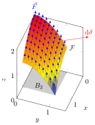
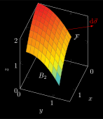

# Mathematics
## constant.svg
 [[PDF]](mathematics/constant/constant.pdf) [[PNG]](mathematics/constant/constant.png) [[SVG]](mathematics/constant/constant.svg)
~~~.tex
\documentclass[crop,tikz]{standalone}

\usepackage{pgfplots}
\tikzset{>=latex}
\colorlet{green}{black!40!green}

\pgfplotsset{
  inverted/.style = {
    every axis legend/.append style={
      draw=white,
      fill=hardblack,
      text=white
    }
  },
  every non boxed x axis/.append style={
    axis line style={-latex}
  },
  every non boxed y axis/.append style={
    axis line style={-latex}
  }
}

\begin{document}
\begin{tikzpicture}
\begin{axis}[
  thick,
  width=6cm,
  height=6cm,
  xlabel={$x$},
  ylabel={$y$},
  xmin = -7, xmax = 7,
  ymin = -2, ymax = 2.5,
  axis y line=middle,
  axis x line=middle,
  xlabel style={at=(current axis.right of origin), anchor=west},
  ylabel style={at=(current axis.above origin), anchor=south},
  ytick distance=1,
  samples=10,
  domain=-6:6,
  smooth,
  clip=false,
  ]
  \addplot[red] {-1.5} node[right] {$f(x)=-\frac{3}{2}$};
  \addplot[blue] {0.5} node[right] {$f(x)=\frac{1}{2}$};
  \addplot[green] {1.5} node[right] {$f(x)=\frac{3}{2}$};
\end{axis}
\end{tikzpicture}
\end{document}
~~~
## derivative.svg
 [[PDF]](mathematics/derivative/derivative.pdf) [[PNG]](mathematics/derivative/derivative.png) [[SVG]](mathematics/derivative/derivative.svg)
~~~.tex
\documentclass[crop,tikz]{standalone}

\usepackage{pgfplots}
\tikzset{>=latex}

\pgfplotsset{
  every non boxed x axis/.append style={
    axis line style={-latex}
  },
  every non boxed y axis/.append style={
    axis line style={-latex}
  },
  inverted/.style = {
    every axis legend/.append style={
      draw=white,
      fill=black,
      text=white
    }
  }
}

\begin{document}
\begin{tikzpicture}
  \begin{axis}[
    width=6cm,
    height=6cm,
    xlabel={$x$},
    ylabel={$y$},
    xmin = 0, xmax = 4.4,
    ymin = 0, ymax = 9,
    axis y line=middle,
    axis x line=middle,
    xtick={\empty},
    ytick={\empty},
    xlabel style={at=(current axis.right of origin), anchor=west},
    ylabel style={at=(current axis.above origin), anchor=south},
    clip=false,
    declare function = {f(\x) = 0.5*\x^2 + 1;},
    ]
    \pgfmathsetmacro{\xo}{1};
    \pgfmathsetmacro{\Dx}{2};
    \addplot[red, domain=0:4, thick] { f(x) } node[above right] { $f$ };
    \addplot[blue, domain=0.5:4, thick] { (f(\xo+\Dx)-f(\xo))/\Dx*x - (f(\xo+\Dx)-f(\xo))/\Dx*\xo + f(\xo) } node[right] { Sekante };
    \draw[] (axis cs:\xo,0.2) -- (axis cs:\xo,-0.2) node[below] { $x_0$ };
    \draw[] (axis cs:{\xo+\Dx},0.2) -- (axis cs:{\xo+\Dx},-0.2) node[below] { $x_0+\Delta x$ };
    \draw[dashed] (axis cs:\xo,{f(\xo)}) -- (axis cs:{\xo+\Dx},{f(\xo)});
    \draw[dashed] (axis cs:{\xo},{f(\xo)}) -- (axis cs:{\xo},0);
    \draw[dashed] (axis cs:{\xo+\Dx},{f(\xo+\Dx)}) -- (axis cs:{\xo+\Dx},0);
    \draw[dashed] (axis cs:{\xo+\Dx},{f(\xo+\Dx)}) -- (axis cs:0,{f(\xo+\Dx)});
    \draw[dashed] (axis cs:{\xo},{f(\xo)}) -- (axis cs:0,{f(\xo)});
    \draw[] (axis cs:0.1,{f(\xo)}) -- (axis cs:-0.1,{f(\xo)}) node[left] { $f(x_0)$ };
    \draw[] (axis cs:0.1,{f(\xo+\Dx)}) -- (axis cs:-0.1,{f(\xo+\Dx)}) node[left] { $f(x_0+\Delta x)$ };
    \draw[decorate,decoration={brace,amplitude=5pt}] (axis cs:{\xo+\Dx+0.2},{f(\xo+\Dx)}) -- node[right,xshift=0.5em] {$\Delta y$} (axis cs:{\xo+\Dx+0.2},{f(\xo)});
    \draw[decorate,decoration={brace,amplitude=5pt}] (axis cs:{\xo+\Dx},{f(\xo)-0.2}) -- node[below,yshift=-0.5em] {$\Delta x$} (axis cs:{\xo},{f(\xo)-0.2});
  \end{axis}
\end{tikzpicture}
\end{document}
~~~
## derivative-tangent.svg
 [[PDF]](mathematics/derivative-tangent/derivative-tangent.pdf) [[PNG]](mathematics/derivative-tangent/derivative-tangent.png) [[SVG]](mathematics/derivative-tangent/derivative-tangent.svg)
~~~.tex
\documentclass[crop,tikz]{standalone}

\usepackage{pgfplots}
\tikzset{>=latex}

\colorlet{green}{black!40!green}

\pgfplotsset{
  every non boxed x axis/.append style={
    axis line style={-latex}
  },
  every non boxed y axis/.append style={
    axis line style={-latex}
  },
  inverted/.style = {
    every axis legend/.append style={
      draw=white,
      fill=black,
      text=white
    }
  }
}

\begin{document}
\begin{tikzpicture}
  \begin{axis}[
    width=6cm,
    height=6cm,
    xlabel={$x$},
    ylabel={$y$},
    xmin = 0, xmax = 4.4,
    ymin = 0, ymax = 9,
    axis y line=middle,
    axis x line=middle,
    xtick={\empty},
    ytick={\empty},
    xlabel style={at=(current axis.right of origin), anchor=west},
    ylabel style={at=(current axis.above origin), anchor=south},
    clip=false,
    declare function = {f(\x) = 0.5*\x^2 + 1;},
    ]
    \pgfmathsetmacro{\xo}{1};
    \pgfmathsetmacro{\Dx}{2};
    \addplot[red, domain=0:4, thick] { f(x) } node[above right] { $f$ };
    \addplot[blue, domain=0.5:4, thick] { (f(\xo+\Dx)-f(\xo))/\Dx*x - (f(\xo+\Dx)-f(\xo))/\Dx*\xo + f(\xo) } node[right] { Sekante };
    \addplot[green, domain=0.5:4, thick] { x - \xo + f(\xo) } node[right] { Tangente };
    \draw[] (axis cs:\xo,0.2) -- (axis cs:\xo,-0.2) node[below] { $x_0$ };
    \draw[] (axis cs:{\xo+\Dx},0.2) -- (axis cs:{\xo+\Dx},-0.2) node[below] { $x_0+\Delta x$ };
    \draw[dashed] (axis cs:\xo,{f(\xo)}) -- (axis cs:{\xo+\Dx},{f(\xo)});
    \draw[dashed] (axis cs:{\xo},{f(\xo)}) -- (axis cs:{\xo},0);
    \draw[dashed] (axis cs:{\xo+\Dx},{f(\xo+\Dx)}) -- (axis cs:{\xo+\Dx},0);
    \draw[dashed] (axis cs:{\xo+\Dx},{f(\xo+\Dx)}) -- (axis cs:0,{f(\xo+\Dx)});
    \draw[dashed] (axis cs:{\xo},{f(\xo)}) -- (axis cs:0,{f(\xo)});
    \draw[] (axis cs:0.1,{f(\xo)}) -- (axis cs:-0.1,{f(\xo)}) node[left] { $f(x_0)$ };
    \draw[] (axis cs:0.1,{f(\xo+\Dx)}) -- (axis cs:-0.1,{f(\xo+\Dx)}) node[left] { $f(x_0+\Delta x)$ };
    \draw[decorate,decoration={brace,amplitude=5pt}] (axis cs:{\xo+\Dx+0.2},{f(\xo+\Dx)}) -- node[right,xshift=0.5em] {$\Delta y$} (axis cs:{\xo+\Dx+0.2},{f(\xo)});
    \draw[decorate,decoration={brace,amplitude=5pt}] (axis cs:{\xo+\Dx},{f(\xo)-0.2}) -- node[below,yshift=-0.5em] {$\Delta x$} (axis cs:{\xo},{f(\xo)-0.2});
  \end{axis}
\end{tikzpicture}
\end{document}
~~~
## differentiation_parametric.svg
 [[PDF]](mathematics/differentiation_parametric/differentiation_parametric.pdf) [[PNG]](mathematics/differentiation_parametric/differentiation_parametric.png) [[SVG]](mathematics/differentiation_parametric/differentiation_parametric.svg)
~~~.tex
\documentclass[crop,tikz]{standalone}

\usetikzlibrary{decorations.markings}
\usepackage{pgfplots}
\pgfplotsset{compat=1.17}
\tikzset{>=latex}

\pgfplotsset{
  inverted/.style = {
    every axis legend/.append style={
      draw=white,
      fill=hardblack,
      text=white
    }
  },
  every non boxed x axis/.append style={
    axis line style={-latex}
  },
  every non boxed y axis/.append style={
    axis line style={-latex}
  },
}

\begin{document}
\begin{tikzpicture}
  \pgfmathsetmacro{\px}{pi/2}; % start x coordinate
  \pgfmathsetmacro{\py}{pi/2}; % start y coordinate
  \pgfmathsetmacro{\qx}{3*pi/2}; % end x coordinate
  \pgfmathsetmacro{\qy}{3*pi/2}; % end y coordinate
  \begin{axis}[
    view={0}{90},
    xlabel={$x$},
    ylabel={$y$},
    axis equal image,
    xtick=\empty,
    ytick=\empty,
    xmin=0,xmax={2*pi},
    ymin=0,ymax={2*pi},
    declare function = {
      f(\x,\y) = sin(deg(x))*sin(deg(y));
    },
    samples=40, samples y=40,
    domain=0:{2*pi}, domain y=0:{2*pi},
    ]
    \addplot3[surf,colormap/blackwhite] { f(x, y) };
    \addplot[red,
      very thick,
      domain={-pi/2}:{0},
      samples=50,
      decoration={markings, mark=at position 0.5 with {\arrow{>}}},
      postaction={decorate}] ({\px+pi*cos(deg(x))},{\qx+pi*sin(deg(x))});
    % marks
    \addplot[only marks, mark=*, mark size=1pt, red] coordinates { ({\px}, {\py}) } node[below] { $(x_0, y_0)$ };
    \addplot[only marks, mark=*, mark size=1pt, red] coordinates { ({\qx}, {\qy}) } node[above] { $(x_1, y_1)$ };
  \end{axis}
\end{tikzpicture}
\end{document}
~~~
## exp-2.svg
 [[PDF]](mathematics/exp-2/exp-2.pdf) [[PNG]](mathematics/exp-2/exp-2.png) [[SVG]](mathematics/exp-2/exp-2.svg)
~~~.tex
\documentclass[crop,tikz]{standalone}

\usepackage{amsmath}
\usepackage{pgfplots}
\tikzset{>=latex}

\pgfplotsset{
  every non boxed x axis/.append style={
    axis line style={-latex}
  },
  every non boxed y axis/.append style={
    axis line style={-latex}
  },
  inverted/.style = {
    every axis legend/.append style={
      draw=white,
      fill=black,
      text=white
    }
  }
}

\begin{document}
\begin{tikzpicture}
\begin{axis}[
  thick,
  width=6cm,
  height=5cm,
  domain=-4:2,
  samples=50,
  axis y line=middle,
  axis x line=middle,
  xlabel={$x$},
  ylabel={$y$},
  xlabel style={right},
  ylabel style={above},
  xmin=-4, xmax=5,
  ymin=-4, ymax=5
  ]
  \addplot[red,smooth] { exp(x) };
  \node[red,right] at (axis cs:1.4,4) {$f(x)=\operatorname{e}^x$};
\end{axis}
\end{tikzpicture}
\end{document}
~~~
## exp2.svg
 [[PDF]](mathematics/exp2/exp2.pdf) [[PNG]](mathematics/exp2/exp2.png) [[SVG]](mathematics/exp2/exp2.svg)
~~~.tex
\documentclass[crop,tikz]{standalone}

\usepackage{pgfplots}
\tikzset{>=latex}

\pgfplotsset{
  every non boxed x axis/.append style={
    axis line style={-latex}
  },
  every non boxed y axis/.append style={
    axis line style={-latex}
  },
  inverted/.style = {
    every axis legend/.append style={
      draw=white,
      fill=black,
      text=white
    }
  }
}

\begin{document}
\begin{tikzpicture}
\begin{axis}[
  thick,
  width=7cm,
  height=5cm,
  domain={0}:{5},
  samples=50,
  axis y line=middle,
  axis x line=middle,
  xlabel={$x$},
  ylabel={$y$},
  xlabel style={right},
  ylabel style={above},
  xmin=0, xmax={5.5},
  ymin=0, ymax=1.2
  ]
  \addplot[red,smooth] { exp(-x) };
\end{axis}
\end{tikzpicture}
\end{document}
~~~
## exp.svg
 [[PDF]](mathematics/exp/exp.pdf) [[PNG]](mathematics/exp/exp.png) [[SVG]](mathematics/exp/exp.svg)
~~~.tex
\documentclass[crop,tikz]{standalone}

\usepackage{pgfplots}
\tikzset{>=latex}

\pgfplotsset{
  every non boxed x axis/.append style={
    axis line style={-latex}
  },
  every non boxed y axis/.append style={
    axis line style={-latex}
  },
  inverted/.style = {
    every axis legend/.append style={
      draw=white,
      fill=black,
      text=white
    }
  }
}

\begin{document}
\begin{tikzpicture}
\begin{axis}[
  thick,
  width=7cm,
  height=5cm,
  domain={0}:{5},
  samples=50,
  axis y line=middle,
  axis x line=middle,
  xlabel={$x$},
  ylabel={$y$},
  xlabel style={right},
  ylabel style={above},
  xmin=0, xmax={5.5},
  ymin=0,
  ]
  \addplot[red,smooth] { exp(x) };
\end{axis}
\end{tikzpicture}
\end{document}
~~~
## exponentials.svg
 [[PDF]](mathematics/exponentials/exponentials.pdf) [[PNG]](mathematics/exponentials/exponentials.png) [[SVG]](mathematics/exponentials/exponentials.svg)
~~~.tex
\documentclass[crop,tikz]{standalone}

\usepackage{amsmath}
\usepackage{pgfplots}
\tikzset{>=latex}
\colorlet{green}{black!40!green}

\pgfplotsset{
  every non boxed x axis/.append style={
    axis line style={-latex}
  },
  every non boxed y axis/.append style={
    axis line style={-latex}
  },
  inverted/.style = {
    every axis legend/.append style={
      draw=white,
      fill=black,
      text=white
    }
  }
}

\begin{document}
\begin{tikzpicture}
\begin{axis}[
  thick,
  width=6cm,
  height=6cm,
  samples=100,
  smooth,
  axis y line=middle,
  axis x line=middle,
  xlabel={$x$},
  ylabel={$y$},
  xlabel style={right},
  ylabel style={above},
  xmin=-4, xmax=5,
  ymin=-4, ymax=5,
  clip=false,
  ]
  \addplot[red,smooth,domain=-4:1.5] { exp(x) };
  \node[red,right] at (axis cs:1.4,5) {$f(x)=\operatorname{e}^x$};
  \addplot[blue,smooth,domain=-4:2] { 2^x } node[right] {$f(x)=2^x$};
  \addplot[green,smooth,domain=-4:0.7] { 10^x } node[above,xshift=2em] {$f(x)=10^x$};
  \addplot[orange,smooth,domain=-2:4] { 0.5^x } node[above] {$f(x)=\left(\frac{1}{2}\right)^x$};
\end{axis}
\end{tikzpicture}
\end{document}
~~~
## hyperbel.svg
 [[PDF]](mathematics/hyperbel/hyperbel.pdf) [[PNG]](mathematics/hyperbel/hyperbel.png) [[SVG]](mathematics/hyperbel/hyperbel.svg)
~~~.tex
\documentclass[crop,tikz]{standalone}

\usepackage{pgfplots}
\tikzset{>=latex}

\pgfplotsset{
  every non boxed x axis/.append style={
    axis line style={-latex}
  },
  every non boxed y axis/.append style={
    axis line style={-latex}
  },
  inverted/.style = {
    every axis legend/.append style={
      draw=white,
      fill=black,
      text=white
    }
  }
}

\begin{document}
\begin{tikzpicture}
\begin{axis}[
  thick,
  width=7cm,
  height=5cm,
  domain={0.1}:{5},
  samples=50,
  axis y line=middle,
  axis x line=middle,
  xlabel={$x$},
  ylabel={$y$},
  xlabel style={right},
  ylabel style={above},
  xmin=0, xmax={5.5},
  ymin=0, ymax={5.5}
  ]
  \addplot[red,smooth] { 1/x };
\end{axis}
\end{tikzpicture}
\end{document}
~~~
## linear-2.svg
 [[PDF]](mathematics/linear-2/linear-2.pdf) [[PNG]](mathematics/linear-2/linear-2.png) [[SVG]](mathematics/linear-2/linear-2.svg)
~~~.tex
\documentclass[crop,tikz]{standalone}

\usepackage{pgfplots}
\tikzset{>=latex}
\colorlet{green}{black!40!green}

\pgfplotsset{
  inverted/.style = {
    every axis legend/.append style={
      draw=white,
      fill=hardblack,
      text=white
    }
  },
  every non boxed x axis/.append style={
    axis line style={-latex}
  },
  every non boxed y axis/.append style={
    axis line style={-latex}
  }
}

\begin{document}
\begin{tikzpicture}
\begin{axis}[
  thick,
  width=6cm,
  height=6cm,
  xlabel={$x$},
  ylabel={$y$},
  xmin = -4, xmax = 7,
  ymin = -6, ymax = 7,
  axis y line=middle,
  axis x line=middle,
  xlabel style={at=(current axis.right of origin), anchor=west},
  ylabel style={at=(current axis.above origin), anchor=south},
  xtick distance=2,
  ytick distance=2,
  samples=10,
  smooth,
  clip=false,
  ]
  \addplot[red, domain=-4:4] {x+2} node[above,xshift=-1em] {$f(x)=x+2$};
  \addplot[blue, domain=-4:6] {x} node[right] {$f(x)=x$};
  \addplot[green, domain=-3:6] {x-3} node[right] {$f(x)=x-3$};
\end{axis}
\end{tikzpicture}
\end{document}
~~~
## linear.svg
 [[PDF]](mathematics/linear/linear.pdf) [[PNG]](mathematics/linear/linear.png) [[SVG]](mathematics/linear/linear.svg)
~~~.tex
\documentclass[crop,tikz]{standalone}

\usepackage{pgfplots}
\tikzset{>=latex}
\colorlet{green}{black!40!green}

\pgfplotsset{
  inverted/.style = {
    every axis legend/.append style={
      draw=white,
      fill=hardblack,
      text=white
    }
  },
  every non boxed x axis/.append style={
    axis line style={-latex}
  },
  every non boxed y axis/.append style={
    axis line style={-latex}
  }
}

\begin{document}
\begin{tikzpicture}
\begin{axis}[
  thick,
  width=6cm,
  height=6cm,
  xlabel={$x$},
  ylabel={$y$},
  xmin = -7, xmax = 7,
  ymin = -6, ymax = 7,
  axis y line=middle,
  axis x line=middle,
  xlabel style={at=(current axis.right of origin), anchor=west},
  ylabel style={at=(current axis.above origin), anchor=south},
  xtick distance=2,
  ytick distance=2,
  samples=10,
  smooth,
  clip=false,
  ]
  \addplot[red, domain=-2:2] {3*x} node[above,xshift=1em] {$f(x)=3x$};
  \addplot[blue, domain=-6:6] {x} node[right] {$f(x)=x$};
  \addplot[green, domain=-6:6] {-x/5} node[below] {$f(x)=-\frac{1}{5}x$};
\end{axis}
\end{tikzpicture}
\end{document}
~~~
## ln.svg
 [[PDF]](mathematics/ln/ln.pdf) [[PNG]](mathematics/ln/ln.png) [[SVG]](mathematics/ln/ln.svg)
~~~.tex
\documentclass[crop,tikz]{standalone}

\usepackage{pgfplots}
\tikzset{>=latex}

\pgfplotsset{
  every non boxed x axis/.append style={
    axis line style={-latex}
  },
  every non boxed y axis/.append style={
    axis line style={-latex}
  },
  inverted/.style = {
    every axis legend/.append style={
      draw=white,
      fill=black,
      text=white
    }
  }
}

\begin{document}
\begin{tikzpicture}
\begin{axis}[
  thick,
  width=7cm,
  height=5cm,
  domain={0.1}:{5},
  samples=50,
  axis y line=middle,
  axis x line=middle,
  xlabel={$x$},
  ylabel={$y$},
  xlabel style={right},
  ylabel style={above},
  xmin=0, xmax={5.5},
  % ymin=0,
  ]
  \addplot[red,smooth] { ln(x) };
\end{axis}
\end{tikzpicture}
\end{document}
~~~
## polynom.svg
 [[PDF]](mathematics/polynom/polynom.pdf) [[PNG]](mathematics/polynom/polynom.png) [[SVG]](mathematics/polynom/polynom.svg)
~~~.tex
\documentclass[crop,tikz]{standalone}

\usepackage{pgfplots}
\tikzset{>=latex}

\pgfplotsset{
  inverted/.style = {
    every axis legend/.append style={
      draw=white,
      fill=hardblack,
      text=white
    }
  },
  every non boxed x axis/.append style={
    axis line style={-latex}
  },
  every non boxed y axis/.append style={
    axis line style={-latex}
  }
}

\begin{document}
\begin{tikzpicture}
\begin{axis}[
  thick,
  width=6cm,
  height=6cm,
  xlabel={$x$},
  ylabel={$y$},
  xmin = -7, xmax = 7,
  ymin = -2, ymax = 2.5,
  axis y line=middle,
  axis x line=middle,
  xlabel style={at=(current axis.right of origin), anchor=west},
  ylabel style={at=(current axis.above origin), anchor=south},
  samples=100,
  smooth,
  ]
  \addplot[red, domain=-6:6] {x - x^3/6 + x^5/120 - x^7/5040 + x^9/362880};
\end{axis}
\end{tikzpicture}
\end{document}
~~~
## quadratic.svg
 [[PDF]](mathematics/quadratic/quadratic.pdf) [[PNG]](mathematics/quadratic/quadratic.png) [[SVG]](mathematics/quadratic/quadratic.svg)
~~~.tex
\documentclass[crop,tikz]{standalone}

\usepackage{pgfplots}
\tikzset{>=latex}

\pgfplotsset{
  inverted/.style = {
    every axis legend/.append style={
      draw=white,
      fill=hardblack,
      text=white
    }
  },
  every non boxed x axis/.append style={
    axis line style={-latex}
  },
  every non boxed y axis/.append style={
    axis line style={-latex}
  }
}

\begin{document}
\begin{tikzpicture}
\begin{axis}[
  thick,
  width=6cm,
  height=6cm,
  xlabel={$x$},
  ylabel={$y$},
  xmin = -2, xmax = 2.9,
  ymin = -4, ymax = 4.5,
  axis y line=middle,
  axis x line=middle,
  xlabel style={at=(current axis.right of origin), anchor=west},
  ylabel style={at=(current axis.above origin), anchor=south},
  xtick distance=1,
  ytick distance=2,
  samples=100,
  smooth,
  clip=false,
  ]
  \addplot[red, domain=-2:2] {x^2} node[above,xshift=1em] {$f(x)=x^2$};
  \addplot[blue, domain=-0.7:2.5] {-2*x^2+4*x} node[below] {$f(x)=-2x^2+4x$};
\end{axis}
\end{tikzpicture}
\end{document}
~~~
## regression-minmax.svg
 [[PDF]](mathematics/regression-minmax/regression-minmax.pdf) [[PNG]](mathematics/regression-minmax/regression-minmax.png) [[SVG]](mathematics/regression-minmax/regression-minmax.svg)
~~~.tex
\documentclass[crop,tikz]{standalone}

\usepackage{pgfplots}
\usepackage[locale=DE]{siunitx}

\pgfplotsset{compat=1.17}

\tikzset{>=latex}

\pgfplotsset{
  every non boxed x axis/.append style={
    axis line style={-latex}
  },
  every non boxed y axis/.append style={
    axis line style={-latex}
  },
  inverted/.style = {
    every axis legend/.append style={
      draw=white,
      fill=hardblack,
      text=white
    }
  }
}

\colorlet{green}{black!40!green}

\begin{document}
\begin{tikzpicture}
\begin{axis}[
  width={0.7\textwidth},
  height={0.6\textwidth},
  domain=0:11,
  xmin=0,xmax=12,
  ymin=0,ymax=6,
  xlabel={$I/\si{\A}$},
  ylabel={$U/\si{\V}$},
  grid,
  legend cell align = {left},
  legend style = {font=\small},
  legend pos = {south east},
  ]
  \addplot[blue, thick] { 0.5014*x };
  \addlegendentry{$U = \SI{0.5014}{\ohm}\cdot I$};
  \addplot[red  , dashed, thick, domain = 0:10] { 0.5579*x };
  \addlegendentry{$U = \SI{0.5579}{\ohm}\cdot I$};
  \addplot[green, dashed, thick] { 0.4393*x };
  \addlegendentry{$U = \SI{0.4393}{\ohm}\cdot I$};
  \fill[opacity=0.3,blue] ( 1.6-0.6, 1-0.3) rectangle ( 1.6+0.6, 1+0.3);
  \fill[opacity=0.3,blue] ( 3.9-0.6, 2-0.3) rectangle ( 3.9+0.6, 2+0.3);
  \fill[opacity=0.3,blue] ( 5.6-0.6, 3-0.3) rectangle ( 5.6+0.6, 3+0.3);
  \fill[opacity=0.3,blue] ( 8.2-0.6, 4-0.3) rectangle ( 8.2+0.6, 4+0.3);
  \fill[opacity=0.3,blue] (10.1-0.6, 5-0.3) rectangle (10.1+0.6, 5+0.3);
  \addplot[only marks, error bars/.cd, x dir=both, y dir=both, x explicit, y explicit] coordinates {
    ( 1.6, 1) +- (0.6, 0.3)
    ( 3.9, 2) +- (0.6, 0.3)
    ( 5.6, 3) +- (0.6, 0.3)
    ( 8.2, 4) +- (0.6, 0.3)
    (10.1, 5) +- (0.6, 0.3)
  };
\end{axis}
\end{tikzpicture}
\end{document}
~~~
## regression.svg
 [[PDF]](mathematics/regression/regression.pdf) [[PNG]](mathematics/regression/regression.png) [[SVG]](mathematics/regression/regression.svg)
~~~.tex
\documentclass[crop,tikz]{standalone}

\usepackage{pgfplots}
\usepackage[locale=DE]{siunitx}

\pgfplotsset{compat=1.17}

\tikzset{>=latex}

\pgfplotsset{
  every non boxed x axis/.append style={
    axis line style={-latex}
  },
  every non boxed y axis/.append style={
    axis line style={-latex}
  },
  inverted/.style = {
    every axis legend/.append style={
      draw=white,
      fill=hardblack,
      text=white
    }
  }
}

\begin{document}
\begin{tikzpicture}
\begin{axis}[
  width={0.7\textwidth},
  height={0.6\textwidth},
  domain=0:11,
  xmin=0,xmax=12,
  ymin=0,ymax=6,
  xlabel={$I/\si{\A}$},
  ylabel={$U/\si{\V}$},
  grid,
  legend cell align = {left},
  legend style = {font=\small},
  legend pos = {south east},
  ]
  \addplot[blue, thick] { 0.5014*x };
  \addlegendentry{$U = \SI{0.5014}{\ohm}\cdot I$};
  \addplot[only marks, error bars/.cd, x dir=both, y dir=both, x explicit, y explicit] coordinates {
    ( 1.6, 1) +- (0.6, 0.3)
    ( 3.9, 2) +- (0.6, 0.3)
    ( 5.6, 3) +- (0.6, 0.3)
    ( 8.2, 4) +- (0.6, 0.3)
    (10.1, 5) +- (0.6, 0.3)
  };
\end{axis}
\end{tikzpicture}
\end{document}
~~~
## sin.svg
 [[PDF]](mathematics/sin/sin.pdf) [[PNG]](mathematics/sin/sin.png) [[SVG]](mathematics/sin/sin.svg)
~~~.tex
\documentclass[crop,tikz]{standalone}

\usepackage{pgfplots}
\tikzset{>=latex}

\pgfplotsset{
  every non boxed x axis/.append style={
    axis line style={-latex}
  },
  every non boxed y axis/.append style={
    axis line style={-latex}
  },
  inverted/.style = {
    every axis legend/.append style={
      draw=white,
      fill=black,
      text=white
    }
  }
}

\begin{document}
\begin{tikzpicture}
\begin{axis}[
  thick,
  width=7cm,
  height=5cm,
  domain={0}:{4*pi},
  samples=50,
  axis y line=middle,
  axis x line=middle,
  xlabel={$x$},
  ylabel={$y$},
  xlabel style={right},
  ylabel style={above},
  xmin=0, xmax={4.2*pi},
  ymin=-1, ymax=1.2,
  xtick={0, pi, 2*pi, 3*pi, 4*pi},
  xticklabels={$0$, $\pi$, $2\pi$, $3\pi$, $4\pi$},
  ytick={-1, 0, 1},
  ]
  \addplot[red,smooth] { sin(deg(x)) };
\end{axis}
\end{tikzpicture}
\end{document}
~~~
## sqr.svg
 [[PDF]](mathematics/sqr/sqr.pdf) [[PNG]](mathematics/sqr/sqr.png) [[SVG]](mathematics/sqr/sqr.svg)
~~~.tex
\documentclass[crop,tikz]{standalone}

\usepackage{pgfplots}
\tikzset{>=latex}

\pgfplotsset{
  every non boxed x axis/.append style={
    axis line style={-latex}
  },
  every non boxed y axis/.append style={
    axis line style={-latex}
  },
  inverted/.style = {
    every axis legend/.append style={
      draw=white,
      fill=black,
      text=white
    }
  }
}

\begin{document}
\begin{tikzpicture}
\begin{axis}[
  thick,
  width=7cm,
  height=5cm,
  domain={0}:{4},
  samples=50,
  axis y line=middle,
  axis x line=middle,
  xlabel={$x$},
  ylabel={$y$},
  xlabel style={right},
  ylabel style={above},
  xmin=0, xmax={4.4},
  ymin=0, ymax=17,
  ]
  \addplot[red,smooth] { x^2 };
\end{axis}
\end{tikzpicture}
\end{document}
~~~
## sqrt.svg
 [[PDF]](mathematics/sqrt/sqrt.pdf) [[PNG]](mathematics/sqrt/sqrt.png) [[SVG]](mathematics/sqrt/sqrt.svg)
~~~.tex
\documentclass[crop,tikz]{standalone}

\usepackage{pgfplots}
\tikzset{>=latex}

\pgfplotsset{
  every non boxed x axis/.append style={
    axis line style={-latex}
  },
  every non boxed y axis/.append style={
    axis line style={-latex}
  },
  inverted/.style = {
    every axis legend/.append style={
      draw=white,
      fill=black,
      text=white
    }
  }
}

\begin{document}
\begin{tikzpicture}
\begin{axis}[
  thick,
  width=7cm,
  height=5cm,
  domain={0}:{5},
  samples=50,
  axis y line=middle,
  axis x line=middle,
  xlabel={$x$},
  ylabel={$y$},
  xlabel style={right},
  ylabel style={above},
  xmin=0, xmax={5.5},
  ymin=0,
  ]
  \addplot[red,smooth] (x^2, x);
\end{axis}
\end{tikzpicture}
\end{document}
~~~
## surface-element.svg
 [[PDF]](mathematics/surface-element/surface-element.pdf) [[PNG]](mathematics/surface-element/surface-element.png) [[SVG]](mathematics/surface-element/surface-element.svg)
~~~.tex
\documentclass[crop,tikz]{standalone}

\usepackage{amsmath,amssymb}
\usepackage{physics}
\usepackage{pgfplots}
\pgfplotsset{compat=1.16}
\tikzset{>=latex}

\pgfplotsset{
  inverted/.style = {
    every axis legend/.append style={
      draw=white,
      fill=black,
      text=white
    }
  }
}

\begin{document}
\begin{tikzpicture}
  \pgfmathsetmacro{\px}{0.05};
  \pgfmathsetmacro{\py}{0.85};
  \begin{axis}[
    width=10cm,
    height=10cm,
    axis equal image,
    view={110}{45},
    xlabel={$x$},
    ylabel={$y$},
    zlabel={$z$},
    xmin=0,xmax=1.5,
    ymin=0,ymax=1.5,
    zmin=0, zmax=2,
    declare function = {
      f(\x,\y) = 2 - \x^2 - \y^2;
      dx(\x,\y) = 2*\x/sqrt(4*\x^2 + 4*\y^2 + 1);
      dy(\x,\y) = 2*\y/sqrt(4*\x^2 + 4*\y^2 + 1);
      dz(\x,\y) = 1/sqrt(4*\x^2 + 4*\y^2 + 1);
    },
    samples=10, samples y=10,
    domain=0:1, domain y=0:1,
    z buffer=sort,
    clip=false,
    ]
    \addplot3[surf,fill opacity=0.2,shader=flat,draw=black,draw opacity=0,colormap/blackwhite] (x,y,0);
    \addplot3[surf,colormap/hot] (x,y,{f(x,y)});
    % surface element
    \draw[->,red] (axis cs: {\px},{\py},{f(\px,\py)}) -- ++ (axis direction cs: {dx(\px,\py)},{dy(\px,\py)},{dz(\px,\py)}) node[above] { $\dd{\vec{\sigma}}$ };
    % labels
    \node[above] at (axis cs: 1,0.5,0) { $B_2$ };
    \node[right] at (axis cs: 0,1,{f(0,1)}) { $\mathcal{F}$ };
  \end{axis}
\end{tikzpicture}
\end{document}
~~~
## surface-integral.svg
 [[PDF]](mathematics/surface-integral/surface-integral.pdf) [[PNG]](mathematics/surface-integral/surface-integral.png) [[SVG]](mathematics/surface-integral/surface-integral.svg)
~~~.tex
\documentclass[crop,tikz]{standalone}

\usepackage{amsmath,amssymb}
\usepackage{physics}
\usepackage{pgfplots}
\pgfplotsset{compat=1.16}
\tikzset{>=latex}

\pgfplotsset{
  inverted/.style = {
    every axis legend/.append style={
      draw=white,
      fill=black,
      text=white
    }
  }
}

\begin{document}
\begin{tikzpicture}
  \pgfmathsetmacro{\px}{0.05};
  \pgfmathsetmacro{\py}{0.85};
  \begin{axis}[
    width=10cm,
    height=10cm,
    axis equal image,
    view={110}{45},
    xlabel={$x$},
    ylabel={$y$},
    zlabel={$z$},
    xmin=0,xmax=1.5,
    ymin=0,ymax=1.5,
    zmin=0, zmax=2,
    declare function = {
      f(\x,\y) = 2 - \x^2 - \y^2;
      dx(\x,\y) = 2*\x/sqrt(4*\x^2 + 4*\y^2 + 1);
      dy(\x,\y) = 2*\y/sqrt(4*\x^2 + 4*\y^2 + 1);
      dz(\x,\y) = 1/sqrt(4*\x^2 + 4*\y^2 + 1);
    },
    samples=10, samples y=10,
    domain=0:1, domain y=0:1,
    z buffer=sort,
    clip=false,
    ]
    \addplot3[surf,fill opacity=0.2,shader=flat,draw=black,draw opacity=0,colormap/blackwhite] (x,y,0);
    \addplot3[surf,colormap/hot] (x,y,{f(x,y)});
    % vector field
    \addplot3[blue,
      quiver = {
        u = {0},
        v = {0},
        w = {1},
        scale arrows = 0.25,
        every arrow/.append style={-latex},
      },
      samples=9, samples y=9,
      domain = 0.05:0.95,
      domain y = 0.05:0.95,
    ] (x,y,{f(x,y)});
    % surface element
    \draw[->,red] (axis cs: {\px},{\py},{f(\px,\py)}) -- ++ (axis direction cs: {dx(\px,\py)},{dy(\px,\py)},{dz(\px,\py)}) node[above] { $\dd{\vec{\sigma}}$ };
    % labels
    \node[above] at (axis cs: 1,0.5,0) { $B_2$ };
    \node[right] at (axis cs: 0,1,{f(0,1)}) { $\mathcal{F}$ };
    \node[above,blue,yshift=0.5em] at (axis cs: 0,0,{f(0,0)}) { $\vec{F}$ };
  \end{axis}
\end{tikzpicture}
\end{document}
~~~
## total_differential.svg
 [[PDF]](mathematics/total_differential/total_differential.pdf) [[PNG]](mathematics/total_differential/total_differential.png) [[SVG]](mathematics/total_differential/total_differential.svg)
~~~.tex
\documentclass[crop,tikz]{standalone}

\usepackage{pgfplots}
\usepackage{physics}
\pgfplotsset{compat=1.17}
\tikzset{>=latex}

\colorlet{green}{black!40!green}

\pgfplotsset{
  inverted/.style = {
    every axis legend/.append style={
      draw=white,
      fill=hardblack,
      text=white
    }
  },
  every non boxed x axis/.append style={
    axis line style={-latex}
  },
  every non boxed y axis/.append style={
    axis line style={-latex}
  },
  every non boxed z axis/.append style={
    axis line style={-latex}
  }
}

\begin{document}
\begin{tikzpicture}
  \pgfmathsetmacro{\px}{1};
  \pgfmathsetmacro{\py}{1};
  \pgfmathsetmacro{\dx}{2};
  \pgfmathsetmacro{\dy}{2};
  \begin{axis}[
    axis x line=middle,
    axis y line=middle,
    axis z line=middle,
    xlabel={$x$},
    xlabel style={right},
    ylabel={$y$},
    ylabel style={above},
    zlabel={$z$},
    zlabel style={above},
    xtick={1, 3},
    xticklabels={$x_0$, $x_0+\dd{x}$},
    xticklabel style={font=\small},
    ytick={1, 3},
    yticklabels={$y_0$, $y_0+\dd{y}$},
    yticklabel style={font=\small, above, anchor=east},
    ztick=\empty,
    xmin=0,xmax=4,
    ymin=0,ymax=4,
    zmin=0,zmax={2*3*3},
    declare function = {
      f(\x,\y) = \x^2 + \y^2;
      t(\x,\y) = f(\px,\py) + 2*\px*(\x-\px) + 2*\py*(\y-\py);
    },
    samples=10, samples y=10,
    domain={\px}:{\px+\dx}, domain y={\py}:{\py+\dy},
    clip=false,
    ]
    % help lines
    \draw[gray, dashed, thin]
      (\px, 0, 0) -- (\px, {\py+\dy}, 0)
      (\px, \py, 0) -- (\px, \py, {f(\px, \py)})
      ({\px+\dx}, \py, 0) -- ({\px+\dx}, \py, {f(\px, \py)})
      ({\px+\dx}, 0, 0) -- ({\px+\dx}, {\py+\dy}, 0) -- ({\px+\dx}, {\py+\dy}, {f(\px, \py)})
      (0, \py, 0) -- ({\px+\dx}, \py, 0)
      (0, {\py+\dy}, 0) -- ({\px+\dx}, {\py+\dy}, 0);
    % slope lines
    \draw[gray, thin]
         (\px, \py, {f(\px, \py)})
      -- ({\px+\dx}, \py, {f(\px, \py)})
      -- ({\px+\dx}, \py, {t(\px+\dx, \py)})
      -- ({\px+\dx}, {\py+\dy}, {t(\px+\dx, \py)})
      -- ({\px+\dx}, {\py+\dy}, {f(\px, \py)})
      -- ({\px+\dx}, {\py}, {f(\px, \py)})
         ({\px+\dx}, {\py+\dy}, {t(\px+\dx, \py)})
      -- ({\px+\dx}, {\py+\dy}, {t(\px+\dx, \py+\dy)});
    % tangential plane
    \addplot3[surf,colormap/cool] { t(x, y) };
    % function
    \addplot3[surf,colormap/blackwhite] { f(x, y) };
    % marks
    \addplot3[only marks, mark=*, mark size=1pt, red] coordinates { (\px, \py, {f(\px, \py)}) } node[below] { $f(x_0, y_0)$ };
    \addplot3[only marks, mark=*, mark size=1pt, green] coordinates { ({\px+\dx}, {\py+\dy}, {f(\px+\dx, \py+\dy)}) } node[right] { $f(x_0+\dd{x}, y_0+\dd{y})$ };
    \addplot3[only marks, mark=*, mark size=1pt, blue] coordinates { ({\px+\dx}, {\py+\dy}, {t(\px+\dx, \py+\dy)}) } node[above right] { $t(x_0+\dd{x}, y_0+\dd{y})$ };
    % braces
    \draw[decorate, decoration = {brace, amplitude=3pt}] ([xshift=0.2em]{\px+\dx}, {\py+\dy}, {t(\px+\dx, \py)}) -- ([xshift=0.2em]{\px+\dx}, {\py+\dy}, {f(\px, \py)}) coordinate (a) node[right,xshift=0.5em,midway] {$\pdv{f(x_0, y_0)}{x}\dd{x}$};
    \draw[decorate, decoration = {brace, amplitude=3pt}] ([xshift=0.2em]{\px+\dx}, {\py+\dy}, {t(\px+\dx, \py+\dy)}) -- ([xshift=0.2em]{\px+\dx}, {\py+\dy}, {t(\px+\dx, \py)}) node[right,xshift=0.5em,midway] {$\pdv{f(x_0, y_0)}{y}\dd{y}$};
    \draw[decorate, decoration = {brace, amplitude=3pt}] ([xshift=7em]{\px+\dx}, {\py+\dy}, {t(\px+\dx, \py+\dy)}) -- ([xshift=7em]{\px+\dx}, {\py+\dy}, {f(\px, \py)}) node[right,xshift=0.5em,midway] {$\dd{f(x_0, y_0)}$};
  \end{axis}
\end{tikzpicture}
\end{document}
~~~
## constant_inverted.svg
 [[PDF]](mathematics/constant/constant_inverted.pdf) [[PNG]](mathematics/constant/constant_inverted.png) [[SVG]](mathematics/constant/constant_inverted.svg)
~~~.tex
\documentclass[crop,tikz]{standalone}
\usetikzlibrary{backgrounds}
\colorlet{blue}{cyan}
\tikzset{
  inverted/.style = {
    color=white,
    background rectangle/.style={fill},
    show background rectangle
  }
}

\usepackage{pgfplots}
\tikzset{>=latex}
\colorlet{green}{green}

\pgfplotsset{
  inverted/.style = {
    every axis legend/.append style={
      draw=white,
      fill=black,
      text=white
    }
  },
  every non boxed x axis/.append style={
    axis line style={-latex}
  },
  every non boxed y axis/.append style={
    axis line style={-latex}
  }
}

\begin{document}
\begin{tikzpicture}[inverted,inverted]
\begin{axis}[inverted,
  thick,
  width=6cm,
  height=6cm,
  xlabel={$x$},
  ylabel={$y$},
  xmin = -7, xmax = 7,
  ymin = -2, ymax = 2.5,
  axis y line=middle,
  axis x line=middle,
  xlabel style={at=(current axis.right of origin), anchor=west},
  ylabel style={at=(current axis.above origin), anchor=south},
  ytick distance=1,
  samples=10,
  domain=-6:6,
  smooth,
  clip=false,
  ]
  \addplot[red] {-1.5} node[right] {$f(x)=-\frac{3}{2}$};
  \addplot[blue] {0.5} node[right] {$f(x)=\frac{1}{2}$};
  \addplot[green] {1.5} node[right] {$f(x)=\frac{3}{2}$};
\end{axis}
\end{tikzpicture}
\end{document}
~~~
## derivative_inverted.svg
 [[PDF]](mathematics/derivative/derivative_inverted.pdf) [[PNG]](mathematics/derivative/derivative_inverted.png) [[SVG]](mathematics/derivative/derivative_inverted.svg)
~~~.tex
\documentclass[crop,tikz]{standalone}
\usetikzlibrary{backgrounds}
\colorlet{blue}{cyan}
\tikzset{
  inverted/.style = {
    color=white,
    background rectangle/.style={fill},
    show background rectangle
  }
}

\usepackage{pgfplots}
\tikzset{>=latex}

\pgfplotsset{
  every non boxed x axis/.append style={
    axis line style={-latex}
  },
  every non boxed y axis/.append style={
    axis line style={-latex}
  },
  inverted/.style = {
    every axis legend/.append style={
      draw=white,
      fill=white,
      text=white
    }
  }
}

\begin{document}
\begin{tikzpicture}[inverted,inverted]
  \begin{axis}[inverted,
    width=6cm,
    height=6cm,
    xlabel={$x$},
    ylabel={$y$},
    xmin = 0, xmax = 4.4,
    ymin = 0, ymax = 9,
    axis y line=middle,
    axis x line=middle,
    xtick={\empty},
    ytick={\empty},
    xlabel style={at=(current axis.right of origin), anchor=west},
    ylabel style={at=(current axis.above origin), anchor=south},
    clip=false,
    declare function = {f(\x) = 0.5*\x^2 + 1;},
    ]
    \pgfmathsetmacro{\xo}{1};
    \pgfmathsetmacro{\Dx}{2};
    \addplot[red, domain=0:4, thick] { f(x) } node[above right] { $f$ };
    \addplot[blue, domain=0.5:4, thick] { (f(\xo+\Dx)-f(\xo))/\Dx*x - (f(\xo+\Dx)-f(\xo))/\Dx*\xo + f(\xo) } node[right] { Sekante };
    \draw[] (axis cs:\xo,0.2) -- (axis cs:\xo,-0.2) node[below] { $x_0$ };
    \draw[] (axis cs:{\xo+\Dx},0.2) -- (axis cs:{\xo+\Dx},-0.2) node[below] { $x_0+\Delta x$ };
    \draw[dashed] (axis cs:\xo,{f(\xo)}) -- (axis cs:{\xo+\Dx},{f(\xo)});
    \draw[dashed] (axis cs:{\xo},{f(\xo)}) -- (axis cs:{\xo},0);
    \draw[dashed] (axis cs:{\xo+\Dx},{f(\xo+\Dx)}) -- (axis cs:{\xo+\Dx},0);
    \draw[dashed] (axis cs:{\xo+\Dx},{f(\xo+\Dx)}) -- (axis cs:0,{f(\xo+\Dx)});
    \draw[dashed] (axis cs:{\xo},{f(\xo)}) -- (axis cs:0,{f(\xo)});
    \draw[] (axis cs:0.1,{f(\xo)}) -- (axis cs:-0.1,{f(\xo)}) node[left] { $f(x_0)$ };
    \draw[] (axis cs:0.1,{f(\xo+\Dx)}) -- (axis cs:-0.1,{f(\xo+\Dx)}) node[left] { $f(x_0+\Delta x)$ };
    \draw[decorate,decoration={brace,amplitude=5pt}] (axis cs:{\xo+\Dx+0.2},{f(\xo+\Dx)}) -- node[right,xshift=0.5em] {$\Delta y$} (axis cs:{\xo+\Dx+0.2},{f(\xo)});
    \draw[decorate,decoration={brace,amplitude=5pt}] (axis cs:{\xo+\Dx},{f(\xo)-0.2}) -- node[below,yshift=-0.5em] {$\Delta x$} (axis cs:{\xo},{f(\xo)-0.2});
  \end{axis}
\end{tikzpicture}
\end{document}
~~~
## derivative-tangent_inverted.svg
 [[PDF]](mathematics/derivative-tangent/derivative-tangent_inverted.pdf) [[PNG]](mathematics/derivative-tangent/derivative-tangent_inverted.png) [[SVG]](mathematics/derivative-tangent/derivative-tangent_inverted.svg)
~~~.tex
\documentclass[crop,tikz]{standalone}
\usetikzlibrary{backgrounds}
\colorlet{blue}{cyan}
\tikzset{
  inverted/.style = {
    color=white,
    background rectangle/.style={fill},
    show background rectangle
  }
}

\usepackage{pgfplots}
\tikzset{>=latex}

\colorlet{green}{green}

\pgfplotsset{
  every non boxed x axis/.append style={
    axis line style={-latex}
  },
  every non boxed y axis/.append style={
    axis line style={-latex}
  },
  inverted/.style = {
    every axis legend/.append style={
      draw=white,
      fill=white,
      text=white
    }
  }
}

\begin{document}
\begin{tikzpicture}[inverted,inverted]
  \begin{axis}[inverted,
    width=6cm,
    height=6cm,
    xlabel={$x$},
    ylabel={$y$},
    xmin = 0, xmax = 4.4,
    ymin = 0, ymax = 9,
    axis y line=middle,
    axis x line=middle,
    xtick={\empty},
    ytick={\empty},
    xlabel style={at=(current axis.right of origin), anchor=west},
    ylabel style={at=(current axis.above origin), anchor=south},
    clip=false,
    declare function = {f(\x) = 0.5*\x^2 + 1;},
    ]
    \pgfmathsetmacro{\xo}{1};
    \pgfmathsetmacro{\Dx}{2};
    \addplot[red, domain=0:4, thick] { f(x) } node[above right] { $f$ };
    \addplot[blue, domain=0.5:4, thick] { (f(\xo+\Dx)-f(\xo))/\Dx*x - (f(\xo+\Dx)-f(\xo))/\Dx*\xo + f(\xo) } node[right] { Sekante };
    \addplot[green, domain=0.5:4, thick] { x - \xo + f(\xo) } node[right] { Tangente };
    \draw[] (axis cs:\xo,0.2) -- (axis cs:\xo,-0.2) node[below] { $x_0$ };
    \draw[] (axis cs:{\xo+\Dx},0.2) -- (axis cs:{\xo+\Dx},-0.2) node[below] { $x_0+\Delta x$ };
    \draw[dashed] (axis cs:\xo,{f(\xo)}) -- (axis cs:{\xo+\Dx},{f(\xo)});
    \draw[dashed] (axis cs:{\xo},{f(\xo)}) -- (axis cs:{\xo},0);
    \draw[dashed] (axis cs:{\xo+\Dx},{f(\xo+\Dx)}) -- (axis cs:{\xo+\Dx},0);
    \draw[dashed] (axis cs:{\xo+\Dx},{f(\xo+\Dx)}) -- (axis cs:0,{f(\xo+\Dx)});
    \draw[dashed] (axis cs:{\xo},{f(\xo)}) -- (axis cs:0,{f(\xo)});
    \draw[] (axis cs:0.1,{f(\xo)}) -- (axis cs:-0.1,{f(\xo)}) node[left] { $f(x_0)$ };
    \draw[] (axis cs:0.1,{f(\xo+\Dx)}) -- (axis cs:-0.1,{f(\xo+\Dx)}) node[left] { $f(x_0+\Delta x)$ };
    \draw[decorate,decoration={brace,amplitude=5pt}] (axis cs:{\xo+\Dx+0.2},{f(\xo+\Dx)}) -- node[right,xshift=0.5em] {$\Delta y$} (axis cs:{\xo+\Dx+0.2},{f(\xo)});
    \draw[decorate,decoration={brace,amplitude=5pt}] (axis cs:{\xo+\Dx},{f(\xo)-0.2}) -- node[below,yshift=-0.5em] {$\Delta x$} (axis cs:{\xo},{f(\xo)-0.2});
  \end{axis}
\end{tikzpicture}
\end{document}
~~~
## differentiation_parametric_inverted.svg
 [[PDF]](mathematics/differentiation_parametric/differentiation_parametric_inverted.pdf) [[PNG]](mathematics/differentiation_parametric/differentiation_parametric_inverted.png) [[SVG]](mathematics/differentiation_parametric/differentiation_parametric_inverted.svg)
~~~.tex
\documentclass[crop,tikz]{standalone}
\usetikzlibrary{backgrounds}
\colorlet{blue}{cyan}
\tikzset{
  inverted/.style = {
    color=white,
    background rectangle/.style={fill},
    show background rectangle
  }
}

\usetikzlibrary{decorations.markings}
\usepackage{pgfplots}
\pgfplotsset{compat=1.17}
\tikzset{>=latex}

\pgfplotsset{
  inverted/.style = {
    every axis legend/.append style={
      draw=white,
      fill=black,
      text=white
    }
  },
  every non boxed x axis/.append style={
    axis line style={-latex}
  },
  every non boxed y axis/.append style={
    axis line style={-latex}
  },
}

\begin{document}
\begin{tikzpicture}[inverted,inverted]
  \pgfmathsetmacro{\px}{pi/2}; % start x coordinate
  \pgfmathsetmacro{\py}{pi/2}; % start y coordinate
  \pgfmathsetmacro{\qx}{3*pi/2}; % end x coordinate
  \pgfmathsetmacro{\qy}{3*pi/2}; % end y coordinate
  \begin{axis}[inverted,
    view={0}{90},
    xlabel={$x$},
    ylabel={$y$},
    axis equal image,
    xtick=\empty,
    ytick=\empty,
    xmin=0,xmax={2*pi},
    ymin=0,ymax={2*pi},
    declare function = {
      f(\x,\y) = sin(deg(x))*sin(deg(y));
    },
    samples=40, samples y=40,
    domain=0:{2*pi}, domain y=0:{2*pi},
    ]
    \addplot3[surf,colormap/blackwhite] { f(x, y) };
    \addplot[red,
      very thick,
      domain={-pi/2}:{0},
      samples=50,
      decoration={markings, mark=at position 0.5 with {\arrow{>}}},
      postaction={decorate}] ({\px+pi*cos(deg(x))},{\qx+pi*sin(deg(x))});
    % marks
    \addplot[only marks, mark=*, mark size=1pt, red] coordinates { ({\px}, {\py}) } node[below] { $(x_0, y_0)$ };
    \addplot[only marks, mark=*, mark size=1pt, red] coordinates { ({\qx}, {\qy}) } node[above] { $(x_1, y_1)$ };
  \end{axis}
\end{tikzpicture}
\end{document}
~~~
## exp-2_inverted.svg
 [[PDF]](mathematics/exp-2/exp-2_inverted.pdf) [[PNG]](mathematics/exp-2/exp-2_inverted.png) [[SVG]](mathematics/exp-2/exp-2_inverted.svg)
~~~.tex
\documentclass[crop,tikz]{standalone}
\usetikzlibrary{backgrounds}
\colorlet{blue}{cyan}
\tikzset{
  inverted/.style = {
    color=white,
    background rectangle/.style={fill},
    show background rectangle
  }
}

\usepackage{amsmath}
\usepackage{pgfplots}
\tikzset{>=latex}

\pgfplotsset{
  every non boxed x axis/.append style={
    axis line style={-latex}
  },
  every non boxed y axis/.append style={
    axis line style={-latex}
  },
  inverted/.style = {
    every axis legend/.append style={
      draw=white,
      fill=white,
      text=white
    }
  }
}

\begin{document}
\begin{tikzpicture}[inverted,inverted]
\begin{axis}[inverted,
  thick,
  width=6cm,
  height=5cm,
  domain=-4:2,
  samples=50,
  axis y line=middle,
  axis x line=middle,
  xlabel={$x$},
  ylabel={$y$},
  xlabel style={right},
  ylabel style={above},
  xmin=-4, xmax=5,
  ymin=-4, ymax=5
  ]
  \addplot[red,smooth] { exp(x) };
  \node[red,right] at (axis cs:1.4,4) {$f(x)=\operatorname{e}^x$};
\end{axis}
\end{tikzpicture}
\end{document}
~~~
## exp2_inverted.svg
 [[PDF]](mathematics/exp2/exp2_inverted.pdf) [[PNG]](mathematics/exp2/exp2_inverted.png) [[SVG]](mathematics/exp2/exp2_inverted.svg)
~~~.tex
\documentclass[crop,tikz]{standalone}
\usetikzlibrary{backgrounds}
\colorlet{blue}{cyan}
\tikzset{
  inverted/.style = {
    color=white,
    background rectangle/.style={fill},
    show background rectangle
  }
}

\usepackage{pgfplots}
\tikzset{>=latex}

\pgfplotsset{
  every non boxed x axis/.append style={
    axis line style={-latex}
  },
  every non boxed y axis/.append style={
    axis line style={-latex}
  },
  inverted/.style = {
    every axis legend/.append style={
      draw=white,
      fill=white,
      text=white
    }
  }
}

\begin{document}
\begin{tikzpicture}[inverted,inverted]
\begin{axis}[inverted,
  thick,
  width=7cm,
  height=5cm,
  domain={0}:{5},
  samples=50,
  axis y line=middle,
  axis x line=middle,
  xlabel={$x$},
  ylabel={$y$},
  xlabel style={right},
  ylabel style={above},
  xmin=0, xmax={5.5},
  ymin=0, ymax=1.2
  ]
  \addplot[red,smooth] { exp(-x) };
\end{axis}
\end{tikzpicture}
\end{document}
~~~
## exp_inverted.svg
 [[PDF]](mathematics/exp/exp_inverted.pdf) [[PNG]](mathematics/exp/exp_inverted.png) [[SVG]](mathematics/exp/exp_inverted.svg)
~~~.tex
\documentclass[crop,tikz]{standalone}
\usetikzlibrary{backgrounds}
\colorlet{blue}{cyan}
\tikzset{
  inverted/.style = {
    color=white,
    background rectangle/.style={fill},
    show background rectangle
  }
}

\usepackage{pgfplots}
\tikzset{>=latex}

\pgfplotsset{
  every non boxed x axis/.append style={
    axis line style={-latex}
  },
  every non boxed y axis/.append style={
    axis line style={-latex}
  },
  inverted/.style = {
    every axis legend/.append style={
      draw=white,
      fill=white,
      text=white
    }
  }
}

\begin{document}
\begin{tikzpicture}[inverted,inverted]
\begin{axis}[inverted,
  thick,
  width=7cm,
  height=5cm,
  domain={0}:{5},
  samples=50,
  axis y line=middle,
  axis x line=middle,
  xlabel={$x$},
  ylabel={$y$},
  xlabel style={right},
  ylabel style={above},
  xmin=0, xmax={5.5},
  ymin=0,
  ]
  \addplot[red,smooth] { exp(x) };
\end{axis}
\end{tikzpicture}
\end{document}
~~~
## exponentials_inverted.svg
 [[PDF]](mathematics/exponentials/exponentials_inverted.pdf) [[PNG]](mathematics/exponentials/exponentials_inverted.png) [[SVG]](mathematics/exponentials/exponentials_inverted.svg)
~~~.tex
\documentclass[crop,tikz]{standalone}
\usetikzlibrary{backgrounds}
\colorlet{blue}{cyan}
\tikzset{
  inverted/.style = {
    color=white,
    background rectangle/.style={fill},
    show background rectangle
  }
}

\usepackage{amsmath}
\usepackage{pgfplots}
\tikzset{>=latex}
\colorlet{green}{green}

\pgfplotsset{
  every non boxed x axis/.append style={
    axis line style={-latex}
  },
  every non boxed y axis/.append style={
    axis line style={-latex}
  },
  inverted/.style = {
    every axis legend/.append style={
      draw=white,
      fill=white,
      text=white
    }
  }
}

\begin{document}
\begin{tikzpicture}[inverted,inverted]
\begin{axis}[inverted,
  thick,
  width=6cm,
  height=6cm,
  samples=100,
  smooth,
  axis y line=middle,
  axis x line=middle,
  xlabel={$x$},
  ylabel={$y$},
  xlabel style={right},
  ylabel style={above},
  xmin=-4, xmax=5,
  ymin=-4, ymax=5,
  clip=false,
  ]
  \addplot[red,smooth,domain=-4:1.5] { exp(x) };
  \node[red,right] at (axis cs:1.4,5) {$f(x)=\operatorname{e}^x$};
  \addplot[blue,smooth,domain=-4:2] { 2^x } node[right] {$f(x)=2^x$};
  \addplot[green,smooth,domain=-4:0.7] { 10^x } node[above,xshift=2em] {$f(x)=10^x$};
  \addplot[orange,smooth,domain=-2:4] { 0.5^x } node[above] {$f(x)=\left(\frac{1}{2}\right)^x$};
\end{axis}
\end{tikzpicture}
\end{document}
~~~
## hyperbel_inverted.svg
 [[PDF]](mathematics/hyperbel/hyperbel_inverted.pdf) [[PNG]](mathematics/hyperbel/hyperbel_inverted.png) [[SVG]](mathematics/hyperbel/hyperbel_inverted.svg)
~~~.tex
\documentclass[crop,tikz]{standalone}
\usetikzlibrary{backgrounds}
\colorlet{blue}{cyan}
\tikzset{
  inverted/.style = {
    color=white,
    background rectangle/.style={fill},
    show background rectangle
  }
}

\usepackage{pgfplots}
\tikzset{>=latex}

\pgfplotsset{
  every non boxed x axis/.append style={
    axis line style={-latex}
  },
  every non boxed y axis/.append style={
    axis line style={-latex}
  },
  inverted/.style = {
    every axis legend/.append style={
      draw=white,
      fill=white,
      text=white
    }
  }
}

\begin{document}
\begin{tikzpicture}[inverted,inverted]
\begin{axis}[inverted,
  thick,
  width=7cm,
  height=5cm,
  domain={0.1}:{5},
  samples=50,
  axis y line=middle,
  axis x line=middle,
  xlabel={$x$},
  ylabel={$y$},
  xlabel style={right},
  ylabel style={above},
  xmin=0, xmax={5.5},
  ymin=0, ymax={5.5}
  ]
  \addplot[red,smooth] { 1/x };
\end{axis}
\end{tikzpicture}
\end{document}
~~~
## linear-2_inverted.svg
 [[PDF]](mathematics/linear-2/linear-2_inverted.pdf) [[PNG]](mathematics/linear-2/linear-2_inverted.png) [[SVG]](mathematics/linear-2/linear-2_inverted.svg)
~~~.tex
\documentclass[crop,tikz]{standalone}
\usetikzlibrary{backgrounds}
\colorlet{blue}{cyan}
\tikzset{
  inverted/.style = {
    color=white,
    background rectangle/.style={fill},
    show background rectangle
  }
}

\usepackage{pgfplots}
\tikzset{>=latex}
\colorlet{green}{green}

\pgfplotsset{
  inverted/.style = {
    every axis legend/.append style={
      draw=white,
      fill=black,
      text=white
    }
  },
  every non boxed x axis/.append style={
    axis line style={-latex}
  },
  every non boxed y axis/.append style={
    axis line style={-latex}
  }
}

\begin{document}
\begin{tikzpicture}[inverted,inverted]
\begin{axis}[inverted,
  thick,
  width=6cm,
  height=6cm,
  xlabel={$x$},
  ylabel={$y$},
  xmin = -4, xmax = 7,
  ymin = -6, ymax = 7,
  axis y line=middle,
  axis x line=middle,
  xlabel style={at=(current axis.right of origin), anchor=west},
  ylabel style={at=(current axis.above origin), anchor=south},
  xtick distance=2,
  ytick distance=2,
  samples=10,
  smooth,
  clip=false,
  ]
  \addplot[red, domain=-4:4] {x+2} node[above,xshift=-1em] {$f(x)=x+2$};
  \addplot[blue, domain=-4:6] {x} node[right] {$f(x)=x$};
  \addplot[green, domain=-3:6] {x-3} node[right] {$f(x)=x-3$};
\end{axis}
\end{tikzpicture}
\end{document}
~~~
## linear_inverted.svg
 [[PDF]](mathematics/linear/linear_inverted.pdf) [[PNG]](mathematics/linear/linear_inverted.png) [[SVG]](mathematics/linear/linear_inverted.svg)
~~~.tex
\documentclass[crop,tikz]{standalone}
\usetikzlibrary{backgrounds}
\colorlet{blue}{cyan}
\tikzset{
  inverted/.style = {
    color=white,
    background rectangle/.style={fill},
    show background rectangle
  }
}

\usepackage{pgfplots}
\tikzset{>=latex}
\colorlet{green}{green}

\pgfplotsset{
  inverted/.style = {
    every axis legend/.append style={
      draw=white,
      fill=black,
      text=white
    }
  },
  every non boxed x axis/.append style={
    axis line style={-latex}
  },
  every non boxed y axis/.append style={
    axis line style={-latex}
  }
}

\begin{document}
\begin{tikzpicture}[inverted,inverted]
\begin{axis}[inverted,
  thick,
  width=6cm,
  height=6cm,
  xlabel={$x$},
  ylabel={$y$},
  xmin = -7, xmax = 7,
  ymin = -6, ymax = 7,
  axis y line=middle,
  axis x line=middle,
  xlabel style={at=(current axis.right of origin), anchor=west},
  ylabel style={at=(current axis.above origin), anchor=south},
  xtick distance=2,
  ytick distance=2,
  samples=10,
  smooth,
  clip=false,
  ]
  \addplot[red, domain=-2:2] {3*x} node[above,xshift=1em] {$f(x)=3x$};
  \addplot[blue, domain=-6:6] {x} node[right] {$f(x)=x$};
  \addplot[green, domain=-6:6] {-x/5} node[below] {$f(x)=-\frac{1}{5}x$};
\end{axis}
\end{tikzpicture}
\end{document}
~~~
## ln_inverted.svg
 [[PDF]](mathematics/ln/ln_inverted.pdf) [[PNG]](mathematics/ln/ln_inverted.png) [[SVG]](mathematics/ln/ln_inverted.svg)
~~~.tex
\documentclass[crop,tikz]{standalone}
\usetikzlibrary{backgrounds}
\colorlet{blue}{cyan}
\tikzset{
  inverted/.style = {
    color=white,
    background rectangle/.style={fill},
    show background rectangle
  }
}

\usepackage{pgfplots}
\tikzset{>=latex}

\pgfplotsset{
  every non boxed x axis/.append style={
    axis line style={-latex}
  },
  every non boxed y axis/.append style={
    axis line style={-latex}
  },
  inverted/.style = {
    every axis legend/.append style={
      draw=white,
      fill=white,
      text=white
    }
  }
}

\begin{document}
\begin{tikzpicture}[inverted,inverted]
\begin{axis}[inverted,
  thick,
  width=7cm,
  height=5cm,
  domain={0.1}:{5},
  samples=50,
  axis y line=middle,
  axis x line=middle,
  xlabel={$x$},
  ylabel={$y$},
  xlabel style={right},
  ylabel style={above},
  xmin=0, xmax={5.5},
  % ymin=0,
  ]
  \addplot[red,smooth] { ln(x) };
\end{axis}
\end{tikzpicture}
\end{document}
~~~
## polynom_inverted.svg
 [[PDF]](mathematics/polynom/polynom_inverted.pdf) [[PNG]](mathematics/polynom/polynom_inverted.png) [[SVG]](mathematics/polynom/polynom_inverted.svg)
~~~.tex
\documentclass[crop,tikz]{standalone}
\usetikzlibrary{backgrounds}
\colorlet{blue}{cyan}
\tikzset{
  inverted/.style = {
    color=white,
    background rectangle/.style={fill},
    show background rectangle
  }
}

\usepackage{pgfplots}
\tikzset{>=latex}

\pgfplotsset{
  inverted/.style = {
    every axis legend/.append style={
      draw=white,
      fill=black,
      text=white
    }
  },
  every non boxed x axis/.append style={
    axis line style={-latex}
  },
  every non boxed y axis/.append style={
    axis line style={-latex}
  }
}

\begin{document}
\begin{tikzpicture}[inverted,inverted]
\begin{axis}[inverted,
  thick,
  width=6cm,
  height=6cm,
  xlabel={$x$},
  ylabel={$y$},
  xmin = -7, xmax = 7,
  ymin = -2, ymax = 2.5,
  axis y line=middle,
  axis x line=middle,
  xlabel style={at=(current axis.right of origin), anchor=west},
  ylabel style={at=(current axis.above origin), anchor=south},
  samples=100,
  smooth,
  ]
  \addplot[red, domain=-6:6] {x - x^3/6 + x^5/120 - x^7/5040 + x^9/362880};
\end{axis}
\end{tikzpicture}
\end{document}
~~~
## quadratic_inverted.svg
 [[PDF]](mathematics/quadratic/quadratic_inverted.pdf) [[PNG]](mathematics/quadratic/quadratic_inverted.png) [[SVG]](mathematics/quadratic/quadratic_inverted.svg)
~~~.tex
\documentclass[crop,tikz]{standalone}
\usetikzlibrary{backgrounds}
\colorlet{blue}{cyan}
\tikzset{
  inverted/.style = {
    color=white,
    background rectangle/.style={fill},
    show background rectangle
  }
}

\usepackage{pgfplots}
\tikzset{>=latex}

\pgfplotsset{
  inverted/.style = {
    every axis legend/.append style={
      draw=white,
      fill=black,
      text=white
    }
  },
  every non boxed x axis/.append style={
    axis line style={-latex}
  },
  every non boxed y axis/.append style={
    axis line style={-latex}
  }
}

\begin{document}
\begin{tikzpicture}[inverted,inverted]
\begin{axis}[inverted,
  thick,
  width=6cm,
  height=6cm,
  xlabel={$x$},
  ylabel={$y$},
  xmin = -2, xmax = 2.9,
  ymin = -4, ymax = 4.5,
  axis y line=middle,
  axis x line=middle,
  xlabel style={at=(current axis.right of origin), anchor=west},
  ylabel style={at=(current axis.above origin), anchor=south},
  xtick distance=1,
  ytick distance=2,
  samples=100,
  smooth,
  clip=false,
  ]
  \addplot[red, domain=-2:2] {x^2} node[above,xshift=1em] {$f(x)=x^2$};
  \addplot[blue, domain=-0.7:2.5] {-2*x^2+4*x} node[below] {$f(x)=-2x^2+4x$};
\end{axis}
\end{tikzpicture}
\end{document}
~~~
## regression-minmax_inverted.svg
 [[PDF]](mathematics/regression-minmax/regression-minmax_inverted.pdf) [[PNG]](mathematics/regression-minmax/regression-minmax_inverted.png) [[SVG]](mathematics/regression-minmax/regression-minmax_inverted.svg)
~~~.tex
\documentclass[crop,tikz]{standalone}
\usetikzlibrary{backgrounds}
\colorlet{blue}{cyan}
\tikzset{
  inverted/.style = {
    color=white,
    background rectangle/.style={fill},
    show background rectangle
  }
}

\usepackage{pgfplots}
\usepackage[locale=DE]{siunitx}

\pgfplotsset{compat=1.17}

\tikzset{>=latex}

\pgfplotsset{
  every non boxed x axis/.append style={
    axis line style={-latex}
  },
  every non boxed y axis/.append style={
    axis line style={-latex}
  },
  inverted/.style = {
    every axis legend/.append style={
      draw=white,
      fill=black,
      text=white
    }
  }
}

\colorlet{green}{green}

\begin{document}
\begin{tikzpicture}[inverted,inverted]
\begin{axis}[inverted,
  width={0.7\textwidth},
  height={0.6\textwidth},
  domain=0:11,
  xmin=0,xmax=12,
  ymin=0,ymax=6,
  xlabel={$I/\si{\A}$},
  ylabel={$U/\si{\V}$},
  grid,
  legend cell align = {left},
  legend style = {font=\small},
  legend pos = {south east},
  ]
  \addplot[blue, thick] { 0.5014*x };
  \addlegendentry{$U = \SI{0.5014}{\ohm}\cdot I$};
  \addplot[red  , dashed, thick, domain = 0:10] { 0.5579*x };
  \addlegendentry{$U = \SI{0.5579}{\ohm}\cdot I$};
  \addplot[green, dashed, thick] { 0.4393*x };
  \addlegendentry{$U = \SI{0.4393}{\ohm}\cdot I$};
  \fill[opacity=0.3,blue] ( 1.6-0.6, 1-0.3) rectangle ( 1.6+0.6, 1+0.3);
  \fill[opacity=0.3,blue] ( 3.9-0.6, 2-0.3) rectangle ( 3.9+0.6, 2+0.3);
  \fill[opacity=0.3,blue] ( 5.6-0.6, 3-0.3) rectangle ( 5.6+0.6, 3+0.3);
  \fill[opacity=0.3,blue] ( 8.2-0.6, 4-0.3) rectangle ( 8.2+0.6, 4+0.3);
  \fill[opacity=0.3,blue] (10.1-0.6, 5-0.3) rectangle (10.1+0.6, 5+0.3);
  \addplot[only marks, error bars/.cd, x dir=both, y dir=both, x explicit, y explicit] coordinates {
    ( 1.6, 1) +- (0.6, 0.3)
    ( 3.9, 2) +- (0.6, 0.3)
    ( 5.6, 3) +- (0.6, 0.3)
    ( 8.2, 4) +- (0.6, 0.3)
    (10.1, 5) +- (0.6, 0.3)
  };
\end{axis}
\end{tikzpicture}
\end{document}
~~~
## regression_inverted.svg
 [[PDF]](mathematics/regression/regression_inverted.pdf) [[PNG]](mathematics/regression/regression_inverted.png) [[SVG]](mathematics/regression/regression_inverted.svg)
~~~.tex
\documentclass[crop,tikz]{standalone}
\usetikzlibrary{backgrounds}
\colorlet{blue}{cyan}
\tikzset{
  inverted/.style = {
    color=white,
    background rectangle/.style={fill},
    show background rectangle
  }
}

\usepackage{pgfplots}
\usepackage[locale=DE]{siunitx}

\pgfplotsset{compat=1.17}

\tikzset{>=latex}

\pgfplotsset{
  every non boxed x axis/.append style={
    axis line style={-latex}
  },
  every non boxed y axis/.append style={
    axis line style={-latex}
  },
  inverted/.style = {
    every axis legend/.append style={
      draw=white,
      fill=black,
      text=white
    }
  }
}

\begin{document}
\begin{tikzpicture}[inverted,inverted]
\begin{axis}[inverted,
  width={0.7\textwidth},
  height={0.6\textwidth},
  domain=0:11,
  xmin=0,xmax=12,
  ymin=0,ymax=6,
  xlabel={$I/\si{\A}$},
  ylabel={$U/\si{\V}$},
  grid,
  legend cell align = {left},
  legend style = {font=\small},
  legend pos = {south east},
  ]
  \addplot[blue, thick] { 0.5014*x };
  \addlegendentry{$U = \SI{0.5014}{\ohm}\cdot I$};
  \addplot[only marks, error bars/.cd, x dir=both, y dir=both, x explicit, y explicit] coordinates {
    ( 1.6, 1) +- (0.6, 0.3)
    ( 3.9, 2) +- (0.6, 0.3)
    ( 5.6, 3) +- (0.6, 0.3)
    ( 8.2, 4) +- (0.6, 0.3)
    (10.1, 5) +- (0.6, 0.3)
  };
\end{axis}
\end{tikzpicture}
\end{document}
~~~
## sin_inverted.svg
 [[PDF]](mathematics/sin/sin_inverted.pdf) [[PNG]](mathematics/sin/sin_inverted.png) [[SVG]](mathematics/sin/sin_inverted.svg)
~~~.tex
\documentclass[crop,tikz]{standalone}
\usetikzlibrary{backgrounds}
\colorlet{blue}{cyan}
\tikzset{
  inverted/.style = {
    color=white,
    background rectangle/.style={fill},
    show background rectangle
  }
}

\usepackage{pgfplots}
\tikzset{>=latex}

\pgfplotsset{
  every non boxed x axis/.append style={
    axis line style={-latex}
  },
  every non boxed y axis/.append style={
    axis line style={-latex}
  },
  inverted/.style = {
    every axis legend/.append style={
      draw=white,
      fill=white,
      text=white
    }
  }
}

\begin{document}
\begin{tikzpicture}[inverted,inverted]
\begin{axis}[inverted,
  thick,
  width=7cm,
  height=5cm,
  domain={0}:{4*pi},
  samples=50,
  axis y line=middle,
  axis x line=middle,
  xlabel={$x$},
  ylabel={$y$},
  xlabel style={right},
  ylabel style={above},
  xmin=0, xmax={4.2*pi},
  ymin=-1, ymax=1.2,
  xtick={0, pi, 2*pi, 3*pi, 4*pi},
  xticklabels={$0$, $\pi$, $2\pi$, $3\pi$, $4\pi$},
  ytick={-1, 0, 1},
  ]
  \addplot[red,smooth] { sin(deg(x)) };
\end{axis}
\end{tikzpicture}
\end{document}
~~~
## sqr_inverted.svg
 [[PDF]](mathematics/sqr/sqr_inverted.pdf) [[PNG]](mathematics/sqr/sqr_inverted.png) [[SVG]](mathematics/sqr/sqr_inverted.svg)
~~~.tex
\documentclass[crop,tikz]{standalone}
\usetikzlibrary{backgrounds}
\colorlet{blue}{cyan}
\tikzset{
  inverted/.style = {
    color=white,
    background rectangle/.style={fill},
    show background rectangle
  }
}

\usepackage{pgfplots}
\tikzset{>=latex}

\pgfplotsset{
  every non boxed x axis/.append style={
    axis line style={-latex}
  },
  every non boxed y axis/.append style={
    axis line style={-latex}
  },
  inverted/.style = {
    every axis legend/.append style={
      draw=white,
      fill=white,
      text=white
    }
  }
}

\begin{document}
\begin{tikzpicture}[inverted,inverted]
\begin{axis}[inverted,
  thick,
  width=7cm,
  height=5cm,
  domain={0}:{4},
  samples=50,
  axis y line=middle,
  axis x line=middle,
  xlabel={$x$},
  ylabel={$y$},
  xlabel style={right},
  ylabel style={above},
  xmin=0, xmax={4.4},
  ymin=0, ymax=17,
  ]
  \addplot[red,smooth] { x^2 };
\end{axis}
\end{tikzpicture}
\end{document}
~~~
## sqrt_inverted.svg
 [[PDF]](mathematics/sqrt/sqrt_inverted.pdf) [[PNG]](mathematics/sqrt/sqrt_inverted.png) [[SVG]](mathematics/sqrt/sqrt_inverted.svg)
~~~.tex
\documentclass[crop,tikz]{standalone}
\usetikzlibrary{backgrounds}
\colorlet{blue}{cyan}
\tikzset{
  inverted/.style = {
    color=white,
    background rectangle/.style={fill},
    show background rectangle
  }
}

\usepackage{pgfplots}
\tikzset{>=latex}

\pgfplotsset{
  every non boxed x axis/.append style={
    axis line style={-latex}
  },
  every non boxed y axis/.append style={
    axis line style={-latex}
  },
  inverted/.style = {
    every axis legend/.append style={
      draw=white,
      fill=white,
      text=white
    }
  }
}

\begin{document}
\begin{tikzpicture}[inverted,inverted]
\begin{axis}[inverted,
  thick,
  width=7cm,
  height=5cm,
  domain={0}:{5},
  samples=50,
  axis y line=middle,
  axis x line=middle,
  xlabel={$x$},
  ylabel={$y$},
  xlabel style={right},
  ylabel style={above},
  xmin=0, xmax={5.5},
  ymin=0,
  ]
  \addplot[red,smooth] (x^2, x);
\end{axis}
\end{tikzpicture}
\end{document}
~~~
## surface-element_inverted.svg
 [[PDF]](mathematics/surface-element/surface-element_inverted.pdf) [[PNG]](mathematics/surface-element/surface-element_inverted.png) [[SVG]](mathematics/surface-element/surface-element_inverted.svg)
~~~.tex
\documentclass[crop,tikz]{standalone}
\usetikzlibrary{backgrounds}
\colorlet{blue}{cyan}
\tikzset{
  inverted/.style = {
    color=white,
    background rectangle/.style={fill},
    show background rectangle
  }
}

\usepackage{amsmath,amssymb}
\usepackage{physics}
\usepackage{pgfplots}
\pgfplotsset{compat=1.16}
\tikzset{>=latex}

\pgfplotsset{
  inverted/.style = {
    every axis legend/.append style={
      draw=white,
      fill=white,
      text=white
    }
  }
}

\begin{document}
\begin{tikzpicture}[inverted,inverted]
  \pgfmathsetmacro{\px}{0.05};
  \pgfmathsetmacro{\py}{0.85};
  \begin{axis}[inverted,
    width=10cm,
    height=10cm,
    axis equal image,
    view={110}{45},
    xlabel={$x$},
    ylabel={$y$},
    zlabel={$z$},
    xmin=0,xmax=1.5,
    ymin=0,ymax=1.5,
    zmin=0, zmax=2,
    declare function = {
      f(\x,\y) = 2 - \x^2 - \y^2;
      dx(\x,\y) = 2*\x/sqrt(4*\x^2 + 4*\y^2 + 1);
      dy(\x,\y) = 2*\y/sqrt(4*\x^2 + 4*\y^2 + 1);
      dz(\x,\y) = 1/sqrt(4*\x^2 + 4*\y^2 + 1);
    },
    samples=10, samples y=10,
    domain=0:1, domain y=0:1,
    z buffer=sort,
    clip=false,
    ]
    \addplot3[surf,fill opacity=0.2,shader=flat,draw=white,draw opacity=0,colormap/blackwhite] (x,y,0);
    \addplot3[surf,colormap/hot] (x,y,{f(x,y)});
    % surface element
    \draw[->,red] (axis cs: {\px},{\py},{f(\px,\py)}) -- ++ (axis direction cs: {dx(\px,\py)},{dy(\px,\py)},{dz(\px,\py)}) node[above] { $\dd{\vec{\sigma}}$ };
    % labels
    \node[above] at (axis cs: 1,0.5,0) { $B_2$ };
    \node[right] at (axis cs: 0,1,{f(0,1)}) { $\mathcal{F}$ };
  \end{axis}
\end{tikzpicture}
\end{document}
~~~
## surface-integral_inverted.svg
 [[PDF]](mathematics/surface-integral/surface-integral_inverted.pdf) [[PNG]](mathematics/surface-integral/surface-integral_inverted.png) [[SVG]](mathematics/surface-integral/surface-integral_inverted.svg)
~~~.tex
\documentclass[crop,tikz]{standalone}
\usetikzlibrary{backgrounds}
\colorlet{blue}{cyan}
\tikzset{
  inverted/.style = {
    color=white,
    background rectangle/.style={fill},
    show background rectangle
  }
}

\usepackage{amsmath,amssymb}
\usepackage{physics}
\usepackage{pgfplots}
\pgfplotsset{compat=1.16}
\tikzset{>=latex}

\pgfplotsset{
  inverted/.style = {
    every axis legend/.append style={
      draw=white,
      fill=white,
      text=white
    }
  }
}

\begin{document}
\begin{tikzpicture}[inverted,inverted]
  \pgfmathsetmacro{\px}{0.05};
  \pgfmathsetmacro{\py}{0.85};
  \begin{axis}[inverted,
    width=10cm,
    height=10cm,
    axis equal image,
    view={110}{45},
    xlabel={$x$},
    ylabel={$y$},
    zlabel={$z$},
    xmin=0,xmax=1.5,
    ymin=0,ymax=1.5,
    zmin=0, zmax=2,
    declare function = {
      f(\x,\y) = 2 - \x^2 - \y^2;
      dx(\x,\y) = 2*\x/sqrt(4*\x^2 + 4*\y^2 + 1);
      dy(\x,\y) = 2*\y/sqrt(4*\x^2 + 4*\y^2 + 1);
      dz(\x,\y) = 1/sqrt(4*\x^2 + 4*\y^2 + 1);
    },
    samples=10, samples y=10,
    domain=0:1, domain y=0:1,
    z buffer=sort,
    clip=false,
    ]
    \addplot3[surf,fill opacity=0.2,shader=flat,draw=white,draw opacity=0,colormap/blackwhite] (x,y,0);
    \addplot3[surf,colormap/hot] (x,y,{f(x,y)});
    % vector field
    \addplot3[blue,
      quiver = {
        u = {0},
        v = {0},
        w = {1},
        scale arrows = 0.25,
        every arrow/.append style={-latex},
      },
      samples=9, samples y=9,
      domain = 0.05:0.95,
      domain y = 0.05:0.95,
    ] (x,y,{f(x,y)});
    % surface element
    \draw[->,red] (axis cs: {\px},{\py},{f(\px,\py)}) -- ++ (axis direction cs: {dx(\px,\py)},{dy(\px,\py)},{dz(\px,\py)}) node[above] { $\dd{\vec{\sigma}}$ };
    % labels
    \node[above] at (axis cs: 1,0.5,0) { $B_2$ };
    \node[right] at (axis cs: 0,1,{f(0,1)}) { $\mathcal{F}$ };
    \node[above,blue,yshift=0.5em] at (axis cs: 0,0,{f(0,0)}) { $\vec{F}$ };
  \end{axis}
\end{tikzpicture}
\end{document}
~~~
## total_differential_inverted.svg
 [[PDF]](mathematics/total_differential/total_differential_inverted.pdf) [[PNG]](mathematics/total_differential/total_differential_inverted.png) [[SVG]](mathematics/total_differential/total_differential_inverted.svg)
~~~.tex
\documentclass[crop,tikz]{standalone}
\usetikzlibrary{backgrounds}
\colorlet{blue}{cyan}
\tikzset{
  inverted/.style = {
    color=white,
    background rectangle/.style={fill},
    show background rectangle
  }
}

\usepackage{pgfplots}
\usepackage{physics}
\pgfplotsset{compat=1.17}
\tikzset{>=latex}

\colorlet{green}{green}

\pgfplotsset{
  inverted/.style = {
    every axis legend/.append style={
      draw=white,
      fill=black,
      text=white
    }
  },
  every non boxed x axis/.append style={
    axis line style={-latex}
  },
  every non boxed y axis/.append style={
    axis line style={-latex}
  },
  every non boxed z axis/.append style={
    axis line style={-latex}
  }
}

\begin{document}
\begin{tikzpicture}[inverted,inverted]
  \pgfmathsetmacro{\px}{1};
  \pgfmathsetmacro{\py}{1};
  \pgfmathsetmacro{\dx}{2};
  \pgfmathsetmacro{\dy}{2};
  \begin{axis}[inverted,
    axis x line=middle,
    axis y line=middle,
    axis z line=middle,
    xlabel={$x$},
    xlabel style={right},
    ylabel={$y$},
    ylabel style={above},
    zlabel={$z$},
    zlabel style={above},
    xtick={1, 3},
    xticklabels={$x_0$, $x_0+\dd{x}$},
    xticklabel style={font=\small},
    ytick={1, 3},
    yticklabels={$y_0$, $y_0+\dd{y}$},
    yticklabel style={font=\small, above, anchor=east},
    ztick=\empty,
    xmin=0,xmax=4,
    ymin=0,ymax=4,
    zmin=0,zmax={2*3*3},
    declare function = {
      f(\x,\y) = \x^2 + \y^2;
      t(\x,\y) = f(\px,\py) + 2*\px*(\x-\px) + 2*\py*(\y-\py);
    },
    samples=10, samples y=10,
    domain={\px}:{\px+\dx}, domain y={\py}:{\py+\dy},
    clip=false,
    ]
    % help lines
    \draw[gray, dashed, thin]
      (\px, 0, 0) -- (\px, {\py+\dy}, 0)
      (\px, \py, 0) -- (\px, \py, {f(\px, \py)})
      ({\px+\dx}, \py, 0) -- ({\px+\dx}, \py, {f(\px, \py)})
      ({\px+\dx}, 0, 0) -- ({\px+\dx}, {\py+\dy}, 0) -- ({\px+\dx}, {\py+\dy}, {f(\px, \py)})
      (0, \py, 0) -- ({\px+\dx}, \py, 0)
      (0, {\py+\dy}, 0) -- ({\px+\dx}, {\py+\dy}, 0);
    % slope lines
    \draw[gray, thin]
         (\px, \py, {f(\px, \py)})
      -- ({\px+\dx}, \py, {f(\px, \py)})
      -- ({\px+\dx}, \py, {t(\px+\dx, \py)})
      -- ({\px+\dx}, {\py+\dy}, {t(\px+\dx, \py)})
      -- ({\px+\dx}, {\py+\dy}, {f(\px, \py)})
      -- ({\px+\dx}, {\py}, {f(\px, \py)})
         ({\px+\dx}, {\py+\dy}, {t(\px+\dx, \py)})
      -- ({\px+\dx}, {\py+\dy}, {t(\px+\dx, \py+\dy)});
    % tangential plane
    \addplot3[surf,colormap/cool] { t(x, y) };
    % function
    \addplot3[surf,colormap/blackwhite] { f(x, y) };
    % marks
    \addplot3[only marks, mark=*, mark size=1pt, red] coordinates { (\px, \py, {f(\px, \py)}) } node[below] { $f(x_0, y_0)$ };
    \addplot3[only marks, mark=*, mark size=1pt, green] coordinates { ({\px+\dx}, {\py+\dy}, {f(\px+\dx, \py+\dy)}) } node[right] { $f(x_0+\dd{x}, y_0+\dd{y})$ };
    \addplot3[only marks, mark=*, mark size=1pt, blue] coordinates { ({\px+\dx}, {\py+\dy}, {t(\px+\dx, \py+\dy)}) } node[above right] { $t(x_0+\dd{x}, y_0+\dd{y})$ };
    % braces
    \draw[decorate, decoration = {brace, amplitude=3pt}] ([xshift=0.2em]{\px+\dx}, {\py+\dy}, {t(\px+\dx, \py)}) -- ([xshift=0.2em]{\px+\dx}, {\py+\dy}, {f(\px, \py)}) coordinate (a) node[right,xshift=0.5em,midway] {$\pdv{f(x_0, y_0)}{x}\dd{x}$};
    \draw[decorate, decoration = {brace, amplitude=3pt}] ([xshift=0.2em]{\px+\dx}, {\py+\dy}, {t(\px+\dx, \py+\dy)}) -- ([xshift=0.2em]{\px+\dx}, {\py+\dy}, {t(\px+\dx, \py)}) node[right,xshift=0.5em,midway] {$\pdv{f(x_0, y_0)}{y}\dd{y}$};
    \draw[decorate, decoration = {brace, amplitude=3pt}] ([xshift=7em]{\px+\dx}, {\py+\dy}, {t(\px+\dx, \py+\dy)}) -- ([xshift=7em]{\px+\dx}, {\py+\dy}, {f(\px, \py)}) node[right,xshift=0.5em,midway] {$\dd{f(x_0, y_0)}$};
  \end{axis}
\end{tikzpicture}
\end{document}
~~~
