# Mechanics
## actio-reactio.svg
 [[PDF]](mechanics/actio-reactio/actio-reactio.pdf) [[PNG]](mechanics/actio-reactio/actio-reactio.png) [[SVG]](mechanics/actio-reactio/actio-reactio.svg)
~~~.tex
\documentclass[crop,tikz]{standalone}

\usepackage{amsmath}
\tikzset{>=latex}

\begin{document}
\begin{tikzpicture}
  \draw[gray!50,fill] (-2.5,0) circle (1)   coordinate (c1);
  \draw[gray!50,fill] (+2.5,0) circle (0.5) coordinate (c2);
  \node[blue,yshift=1.2cm] at (c1) {1};
  \node[red, yshift=0.7cm] at (c2) {2};
  \draw[->,blue] (c1) -- ++(+1.5,0) node[below] {$\vec{F}_{2\to 1}$};
  \draw[->,red]  (c2) -- ++(-1.5,0) node[below] {$\vec{F}_{1\to 2}$};
\end{tikzpicture}
\end{document}
~~~
## balance.svg
 [[PDF]](mechanics/balance/balance.pdf) [[PNG]](mechanics/balance/balance.png) [[SVG]](mechanics/balance/balance.svg)
~~~.tex
\documentclass[crop,tikz]{standalone}

\tikzset{>=latex}
%\usetikzlibrary{calc,decorations.markings,shapes}
\colorlet{gray}{gray!20}
\colorlet{green}{black!40!green}

\begin{document}
\begin{tikzpicture}
  \draw[fill=gray] (-2,0) rectangle (4,0.2);
  \draw[fill=gray] (-0.1,-0.5) -- (0,0) -- (0.1,-0.5) -- cycle;
  \draw[fill=black] (-2,0.6) circle (0.4);
  \draw[fill=black] ( 4,0.4) circle (0.2);
  \draw[->,red] (0,-0.1) -- node[below]{$\vec{r}_1$} +(-2,0);
  \draw[->,red] (0,-0.1) -- node[below]{$\vec{r}_2$} +( 4,0);
  \draw[->,blue] (-2,-0.1) -- +(0,-2) node[left]{$\vec{F}_{1}$};
  \draw[->,blue] ( 4,-0.1) -- +(0,-1) node[right]{$\vec{F}_{2}$};
  \draw[->] (0,0.3) -- +(1,0) node[above] {$x$};
  \draw[->] (0,0.3) -- +(0,1) node[right] {$y$};
\end{tikzpicture}
\end{document}
~~~
## bicycle.svg
 [[PDF]](mechanics/bicycle/bicycle.pdf) [[PNG]](mechanics/bicycle/bicycle.png) [[SVG]](mechanics/bicycle/bicycle.svg)
~~~.tex
\documentclass[crop,tikz]{standalone}

\tikzset{>=latex}
\colorlet{blue}{blue!70!green}

\begin{document}
\begin{tikzpicture}
  \def\WheelRadiusInner{1.5cm}
  \def\WheelRadiusOuter{\WheelRadiusInner+0.15cm}
  \def\PetalRadius{0.4cm}
  % wheel 1
  \coordinate (wheel1) at (0,0);
  \foreach \a in {0,5,...,355} {
    \draw[gray] (wheel1) -- (\a:\WheelRadiusInner);
  }
  \draw[line width=4pt] (wheel1) circle (\WheelRadiusOuter); % outer
  \draw (wheel1) circle (\WheelRadiusInner); % inner
  \draw[fill=gray,line width=1pt] (wheel1) circle (0.2cm); % inner
  \fill (wheel1) circle (2pt); % inner
  % wheel 2
  \coordinate (wheel2) at (6,0);
  \foreach \a in {0,5,...,355} {  
    \draw[gray] (wheel2) -- ++(\a:\WheelRadiusInner);
  }
  \draw[line width=4pt] (wheel2) circle (\WheelRadiusOuter); % outer
  \draw (wheel2) circle (\WheelRadiusInner); % inner
  \fill (wheel2) circle (2pt); % inner
  % chain
  \coordinate (petal) at (2.2,0);
  \draw[line width=1pt] (0,0.2cm)--(2.2,\PetalRadius) (0,-0.2cm)--(2.2,-\PetalRadius);
  % petal 1
  \draw[line width=2pt] (petal)--(2.6,-0.6) (petal)--(1.8,0.6);
  \draw[line width=4pt] (1.68,0.6)--(1.94,0.54);
  % handlebars
  \draw[blue,line width=1mm,rounded corners=8pt,rotate around={25:(wheel2)}] (wheel2)--(6,1.3cm)--++(80:2.1cm);
  \draw[blue,line width=1mm,rounded corners=8pt,rotate around={27:(wheel2)}] (wheel2)--(6,1.3cm)--++(80:2.1cm);
  \draw[blue,line width=1mm,rounded corners=8pt,rotate around={26:(wheel2)}] (wheel2)--(6,1.3cm)--++(80:2.1cm) coordinate (a);
  \draw[blue,line width=1.5mm] (a)--++(-80:0.15cm)--++(0:\PetalRadius)--++(180:0.05cm) coordinate (b);
  \draw[blue,line width=1.5mm] (b) -- ++(-30:0.5cm) coordinate (a);
  \draw[line width=1.5mm] (a) -- ++(-30:0.5cm);
  \draw[blue,line width=1.5mm] (b) -- ++(150:0.5cm) coordinate (a);
  \draw[line width=1.5mm] (a) -- ++(150:0.5cm);
  % chassis
  \draw[blue,line width=2mm,rotate around={35:(petal)}] (petal)--++(3.7,0)--++(75:0.4cm)--++(155:3.5)coordinate(e)--(petal);
  \draw[blue,line width=1mm] (0,0)--(petal) (0,0)--(45:2.5cm) (0,0)--(46.5:2.5) (0,0)--(2:2.2);
  \draw[blue,line width=1.2mm] (e)--++(106:0.9cm)--++(-74:0.1cm)coordinate(d);
  % chain--petal connection
  \draw[fill=gray,line width=2pt] (petal) circle (\PetalRadius);
  % petal 2
  \fill (petal) circle (0.1cm);
  \draw[line width=4pt] (2.4,-0.58)--(2.68,-0.56);
  \draw[line width=2pt] (petal)--(2.6,-0.6);
  % saddle
  \fill[black,rounded corners=2pt] (d)--++(10:0.8cm)--++(90:1mm)--++(180:0.8cm)--++(170:0.7cm)--++(-70:0.5cm)--cycle;
  % dirt
  \foreach \a in {240,220,200} {
    \draw[->,brown,line width=2pt] (wheel1)++(\a:\WheelRadiusOuter) -- ++(\a-90:2cm);
  }
\end{tikzpicture}
\end{document}
~~~
## body-inclined-plane.svg
 [[PDF]](mechanics/body-inclined-plane/body-inclined-plane.pdf) [[PNG]](mechanics/body-inclined-plane/body-inclined-plane.png) [[SVG]](mechanics/body-inclined-plane/body-inclined-plane.svg)
~~~.tex
\documentclass[crop,tikz]{standalone}

\tikzset{>=latex}
\usetikzlibrary{calc}
\colorlet{gray}{gray!20}

\begin{document}
\begin{tikzpicture}[scale=2]
  \pgfmathsetmacro{\al}{atan(0.5)} % angle
  \pgfmathsetmacro{\radius}{0.3};  % radius
  % inclined plane
  \draw[fill=gray] (0,0) -- (2,0) -- (2,{2*tan(\al)}) -- cycle;
  % rotating body
  \coordinate (body) at ($(1,{tan(\al)})+(90+\al:\radius)$);
  \draw[fill=brown!30] (body) circle (\radius);
  % arrows
  \draw[->,red,thick] (body) -- ++(180+\al:0.7) node[left] {$\vec{v}_S$};
  \coordinate (cube) at ($(body)+(\al:0.7*\radius)$);
  \draw[->,blue,thick] (cube) arc (\al:180:0.7*\radius);
  \node[below,blue] at ($(body)+(\al:0.6*\radius)$) {$\vec{\omega}$};
  % cube
  \pgfmathsetmacro{\cubex}{0.05}
  \pgfmathsetmacro{\cubey}{0.05}
  \pgfmathsetmacro{\cubez}{0.05}
  \draw[fill=blue!50] (cube) -- ++(-\cubex,0,0) -- ++(0,-\cubey,0) -- ++(\cubex,0,0) -- cycle;
  \draw[fill=blue!70] (cube) -- ++(0,0,-\cubez) -- ++(0,-\cubey,0) -- ++(0,0,\cubez) -- cycle
                      (cube) -- ++(-\cubex,0,0) -- ++(0,0,-\cubez) -- ++(\cubex,0,0) -- cycle;
\end{tikzpicture}%
\end{document}
~~~
## car-forces-initial-frame.svg
 [[PDF]](mechanics/car-forces-initial-frame/car-forces-initial-frame.pdf) [[PNG]](mechanics/car-forces-initial-frame/car-forces-initial-frame.png) [[SVG]](mechanics/car-forces-initial-frame/car-forces-initial-frame.svg)
~~~.tex
\documentclass[crop,tikz]{standalone}

\usepackage{amsmath,marvosym}
\tikzset{>=latex}
\usetikzlibrary{decorations.markings,positioning,arrows}
\colorlet{green}{black!40!green}

\begin{document}
\begin{tikzpicture}[scale=2]
  \pgfmathsetmacro{\cx}{-1};
  \pgfmathsetmacro{\cy}{0};
  \pgfmathsetmacro{\cw}{0.2};
  \pgfmathsetmacro{\ch}{0.3};
  \pgfmathsetmacro{\angl}{40};
  \node at (0,0) {\LARGE\Gentsroom};
  \draw[thick,green,
        decoration={markings, mark=at position 0.9 with {\arrow{>}}},
        postaction={decorate}
  ] (180+\angl:1) arc (180+\angl:180-\angl:1);
  \coordinate (car) at (\cx,\cy);
  \draw[fill=black] (\cx-\cw/2,\cy-\ch/2) rectangle (\cx+\cw/2,\cy+\ch/2);
  \draw[->,blue,thick] (car) -- ++(0,0.5) node[above] {$\vec{v}(t)$};
  \draw[->,red,thick] (car) -- ++(0.5,0) node[above] {$\vec{F}_\text{Zp}(t)$};
  \draw[fill,brown] (car) circle (0.02);
\end{tikzpicture}
\end{document}
~~~
## car-forces-rotating-frame.svg
 [[PDF]](mechanics/car-forces-rotating-frame/car-forces-rotating-frame.pdf) [[PNG]](mechanics/car-forces-rotating-frame/car-forces-rotating-frame.png) [[SVG]](mechanics/car-forces-rotating-frame/car-forces-rotating-frame.svg)
~~~.tex
\documentclass[crop,tikz]{standalone}

\usepackage{amsmath,marvosym}
\tikzset{>=latex}
\usetikzlibrary{decorations.markings,positioning,arrows}
\colorlet{green}{black!40!green}
\newcommand{\F}{\vec{F}}

\begin{document}
\begin{tikzpicture}[scale=2]
  \pgfmathsetmacro{\cx}{-1};
  \pgfmathsetmacro{\cy}{0};
  \pgfmathsetmacro{\cw}{0.2};
  \pgfmathsetmacro{\ch}{0.3};
  \pgfmathsetmacro{\angl}{40};
  \draw[thick,green,
        decoration={markings, mark=at position 0.9 with {\arrow{>}}},
        postaction={decorate}
  ] (180+\angl:1) arc (180+\angl:180-\angl:1);
  \coordinate (car) at (\cx,\cy);
  \draw[fill=black] (\cx-\cw/2,\cy-\ch/2) rectangle (\cx+\cw/2,\cy+\ch/2);
  \draw[->,red,thick] (car) -- ++(0.5,0) node[above] {$\F_\text{Zp}(t)$};
  \draw[->,violet!50,thick] (car) -- ++(-0.5,0) node[above] {$\F_\text{Zf}(t)$};
  \node[brown] at (car) {\LARGE\Gentsroom};
\end{tikzpicture}
\end{document}
~~~
## circular-motion-acceleration.svg
 [[PDF]](mechanics/circular-motion-acceleration/circular-motion-acceleration.pdf) [[PNG]](mechanics/circular-motion-acceleration/circular-motion-acceleration.png) [[SVG]](mechanics/circular-motion-acceleration/circular-motion-acceleration.svg)
~~~.tex
\documentclass[crop,tikz]{standalone}

\tikzset{>=latex}
\usetikzlibrary{decorations.markings}
\colorlet{green}{black!40!green}
\definecolor{orange}{RGB}{250,194,25}
\newcommand{\place}{\vec{r}}
\newcommand{\acceleration}{\vec{a}}

\begin{document}
\begin{tikzpicture}[scale=2]
  \draw[->,thick] (-1.2,0) -- (1.2,0) node[below] {$x$};
  \draw[->,thick] (0,-1.2) -- (0,1.2) node[left] {$y$};
  \draw[
    decoration={markings, mark=at position 0.4 with {\arrow{>}}},
    postaction={decorate},
    green,
    thick
  ] (0,0) circle (1);
  \draw[->,thick,red] (0,0) -- (45:1) node[right]{$\place(t)$};
  \begin{scope}[shift={(-0.03,0.03)}]
    \draw[->,thick,orange,dashed] (45:1) -- +(135:0.6) node[left,anchor=south west]{$\acceleration_T(t)$};
    \draw[->,thick,orange,dashed] (45:1) -- +(225:0.6) node[right,anchor=north west]{$\acceleration_R(t)$};
    \draw[->,thick,orange] (45:1) -- +(180:0.84) node[left]{$\acceleration(t)$};
  \end{scope}
\end{tikzpicture}
\end{document}
~~~
## circular-motion.svg
 [[PDF]](mechanics/circular-motion/circular-motion.pdf) [[PNG]](mechanics/circular-motion/circular-motion.png) [[SVG]](mechanics/circular-motion/circular-motion.svg)
~~~.tex
\documentclass[crop,tikz]{standalone}

\tikzset{>=latex}
\colorlet{green}{black!40!green}
\newcommand{\place}{\vec{r}}

\begin{document}
\begin{tikzpicture}[scale=2]
    \draw[->,thick] (-1.2,0) -- (1.2,0) node[below] {$x$};
    \draw[->,thick] (0,-1.2) -- (0,1.2) node[left] {$y$};
    \draw[green, thick] (0,0) circle (1);
    \draw[->,thick,red] (0,0) -- (45:1) node[right,anchor=south west]{$\place(t)$};
    \draw[->,thick] (0.6,0) arc (0:45:0.6);
    \draw (0.4,0) node[above] {$\varphi(t)$};
    \draw (-0.5,0) node[above] {$R$};
    \draw[dashed] (0.707,0.707) -- (0.707,0) node[below] {$x(t)$};
    \draw[dashed] (45:1) -- (0,0.707) node[left] {$y(t)$};
\end{tikzpicture}
\end{document}
~~~
## circular-motion-non-uniform.svg
 [[PDF]](mechanics/circular-motion-non-uniform/circular-motion-non-uniform.pdf) [[PNG]](mechanics/circular-motion-non-uniform/circular-motion-non-uniform.png) [[SVG]](mechanics/circular-motion-non-uniform/circular-motion-non-uniform.svg)
~~~.tex
\documentclass[crop,tikz]{standalone}

\tikzset{>=latex}
\usetikzlibrary{decorations.markings}
\colorlet{green}{black!40!green}
\definecolor{orange}{RGB}{250,194,25}
\newcommand{\place}{\vec{r}}
\newcommand{\velocity}{\vec{v}}
\newcommand{\acceleration}{\vec{a}}

\begin{document}
\begin{tikzpicture}[scale=2]
  % axes
  \draw[->,thick] (-1.2,0) -- (1.2,0) node[below] {$x$};
  \draw[->,thick] (0,-1.2) -- (0,1.2) node[left] {$y$};
  % circle
  \draw[
    decoration={markings, mark=at position 0.4 with {\arrow{>}}},
    postaction={decorate},
    green,
    thick
  ] (0,0) circle (1);
  % place, velocity, acceleration
  \draw[->,thick,red] (0,0) -- node[left,anchor=south east,yshift=-0.2em]{$\place(t)$} (20:1);
  \draw[->,thick,blue] (20:1) -- node[right,anchor=west]{$\velocity(t)$} +(20+90:0.7);
  \draw[->,thick,orange] (20:1) -- ++(160:0.5) node[left,xshift=0.4em,yshift=0.6em] {$\acceleration(t)$};
\end{tikzpicture}
\end{document}
~~~
## circular-motion-non-uniform-velocity-2.svg
 [[PDF]](mechanics/circular-motion-non-uniform-velocity-2/circular-motion-non-uniform-velocity-2.pdf) [[PNG]](mechanics/circular-motion-non-uniform-velocity-2/circular-motion-non-uniform-velocity-2.png) [[SVG]](mechanics/circular-motion-non-uniform-velocity-2/circular-motion-non-uniform-velocity-2.svg)
~~~.tex
\documentclass[crop,tikz]{standalone}

\tikzset{>=latex}
\usetikzlibrary{decorations.markings}
\colorlet{green}{black!40!green}
\newcommand{\place}{\vec{r}}
\newcommand{\velocity}{\vec{v}}
\newcommand{\acceleration}{\vec{a}}

\begin{document}
\begin{tikzpicture}[scale=2]
  % axes
  \draw[->,thick] (-1.2,0) -- (1.2,0) node[below] {$x$};
  \draw[->,thick] (0,-1.2) -- (0,1.2) node[left] {$y$};
  % circle
  \draw[
    decoration={markings, mark=at position 0.4 with {\arrow{>}}},
    postaction={decorate},
    green,
    thick
  ] (0,0) circle (1);
  % place, velocity
  \draw[->,thick,red] (0,0) -- node[anchor=north west,yshift=0.5em]{$\place(t_1)$} (20:1);
  \draw[->,thick,blue] (20:1) -- +(20+90:0.7) node[right]{$\velocity(t_1)$};
  % place, velocity
  \draw[->,thick,red] (0,0) -- node[anchor=south,yshift=0.3em]{$\place(t_2)$} (30:1);
  \draw[->,thick,blue] (30:1) -- +(30+90:0.9) node[above left,yshift=-0.5em]{$\velocity(t_2)$};
\end{tikzpicture}
\end{document}
~~~
## circular-motion-non-uniform-velocity-2-delta.svg
[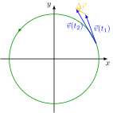](mechanics/circular-motion-non-uniform-velocity-2-delta/circular-motion-non-uniform-velocity-2-delta.svg) [[PDF]](mechanics/circular-motion-non-uniform-velocity-2-delta/circular-motion-non-uniform-velocity-2-delta.pdf) [[PNG]](mechanics/circular-motion-non-uniform-velocity-2-delta/circular-motion-non-uniform-velocity-2-delta.png) [[SVG]](mechanics/circular-motion-non-uniform-velocity-2-delta/circular-motion-non-uniform-velocity-2-delta.svg)
~~~.tex
\documentclass[crop,tikz]{standalone}

\tikzset{>=latex}
\usetikzlibrary{decorations.markings}
\colorlet{green}{black!40!green}
\definecolor{orange}{RGB}{250,194,25}
\newcommand{\place}{\vec{r}}
\newcommand{\velocity}{\vec{v}}
\newcommand{\acceleration}{\vec{a}}

\begin{document}
\begin{tikzpicture}[scale=2]
  % axes
  \draw[->,thick] (-1.2,0) -- (1.2,0) node[below] {$x$};
  \draw[->,thick] (0,-1.2) -- (0,1.2) node[left] {$y$};
  % circle
  \draw[
    decoration={markings, mark=at position 0.4 with {\arrow{>}}},
    postaction={decorate},
    green,
    thick
  ] (0,0) circle (1);
  % place, velocity
  \draw[->,thick,blue] (20:1) -- node[right]{$\velocity(t_1)$} ++(20+90:0.7) coordinate (v1);
  % place, velocity
  \draw[->,thick,blue] (20:1) -- node[left]{$\velocity(t_2)$} ++(30+90:0.9) coordinate (v2);
  \draw[->,thick,orange] (v1) -- node[above] {$\Delta\velocity$} (v2);
\end{tikzpicture}
\end{document}
~~~
## circular-motion-uniform.svg
 [[PDF]](mechanics/circular-motion-uniform/circular-motion-uniform.pdf) [[PNG]](mechanics/circular-motion-uniform/circular-motion-uniform.png) [[SVG]](mechanics/circular-motion-uniform/circular-motion-uniform.svg)
~~~.tex
\documentclass[crop,tikz]{standalone}

\tikzset{>=latex}
\usetikzlibrary{decorations.markings}
\colorlet{green}{black!40!green}
\definecolor{orange}{RGB}{250,194,25}
\newcommand{\place}{\vec{r}}
\newcommand{\velocity}{\vec{v}}
\newcommand{\acceleration}{\vec{a}}

\begin{document}
\begin{tikzpicture}[scale=2]
  % axes
  \draw[->,thick] (-1.2,0) -- (1.2,0) node[below] {$x$};
  \draw[->,thick] (0,-1.2) -- (0,1.2) node[left] {$y$};
  % circle
  \draw[
    decoration={markings, mark=at position 0.4 with {\arrow{>}}},
    postaction={decorate},
    green,
    thick
  ] (0,0) circle (1);
  % place, velocity, acceleration
  \draw[->,thick,red] (0,0) -- node[left,anchor=south east,yshift=-0.2em]{$\place(t)$} (20:1);
  \draw[->,thick,blue] (20:1) -- node[right,anchor=west]{$\velocity(t)$} +(20+90:0.7);
  \begin{scope}[shift={(-0.03,0.03)}]
    \draw[->,thick,orange] (20:1) -- node[left, anchor=south east] {$\acceleration(t)$} (20:0.8);
  \end{scope}
\end{tikzpicture}
\end{document}
~~~
## circular-motion-uniform-velocity-2.svg
 [[PDF]](mechanics/circular-motion-uniform-velocity-2/circular-motion-uniform-velocity-2.pdf) [[PNG]](mechanics/circular-motion-uniform-velocity-2/circular-motion-uniform-velocity-2.png) [[SVG]](mechanics/circular-motion-uniform-velocity-2/circular-motion-uniform-velocity-2.svg)
~~~.tex
\documentclass[crop,tikz]{standalone}

\tikzset{>=latex}
\usetikzlibrary{decorations.markings}
\colorlet{green}{black!40!green}
\newcommand{\place}{\vec{r}}
\newcommand{\velocity}{\vec{v}}
\newcommand{\acceleration}{\vec{a}}

\begin{document}
\begin{tikzpicture}[scale=2]
  % axes
  \draw[->,thick] (-1.2,0) -- (1.2,0) node[below] {$x$};
  \draw[->,thick] (0,-1.2) -- (0,1.2) node[left] {$y$};
  % circle
  \draw[
    decoration={markings, mark=at position 0.4 with {\arrow{>}}},
    postaction={decorate},
    green,
    thick
  ] (0,0) circle (1);
  % place, velocity
  \draw[->,thick,red] (0,0) -- node[anchor=north west,yshift=0.5em]{$\place(t_1)$} (20:1);
  \draw[->,thick,blue] (20:1) -- +(20+90:0.7) node[right]{$\velocity(t_1)$};
  % place, velocity
  \draw[->,thick,red] (0,0) -- node[anchor=south,yshift=0.3em]{$\place(t_2)$} (30:1);
  \draw[->,thick,blue] (30:1) -- +(30+90:0.7) node[above left,yshift=-0.5em]{$\velocity(t_2)$};
\end{tikzpicture}
\end{document}
~~~
## circular-motion-uniform-velocity-2-delta.svg
 [[PDF]](mechanics/circular-motion-uniform-velocity-2-delta/circular-motion-uniform-velocity-2-delta.pdf) [[PNG]](mechanics/circular-motion-uniform-velocity-2-delta/circular-motion-uniform-velocity-2-delta.png) [[SVG]](mechanics/circular-motion-uniform-velocity-2-delta/circular-motion-uniform-velocity-2-delta.svg)
~~~.tex
\documentclass[crop,tikz]{standalone}

\tikzset{>=latex}
\usetikzlibrary{decorations.markings}
\colorlet{green}{black!40!green}
\definecolor{orange}{RGB}{250,194,25}
\newcommand{\velocity}{\vec{v}}
\newcommand{\acceleration}{\vec{a}}

\begin{document}
\begin{tikzpicture}[scale=2]
  % axes
  \draw[->,thick] (-1.2,0) -- (1.2,0) node[below] {$x$};
  \draw[->,thick] (0,-1.2) -- (0,1.2) node[left] {$y$};
  % circle
  \draw[
    decoration={markings, mark=at position 0.4 with {\arrow{>}}},
    postaction={decorate},
    green,
    thick
  ] (0,0) circle (1);
  % place, velocity
  \draw[->,thick,blue] (20:1) -- node[right]{$\velocity(t_1)$} ++(20+90:0.7) coordinate (v1);
  % place, velocity
  \draw[->,thick,blue] (20:1) -- node[left]{$\velocity(t_2)$} ++(30+90:0.7) coordinate (v2);
  \draw[->,thick,orange] (v1) -- node[above] {$\Delta\velocity$} (v2);
\end{tikzpicture}
\end{document}
~~~
## circular-motion-velocity-2.svg
 [[PDF]](mechanics/circular-motion-velocity-2/circular-motion-velocity-2.pdf) [[PNG]](mechanics/circular-motion-velocity-2/circular-motion-velocity-2.png) [[SVG]](mechanics/circular-motion-velocity-2/circular-motion-velocity-2.svg)
~~~.tex
\documentclass[crop,tikz]{standalone}

\tikzset{>=latex}
\usetikzlibrary{decorations.markings}
\colorlet{green}{black!40!green}
\newcommand{\place}{\vec{r}}
\newcommand{\velocity}{\vec{v}}

\begin{document}
\begin{tikzpicture}[scale=2]
  \draw[->,thick] (-1.2,0) -- (1.2,0) node[below] {$x$};
  \draw[->,thick] (0,-1.2) -- (0,1.2) node[left] {$y$};
  \draw[
    decoration={markings, mark=at position 0.3 with {\arrow{>}}},
    postaction={decorate},
    green,
    thick
  ] (0,0) circle (1);
  % 1
  \draw[->,thick,red] (0,0) -- node[left,yshift=1em,xshift=0.5em] {$\place(t)$} (45:1);
  \draw[->,thick,blue] (45:1) -- node[right,yshift=0.5em]{$\velocity(t)$} +(135:0.6);
  % 2
  \draw[->,thick,red] (0,0) -- node[right,yshift=1em,xshift=-0.5em] {$\place(t)$} (135:1);
  \draw[->,thick,blue] (135:1) -- node[left,yshift=0.5em]{$\velocity(t)$} +(225:0.6);
\end{tikzpicture}
\end{document}
~~~
## circular-motion-velocity.svg
 [[PDF]](mechanics/circular-motion-velocity/circular-motion-velocity.pdf) [[PNG]](mechanics/circular-motion-velocity/circular-motion-velocity.png) [[SVG]](mechanics/circular-motion-velocity/circular-motion-velocity.svg)
~~~.tex
\documentclass[crop,tikz]{standalone}

\tikzset{>=latex}
\usetikzlibrary{decorations.markings}
\colorlet{green}{black!40!green}
\newcommand{\place}{\vec{r}}
\newcommand{\velocity}{\vec{v}}

\begin{document}
\begin{tikzpicture}[scale=2]
    \draw[->,thick] (-1.2,0) -- (1.2,0) node[below] {$x$};
    \draw[->,thick] (0,-1.2) -- (0,1.2) node[left] {$y$};
    \draw[
      decoration={markings, mark=at position 0.4 with {\arrow{>}}},
      postaction={decorate},
      green,
      thick
    ] (0,0) circle (1);
    \draw[->,thick,red] (0,0) -- node[right,anchor=north west]{$\place(t)$} (45:1);
    \draw[->,thick,blue] (45:1) -- +(135:0.6) node[right,anchor=south west]{$\velocity(t)$};
\end{tikzpicture}
\end{document}
~~~
## constraint-force-inclined-plane.svg
 [[PDF]](mechanics/constraint-force-inclined-plane/constraint-force-inclined-plane.pdf) [[PNG]](mechanics/constraint-force-inclined-plane/constraint-force-inclined-plane.png) [[SVG]](mechanics/constraint-force-inclined-plane/constraint-force-inclined-plane.svg)
~~~.tex
\documentclass[crop,tikz]{standalone}

\usetikzlibrary{calc}
\tikzset{>=latex}
\colorlet{green}{black!40!green}
\colorlet{gray}{gray!20}
\newcommand{\F}{\vec{F}}
\newcommand{\Z}{\vec{Z}}

\begin{document}
\begin{tikzpicture}[scale=2.5]
  \pgfmathsetmacro{\al}{atan(0.5)} % angle
  \pgfmathsetmacro{\sa}{sin(\al)}; % sin(angle)
  \pgfmathsetmacro{\ca}{cos(\al)}; % cos(angle)
  % axis
  \draw[->] (0,0) -- ++(2.2,0) node[right] {$x$};
  \draw[->] (0,0) -- ++(0,1.2) node[above] {$y$};
  % inclined plane
  \draw[fill=gray] (0,0) -- (2,0) -- (0,1) -- cycle;
  % position of mass
  \draw[fill,black] (1,0.55) circle (0.04) coordinate (a);
  % arc
  \draw ([shift={({180-\al}:0.6)}]2,0) arc ({180-\al}:180:0.6);
  \node at ($(2,0)+({180-\al/2}:0.4)$) {$\alpha$};
  % arc
  \draw ([shift={(-90:0.4)}]a) arc (-90:{-90-\al}:0.4);
  \node at ($(a)+({-90-\al/2}:0.3)$) {$\alpha$};
  % forces
  \draw[->,thick,red]          (a) -- +(0,-1) node[below] {$\F_g$};
  \draw[->,thick,green]        (a) -- +($(\sa*\ca,-\sa*\sa)$) node[above] {$\F_H$};
  \draw[->,thick,green,dashed] (a) -- +($(-\sa*\ca,-\ca*\ca)$) node[below] {$\F_N$};
  \draw[->,thick,blue]         (a) -- +($(\sa*\ca,\ca*\ca)$) node[above] {$\Z$};
\end{tikzpicture}
\end{document}
~~~
## constraint-force-table.svg
 [[PDF]](mechanics/constraint-force-table/constraint-force-table.pdf) [[PNG]](mechanics/constraint-force-table/constraint-force-table.png) [[SVG]](mechanics/constraint-force-table/constraint-force-table.svg)
~~~.tex
\documentclass[crop,tikz]{standalone}

\tikzset{>=latex}
\colorlet{gray}{gray!20}
\newcommand{\F}{\vec{F}}
\newcommand{\Z}{\vec{Z}}

\begin{document}
\begin{tikzpicture}[scale=1.5]
  \draw[fill,gray] (xyz cs:x=0.1,z=-0.2) -- ++(xyz cs:x=2.6) -- ++(xyz cs:z=-3) -- ++(xyz cs:x=-2.6) -- cycle;
  \draw[->] (xyz cs:x=-0.5) -- (xyz cs:x=3) node[below] {$x$};
  \draw[->] (xyz cs:y=-0.5) -- (xyz cs:y=2) node[left] {$z$};
  \draw[->] (xyz cs:z=1) -- (xyz cs:z=-3) node[above] {$y$};
  \draw[fill,black] (xyz cs:x=1.5,z=-1.5) circle (0.1);
  \draw[->,red] (xyz cs:x=1.5,z=-1.5) -- ++(0,-1) node[below] {$\F_g$};
  \draw[->,blue] (xyz cs:x=1.5,z=-1.5) -- ++(0,+1) node[above] {$\Z$};
\end{tikzpicture}
\end{document}
~~~
## coriolis-force-1.svg
 [[PDF]](mechanics/coriolis-force-1/coriolis-force-1.pdf) [[PNG]](mechanics/coriolis-force-1/coriolis-force-1.png) [[SVG]](mechanics/coriolis-force-1/coriolis-force-1.svg)
~~~.tex
\documentclass[crop,tikz]{standalone}

\usepackage{amsmath}
\usetikzlibrary{decorations.markings}
\tikzset{>=latex}
\colorlet{green}{black!40!green}
\colorlet{gray}{gray!20}
\newcommand{\vel}{\vec{v}}

\begin{document}
\begin{tikzpicture}[scale=2]
  \node at (-1,1) {$t=0$};
  \draw[fill=gray,
    decoration={markings, mark=at position 0.4 with {\arrow{>}}},
    postaction={decorate},
    thick
  ] (0,0) circle (1);
  \draw[->,thick] (-1.2,0) -- (1.2,0) node[below] {$x$};
  \draw[->,thick] (0,-1.2) -- (0,1.2) node[left] {$y$};
  \draw[->,red,thick] (0,0) -- (0.5,0) node[below] {$x'$};
  \draw[->,red,thick] (0,0) -- (0,0.5) node[left] {$y'$};
  \draw[fill] (0,0) circle (0.05);
  \draw[->,blue,thick] (0.1,0.1) -- +(0:0.5) node[above]{$\vel$};
  \node at (1.2,0.4) {$\Sigma$};
  \node at (0.4,0.4) {\textcolor{red}{$\Sigma'$}};
\end{tikzpicture}
\end{document}
~~~
## coriolis-force-2.svg
 [[PDF]](mechanics/coriolis-force-2/coriolis-force-2.pdf) [[PNG]](mechanics/coriolis-force-2/coriolis-force-2.png) [[SVG]](mechanics/coriolis-force-2/coriolis-force-2.svg)
~~~.tex
\documentclass[crop,tikz]{standalone}

\usepackage{amsmath}
\usetikzlibrary{decorations.markings}
\tikzset{>=latex}
\colorlet{green}{black!40!green}
\colorlet{gray}{gray!20}
\newcommand{\FCo}{\vec{F}_\text{Co}}
\newcommand{\vel}{\vec{v}}
\newcommand{\velp}{\vec{v}^{\,\prime}}

\begin{document}
\begin{tikzpicture}[scale=2]
  \node at (-1,1) {$t>0$};
  \draw[fill=gray,
    decoration={markings, mark=at position 0.4 with {\arrow{>}}},
    postaction={decorate},
    thick
  ] (0,0) circle (1);
  \draw[->,thick] (-1.2,0) -- (1.2,0) node[below] {$x$};
  \draw[->,thick] (0,-1.2) -- (0,1.2) node[left] {$y$};
  \draw[->,red,thick] (0,0) -- (45:0.5) node[right] {$x'$};
  \draw[->,red,thick] (0,0) -- (135:0.5) node[left] {$y'$};
  \draw[fill] (0.7,0) circle (0.05);
  \draw[->,blue,thick] (0.8,0.1) -- +(0:0.5) node[above]{$\vel$};
  \draw[green,thick] (0,0) arc (135:45:0.5);
  \draw[->,green,thick] (0.7,0)+(-45:0.1) -- +(-45:0.5) node[right] {$\velp(t)$};
  \draw[->,thick] (0.7,0) -- +(225:0.5) node[below] {$\FCo(t)$};
  \node at (1.2,0.6) {$\Sigma$};
  \node at (70:0.5) {\textcolor{red}{$\Sigma'$}};
\end{tikzpicture}
\end{document}
~~~
## curve-length.svg
 [[PDF]](mechanics/curve-length/curve-length.pdf) [[PNG]](mechanics/curve-length/curve-length.png) [[SVG]](mechanics/curve-length/curve-length.svg)
~~~.tex
\documentclass[crop,tikz]{standalone}

\tikzset{>=latex}
\usetikzlibrary{calc}
\colorlet{green}{black!40!green}
\newcommand{\place}{\vec{r}}

\begin{document}
\begin{tikzpicture}[scale=1.3]
  % axes
  \draw[->,thick] (xyz cs:x=-0.5) -- (xyz cs:x=4)  node[below] {$x$};
  \draw[->,thick] (xyz cs:y=-0.5) -- (xyz cs:y=3)  node[left] {$z$};
  \draw[->,thick] (xyz cs:z=1)    -- (xyz cs:z=-4) node[above] {$y$};
  % space point
  \coordinate (r1) at ($(1,0.5)+(70:2)$);
  \coordinate (r2) at ($(1,0.5)+(20:2)$);
  % path
  \draw[thick,green] (r1) arc (70:20:2);
  \node[right,xshift=0.5em,green] at ($(1,0.5)+(50:2)$) {$s(t_1,t_2)$};
  % space-point vectors
  \draw[->,thick,red] (xyz cs:x=0) -- node[above,xshift=-1em]{$\place(t_1)$} (r1);
  \draw[->,thick,red] (xyz cs:x=0) -- node[below,xshift=+1em]{$\place(t_2)$} (r2);
\end{tikzpicture}
\end{document}
~~~
## curve-length-parts.svg
 [[PDF]](mechanics/curve-length-parts/curve-length-parts.pdf) [[PNG]](mechanics/curve-length-parts/curve-length-parts.png) [[SVG]](mechanics/curve-length-parts/curve-length-parts.svg)
~~~.tex
\documentclass[crop,tikz]{standalone}

\tikzset{>=latex}
\usetikzlibrary{calc}
\colorlet{green}{black!40!green}
\newcommand{\place}{\vec{r}}

\begin{document}
\begin{tikzpicture}[scale=1.3]
  % axes
  \draw[->,thick] (xyz cs:x=-0.5) -- (xyz cs:x=4)  node[below] {$x$};
  \draw[->,thick] (xyz cs:y=-0.5) -- (xyz cs:y=3)  node[left] {$z$};
  \draw[->,thick] (xyz cs:z=1)    -- (xyz cs:z=-4) node[above] {$y$};
  % space point
  \coordinate (r1) at ($(1,0.5)+(70:2)$);
  \coordinate (r2) at ($(1,0.5)+(20:2)$);
  % path
  \draw[thick,green] (r1) arc (70:20:2);
  \node[right,xshift=0.5em,green] at ($(1,0.5)+(50:2)$) {$s(t_1,t_2)$};
  % space-point vectors
  \foreach \r/\n in { 70/1, 53.3333/2, 36.6667/3 } {%
    \draw[->,gray] (0,0) -- ($(1,0.5)+({\r-50/3}:2)$);
    \draw[->] ($(1,0.5)+(\r:2)$) -- ($(1,0.5)+({\r-50/3}:2)$);
    \node[scale=0.7] at ($(1,0.5)+({\r-50/6}:1.8)$) {$\Delta\place_{\n}$};
  }
  % main space-point vectors
  \draw[->,thick,red] (xyz cs:x=0) -- node[above,xshift=-1em]{$\place(t_1)$} (r1);
  \draw[->,thick,red] (xyz cs:x=0) -- node[below,xshift=+1em]{$\place(t_2)$} (r2);
\end{tikzpicture}
\end{document}
~~~
## damped-non-oscillator.svg
 [[PDF]](mechanics/damped-non-oscillator/damped-non-oscillator.pdf) [[PNG]](mechanics/damped-non-oscillator/damped-non-oscillator.png) [[SVG]](mechanics/damped-non-oscillator/damped-non-oscillator.svg)
~~~.tex
\documentclass[crop,tikz]{standalone}

\usepackage{pgfplots}
\tikzset{>=latex}

\pgfplotsset{
  inverted/.style = {
    every axis legend/.append style={
      draw=white,
      fill=hardblack,
      text=white
    }
  },
  every non boxed x axis/.append style={
    axis line style={-latex}
  },
  every non boxed y axis/.append style={
    axis line style={-latex}
  }
}

\begin{document}
\begin{tikzpicture}
\pgfmathsetmacro{\damp}{0.2}
\pgfmathsetmacro{\apar}{1}
\pgfmathsetmacro{\bpar}{1}
\begin{axis}[
  thick,
  width=7cm,
  height=6cm,
  domain={0}:{6*pi},
  samples=50,
  axis y line=middle,
  axis x line=middle,
  xlabel={$t$},
  ylabel={$x$},
  xlabel style={right},
  ylabel style={above},
  xmin=0, xmax={6.3*pi},
  ymin=-1.1, ymax=1.2,
  xtick={\empty},
  xticklabels={\empty},
  ytick={\empty},
  yticklabels={\empty},
  legend cell align={right},
  legend style={at={(1,0)},anchor=south east}
  ]
  \addplot[red,smooth] { (\apar + \damp*x)*exp(-\damp*x) };
  \addlegendentry{aperiodischer Grenzfall};
  \addplot[blue,densely dashed,smooth] {exp(-0.2*x)*(1.07735*exp(sqrt(0.03)*x) - 0.0773503*exp(-sqrt(0.03)*x))};
  \addlegendentry{Kriechfall};
\end{axis}
\end{tikzpicture}
\end{document}
~~~
## damped-oscillator-2.svg
 [[PDF]](mechanics/damped-oscillator-2/damped-oscillator-2.pdf) [[PNG]](mechanics/damped-oscillator-2/damped-oscillator-2.png) [[SVG]](mechanics/damped-oscillator-2/damped-oscillator-2.svg)
~~~.tex
\documentclass[crop,tikz]{standalone}

\usepackage{amsmath}
\usepackage{pgfplots}
\usepackage[locale=DE]{siunitx}
\tikzset{>=latex}

\pgfplotsset{
  inverted/.style = {
    every axis legend/.append style={
      draw=white,
      fill=hardblack,
      text=white
    }
  },
  every non boxed x axis/.append style={
    axis line style={-latex}
  },
  every non boxed y axis/.append style={
    axis line style={-latex}
  }
}

\begin{document}
\begin{tikzpicture}
\pgfmathsetmacro{\damp}{0.2}
\begin{axis}[
  thick,
  width=7cm,
  height=6cm,
  domain={0}:{6*pi},
  samples=100,
  smooth,
  axis y line=middle,
  axis x line=middle,
  xlabel={$t/\si{\s}$},
  ylabel={$x/\si{\m}$},
  xlabel style={right},
  ylabel style={above},
  xmin=0, xmax={6.3*pi},
  ymin=-2.2, ymax=2.4,
  extra y ticks={0},
  legend cell align={left},
  legend style={at={(1.1,0)},anchor=north east}
  ]
  \addplot[red] { 2*exp(-\damp*x)*cos(deg(x)) };
  \addlegendentry{$x(t)=\SI{2}{\m}\operatorname{e}^{-\SI{\damp}{\per\s} t}\sin(\SI{1}{\per\s} t)$};
  \addplot[blue,densely dashed] { 2*exp(-\damp*x) };
  \addlegendentry{$x(t)=\pm\SI{2}{\m}\operatorname{e}^{-\SI{\damp}{\per\s} t}$};
  \addplot[blue,densely dashed] { -2*exp(-\damp*x) };
\end{axis}
\end{tikzpicture}
\end{document}
~~~
## damped-oscillator.svg
 [[PDF]](mechanics/damped-oscillator/damped-oscillator.pdf) [[PNG]](mechanics/damped-oscillator/damped-oscillator.png) [[SVG]](mechanics/damped-oscillator/damped-oscillator.svg)
~~~.tex
\documentclass[crop,tikz]{standalone}

\usepackage{pgfplots}
\tikzset{>=latex}

\pgfplotsset{
  inverted/.style = {
    every axis legend/.append style={
      draw=white,
      fill=hardblack,
      text=white
    }
  },
  every non boxed x axis/.append style={
    axis line style={-latex}
  },
  every non boxed y axis/.append style={
    axis line style={-latex}
  }
}

\begin{document}
\begin{tikzpicture}
\pgfmathsetmacro{\damp}{0.2}
\begin{axis}[
  thick,
  width=7cm,
  height=6cm,
  domain={0}:{6*pi},
  samples=50,
  axis y line=middle,
  axis x line=middle,
  xlabel={$t$},
  ylabel={$x$},
  xlabel style={right},
  ylabel style={above},
  xmin=0, xmax={6.3*pi},
  ymin=-1.1, ymax=1.2,
  xtick={\empty},
  xticklabels={\empty},
  ytick={\empty},
  yticklabels={\empty},
  legend cell align={right},
  legend style={at={(1,1)},anchor=north east}
  ]
  \addplot[red,smooth] { exp(-\damp*x)*cos(deg(x)) };
  \addlegendentry{gedämpfte Schwingung};
  \addplot[smooth,densely dashed] { exp(-\damp*x) };
  \addplot[smooth,densely dashed] { -exp(-\damp*x) };
  \addlegendentry{Einhüllende};
\end{axis}
\end{tikzpicture}
\end{document}
~~~
## earth-forces.svg
 [[PDF]](mechanics/earth-forces/earth-forces.pdf) [[PNG]](mechanics/earth-forces/earth-forces.png) [[SVG]](mechanics/earth-forces/earth-forces.svg)
~~~.tex
\documentclass[crop,tikz]{standalone}

\usepackage{amsmath}
\tikzset{>=latex}
\colorlet{green}{black!40!green}
\newcommand{\F}{\vec{F}}

\begin{document}
\begin{tikzpicture}[scale=2]
  \draw[dashed] (-1,0) -- (1,0);
  \draw[->,thick] (0,-1.2) -- (0,1.2) node[above] {$\vec{\omega}$};
  \draw[thick] (0,0) circle (1);
  \coordinate (r) at (55:1);
  \draw[fill=black] (r) circle (0.02);
  \draw[->,brown,thick] (r) -- (55:0.5) node[below] {$\F_g$};
  \draw[->,green,thick] (r) -- ++(0.3,0) node[right] {$\F_\text{Zf}$};
  \draw[->,red,thick]   (r) -- ++(55+90:0.3) node[above] {$\vec{v}^{\,\prime}$};
  \node[above,blue] at (r) {$\times$};
  \node[above,blue,xshift=0.7em,yshift=0.7em] at (r) {$\F_\text{Co}$};
\end{tikzpicture}
\end{document}
~~~
## Epot-gravity.svg
 [[PDF]](mechanics/Epot-gravity/Epot-gravity.pdf) [[PNG]](mechanics/Epot-gravity/Epot-gravity.png) [[SVG]](mechanics/Epot-gravity/Epot-gravity.svg)
~~~.tex
\documentclass[crop,tikz]{standalone}

\usepackage{amsmath}
\usepackage{pgfplots}

\tikzset{>=latex}
\pgfplotsset{
  compat=1.16,
  every non boxed x axis/.append style={
    axis line style={-latex}
  },
  every non boxed y axis/.append style={
    axis line style={-latex}
  }
}

\begin{document}
\begin{tikzpicture}
  \begin{axis}[
    thick,
    width=7cm,
    height=6cm,
    domain=0.5:4.6,
    xmin=0, xmax=5,
    ymin=-2, ymax=0.2,
    samples=200,
    xlabel={$r$},
    ylabel={$E_\text{pot}$},
    axis x line=center,
    axis y line=center,
    xlabel style={right},
    ylabel style={above},
    xtick={\empty},
    xticklabels={},
    ytick={\empty},
    yticklabels={},
    clip=false,
    ]
    \addplot[mark=none,red] {-1/x};
    \node[left] at (axis cs:0,0) {$0$};
  \end{axis}
\end{tikzpicture}%
\end{document}
~~~
## Epot-linear.svg
 [[PDF]](mechanics/Epot-linear/Epot-linear.pdf) [[PNG]](mechanics/Epot-linear/Epot-linear.png) [[SVG]](mechanics/Epot-linear/Epot-linear.svg)
~~~.tex
\documentclass[crop,tikz]{standalone}

\usepackage{amsmath}
\usepackage{pgfplots}

\tikzset{>=latex}
\pgfplotsset{
  compat=1.16,
  every non boxed x axis/.append style={
    axis line style={-latex}
  },
  every non boxed y axis/.append style={
    axis line style={-latex}
  }
}

\begin{document}
\begin{tikzpicture}
  \begin{axis}[
    thick,
    width=7cm,
    height=6cm,
    domain=0:1,
    xmin=0, xmax={1},
    ymin={0}, ymax={1},
    samples=200,
    xlabel={$h$},
    ylabel={$E_\text{pot}$},
    axis x line=center,
    axis y line=center,
    xlabel style={right},
    ylabel style={above},
    xtick={\empty},
    xticklabels={},
    ytick={\empty},
    yticklabels={},
    clip=false,
    ]
    \addplot[mark=none,red] {x};
    \node[left] at (axis cs:0,0) {$0$};
  \end{axis}
\end{tikzpicture}%
\end{document}
~~~
## Epot-quadtratic.svg
 [[PDF]](mechanics/Epot-quadratic/Epot-quadtratic.pdf) [[PNG]](mechanics/Epot-quadratic/Epot-quadtratic.png) [[SVG]](mechanics/Epot-quadratic/Epot-quadtratic.svg)
~~~.tex
\documentclass[crop,tikz]{standalone}

\usepackage{amsmath}
\usepackage{pgfplots}

\tikzset{>=latex}
\pgfplotsset{
  compat=1.16,
  every non boxed x axis/.append style={
    axis line style={-latex}
  },
  every non boxed y axis/.append style={
    axis line style={-latex}
  }
}

\begin{document}
\begin{tikzpicture}
  \begin{axis}[
    thick,
    width=7cm,
    height=6cm,
    domain=0:1,
    xmin=0, xmax=1,
    ymin=0, ymax=1,
    samples=200,
    xlabel={$x$},
    ylabel={$E_\text{pot}$},
    axis x line=center,
    axis y line=center,
    xlabel style={right},
    ylabel style={above},
    xtick={\empty},
    xticklabels={},
    ytick={\empty},
    yticklabels={},
    clip=false,
    ]
    \addplot[mark=none,red] {x^2};
    \node[left] at (axis cs:0,0) {$0$};
  \end{axis}
\end{tikzpicture}%
\end{document}
~~~
## fictitious-force.svg
 [[PDF]](mechanics/fictitious-force/fictitious-force.pdf) [[PNG]](mechanics/fictitious-force/fictitious-force.png) [[SVG]](mechanics/fictitious-force/fictitious-force.svg)
~~~.tex
\documentclass[crop,tikz]{standalone}

\usepackage{amsmath}
\newcommand{\F}{\vec{F}}
\newcommand{\place}{\vec{r}}
\tikzset{>=latex}
\usetikzlibrary{calc,patterns,decorations.pathmorphing}
\colorlet{green}{black!40!green}

\begin{document}
\begin{tikzpicture}[scale=1.5]
  \pattern[pattern=north east lines,pattern color=black] (0,0)--++(3,0)--++(0,-0.2)--++(-3,0)--cycle;
  \draw (0,0) -- (3,0);
  \draw[->,thick] (3,1) -- +(0.5,0) node[above]{$\F_\text{res}$};
  % Sigma
  \coordinate (s) at (0,0.1);
  \draw[->,thick] (s) -- +(1,0);
  \draw[->,thick] (s) -- +(0,1) node[left] {$\Sigma$};
  % car
  \draw (1,0.2) rectangle (3,1.4);
  \draw[fill] (1.5,0.2) circle (0.2);
  \draw[fill] (2.5,0.2) circle (0.2);
  % Sigma'
  \coordinate (sp) at (1,1.5);
  \draw[->,thick] (sp) -- +(1,0);
  \draw[->,thick] (sp) -- +(0,1) node[left] {$\Sigma'$};
  % r
  \coordinate (m) at (2,1);
  \draw[fill,black] (m) circle (0.05);
  \draw[->,red,shorten >= 1]   (s)  -- node[above,xshift=5em] {$\place(t)$} ($(s)!0.98!(m)$);
  \draw[->,green,shorten >= 1] (sp) -- node[right,xshift=1em] {$\place^{\,\prime}(t)$} ($(sp)!0.98!(m)$);
  \draw[->,blue]  (s)  -- node[above,yshift=1em] {$\place_0(t)$} (sp);
\end{tikzpicture}
\end{document}
~~~
## force-addition.svg
 [[PDF]](mechanics/force-addition/force-addition.pdf) [[PNG]](mechanics/force-addition/force-addition.png) [[SVG]](mechanics/force-addition/force-addition.svg)
~~~.tex
\documentclass[crop,tikz]{standalone}

\usepackage{amsmath}
\tikzset{>=latex}
\newcommand{\F}{\vec{F}}

\begin{document}
\begin{tikzpicture}
  \draw[step=1.0,gray!50,very thin] (-1,-2) grid (4,2);
  \draw[->] (-1,0) -- (4,0) node[right] {$F_x/\text{N}$};
  \draw[->] (0,-2) -- (0,2) node[above] {$F_y/\text{N}$};
  % 
  \draw[->,blue] (0,0) -- node[above] {$\F_1$} (2,1);
  \draw[->,blue] (0,0) -- node[below] {$\F_2$} (1,-1);
  \draw[->,red,thick] (0,0) -- node[above,xshift=1em] {$\F_\text{res}$} (3,0);
  \draw[->,blue,dashed] (2,1) -- (3,0);
  \draw[->,blue,dashed] (1,-1) -- (3,0);
\end{tikzpicture}
\end{document}
~~~
## foucault-curve.svg
 [[PDF]](mechanics/foucault-curve/foucault-curve.pdf) [[PNG]](mechanics/foucault-curve/foucault-curve.png) [[SVG]](mechanics/foucault-curve/foucault-curve.svg)
~~~.tex
\documentclass[crop,tikz]{standalone}

\tikzset{>=latex}
\newcommand{\narcs}{8}

\begin{document}
\begin{tikzpicture}[scale=2]
  \draw (0,0) circle (1);
  \foreach \a in {0,...,\narcs-1} {
    \draw[->,blue] ({\a*360/\narcs}:1) to[bend left=360/(2*\narcs)] ({(\a + \narcs/2 - 1)*360/\narcs}:1);
  }
\end{tikzpicture}
\end{document}
~~~
## foucault.svg
 [[PDF]](mechanics/foucault/foucault.pdf) [[PNG]](mechanics/foucault/foucault.png) [[SVG]](mechanics/foucault/foucault.svg)
~~~.tex
\documentclass[crop,tikz]{standalone}

\tikzset{>=latex}
\usetikzlibrary{decorations.markings}
\colorlet{gray}{gray!20}
\colorlet{green}{black!40!green}

\newcommand{\angl}{20}
\newcommand{\leng}{1.5}

\begin{document}
\begin{tikzpicture}[scale=2]
  \draw[thick,
        decoration={markings, mark=at position 0.4 with {\arrow{>}}},
        postaction={decorate},
        fill=gray
        ] (0,0) ellipse (1 and 0.25);
  \draw[->] (0,0) -- ++(0,0.8) node[above] {$\vec{\omega}$};
  \coordinate (a) at (0,2); % fixation
  \draw[line width=2pt,brown] (-1.5,0) -- ++ (0,2) -- (a);
  \draw[blue,thick] (a) -- ++(-90+\angl:\leng) coordinate (m);
  \draw[fill] (m) circle (1pt);
  \draw[<->,green,thick] (m) arc (-90+\angl:-90-\angl:\leng);
\end{tikzpicture}
\end{document}
~~~
## free-fall-a.svg
 [[PDF]](mechanics/free-fall-a/free-fall-a.pdf) [[PNG]](mechanics/free-fall-a/free-fall-a.png) [[SVG]](mechanics/free-fall-a/free-fall-a.svg)
~~~.tex
\documentclass[crop,tikz]{standalone}

\tikzset{>=latex}
\definecolor{orange}{RGB}{250,194,25}

\begin{document}
\begin{tikzpicture}[scale=2.5,thick]
  \draw[->] (0,0) -- (1,0) node[right] {$t$};
  \draw[->] (0,-0.8) -- (0,0.2) node[left] {$a_z$};
  \draw[orange] (0,-0.5) -- (0.8,-0.5);
  \draw (-0.05,-0.5) node[left] {$-g$} -- (0.05,-0.5);
\end{tikzpicture}
\end{document}
~~~
## free-fall.svg
 [[PDF]](mechanics/free-fall/free-fall.pdf) [[PNG]](mechanics/free-fall/free-fall.png) [[SVG]](mechanics/free-fall/free-fall.svg)
~~~.tex
\documentclass[crop,tikz]{standalone}

\tikzset{>=latex}
\usetikzlibrary{patterns}

\begin{document}
\begin{tikzpicture}[scale=1.5]
  \draw[->] (1,0) -- (1,2) node[left] {$z$};
  \coordinate (r) at (1.1,1.5);
  \draw[] (r) -- ++(-0.2,0) node[left] {$h$};
  \draw[red,->] (r) -- ++(0,-1);
  \draw[red,fill] (r) circle (0.05);
  \draw (0,0) -- (2,0);
  \pattern[pattern=north east lines] (0,0)--(2,0)--(2,-0.2)--(0,-0.2)--cycle;
\end{tikzpicture}
\end{document}
~~~
## free-fall-v.svg
 [[PDF]](mechanics/free-fall-v/free-fall-v.pdf) [[PNG]](mechanics/free-fall-v/free-fall-v.png) [[SVG]](mechanics/free-fall-v/free-fall-v.svg)
~~~.tex
\documentclass[crop,tikz]{standalone}

\tikzset{>=latex}

\begin{document}
\begin{tikzpicture}[scale=2.5,thick]
  \draw[->] (0,0) -- (1,0) node[right] {$t$};
  \draw[->] (0,-0.8) -- (0,0.2) node[left] {$v_z$};
  \draw[blue] (0,0) -- (0.8,-0.8);
\end{tikzpicture}
\end{document}
~~~
## free-fall-z.svg
 [[PDF]](mechanics/free-fall-z/free-fall-z.pdf) [[PNG]](mechanics/free-fall-z/free-fall-z.png) [[SVG]](mechanics/free-fall-z/free-fall-z.svg)
~~~.tex
\documentclass[crop,tikz]{standalone}

\tikzset{>=latex}

\begin{document}
\begin{tikzpicture}[scale=2.5,thick]
  \draw[->] (0,0) -- (1,0) node[right] {$t$};
  \draw[->] (0,0) -- (0,1) node[left] {$z$};
  \draw[red] (0,0.8) parabola bend (0,0.8) (0.8,0);
  \draw (-0.05,0.8) node[left] {$h$} -- (0.05,0.8);
\end{tikzpicture}
\end{document}
~~~
## friction.svg
 [[PDF]](mechanics/friction/friction.pdf) [[PNG]](mechanics/friction/friction.png) [[SVG]](mechanics/friction/friction.svg)
~~~.tex
\documentclass[crop,tikz]{standalone}

\usepackage{amsmath}
\newcommand{\F}{\vec{F}}
\tikzset{>=latex}
\usetikzlibrary{patterns,decorations.pathmorphing}

\begin{document}
\begin{tikzpicture}[scale=1.4]
  \pattern[pattern=north east lines,pattern color=black] (-1,0)--++(0,-0.2)--++(4,0)--++(0,0.2)--cycle;
  \draw (-1,0) -- ++(4,0);
  \draw[fill=gray!20] (0,0) rectangle (2,1);
  \draw[->,thick,blue] (1,0.05) -- ++(2,0) node[above] {$\F_S$};
  \draw[->,thick,red] (1,0.05) -- ++(-1.5,0) node[above] {$\F_R$};
\end{tikzpicture}
\end{document}
~~~
## gravitational-force-earth.svg
 [[PDF]](mechanics/gravitational-force-earth/gravitational-force-earth.pdf) [[PNG]](mechanics/gravitational-force-earth/gravitational-force-earth.png) [[SVG]](mechanics/gravitational-force-earth/gravitational-force-earth.svg)
~~~.tex
\documentclass[crop,tikz]{standalone}

\tikzset{>=latex}
\newcommand{\place}{\vec{r}}
\newcommand{\F}{\vec{F}}

\begin{document}
\begin{tikzpicture}
  \draw[] (0,0) circle (2);
  \draw[fill,black] (45:2.1) circle (0.1) node[right] {$m$};
  \draw[->] (0,0) -- node[above,xshift=-0.5em] {$\place_1$} (45:2);
  \node[below] at (0,0) {$0$};
  \begin{scope}[shift={(0.05,-0.05)}]
    \draw[->,red,thick] (45:2) -- node[below,xshift=0.5em] {$\F_g$} (45:1);
  \end{scope}
\end{tikzpicture}
\end{document}
~~~
## gravitational-force.svg
 [[PDF]](mechanics/gravitational-force/gravitational-force.pdf) [[PNG]](mechanics/gravitational-force/gravitational-force.png) [[SVG]](mechanics/gravitational-force/gravitational-force.svg)
~~~.tex
\documentclass[crop,tikz]{standalone}

\tikzset{>=latex}
\newcommand{\place}{\vec{r}}
\newcommand{\F}{\vec{F}}
\colorlet{green}{black!40!green}

\begin{document}
\begin{tikzpicture}[scale=2]
  \draw[->] (0,0) node[below] {$0$} -- node[left] {$\place_1$} (-1,1);
  \draw[->] (0,0) -- node[right] {$\place_2$} (1,1);
  \draw[fill,black] (-1,1)+(-0.1,0.1) circle (0.08);
  \draw[fill,black] (1,1)+(0.1,0.1) circle (0.08);
  \draw[->,blue] (-1,1.15) -- node[above] {$\place_2-\place_1$} (+1,1.15);
  \draw[->,red]  (+1,1.05) -- node[below] {$\place_1-\place_2$} (-1,1.05);
  \draw (-1.2,1.1) node[left] {$m_1$};
  \draw (1.2,1.1) node[right] {$m_2$};
  \draw[->,blue] (-1.1,1.25) -- node[above] {$\F_{G,2\to 1}$} +(+0.5,0);
  \draw[->,red]  (+1.1,1.25) -- node[above] {$\F_{G,1\to 2}$} +(-0.5,0);
\end{tikzpicture}
\end{document}
~~~
## halfpipe-1.svg
 [[PDF]](mechanics/halfpipe-1/halfpipe-1.pdf) [[PNG]](mechanics/halfpipe-1/halfpipe-1.png) [[SVG]](mechanics/halfpipe-1/halfpipe-1.svg)
~~~.tex
\documentclass[crop,tikz]{standalone}

\tikzset{>=latex}

\begin{document}
\begin{tikzpicture}
  \pgfmathsetmacro{\angl}{45}
  \pgfmathsetmacro{\radius}{2}
  \pgfmathsetmacro{\circleRadius}{0.2}
  \coordinate (ball) at (-\angl:\radius);
  % track
  \draw[thick] (ball) arc (-\angl:-180+\angl:\radius);
  % ball
  \draw[fill,red] (ball)+(0,\circleRadius) circle (\circleRadius);
  % height
  \draw[<->,thick] (ball) -- node[right] {$h$} ++(0,{\radius*(-1+cos(\angl))});
\end{tikzpicture}%
\end{document}
~~~
## halpipe-2.svg
 [[PDF]](mechanics/halfpipe-2/halpipe-2.pdf) [[PNG]](mechanics/halfpipe-2/halpipe-2.png) [[SVG]](mechanics/halfpipe-2/halpipe-2.svg)
~~~.tex
\documentclass[crop,tikz]{standalone}

\begin{document}
\begin{tikzpicture}
  \pgfmathsetmacro{\angl}{45}
  \pgfmathsetmacro{\radius}{2}
  \pgfmathsetmacro{\circleRadius}{0.2}
  % track
  \draw[thick] (-\angl:\radius) arc (-\angl:-180+\angl:\radius);
  % ball
  \draw[fill,red] (0,-\radius)+(0,\circleRadius) circle (\circleRadius);
\end{tikzpicture}%
\end{document}
~~~
## harmonic-oscillator.svg
 [[PDF]](mechanics/harmonic-oscillator/harmonic-oscillator.pdf) [[PNG]](mechanics/harmonic-oscillator/harmonic-oscillator.png) [[SVG]](mechanics/harmonic-oscillator/harmonic-oscillator.svg)
~~~.tex
\documentclass[crop,tikz]{standalone}

\usepackage{pgfplots}
\usepackage{siunitx}
\tikzset{>=latex}

\pgfplotsset{
  inverted/.style = {
    every axis legend/.append style={
      draw=white,
      fill=hardblack,
      text=white
    }
  },
  every non boxed x axis/.append style={
    axis line style={-latex}
  },
  every non boxed y axis/.append style={
    axis line style={-latex}
  }
}

\begin{document}
\begin{tikzpicture}
\begin{axis}[
  thick,
  width=7cm,
  height=6cm,
  domain={0}:{6*pi},
  samples=100,
  smooth,
  axis y line=middle,
  axis x line=middle,
  xlabel={$t/\si{\s}$},
  ylabel={$x/\si{\m}$},
  xlabel style={right},
  ylabel style={above},
  xmin=0, xmax={6.3*pi},
  ymin=-2.2, ymax=2.4,
  extra y ticks={0},
  legend cell align={right},
  legend style={at={(1,0)},anchor=north east}
  ]
  \addplot[red] { 2*cos(deg(x)) };
  \addlegendentry{$x(t)=\SI{2}{\m}\cos(\SI{1}{\per\s} t)$};
\end{axis}
\end{tikzpicture}
\end{document}
~~~
## ISS-human.svg
 [[PDF]](mechanics/ISS-human/ISS-human.pdf) [[PNG]](mechanics/ISS-human/ISS-human.png) [[SVG]](mechanics/ISS-human/ISS-human.svg)
~~~.tex
\documentclass[crop,tikz]{standalone}

\usepackage{amsmath,marvosym}
\tikzset{>=latex}
\usetikzlibrary{decorations.markings,positioning,arrows}

\begin{document}
\begin{tikzpicture}[scale=2]
  \draw[fill] (0,0) circle (0.05) node[below] {Erde};
  \draw[thick,
        decoration={markings, mark=at position 0.1 with {\arrow{>}}},
        postaction={decorate}
        ] (0,0) circle (1);
  \coordinate (P) at (1,0);
  \node at (P) {\LARGE\Gentsroom};
  \draw[->,blue,thick] (P) -- ++(0,0.5) node[above] {$\vec{v}(t)$};
  \draw[->,red,thick] (P) -- ++(-0.5,0) node[above] {$\vec{F}_\text{Zp}(t)$};
\end{tikzpicture}
\end{document}
~~~
## ISS-station-human.svg
 [[PDF]](mechanics/ISS-station-human/ISS-station-human.pdf) [[PNG]](mechanics/ISS-station-human/ISS-station-human.png) [[SVG]](mechanics/ISS-station-human/ISS-station-human.svg)
~~~.tex
\documentclass[crop,tikz]{standalone}

\usepackage{amsmath,marvosym}
\tikzset{>=latex}
\usetikzlibrary{decorations.markings,positioning,arrows}

\begin{document}
\begin{tikzpicture}[scale=2]
  \draw[fill] (0,0) circle (0.05) node[below] {Erde};
  \draw[thick,
        decoration={markings, mark=at position 0.1 with {\arrow{>}}},
        postaction={decorate}
        ] (0,0) circle (1);
  \pgfmathsetmacro{\cx}{1};
  \pgfmathsetmacro{\cy}{0};
  \pgfmathsetmacro{\cw}{0.2};
  \pgfmathsetmacro{\ch}{0.3};
  \coordinate (P) at (\cx,\cy);
  \draw[fill=white,thick] (\cx-\cw/2,\cy-\ch/2) rectangle (\cx+\cw/2,\cy+\ch/2);
  \node at (P) {\LARGE\Gentsroom};
  \draw[->,blue,thick] (P) -- ++(0,0.5) node[above] {$\vec{v}(t)$};
  \draw[->,red,thick] (P) -- ++(-0.5,0) node[above] {$\vec{F}_\text{Zp}(t)$};
\end{tikzpicture}
\end{document}
~~~
## ISS-station.svg
 [[PDF]](mechanics/ISS-station/ISS-station.pdf) [[PNG]](mechanics/ISS-station/ISS-station.png) [[SVG]](mechanics/ISS-station/ISS-station.svg)
~~~.tex
\documentclass[crop,tikz]{standalone}

\usepackage{amsmath}
\tikzset{>=latex}
\usetikzlibrary{decorations.markings,positioning,arrows}

\begin{document}
\begin{tikzpicture}[scale=2]
  \draw[fill] (0,0) circle (0.05) node[below] {Erde};
  \draw[thick,
        decoration={markings, mark=at position 0.1 with {\arrow{>}}},
        postaction={decorate}
        ] (0,0) circle (1);
  \pgfmathsetmacro{\cx}{1};
  \pgfmathsetmacro{\cy}{0};
  \pgfmathsetmacro{\cw}{0.2};
  \pgfmathsetmacro{\ch}{0.3};
  \coordinate (P) at (\cx,\cy);
  \draw[fill=white,thick] (\cx-\cw/2,\cy-\ch/2) rectangle (\cx+\cw/2,\cy+\ch/2);
  \draw[->,blue,thick] (P) -- ++(0,0.5) node[above] {$\vec{v}(t)$};
  \draw[->,red,thick] (P) -- ++(-0.5,0) node[above] {$\vec{F}_\text{Zp}(t)$};
\end{tikzpicture}
\end{document}
~~~
## oscillations.svg
 [[PDF]](mechanics/oscillations/oscillations.pdf) [[PNG]](mechanics/oscillations/oscillations.png) [[SVG]](mechanics/oscillations/oscillations.svg)
~~~.tex
\documentclass[crop,tikz]{standalone}

\usepackage{pgfplots}
\tikzset{>=latex}
\colorlet{green}{black!40!green}

\pgfplotsset{
  inverted/.style = {
    every axis legend/.append style={
      draw=white,
      fill=hardblack,
      text=white
    }
  }
}

\begin{document}
\begin{tikzpicture}
\begin{axis}[
  thick,
  width=6cm,
  height=3cm,
  domain={0}:{4*pi},
  samples=50,
  axis y line=middle,
  axis x line=middle,
  xlabel={$t$},
  ylabel={$x$},
  xlabel style={right},
  ylabel style={left},
  xmin=0, xmax={4.2*pi},
  ymin=-1.1, ymax=1.1,
  xtick={\empty},
  xticklabels={\empty},
  ytick={\empty},
  yticklabels={\empty},
  ]
  \addplot[red,smooth] { sin(deg(x)) };
\end{axis}
%
\begin{axis}[
  thick,
  width=6cm,
  height=3cm,
  samples=50,
  axis y line=middle,
  axis x line=middle,
  xlabel={$t$},
  ylabel={$x$},
  xlabel style={right},
  ylabel style={left},
  xmin=0, xmax={4.2*pi},
  ymin=-1.1, ymax=1.1,
  xtick={\empty},
  xticklabels={\empty},
  ytick={\empty},
  yticklabels={\empty},
  at={(0,-1.5cm)},
  ]
  \addplot[blue,smooth,domain=0:{2*pi}] { x/(pi)-1 };
  \draw[blue,dashed] (axis cs:2*pi,-1) -- (axis cs:2*pi,1);
  \addplot[blue,smooth,domain={2*pi}:{4*pi}] { (x-2*pi)/(pi)-1 };
  \draw[blue,dashed] (axis cs:4*pi,-1) -- (axis cs:4*pi,1);
\end{axis}
%
\begin{axis}[
  thick,
  width=6cm,
  height=3cm,
  samples=50,
  axis y line=middle,
  axis x line=middle,
  xlabel={$t$},
  ylabel={$x$},
  xlabel style={right},
  ylabel style={left},
  xmin=0, xmax={4.2*pi},
  ymin=-1.1, ymax=1.1,
  xtick={\empty},
  xticklabels={\empty},
  ytick={\empty},
  yticklabels={\empty},
  at={(0,-3cm)},
  ]
  \addplot[green,smooth,domain=0:{pi}] { 1 };
  \draw[green,dashed] (axis cs:pi,-1) -- (axis cs:pi,1);
  \addplot[green,smooth,domain={pi}:{2*pi}] { -1 };
  \draw[green,dashed] (axis cs:2*pi,-1) -- (axis cs:2*pi,1);
  \addplot[green,smooth,domain={2*pi}:{3*pi}] { 1 };
  \draw[green,dashed] (axis cs:3*pi,-1) -- (axis cs:3*pi,1);
  \addplot[green,smooth,domain={3*pi}:{4*pi}] { -1 };
  \draw[green,dashed] (axis cs:4*pi,-1) -- (axis cs:4*pi,1);
\end{axis}
%
\begin{axis}[
  thick,
  width=6cm,
  height=3cm,
  samples=50,
  axis y line=middle,
  axis x line=middle,
  xlabel={$t$},
  ylabel={$x$},
  xlabel style={right},
  ylabel style={left},
  xmin=0, xmax={4.2*pi},
  ymin=-1.1, ymax=1.1,
  xtick={\empty},
  xticklabels={\empty},
  ytick={\empty},
  yticklabels={\empty},
  at={(0,-4.5cm)},
  ]
  \addplot[brown,smooth,domain=0:{pi/2}         ] { +x/(pi/2)+0 };
  \addplot[brown,smooth,domain={pi/2}:{3/2*pi}  ] { -x/(pi/2)+2 };
  \addplot[brown,smooth,domain={3/2*pi}:{5/2*pi}] { +x/(pi/2)-4 };
  \addplot[brown,smooth,domain={5/2*pi}:{7/2*pi}] { -x/(pi/2)+6 };
  \addplot[brown,smooth,domain={7/2*pi}:{4*pi}  ] { +x/(pi/2)-8 };
\end{axis}
\end{tikzpicture}
\end{document}
~~~
## oscillations-r-v-a.svg
 [[PDF]](mechanics/oscillations-r-v-a/oscillations-r-v-a.pdf) [[PNG]](mechanics/oscillations-r-v-a/oscillations-r-v-a.png) [[SVG]](mechanics/oscillations-r-v-a/oscillations-r-v-a.svg)
~~~.tex
\documentclass[crop,tikz]{standalone}

\usepackage{pgfplots}
\tikzset{>=latex}
\colorlet{green}{black!40!green}

\pgfplotsset{
  inverted/.style = {
    every axis legend/.append style={
      draw=white,
      fill=hardblack,
      text=white
    }
  },
  every non boxed x axis/.append style={
    axis line style={-latex}
  },
  every non boxed y axis/.append style={
    axis line style={-latex}
  }
}

\begin{document}
\begin{tikzpicture}
\begin{axis}[
  very thick,
  width=7cm,
  height=6cm,
  domain={0}:{2*pi},
  samples=50,
  axis y line=middle,
  axis x line=middle,
  xlabel={$t$},
  ylabel={$x$},
  xlabel style={right},
  ylabel style={above},
  xmin=0, xmax={2.1*pi},
  ymin=-1.1, ymax=1.5,
  xtick={\empty},
  xticklabels={\empty},
  ytick={\empty},
  yticklabels={\empty},
  legend cell align={left},
  legend style={at={(1,1)},anchor=north east},
  legend columns=-1,
  ]
  \addplot[red,smooth] { sin(deg(x)) };
  \addlegendentry{$x(t)$};
  \addplot[blue,smooth,densely dashed] { 0.5*sin(deg(x+pi/2)) };
  \addlegendentry{$\dot{x}(t)$};
  \addplot[green,smooth,densely dotted] { 0.25*sin(deg(x+pi)) };
  \addlegendentry{$\ddot{x}(t)$};
\end{axis}
\end{tikzpicture}
\end{document}
~~~
## resonance.svg
 [[PDF]](mechanics/resonance/resonance.pdf) [[PNG]](mechanics/resonance/resonance.png) [[SVG]](mechanics/resonance/resonance.svg)
~~~.tex
\documentclass[crop,tikz]{standalone}

\usepackage[decimalsymbol=comma]{siunitx}
\usepackage{pgfplots}
\tikzset{>=latex}

\pgfplotsset{
  inverted/.style = {
    every axis legend/.append style={
      draw=white,
      fill=hardblack,
      text=white
    }
  }
}

\begin{document}
\begin{tikzpicture}[
      every pin/.style={
        font=\scriptsize,
        pin distance=3ex},
      small dot/.style={
        fill=gray,
        circle,
        scale=0.1}]
    \begin{axis}[
      thick,
      samples=100,
      axis y line=middle,
      axis x line=middle,
      xlabel style={at=(current axis.right of origin), anchor=west},
      ylabel style={at=(current axis.above origin), anchor=south},
      % labels
      % tick label style={font=\scriptsize},
      xlabel={$\omega_e/\omega_0$},
      ylabel={$A(\omega_e)/A(\omega_0)$},
      ytick={0,1,2,3,4,5},
      xtick={0,1,2,3},
      xticklabels={0,$1$,$2$,},
      % plot lines property
      no markers,
      cycle list={{black,solid}},
      % dominio 2D
      samples=200,
      smooth,
      domain=0:2.8,
      xmin=-0.1, xmax=2.9,
      ymin=-0.4, ymax=5.2,
      % canvas dimensions
      width=11cm, 
      height=8cm
      ]

      % horizontal help line
      \draw[help lines] (axis cs:0,1) -- (axis cs:2.5,1);
      % vertical help line
      \draw[help lines] (axis cs:1,0) -- (axis cs:1,5.2);

      % curves
      \addplot [color=red    , smooth, thick]{1/sqrt((1-x^2)^2+4*0.05^2*x^2)};
      \addplot [color=blue   , smooth, thick]{1/sqrt((1-x^2)^2+4*0.10^2*x^2)};
      \addplot [color=blue!80, smooth, thick]{1/sqrt((1-x^2)^2+4*0.20^2*x^2)};
      \addplot [color=blue!70, smooth, thick]{1/sqrt((1-x^2)^2+4*0.30^2*x^2)};
      \addplot [color=blue!60, smooth, thick]{1/sqrt((1-x^2)^2+4*0.40^2*x^2)};
      \addplot [color=blue!50, smooth, thick]{1/sqrt((1-x^2)^2+4*0.50^2*x^2)};
      \addplot [color=blue!40, smooth, thick]{1/sqrt((1-x^2)^2+4*1.00^2*x^2)};
      \addplot [color=blue!30, smooth, thick]{1/sqrt((1-x^2)^2+4*2.00^2*x^2)};

      % resonance
      \addplot[dashed,domain=0:0.99] {1/sqrt(1-x^4)};

      % pins
      \node[small dot,pin=30:{$\delta=\num{0,05}$}] at (axis cs:1.10,4.22) {};
      \node[small dot,pin=30:{$\delta=\num{0,10}$}] at (axis cs:1.10,3.29) {};
      \node[small dot,pin=30:{$\delta=\num{0,20}$}] at (axis cs:1.10,2.05) {};
      \node[small dot,pin=30:{$\delta=\num{0,30}$}] at (axis cs:1.20,1.19) {};
      \node[small dot,pin=30:{$\delta=\num{0,40}$}] at (axis cs:1.28,0.83) {};
      \node[small dot,pin=20:{$\delta=\num{0,50}$}] at (axis cs:1.50,0.51) {};
      \node[small dot,pin=210:{$\delta=\num{1,00}$}] at (axis cs:0.52,0.79) {};
      \node[small dot,pin=195:{$\delta=\num{2,00}$}] at (axis cs:0.60,0.40) {};
      \node[black] at (axis cs:0.4,-0.28) {$\omega_e\ll\omega_0$};
      \node[black] at (axis cs:2.5,-0.28) {$\omega_e\gg\omega_0$};
    \end{axis}
\end{tikzpicture}
\end{document}
~~~
## rotating-sphere.svg
 [[PDF]](mechanics/rotating-sphere/rotating-sphere.pdf) [[PNG]](mechanics/rotating-sphere/rotating-sphere.png) [[SVG]](mechanics/rotating-sphere/rotating-sphere.svg)
~~~.tex
\documentclass[crop,tikz]{standalone}

\tikzset{>=latex}
\usetikzlibrary{shapes}
\colorlet{gray}{gray!50}

\begin{document}
\begin{tikzpicture}
  \shade[ball color = gray, opacity = 0.4] (0,0) circle (2cm);
  \draw[thick] (0,0) circle (2cm);
  \draw[thick] (-2,0) arc (180:360:2 and 0.6);
  \draw[thick,dashed] (2,0) arc (0:180:2 and 0.6);
  \fill[fill=black] (0,0) circle (1pt);
  \draw[<->,blue,thick] (0,0 ) -- node[above]{$R$} (2,0);
  \draw[dashed,thick] (0,-2) -- +(0,4);
  \draw[->,thick] (0,2) -- +(0,0.5) node[above] {$\vec{\omega}$};
\end{tikzpicture}
\end{document}
~~~
## rotating-stick.svg
 [[PDF]](mechanics/rotating-stick/rotating-stick.pdf) [[PNG]](mechanics/rotating-stick/rotating-stick.png) [[SVG]](mechanics/rotating-stick/rotating-stick.svg)
~~~.tex
\documentclass[crop,tikz]{standalone}

\tikzset{>=latex}
\usetikzlibrary{shapes}
\colorlet{gray}{gray!50}

\begin{document}
\begin{tikzpicture}
  % cylinder
  \node (Z) at (0,0) [thick, cylinder, aspect=1, shape border rotate=0, draw, minimum height=5cm, minimum width=0.1cm, cylinder body fill=gray!20, cylinder uses custom fill, cylinder end fill=gray] {};
  % rotation axis
  \draw[->,thick] (0,-0.75) -- +(0,1.5) node[above] {$\vec{\omega}$};
  % radius
  \draw[<->,thick,blue] (-2.4,-0.5) -- node[below,xshift=2em] {$\ell$} +(5,0);
\end{tikzpicture}
\end{document}
~~~
## rotating-thin-zylinder.svg
 [[PDF]](mechanics/rotating-thin-zylinder/rotating-thin-zylinder.pdf) [[PNG]](mechanics/rotating-thin-zylinder/rotating-thin-zylinder.png) [[SVG]](mechanics/rotating-thin-zylinder/rotating-thin-zylinder.svg)
~~~.tex
\documentclass[crop,tikz]{standalone}

\tikzset{>=latex}
\usetikzlibrary{shapes}
\colorlet{gray}{gray!50}

\begin{document}
\begin{tikzpicture}
  % thin cylinder
  \node (Z) at (0,0) [thick, cylinder, aspect=2, shape border rotate=90, draw, minimum height=3cm, minimum width=2cm, cylinder body fill=gray!20, cylinder uses custom fill, cylinder end fill=gray] {};
  \draw[thick,fill=gray!20] (0,1.45) ellipse (0.8 and 0.15);
  % rotation axis
  \draw[dashed,thick] (0,-1.5) -- +(0,3);
  \draw[->,thick] (0,1.5) -- +(0,0.8) node[above] {$\vec{\omega}$};
  % radius
  \draw[<->,thick,blue] (0,1.45) -- node[above,yshift=0.4em] {$R$} +(0.8,0);
\end{tikzpicture}
\end{document}
~~~
## rotating-zylinder.svg
 [[PDF]](mechanics/rotating-zylinder/rotating-zylinder.pdf) [[PNG]](mechanics/rotating-zylinder/rotating-zylinder.png) [[SVG]](mechanics/rotating-zylinder/rotating-zylinder.svg)
~~~.tex
\documentclass[crop,tikz]{standalone}

\tikzset{>=latex}
\usetikzlibrary{shapes}
\colorlet{gray}{gray!50}

\begin{document}
\begin{tikzpicture}
  % cylinder
  \node (Z) at (0,0) [thick, cylinder, aspect=2, shape border rotate=90, draw, minimum height=3cm, minimum width=2cm, cylinder body fill=gray!20, cylinder uses custom fill, cylinder end fill=gray] {};
  % rotation axis
  \draw[dashed,thick] (0,-1.5) -- +(0,3);
  \draw[->,thick] (0,1.5) -- +(0,0.8) node[above] {$\vec{\omega}$};
  % radius
  \draw[<->,thick,blue] (0,1.5) -- node[above,yshift=0.4em] {$R$} +(1,0);
\end{tikzpicture}
\end{document}
~~~
## rotation-angular-momentum.svg
 [[PDF]](mechanics/rotation-angular-momentum/rotation-angular-momentum.pdf) [[PNG]](mechanics/rotation-angular-momentum/rotation-angular-momentum.png) [[SVG]](mechanics/rotation-angular-momentum/rotation-angular-momentum.svg)
~~~.tex
\documentclass[crop,tikz]{standalone}

\tikzset{>=latex}
\usetikzlibrary{decorations.markings}
\colorlet{green}{black!40!green}

\begin{document}
\begin{tikzpicture}[scale=1.3]
  \draw[dashed,thick] (0,1) -- (0,2);
  \draw[->,thick] (0,2) -- +(0,1) node[right] {$\vec{\omega}(t)$};
  \draw[->,brown,thick] (-0.05,2) -- +(0,1.5) node[left] {$\vec{L}(t)$};
  \fill (0,2) circle (0.03);
  \draw[thick,
        decoration={markings, mark=at position 0.4 with {\arrow{>}}},
        postaction={decorate},
        green
  ] (0,2) ellipse (2 and 0.5);
  \fill (1.5,1.67) circle (0.05);
  \draw[->,red ,thick] (0,2) -- node[above] {$\vec{r}(t)$} (1.5,1.65);
  \draw[->,blue,thick] (1.5,1.65) -- +(20:1) node[below] {$\vec{v}(t)$};
\end{tikzpicture}
\end{document}
~~~
## rotation-axis.svg
 [[PDF]](mechanics/rotation-axis/rotation-axis.pdf) [[PNG]](mechanics/rotation-axis/rotation-axis.png) [[SVG]](mechanics/rotation-axis/rotation-axis.svg)
~~~.tex
\documentclass[crop,tikz]{standalone}

\tikzset{>=latex}
\usetikzlibrary{decorations.markings}
\colorlet{green}{black!40!green}

\begin{document}
\begin{tikzpicture}[scale=1.3]
  \draw[dashed,thick] (0,1) -- (0,2);
  \draw[->,thick] (0,2) -- +(0,1) node[right] {$\vec{\omega}(t)$};
  \fill (0,2) circle (0.03);
  \draw[thick,
        decoration={markings, mark=at position 0.4 with {\arrow{>}}},
        postaction={decorate},
        green
  ] (0,2) ellipse (2 and 0.5);
  \fill (1.5,1.67) circle (0.05);
  \draw[->,red ,thick] (0,2) -- node[above] {$\vec{r}(t)$} (1.5,1.65);
  \draw[->,blue,thick] (1.5,1.65) -- +(20:1) node[below] {$\vec{v}(t)$};
\end{tikzpicture}
\end{document}
~~~
## rotation-turning-momentum.svg
 [[PDF]](mechanics/rotation-turning-momentum/rotation-turning-momentum.pdf) [[PNG]](mechanics/rotation-turning-momentum/rotation-turning-momentum.png) [[SVG]](mechanics/rotation-turning-momentum/rotation-turning-momentum.svg)
~~~.tex
\documentclass[crop,tikz]{standalone}

\tikzset{>=latex}
\usetikzlibrary{calc,decorations.markings,shapes}
\colorlet{gray}{gray!20}
\colorlet{green}{black!40!green}

\begin{document}
\begin{tikzpicture}
  \coordinate (C) at (0,-1);
  \coordinate (R) at ($(C)+(-2cm,-0.5cm)$);
  % plate
  \draw[thick] (-3.5cm,-2.3cm) -- ++(4.5cm,0) -- ++(45:2.5) -- ++(-4.5cm,0) -- cycle;
  % cylinder
  \node (A) at (0,0) [thick, cylinder, aspect=2, shape border rotate=90, draw, minimum height=3cm, minimum width=2cm, cylinder body fill=gray!20, cylinder uses custom fill, cylinder end fill=gray] {};
  % turning momentum
  \draw[dashed,red,thick] (C) -- ++(0,3-1/2) coordinate (M);
  \draw[->,red,thick] (M) -- +(0,0.7cm) node[above] {$\vec{M}(t)$};
  \draw[->,blue,thick] (C) -- node[above,xshift=-0.5cm,yshift=-0.2em] {$\vec{r}(t)$} (R);
  \draw[->,green,thick] (R) -- +(1cm,-0.4cm) node[right] {$\vec{F}(t)$};
  \draw[fill] (C) circle (0.05cm) node[right] {$P$};
\end{tikzpicture}
\end{document}
~~~
## rotation-zylinder.svg
 [[PDF]](mechanics/rotation-zylinder/rotation-zylinder.pdf) [[PNG]](mechanics/rotation-zylinder/rotation-zylinder.png) [[SVG]](mechanics/rotation-zylinder/rotation-zylinder.svg)
~~~.tex
\documentclass[crop,tikz]{standalone}

\tikzset{>=latex}
\usetikzlibrary{calc,decorations.markings,shapes}
\colorlet{gray}{gray!20}
\colorlet{green}{black!40!green}

\begin{document}
\begin{tikzpicture}[scale=1.5]
  % cylinder
  \node (Z) at (0,0) [thick, cylinder, aspect=2, shape border rotate=90, draw, minimum height=4.5cm, minimum width=3cm, cylinder body fill=gray!20, cylinder uses custom fill, cylinder end fill=gray] {};
  % circular curve
  \draw[densely dashed,
        green,
        decoration={markings, mark=at position 0.9 with {\pgftransformscale{0.6}\arrow{>}}},
        postaction={decorate},
        ] (0,0.5) ellipse (0.5 and 0.125);
  % L
  \draw[dashed,brown,thick] (0,-1.5) -- +(0,3);
  \draw[->,brown,thick] (0,1.5) -- +(0,1) node[above] {$\vec{L}(t)$};
  % omega
  \draw[dashed,thick] (-0.05,-1.5) -- +(0,3);
  \draw[->,thick] (-0.05,1.5) -- +(0,0.5) node[left] {$\vec{\omega}(t)$};
  % center of mass
  \coordinate (CMS) at (0,0);
  \draw[fill] (CMS) circle (0.05) node[right] {$S$};
  % little piece of mass
  \coordinate (R) at ($(CMS)+(-0.5,0.5)$);
  % cube
  \pgfmathsetmacro{\cubex}{0.1}
  \pgfmathsetmacro{\cubey}{0.1}
  \pgfmathsetmacro{\cubez}{0.1}
  \coordinate (C) at ($(R)+(\cubex/2,\cubey/2,\cubez/2)$);
  \draw[fill=blue!50] (C) -- ++(-\cubex,0,0) -- ++(0,-\cubey,0) -- ++(\cubex,0,0) -- cycle;
  \draw[fill=blue!70] (C) -- ++(0,0,-\cubez) -- ++(0,-\cubey,0) -- ++(0,0,\cubez) -- cycle
                      (C) -- ++(-\cubex,0,0) -- ++(0,0,-\cubez) -- ++(\cubex,0,0) -- cycle;
  \node[above] at (C) {$m_i$};
  % arrows
  \draw[->,red,thick] (CMS) -- node[below,xshift=-0.5em] {$\vec{r}_i(t)$} (R);
  \draw[->,blue,thick] (R) -- +(220:0.5) node[left,xshift=-0.3em] {$\vec{v}_i(t)$};
\end{tikzpicture}
\end{document}
~~~
## schanze.svg
 [[PDF]](mechanics/schanze/schanze.pdf) [[PNG]](mechanics/schanze/schanze.png) [[SVG]](mechanics/schanze/schanze.svg)
~~~.tex
\documentclass[crop,tikz]{standalone}

\tikzset{>=latex}
\usetikzlibrary{patterns}
\colorlet{gray}{gray!20}
\colorlet{green}{black!40!green}

\begin{document}
\begin{tikzpicture}[scale=2]
  \pgfmathsetmacro{\del}{0.05}
  \pgfmathsetmacro{\height}{1.5}
  % table
  \draw[fill=brown]
    (1/2,-\del) -- ++(\del,0) -- ++(0,-\height+\del) -- ++(-\del,0) -- cycle;
  \draw[fill=brown]
    (3/2,-\del) -- ++(\del,0) -- ++(0,-\height+\del) -- ++(-\del,0) -- cycle;
  \draw[fill=brown]
    (0,0) -- ++(2,0) -- ++(0,-\del) -- ++(-2,0) -- cycle;
  % track
  \draw[line width=1pt] (1,0) arc (270:360:1);
  % circle
  \coordinate (c) at (2-\del,1);
  \draw[fill,red] (c) circle (\del);
  % arrows
  \draw[blue,<->] (2.05,1) -- node[right] {$h_B$} ++(0,-1);
  \draw[blue,<->] (-\del,0) -- node[left] {$h_T$} ++(0,-\height);
  \draw[blue,<->] (-\del,-\height) -- node[above] {$s$} ++(-2,0);
\end{tikzpicture}
\end{document}
~~~
## ship-forces.svg
 [[PDF]](mechanics/ship-forces/ship-forces.pdf) [[PNG]](mechanics/ship-forces/ship-forces.png) [[SVG]](mechanics/ship-forces/ship-forces.svg)
~~~.tex
\documentclass[crop,tikz]{standalone}

\usepackage{amsmath}
\usetikzlibrary{calc}
\tikzset{>=latex}
\newcommand{\F}{\vec{F}}

\newcommand{\bigship}[3]{%
  \begin{scope}[shift={#1}, scale={#2/10}, rotate=#3, xscale=-1]
    \draw[fill=black, rounded corners=1] (0,0) -- ++(1,-1) -- ++(9,0) -- ++(0,1) -- cycle;%
    \draw[fill=black, rounded corners=1] (7,0.1) rectangle ++(2,0.7);%
  \end{scope}
}

\newcommand{\smallship}[3]{%
  \begin{scope}[shift={#1}, scale={#2/2}, rotate=#3, xscale=-1]
    \draw[fill=black, rounded corners=1] (0,0) -- ++(0.7,-1) -- ++(2,0) -- ++(0,1) -- cycle;%
    \draw[fill=black, rounded corners=1] (1.6,0) rectangle ++(1,0.4);%
  \end{scope}
}

\begin{document}
\begin{tikzpicture}
  \bigship{(0,0)}{3}{0}
  \smallship{(-42:2.3)}{0.6}{-45}
  \smallship{(29:3.1)}{0.6}{30}
  % arrows
  \draw[->, blue, thick] (0,0) -- node[above left] {$\F_1$} (2,1) coordinate (F1);
  \draw[->, blue, thick] (0,0) -- node[below left] {$\F_2$} (1,-1) coordinate (F2);
  \draw[->, red , thick] (0,0) -- node[above right] {$\F_\text{res}$} ($(F1)+(F2)$);
\end{tikzpicture}
\end{document}
~~~
## shot-put-fci.svg
 [[PDF]](mechanics/shot-put-fci/shot-put-fci.pdf) [[PNG]](mechanics/shot-put-fci/shot-put-fci.png) [[SVG]](mechanics/shot-put-fci/shot-put-fci.svg)
~~~.tex
\documentclass[crop,tikz]{standalone}

\usetikzlibrary{decorations.markings}
\tikzset{>=latex}

\begin{document}
\begin{tikzpicture}[scale=2]
  \draw[
    decoration={markings, mark=at position 0.4 with {\arrow{>}}},
    postaction={decorate},
    thick
  ] (0,0) circle (1);
  \draw[fill] (0:1) circle (0.05);
  \draw[->,red,very thick] (0:1) -- +(0:1) node[right]{A};
  \draw[->,red,very thick] (0:1) -- +(45:1) node[right]{B};
  \draw[->,red,very thick] (0:1) -- +(90:1) node[right]{C};
  \draw[->,red,very thick] (0:1) arc (0:60:1 and 1.4) node[above]{D};
  \draw[->,red,very thick] (0:1) arc (0:90:1) node[above]{E};
\end{tikzpicture}
\end{document}
~~~
## sine-amp.svg
 [[PDF]](mechanics/sine-amp/sine-amp.pdf) [[PNG]](mechanics/sine-amp/sine-amp.png) [[SVG]](mechanics/sine-amp/sine-amp.svg)
~~~.tex
\documentclass[crop,tikz]{standalone}

\usepackage{pgfplots}
\tikzset{>=latex}

\pgfplotsset{
  inverted/.style = {
    every axis legend/.append style={
      draw=white,
      fill=hardblack,
      text=white
    }
  }
}

\begin{document}
\begin{tikzpicture}
\begin{axis}[
  very thick,
  width=9cm,
  height=6cm,
  domain={0}:{2*pi},
  samples=50,
  axis y line=middle,
  axis x line=middle,
  xlabel={$t$},
  ylabel={$x$},
  xlabel style={right},
  ylabel style={above},
  xmin=0, xmax={2.1*pi},
  ymin=-2.1, ymax=2.1,
  xtick={\empty},
  xticklabels={\empty},
  ytick={\empty},
  yticklabels={\empty},
  legend cell align={right},
  legend style={at={(1,1)},anchor=north east}
  ]
  \addplot[blue,smooth] { sin(deg(x)) };
  \addlegendentry{$A\sin(\omega_0 t)$};
  \addplot[red,smooth,densely dashed] { 2*sin(deg(x)) };
  \addlegendentry{$2A\sin(\omega_0 t)$};
\end{axis}
\end{tikzpicture}
\end{document}
~~~
## sine-frequency.svg
 [[PDF]](mechanics/sine-frequency/sine-frequency.pdf) [[PNG]](mechanics/sine-frequency/sine-frequency.png) [[SVG]](mechanics/sine-frequency/sine-frequency.svg)
~~~.tex
\documentclass[crop,tikz]{standalone}

\usepackage{pgfplots}
\tikzset{>=latex}

\pgfplotsset{
  inverted/.style = {
    every axis legend/.append style={
      draw=white,
      fill=hardblack,
      text=white
    }
  }
}

\begin{document}
\begin{tikzpicture}
\begin{axis}[
  very thick,
  width=9cm,
  height=6cm,
  domain={0}:{2*pi},
  samples=50,
  axis y line=middle,
  axis x line=middle,
  xlabel={$t$},
  ylabel={$x$},
  xlabel style={right},
  ylabel style={above},
  xmin=0, xmax={2.1*pi},
  ymin=-2.1, ymax=2.1,
  xtick={\empty},
  xticklabels={\empty},
  ytick={\empty},
  yticklabels={\empty},
  legend cell align={left},
  legend style={at={(1,1)},anchor=north east}
  ]
  \addplot[blue,smooth] { sin(deg(x)) };
  \addlegendentry{$A\sin(\omega_0 t)$};
  \addplot[red,smooth,densely dashed] { sin(deg(2*x)) };
  \addlegendentry{$A\sin(2\omega_0 t)$};
\end{axis}
\end{tikzpicture}
\end{document}
~~~
## sine-phase.svg
 [[PDF]](mechanics/sine-phase/sine-phase.pdf) [[PNG]](mechanics/sine-phase/sine-phase.png) [[SVG]](mechanics/sine-phase/sine-phase.svg)
~~~.tex
\documentclass[crop,tikz]{standalone}

\usepackage{pgfplots}
\tikzset{>=latex}

\pgfplotsset{
  inverted/.style = {
    every axis legend/.append style={
      draw=white,
      fill=hardblack,
      text=white
    }
  }
}

\begin{document}
\begin{tikzpicture}
\begin{axis}[
  very thick,
  width=9cm,
  height=6cm,
  domain={0}:{2*pi},
  samples=50,
  axis y line=middle,
  axis x line=middle,
  xlabel={$t$},
  ylabel={$x$},
  xlabel style={right},
  ylabel style={above},
  xmin=0, xmax={2.1*pi},
  ymin=-2.1, ymax=2.1,
  xtick={\empty},
  xticklabels={\empty},
  ytick={\empty},
  yticklabels={\empty},
  legend cell align={left},
  legend style={at={(1,1)},anchor=north east}
  ]
  \addplot[blue,smooth] { sin(deg(x)) };
  \addlegendentry{$A\sin(\omega_0 t)$};
  \addplot[red,smooth,densely dashed] { sin(deg(x+pi/2)) };
  \addlegendentry{$A\sin(\omega_0 t + \pi/2)$};
\end{axis}
\end{tikzpicture}
\end{document}
~~~
## sine.svg
 [[PDF]](mechanics/sine/sine.pdf) [[PNG]](mechanics/sine/sine.png) [[SVG]](mechanics/sine/sine.svg)
~~~.tex
\documentclass[crop,tikz]{standalone}

\usepackage{pgfplots}
\tikzset{>=latex}

\pgfplotsset{
  inverted/.style = {
    every axis legend/.append style={
      draw=white,
      fill=hardblack,
      text=white
    }
  }
}

\begin{document}
\begin{tikzpicture}
\begin{axis}[
  thick,
  width=6cm,
  height=4cm,
  domain={0}:{2*pi},
  samples=50,
  axis y line=middle,
  axis x line=middle,
  xlabel={$t$},
  ylabel={$x$},
  xlabel style={right},
  ylabel style={above},
  xmin=0, xmax={2.1*pi},
  ymin=-2.1, ymax=1.1,
  xtick={\empty},
  xticklabels={\empty},
  ytick={\empty},
  yticklabels={\empty},
  legend cell align={right},
  legend style={at={(1,1)},anchor=north east},
  ]
  \addplot[red,smooth] { sin(deg(x)) };
  \draw[<->] (axis cs:0,-2) -- node[above] {$T$} (axis cs:2*pi,-2);
  \draw[<->,blue] (axis cs:pi/2,0) -- node[right] {$A$} (axis cs:pi/2,1);
\end{axis}
\end{tikzpicture}
\end{document}
~~~
## solar-system-incorrect.svg
 [[PDF]](mechanics/solar-system-incorrect/solar-system-incorrect.pdf) [[PNG]](mechanics/solar-system-incorrect/solar-system-incorrect.png) [[SVG]](mechanics/solar-system-incorrect/solar-system-incorrect.svg)
~~~.tex
\documentclass[crop,tikz]{standalone}

\tikzset{>=latex}
\usetikzlibrary{decorations.markings,calc}
\colorlet{green}{black!40!green}

\begin{document}
\begin{tikzpicture}[scale=2,thick]
  \pgfmathsetmacro{\ra}{2}
  \pgfmathsetmacro{\rb}{1}
  \coordinate (C) at (0,0); % center of ellipse
  \coordinate (E) at (1,0); % Earth
  \coordinate (S) at (-1,{\rb*sqrt(1 - (-1)^2/\ra^2)}); % Satellite
  % Ellipse
  \draw[decoration={markings, mark=at position 0.4 with {\arrow{>}}},
        postaction={decorate}] (C) ellipse ({\ra} and {\rb});
  % Earth
  \draw[fill,blue] (E) circle (0.1) node[below=0.3cm,black] {Erde};
  % Sattelite
  \draw[fill] (S) circle (0.05) node[below=0.2cm,black] {Sonde};
  % Gravity
  \coordinate (FG) at ($(S)!0.3!(E)$);
  \draw[->,red] (S) -- (FG) node[below] {$\vec{F}_G$};
  % incorrect centrifugal force
  \coordinate (FZ) at ($(S)+0.6*({\rb*((-1)/\ra^2)/sqrt(1 - (-1)^2/\ra^2)},1)$);
  \draw[->,green] (S) -- (FZ) node[left] {$\vec{F}_{\rm Zf}$};
\end{tikzpicture}
\end{document}
~~~
## solar-system-IS-all-forces.svg
[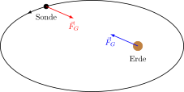](mechanics/solar-system-IS-all-forces/solar-system-IS-all-forces.svg) [[PDF]](mechanics/solar-system-IS-all-forces/solar-system-IS-all-forces.pdf) [[PNG]](mechanics/solar-system-IS-all-forces/solar-system-IS-all-forces.png) [[SVG]](mechanics/solar-system-IS-all-forces/solar-system-IS-all-forces.svg)
~~~.tex
\documentclass[crop,tikz]{standalone}

\tikzset{>=latex}
\usetikzlibrary{decorations.markings,calc}

\begin{document}
\begin{tikzpicture}[scale=2,thick]
  \pgfmathsetmacro{\ra}{2}
  \pgfmathsetmacro{\rb}{1}
  \coordinate (C) at (0,0); % center of ellipse
  \coordinate (E) at (1,0); % Earth
  \coordinate (S) at (-1,{\rb*sqrt(1 - (-1)^2/\ra^2)}); % Satellite
  % Ellipse
  \draw[decoration={markings, mark=at position 0.4 with {\arrow{>}}},
        postaction={decorate}] (C) ellipse ({\ra} and {\rb});
  % Earth
  \draw[fill,blue] (E) circle (0.1) node[below=0.3cm,black] {Erde};
  % Sattelite
  \draw[fill] (S) circle (0.05) node[below=0.2cm,black] {Sonde};
  % Gravity
  \coordinate (FS) at ($(S)!0.3!(E)$);
  \draw[->,red] (S) -- (FS) node[below] {$\vec{F}_{G}$};
  \coordinate (FE) at ($(E)!0.3!(S)$);
  \draw[->,blue] (E) -- (FE) node[below] {$\vec{F}_{G}$};
\end{tikzpicture}
\end{document}
~~~
## solar-system-IS-no-forces.svg
 [[PDF]](mechanics/solar-system-IS-no-forces/solar-system-IS-no-forces.pdf) [[PNG]](mechanics/solar-system-IS-no-forces/solar-system-IS-no-forces.png) [[SVG]](mechanics/solar-system-IS-no-forces/solar-system-IS-no-forces.svg)
~~~.tex
\documentclass[crop,tikz]{standalone}

\tikzset{>=latex}
\usetikzlibrary{decorations.markings,calc}

\begin{document}
\begin{tikzpicture}[scale=2,thick]
  \pgfmathsetmacro{\ra}{2}
  \pgfmathsetmacro{\rb}{1}
  \coordinate (C) at (0,0); % center of ellipse
  \coordinate (E) at (1,0); % Earth
  \coordinate (S) at (-1,{\rb*sqrt(1 - (-1)^2/\ra^2)}); % Satellite
  % Ellipse
  \draw[decoration={markings, mark=at position 0.4 with {\arrow{>}}},
        postaction={decorate}] (C) ellipse ({\ra} and {\rb});
  % Earth
  \draw[fill,blue] (E) circle (0.1) node[below=0.3cm,black] {Erde};
  % Sattelite
  \draw[fill] (S) circle (0.05) node[below=0.2cm,black] {Sonde};
\end{tikzpicture}
\end{document}
~~~
## solar-system-IS.svg
[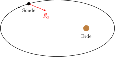](mechanics/solar-system-IS/solar-system-IS.svg) [[PDF]](mechanics/solar-system-IS/solar-system-IS.pdf) [[PNG]](mechanics/solar-system-IS/solar-system-IS.png) [[SVG]](mechanics/solar-system-IS/solar-system-IS.svg)
~~~.tex
\documentclass[crop,tikz]{standalone}

\tikzset{>=latex}
\usetikzlibrary{decorations.markings,calc}

\begin{document}
\begin{tikzpicture}[scale=2,thick]
  \pgfmathsetmacro{\ra}{2}
  \pgfmathsetmacro{\rb}{1}
  \coordinate (C) at (0,0); % center of ellipse
  \coordinate (E) at (1,0); % Earth
  \coordinate (S) at (-1,{\rb*sqrt(1 - (-1)^2/\ra^2)}); % Satellite
  % Ellipse
  \draw[decoration={markings, mark=at position 0.4 with {\arrow{>}}},
        postaction={decorate}] (C) ellipse ({\ra} and {\rb});
  % Earth
  \draw[fill,blue] (E) circle (0.1) node[below=0.3cm,black] {Erde};
  % Sattelite
  \draw[fill] (S) circle (0.05) node[below=0.2cm,black] {Sonde};
  % Gravity
  \coordinate (FG) at ($(S)!0.3!(E)$);
  \draw[->,red] (S) -- (FG) node[below] {$\vec{F}_G$};
\end{tikzpicture}
\end{document}
~~~
## space-point-2-delta.svg
 [[PDF]](mechanics/space-point-2-delta/space-point-2-delta.pdf) [[PNG]](mechanics/space-point-2-delta/space-point-2-delta.png) [[SVG]](mechanics/space-point-2-delta/space-point-2-delta.svg)
~~~.tex
\documentclass[crop,tikz]{standalone}

\tikzset{>=latex}
\usetikzlibrary{calc,decorations.markings}
\colorlet{green}{black!40!green}
\newcommand{\place}{\vec{r}}

\begin{document}
\begin{tikzpicture}[scale=1.3]
  % axes
  \draw[->,thick] (xyz cs:x=-0.5) -- (xyz cs:x=4)  node[below] {$x$};
  \draw[->,thick] (xyz cs:y=-0.5) -- (xyz cs:y=3)  node[left] {$z$};
  \draw[->,thick] (xyz cs:z=1)    -- (xyz cs:z=-4) node[above] {$y$};
  % path
  \draw[thick,
        decoration={markings, mark=at position 0.5 with {\arrow{>}}},
        postaction={decorate},
        green]
       (xyz cs:x=1,y=2.5,z=0) arc (90:0:2);
  % space point
  \coordinate (r1) at ($(1,0.5)+(70:2)$);
  \coordinate (r2) at ($(1,0.5)+(20:2)$);
  \draw[->,thick,red] (xyz cs:x=0) -- node[above,xshift=-1em]{$\place(t_1)$} (r1);
  \draw[->,thick,red] (xyz cs:x=0) -- node[below,xshift=+1em]{$\place(t_2)$} (r2);
  % delta r
  \draw[->,thick,dashed] (r1) -- node[below,anchor=east,xshift=0.5em,yshift=-1em]{$\Delta\place$} (r2);
\end{tikzpicture}
\end{document}
~~~
## space-point-2.svg
 [[PDF]](mechanics/space-point-2/space-point-2.pdf) [[PNG]](mechanics/space-point-2/space-point-2.png) [[SVG]](mechanics/space-point-2/space-point-2.svg)
~~~.tex
\documentclass[crop,tikz]{standalone}

\tikzset{>=latex}
\usetikzlibrary{calc,decorations.markings}
\colorlet{green}{black!40!green}
\newcommand{\place}{\vec{r}}

\begin{document}
\begin{tikzpicture}[scale=1.3]
  % axes
  \draw[->,thick] (xyz cs:x=-0.5) -- (xyz cs:x=4)  node[below] {$x$};
  \draw[->,thick] (xyz cs:y=-0.5) -- (xyz cs:y=3)  node[left] {$z$};
  \draw[->,thick] (xyz cs:z=1)    -- (xyz cs:z=-4) node[above] {$y$};
  % path
  \draw[thick,
        decoration={markings, mark=at position 0.5 with {\arrow{>}}},
        postaction={decorate},
        green]
       (xyz cs:x=1,y=2.5,z=0) arc (90:0:2);
  % space point
  \coordinate (r1) at ($(1,0.5)+(70:2)$);
  \coordinate (r2) at ($(1,0.5)+(20:2)$);
  \draw[->,thick,red] (xyz cs:x=0) -- node[above,xshift=-1em]{$\place(t_1)$} (r1);
  \draw[->,thick,red] (xyz cs:x=0) -- node[below,xshift=+1em]{$\place(t_2)$} (r2);
\end{tikzpicture}
\end{document}
~~~
## space-point.svg
 [[PDF]](mechanics/space-point/space-point.pdf) [[PNG]](mechanics/space-point/space-point.png) [[SVG]](mechanics/space-point/space-point.svg)
~~~.tex
\documentclass[crop,tikz]{standalone}

\tikzset{>=latex}
\newcommand{\place}{\vec{r}}
\newcommand{\ex}{\vec{e}_x}
\newcommand{\ey}{\vec{e}_y}
\newcommand{\ez}{\vec{e}_z}

\begin{document}
\begin{tikzpicture}[scale=1.3]
  % axes
  \draw[->,thick] (xyz cs:x=-0.5) -- (xyz cs:x=4)  node[below] {$x$};
  \draw[->,thick] (xyz cs:y=-0.5) -- (xyz cs:y=3)  node[left]  {$z$};
  \draw[->,thick] (xyz cs:z=1)    -- (xyz cs:z=-4) node[above] {$y$};
  % dashed lines
  \draw[dashed] (xyz cs:x=3)  -- ++(xyz cs:z=-2) -- ++(xyz cs:y=2) coordinate (p) node[above] {$P(x,y,z)$};
  \draw[dashed] (xyz cs:z=-2) -- ++(xyz cs:x=3);
  \draw[dashed] (xyz cs:x=0,y=2,z=0) -- ++(xyz cs:x=3) -- ++(xyz cs:z=-2) -- ++(xyz cs:x=-3) -- ++(xyz cs:z=2);
  \draw[dashed] (xyz cs:x=3)  -- ++(xyz cs:y=2);
  \draw[dashed] (xyz cs:z=-2) -- ++(xyz cs:y=2);
  \node[fill,circle,inner sep=1.5pt] at (p) {};
  % point
  \draw[->,very thick,red,shorten >= 0.5mm] (xyz cs:x=0) -- node[below]{$\place$} (xyz cs:x=3,y=2,z=-2);
  % unit vectors
  \draw[->,very thick,blue] (xyz cs:x=0) -- node[below]{$\ex$} (xyz cs:x=1);
  \draw[->,very thick,blue] (xyz cs:x=0) -- (xyz cs:z=-1) node[left,yshift=0.6em,xshift=0.3em]{$\ey$};
  \draw[->,very thick,blue] (xyz cs:x=0) -- node[left]{$\ez$} (xyz cs:y=1);
\end{tikzpicture}
\end{document}
~~~
## spring-2.svg
 [[PDF]](mechanics/spring-2/spring-2.pdf) [[PNG]](mechanics/spring-2/spring-2.png) [[SVG]](mechanics/spring-2/spring-2.svg)
~~~.tex
\documentclass[crop,tikz]{standalone}

\usepackage{amsmath}
\tikzset{>=latex}
\usetikzlibrary{calc,patterns,decorations.pathmorphing}

\begin{document}
\begin{tikzpicture}[scale=2]
  % wall
  \draw (-1,0.5) -- (-1,0) -- (1,0);
  \pattern[pattern=north east lines,pattern color=black] (-1.2,0.5)--++(0.2,0)--++(0,-0.5)
    --++(2,0)--++(0,-0.2)--++(-2,0)--++(-0.2,0)--cycle;
  % circle
  \coordinate (c) at (0,0.25);
  \draw[decoration={aspect=0.3, segment length=2mm, amplitude=2mm,coil},decorate] (-1,0.25) -- (c);
  \draw[red,fill] (c) circle (0.25);
  % spring force
  \draw[->,blue] ($(c)+(0,0.1)$) -- ++(0.5,0) node[above]{$\vec{F}$};
  \coordinate (o) at ($(c)+(1,0)$);
  % space vector
  \draw[->] (o) -- node[below, xshift=1em] {$\vec{r}$} (c);
  \draw ($(o)+(0,-0.1)$) -- ++(0,0.2) node[above] {$0$};
\end{tikzpicture}
\end{document}
~~~
## spring-damping-motor.svg
 [[PDF]](mechanics/spring-damping-motor/spring-damping-motor.pdf) [[PNG]](mechanics/spring-damping-motor/spring-damping-motor.png) [[SVG]](mechanics/spring-damping-motor/spring-damping-motor.svg)
~~~.tex
\documentclass[crop,tikz]{standalone}

\usepackage{amsmath}
\tikzset{>=latex}
\usetikzlibrary{patterns,decorations.pathmorphing}

\begin{document}
\begin{tikzpicture}[scale=2]
  \pgfmathsetmacro{\basinh}{0.3}
  \pgfmathsetmacro{\basinw}{0.1}
  \pgfmathsetmacro{\wall}{0.2}
  \draw[fill=cyan!20,very thick] (-1-\wall,1+\basinh) -- ++(0,-1-\wall-\basinh) -- ++(2+\wall,0) -- ++(0,1+\wall+\basinh);
  \draw[->] (-0.8,1) -- (0.8,1) node[above] {$x$};
  \draw (0,0.9) -- (0,1.1) node[above] {$0$};
  \draw (-1.2,1) -- (-1,1) -- (-1,0) -- (1,0);
  \pattern[pattern=north east lines,pattern color=black] (-1.2,1)--++(0.2,0)--++(0,-1)
  --++(2,0)--++(0,-0.2)--++(-2,0)--++(-0.2,0)--cycle;
  % motor
  \draw[fill=gray!20] (-1,0) rectangle node {M} (-0.5,0.5);
  \draw[decoration={aspect=0.3, segment length=2mm, amplitude=2mm,coil},decorate] (-0.5,0.25) -- (0.5,0.25);
  \draw[red,fill] (0.5,0.25) circle (0.25);
  \draw[->] (0.5,0.75) node[right]{$\vec{F}_\text{rück}$} -- (0,0.75);
\end{tikzpicture}
\end{document}
~~~
## spring-damping.svg
 [[PDF]](mechanics/spring-damping/spring-damping.pdf) [[PNG]](mechanics/spring-damping/spring-damping.png) [[SVG]](mechanics/spring-damping/spring-damping.svg)
~~~.tex
\documentclass[crop,tikz]{standalone}

\usepackage{amsmath}
\tikzset{>=latex}
\usetikzlibrary{patterns,decorations.pathmorphing}

\begin{document}
\begin{tikzpicture}[scale=2]
  \pgfmathsetmacro{\basinh}{0.3}
  \pgfmathsetmacro{\basinw}{0.1}
  \pgfmathsetmacro{\wall}{0.2}
  \draw[fill=cyan!20,very thick] (-1-\wall,1+\basinh) -- ++(0,-1-\wall-\basinh) -- ++(2+\wall,0) -- ++(0,1+\wall+\basinh);
  \draw[->] (-0.8,1) -- (0.8,1) node[above] {$x$};
  \draw (0,0.9) -- (0,1.1) node[above] {$0$};
  \draw (-1.2,1) -- (-1,1) -- (-1,0) -- (1,0);
  \pattern[pattern=north east lines,pattern color=black] (-1.2,1)--++(0.2,0)--++(0,-1)
  --++(2,0)--++(0,-0.2)--++(-2,0)--++(-0.2,0)--cycle;
  \draw[decoration={aspect=0.3, segment length=2mm, amplitude=2mm,coil},decorate] (-1,0.25) -- (0.5,0.25);
  \draw[red,fill] (0.5,0.25) circle (0.25);
  \draw[->] (0.5,0.75) node[right]{$\vec{F}_\text{rück}$} -- (0,0.75);
\end{tikzpicture}
\end{document}
~~~
## spring.svg
 [[PDF]](mechanics/spring/spring.pdf) [[PNG]](mechanics/spring/spring.png) [[SVG]](mechanics/spring/spring.svg)
~~~.tex
\documentclass[crop,tikz]{standalone}

\usepackage{amsmath}
\tikzset{>=latex}
\usetikzlibrary{patterns,decorations.pathmorphing}

\begin{document}
\begin{tikzpicture}[scale=2]
  \draw[->] (-0.9,1) -- (1,1) node[right] {$x$};
  \draw (0,0.9) -- (0,1.1) node[above] {$0$};
  \draw (-1,1) -- (-1,0) -- (1,0);
  \pattern[pattern=north east lines,pattern color=black] (-1.2,1)--++(0.2,0)--++(0,-1)
  --++(2,0)--++(0,-0.2)--++(-2,0)--++(-0.2,0)--cycle;
  \draw[decoration={aspect=0.3, segment length=2mm, amplitude=2mm,coil},decorate] (-1,0.25) -- (0.5,0.25);
  \draw[red,fill] (0.5,0.25) circle (0.25);
  \draw[->] (0.5,0.75) node[right]{$\vec{F}_\text{rück}$} -- (0,0.75);
\end{tikzpicture}
\end{document}
~~~
## straight-curve.svg
 [[PDF]](mechanics/straight-curve/straight-curve.pdf) [[PNG]](mechanics/straight-curve/straight-curve.png) [[SVG]](mechanics/straight-curve/straight-curve.svg)
~~~.tex
\documentclass[crop,tikz]{standalone}

\tikzset{>=latex}
\usetikzlibrary{decorations.markings}
\colorlet{green}{black!40!green}

\begin{document}
\begin{tikzpicture}[scale=1.3]
  % axes
  \draw[->,thick] (xyz cs:x=-0.5) -- (xyz cs:x=4)  node[below] {$x$};
  \draw[->,thick] (xyz cs:y=-0.5) -- (xyz cs:y=3)  node[left]  {$z$};
  \draw[->,thick] (xyz cs:z=1)    -- (xyz cs:z=-4) node[above] {$y$};
  % path
  \draw[red,very thick,
        decoration={markings, mark=at position 0.8 with {\arrow{>}}},
        postaction={decorate},
        green]
       (xyz cs:x=-1) -- (xyz cs:x=4,y=3,z=2);
\end{tikzpicture}
\end{document}
~~~
## three-body-system-external-force.svg
[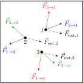](mechanics/three-body-system-external-force/three-body-system-external-force.svg) [[PDF]](mechanics/three-body-system-external-force/three-body-system-external-force.pdf) [[PNG]](mechanics/three-body-system-external-force/three-body-system-external-force.png) [[SVG]](mechanics/three-body-system-external-force/three-body-system-external-force.svg)
~~~.tex
\documentclass[crop,tikz]{standalone}

\usepackage{amsmath}
\tikzset{>=latex}
\colorlet{green}{black!40!green}
\newcommand{\F}{\vec{F}}

\begin{document}
\begin{tikzpicture}[scale=1.2]
  \draw[thick] (-2,-2) -- ++(4,0) -- ++(0,4) -- ++(-4,0) -- cycle;
  \pgfmathsetmacro{\radi}{0.06};
  \pgfmathsetmacro{\xone}{0.2};
  \pgfmathsetmacro{\yone}{0.6};
  \pgfmathsetmacro{\xtwo}{-0.8};
  \pgfmathsetmacro{\ytwo}{0.2};
  \pgfmathsetmacro{\xthr}{0};
  \pgfmathsetmacro{\ythr}{-0.5};
  % coordinates
  \coordinate (r1) at (\xone,\yone);
  \coordinate (r2) at (\xtwo,\ytwo);
  \coordinate (r3) at (\xthr,\ythr);
  % distances
  \pgfmathsetmacro{\donetwo}{(\xone-\xtwo)^2 + (\yone-\ytwo)^(3/2)};
  \pgfmathsetmacro{\donethr}{(\xone-\xthr)^2 + (\yone-\ythr)^(3/2)};
  \pgfmathsetmacro{\dtwothr}{(\xtwo-\xthr)^2 + (\ytwo-\ythr)^(3/2)};
  % 1
  \draw[fill] (r1) circle (\radi) node[left] {$1$};
  \draw[->,blue] (r1) -- ++({(\xone-\xtwo)/\donetwo}, {(\yone-\ytwo)/\donetwo}) node[right] {$\F_{2\to 1}$};
  \draw[->,red]  (r1) -- ++({(\xone-\xthr)/\donethr}, {(\yone-\ythr)/\donethr}) node[above] {$\F_{3\to 1}$};
  % 2
  \draw[fill] (r2) circle (\radi) node[below] {$2$};
  \draw[->,blue]  (r2) -- ++({(\xtwo-\xone)/\donetwo}, {(\ytwo-\yone)/\donetwo}) node[below] {$\F_{1\to 2}$};
  \draw[->,green] (r2) -- ++({(\xtwo-\xthr)/\dtwothr}, {(\ytwo-\ythr)/\dtwothr}) node[above] {$\F_{3\to 2}$};
  % 3
  \draw[fill] (r3) circle (\radi) node[left] {$3$};
  \draw[->,red]   (r3) -- ++({(\xthr-\xone)/\donethr}, {(\ythr-\yone)/\donethr}) node[below] {$\F_{1\to 3}$};
  \draw[->,green] (r3) -- ++({(\xthr-\xtwo)/\dtwothr}, {(\ythr-\ytwo)/\dtwothr}) node[right] {$\F_{2\to 3}$};
  % external forces
  \pgfmathsetmacro{\Fextx}{0.8};
  \pgfmathsetmacro{\Fexty}{-0.2};
  \draw[->,dashed] (r1) -- ++(\Fextx, \Fexty) node[right] {$\F_{\text{ext},1}$};
  \draw[->,dashed] (r2) -- ++(\Fextx, \Fexty) node[right] {$\F_{\text{ext},2}$};
  \draw[->,dashed] (r3) -- ++(\Fextx, \Fexty) node[right] {$\F_{\text{ext},3}$};
\end{tikzpicture}
\end{document}
~~~
## three-body-system.svg
 [[PDF]](mechanics/three-body-system/three-body-system.pdf) [[PNG]](mechanics/three-body-system/three-body-system.png) [[SVG]](mechanics/three-body-system/three-body-system.svg)
~~~.tex
\documentclass[crop,tikz]{standalone}

\tikzset{>=latex}
\colorlet{green}{black!40!green}
\newcommand{\F}{\vec{F}}

\begin{document}
\begin{tikzpicture}[scale=1.2]
  \draw[thick] (-2,-2) -- ++(4,0) -- ++(0,4) -- ++(-4,0) -- cycle;
  \pgfmathsetmacro{\radi}{0.06};
  \pgfmathsetmacro{\xone}{0.4};
  \pgfmathsetmacro{\yone}{0.6};
  \pgfmathsetmacro{\xtwo}{-0.8};
  \pgfmathsetmacro{\ytwo}{0.2};
  \pgfmathsetmacro{\xthr}{0.2};
  \pgfmathsetmacro{\ythr}{-0.5};
  % coordinates
  \coordinate (r1) at (\xone,\yone);
  \coordinate (r2) at (\xtwo,\ytwo);
  \coordinate (r3) at (\xthr,\ythr);
  % distances
  \pgfmathsetmacro{\donetwo}{(\xone-\xtwo)^2 + (\yone-\ytwo)^(3/2)};
  \pgfmathsetmacro{\donethr}{(\xone-\xthr)^2 + (\yone-\ythr)^(3/2)};
  \pgfmathsetmacro{\dtwothr}{(\xtwo-\xthr)^2 + (\ytwo-\ythr)^(3/2)};
  % 1
  \draw[fill] (r1) circle (\radi) node[below] {$1$};
  \draw[->,blue] (r1) -- ++({(\xone-\xtwo)/\donetwo}, {(\yone-\ytwo)/\donetwo}) node[right] {$\F_{2\to 1}$};
  \draw[->,red]  (r1) -- ++({(\xone-\xthr)/\donethr}, {(\yone-\ythr)/\donethr}) node[above] {$\F_{3\to 1}$};
  % 2
  \draw[fill] (r2) circle (\radi) node[right] {$2$};
  \draw[->,blue]  (r2) -- ++({(\xtwo-\xone)/\donetwo}, {(\ytwo-\yone)/\donetwo}) node[below] {$\F_{1\to 2}$};
  \draw[->,green] (r2) -- ++({(\xtwo-\xthr)/\dtwothr}, {(\ytwo-\ythr)/\dtwothr}) node[above] {$\F_{3\to 2}$};
  % 3
  \draw[fill] (r3) circle (\radi) node[above] {$3$};
  \draw[->,red]   (r3) -- ++({(\xthr-\xone)/\donethr}, {(\ythr-\yone)/\donethr}) node[below] {$\F_{1\to 3}$};
  \draw[->,green] (r3) -- ++({(\xthr-\xtwo)/\dtwothr}, {(\ythr-\ytwo)/\dtwothr}) node[right] {$\F_{2\to 3}$};
\end{tikzpicture}
\end{document}
~~~
## velocity-2-delta.svg
 [[PDF]](mechanics/velocity-2-delta/velocity-2-delta.pdf) [[PNG]](mechanics/velocity-2-delta/velocity-2-delta.png) [[SVG]](mechanics/velocity-2-delta/velocity-2-delta.svg)
~~~.tex
\documentclass[crop,tikz]{standalone}

\tikzset{>=latex}
\usetikzlibrary{calc,decorations.markings}
\colorlet{green}{black!40!green}
\definecolor{orange}{RGB}{250,194,25}
\newcommand{\place}{\vec{r}}
\newcommand{\velocity}{\vec{v}}

\begin{document}
\begin{tikzpicture}[scale=1.3]
  % axes
  \draw[->,thick] (xyz cs:x=-0.5) -- (xyz cs:x=4)  node[below] {$x$};
  \draw[->,thick] (xyz cs:y=-0.5) -- (xyz cs:y=3)  node[left] {$z$};
  \draw[->,thick] (xyz cs:z=1)    -- (xyz cs:z=-4);
  % path
  \draw[thick,
        decoration={markings, mark=at position 0.5 with {\arrow{>}}},
        postaction={decorate},
        green!20!white]
       (xyz cs:x=1,y=2.5,z=0) arc (90:0:2);
  % space point
  \coordinate (r1) at ($(1,0.5)+(70:2)$);
  \coordinate (r2) at ($(1,0.5)+(20:2)$);
  % velocities
  \draw[->,thick,blue] (r1) -- node[above,xshift=0.5em]{$\velocity(t_1)$} ++(-20:1.5) coordinate (v1);
  \draw[->,thick,blue] (r1) -- node[left]{$\velocity(t_2)$} ++(-70:0.8) coordinate (v2);
  % delta
  \draw[->,thick,orange] (v1) -- node[below, xshift=-0.5em]{$\Delta\velocity$} (v2);
\end{tikzpicture}
\end{document}
~~~
## velocity-2.svg
 [[PDF]](mechanics/velocity-2/velocity-2.pdf) [[PNG]](mechanics/velocity-2/velocity-2.png) [[SVG]](mechanics/velocity-2/velocity-2.svg)
~~~.tex
\documentclass[crop,tikz]{standalone}

\tikzset{>=latex}
\usetikzlibrary{calc,decorations.markings}
\colorlet{green}{black!40!green}
\newcommand{\place}{\vec{r}}
\newcommand{\velocity}{\vec{v}}

\begin{document}
\begin{tikzpicture}[scale=1.3]
  % axes
  \draw[->,thick] (xyz cs:x=-0.5) -- (xyz cs:x=4)  node[below] {$x$};
  \draw[->,thick] (xyz cs:y=-0.5) -- (xyz cs:y=3)  node[left] {$z$};
  \draw[->,thick] (xyz cs:z=1)    -- (xyz cs:z=-4) node[above] {$y$};
  % path
  \draw[thick,
        decoration={markings, mark=at position 0.5 with {\arrow{>}}},
        postaction={decorate},
        green]
       (xyz cs:x=1,y=2.5,z=0) arc (90:0:2);
  % space point
  \coordinate (r1) at ($(1,0.5)+(70:2)$);
  \coordinate (r2) at ($(1,0.5)+(20:2)$);
  \draw[->,thick,red] (xyz cs:x=0) -- node[above,xshift=-1em]{$\place(t_1)$} (r1);
  \draw[->,thick,red] (xyz cs:x=0) -- node[below,xshift=+1em]{$\place(t_2)$} (r2);
  % velocities
  \draw[->,thick,blue] (r1) -- node[above,xshift=0.5em]{$\velocity(t_1)$} ++(-20:1.5);
  \draw[->,thick,blue] (r2) -- node[right]{$\velocity(t_2)$} ++(-70:0.8);
\end{tikzpicture}
\end{document}
~~~
## velocity-average.svg
 [[PDF]](mechanics/velocity-average/velocity-average.pdf) [[PNG]](mechanics/velocity-average/velocity-average.png) [[SVG]](mechanics/velocity-average/velocity-average.svg)
~~~.tex
\documentclass[crop,tikz]{standalone}

\tikzset{>=latex}
\usetikzlibrary{calc}
\colorlet{green}{black!40!green}
\newcommand{\place}{\vec{r}}
\newcommand{\velocity}{\vec{v}}

\begin{document}
\begin{tikzpicture}[scale=1.3]
  % axes
  \draw[->,thick] (xyz cs:x=-0.5) -- (xyz cs:x=4)  node[below] {$x$};
  \draw[->,thick] (xyz cs:y=-0.5) -- (xyz cs:y=3)  node[left] {$z$};
  \draw[->,thick] (xyz cs:z=1)    -- (xyz cs:z=-4) node[above] {$y$};
  % space point
  \coordinate (r1) at ($(1,0.5)+(70:2)$);
  \coordinate (r2) at ($(1,0.5)+(20:2)$);
  % path
  \draw[thick,green] (r1) arc (70:20:2);
  \node[right,xshift=0.5em,green] at ($(1,0.5)+(50:2)$) {$s(t_1,t_2)$};
  % space-point vectors
  \draw[->,thick,red] (xyz cs:x=0) -- node[above,xshift=-1em]{$\place(t_1)$} (r1);
  \draw[->,thick,red] (xyz cs:x=0) -- node[below,xshift=+1em]{$\place(t_2)$} (r2);
  % delta r
  \draw[->,thick,blue] (r1) -- (r2) node[right,yshift=1em]{$\langle\velocity\rangle\cdot(t_2-t_1)$};
\end{tikzpicture}
\end{document}
~~~
## velocity-drdt.svg
 [[PDF]](mechanics/velocity-drdt/velocity-drdt.pdf) [[PNG]](mechanics/velocity-drdt/velocity-drdt.png) [[SVG]](mechanics/velocity-drdt/velocity-drdt.svg)
~~~.tex
\documentclass[crop,tikz]{standalone}

\tikzset{>=latex}
\usetikzlibrary{calc,decorations.markings}
\colorlet{green}{black!40!green}
\newcommand{\place}{\vec{r}}

\begin{document}
\begin{tikzpicture}[scale=1.3]
  % axes
  \draw[->,thick] (xyz cs:x=-0.5) -- (xyz cs:x=4)  node[below] {$x$};
  \draw[->,thick] (xyz cs:y=-0.5) -- (xyz cs:y=3)  node[left] {$z$};
  \draw[->,thick] (xyz cs:z=1)    -- (xyz cs:z=-4) node[above] {$y$};
  % path
  \draw[thick,
        decoration={markings, mark=at position 0.5 with {\arrow{>}}},
        postaction={decorate},
        green]
       (xyz cs:x=1,y=2.5,z=0) arc (90:0:2);
  % space point
  \coordinate (r1) at ($(1,0.5)+(70:2)$);
  \draw[->,thick,red]  (xyz cs:x=0) -- node[above,xshift=-1em]{$\place(t)$} (r1);
  % velocity
  \draw[->,thick,blue] (r1) -- node[above,xshift=0.5em]{$\displaystyle\frac{\Delta\place}{\Delta t}$} ++(-20:1.5);
\end{tikzpicture}
\end{document}
~~~
## velocity.svg
 [[PDF]](mechanics/velocity/velocity.pdf) [[PNG]](mechanics/velocity/velocity.png) [[SVG]](mechanics/velocity/velocity.svg)
~~~.tex
\documentclass[crop,tikz]{standalone}

\tikzset{>=latex}
\usetikzlibrary{calc,decorations.markings}
\colorlet{green}{black!40!green}
\newcommand{\place}{\vec{r}}
\newcommand{\velocity}{\vec{v}}

\begin{document}
\begin{tikzpicture}[scale=1.3]
  % axes
  \draw[->,thick] (xyz cs:x=-0.5) -- (xyz cs:x=4)  node[below] {$x$};
  \draw[->,thick] (xyz cs:y=-0.5) -- (xyz cs:y=3)  node[left] {$z$};
  \draw[->,thick] (xyz cs:z=1)    -- (xyz cs:z=-4) node[above] {$y$};
  % path
  \draw[thick,
        decoration={markings, mark=at position 0.5 with {\arrow{>}}},
        postaction={decorate},
        green]
       (xyz cs:x=1,y=2.5,z=0) arc (90:0:2);
  % space point
  \coordinate (r1) at ($(1,0.5)+(70:2)$);
  \draw[->,thick,red]  (xyz cs:x=0) -- node[above,xshift=-1em]{$\place(t)$} (r1);
  % velocity
  \draw[->,thick,blue] (r1) -- node[above,xshift=0.5em]{$\velocity(t)$} ++(-20:1.5);
\end{tikzpicture}
\end{document}
~~~
## wagon.svg
 [[PDF]](mechanics/wagon/wagon.pdf) [[PNG]](mechanics/wagon/wagon.png) [[SVG]](mechanics/wagon/wagon.svg)
~~~.tex
\documentclass[crop,tikz]{standalone}

\usepackage{amsmath}
\tikzset{>=latex}
\colorlet{gray}{gray!60}
\usetikzlibrary{calc,patterns}
\newcommand{\F}{\vec{F}}
\newcommand{\ort}{\vec{r}}
\newcommand{\vs}{\vec{s}}

\begin{document}
\begin{tikzpicture}[scale=1.5]
  \pgfmathsetmacro{\angl}{30}
  \pgfmathsetmacro{\wheel}{0.2}
  \pattern[pattern=north east lines] (-1,0)--++(0,-0.2)--++(4,0)--++(0,0.2)--cycle;
  \draw (-1,0) -- ++(4,0);
  \draw[fill=gray] (0.5,\wheel) circle (\wheel);
  \draw[fill=gray] (1.5,\wheel) circle (\wheel);
  \draw[fill=gray] (0,2*\wheel) rectangle (2,1+2*\wheel);
  \coordinate (C) at (1,2*\wheel+0.5);
  \coordinate (Z) at (3,2*\wheel+0.5);
  \draw[->,blue] (C) -- ++(\angl:1.5) node[right] {$\F$};
  \draw[->,red]  (C) -- (Z) node[below] {$\vs$};
  \draw (C)+(0:0.7) arc (0:\angl:0.7);
  \node at ($(C)+({\angl/2}:0.55)$) {$\vartheta$};
  \draw[<->] (1,-0.4) -- node[below] {$\ell$} +(2,0);
  \coordinate (O) at (2.5,3);
  \node[above] at (O) {$O$};
  \draw[->] (O) -- node[left] {$\ort_1$} (C);
  \draw[->] (O) -- node[right] {$\ort_2$} (Z);
\end{tikzpicture}
\end{document}
~~~
## wave-packets.svg
 [[PDF]](mechanics/wave-packets/wave-packets.pdf) [[PNG]](mechanics/wave-packets/wave-packets.png) [[SVG]](mechanics/wave-packets/wave-packets.svg)
~~~.tex
\documentclass[crop,tikz]{standalone}

\usepackage{pgfplots}
\tikzset{>=latex}
\colorlet{green}{black!40!green}

\pgfplotsset{
  inverted/.style = {
    every axis legend/.append style={
      draw=white,
      fill=hardblack,
      text=white
    }
  }
}

\newcommand{\axisstyle}{%
  thick,
  width=8cm,
  height=2.5cm,
  domain=0:10,
  samples=50,
  axis y line=middle,
  axis x line=middle,
  axis line style={draw=none},
  xlabel style={right},
  ylabel style={left},
  xmin=0, xmax=10,
  xticklabels={\empty},
  yticklabels={\empty},
  tick style={draw=none},
  samples=100,
  clip=false,%
}

\newcommand{\yshift}{-1.5cm}
\newcommand{\toz}{-2} % initical position of red wave packet
\newcommand{\ttz}{-8} % initical position of blue wave packet
\newcommand{\dt}{-2}  % time duration

\begin{document}
\begin{tikzpicture}
\begin{axis}[
  \axisstyle
  ]
  \addplot[black,smooth] { exp(-(x+\toz)^2) + exp(-(x+\ttz)^2) };
  \addplot[red  ,smooth, densely dashed] { exp(-(x+\toz)^2) };
  \addplot[blue ,smooth, densely dashed] { exp(-(x+\ttz)^2) };
  \node at (axis cs: 0,1) {$t$};
  \draw[red ,->] (axis cs: 2,1.1) -- (axis cs: 3,1.1);
  \draw[blue,->] (axis cs: 8,1.1) -- (axis cs: 7,1.1);
\end{axis}
%
\begin{axis}[
  \axisstyle
  at={(0,\yshift)},
  ]
  \addplot[black,smooth] { exp(-(x+\toz+\dt)^2) + exp(-(x+\ttz-\dt)^2) };
  \addplot[red ,smooth, densely dashed] { exp(-(x+\toz+\dt)^2) };
  \addplot[blue,smooth, densely dashed] { exp(-(x+\ttz-\dt)^2) };
  \node at (axis cs: 0,1) {$2t$};
  \draw[red ,->] (axis cs: 4,1.1) -- (axis cs: 5,1.1);
  \draw[blue,->] (axis cs: 6,1.1) -- (axis cs: 5,1.1);
\end{axis}
%
\begin{axis}[
  \axisstyle
  at={(0,2*\yshift)},
  ]
  \addplot[black,smooth] { exp(-(x+\toz+2*\dt)^2) + exp(-(x+\ttz-2*\dt)^2) };
  \addplot[red ,smooth, densely dashed] { exp(-(x+\toz+2*\dt)^2) };
  \addplot[blue,smooth, densely dashed] { exp(-(x+\ttz-2*\dt)^2) };
  \node at (axis cs: 0,1) {$3t$};
  \draw[red ,->] (axis cs: 6,1.1) -- (axis cs: 7,1.1);
  \draw[blue,->] (axis cs: 4,1.1) -- (axis cs: 3,1.1);
\end{axis}
%
\begin{axis}[
  \axisstyle
  at={(0,3*\yshift)},
  ]
  \addplot[black,smooth] { exp(-(x+\toz+3*\dt)^2) + exp(-(x+\ttz-3*\dt)^2) };
  \addplot[red ,smooth, densely dashed] { exp(-(x+\toz+3*\dt)^2) };
  \addplot[blue,smooth, densely dashed] { exp(-(x+\ttz-3*\dt)^2) };
  \node at (axis cs: 0,1) {$4t$};
  \draw[red ,->] (axis cs: 8,1.1) -- (axis cs: 9,1.1);
  \draw[blue,->] (axis cs: 2,1.1) -- (axis cs: 1,1.1);
\end{axis}
\end{tikzpicture}
\end{document}
~~~
## wave.svg
 [[PDF]](mechanics/wave/wave.pdf) [[PNG]](mechanics/wave/wave.png) [[SVG]](mechanics/wave/wave.svg)
~~~.tex
\documentclass[crop,tikz]{standalone}

\usepackage{pgfplots}
\tikzset{>=latex}

\pgfplotsset{
  compat=1.16,
  every non boxed x axis/.append style={
    axis line style={-latex}
  },
  every non boxed y axis/.append style={
    axis line style={-latex}
  },
  inverted/.style = {
    every axis legend/.append style={
      draw=white,
      fill=hardblack,
      text=white
    }
  }
}

\begin{document}
  \begin{tikzpicture}
    \begin{axis}[
      thick,
      width=10cm,
      height=5cm,
      domain=0:{4*pi},
      samples=50,
      axis y line=middle,
      axis x line=middle,
      xmax={4.2*pi},
      ymax=1.2,
      xlabel={$x$},
      ylabel={$y$},
      xlabel style={right},
      ylabel style={left},
      ticks=none,
      legend cell align={left},
      legend style={at={(0.8,1)},anchor=north west},
      clip=false,
      ]
      \addplot[red,mark=*,smooth] {sin(deg(x))};
      \addplot[blue,mark=*,smooth,densely dashed] {sin(deg(x - pi/4))};
      \legend{$t=t_1$, $t=t_2$};
      \draw[thick,->] (axis cs:1.5*pi,-1.1) -- node[below,yshift=-0.2cm] {\small $c(t_2-t_1)$} (axis cs:7*pi/4,-1.1);
      \draw[] (axis cs:1.5*pi,-1) -- (axis cs:1.5*pi,-1.2);
      \draw[] (axis cs:7*pi/4,-1) -- (axis cs:7*pi/4,-1.2);
      \draw[thick,->] (axis cs:pi/2,1.1) -- node[above] {\small $\lambda$} (axis cs:2.5*pi,1.1);
      \draw[] (axis cs:pi/2,1) -- (axis cs:pi/2,1.2);
      \draw[] (axis cs:2.5*pi,1) -- (axis cs:2.5*pi,1.2);
    \end{axis}
  \end{tikzpicture}
\end{document}
~~~
## work-hub.svg
 [[PDF]](mechanics/work-hub/work-hub.pdf) [[PNG]](mechanics/work-hub/work-hub.png) [[SVG]](mechanics/work-hub/work-hub.svg)
~~~.tex
\documentclass[crop,tikz]{standalone}

\usepackage{amsmath}
\tikzset{>=latex}
\usetikzlibrary{calc,patterns}
\colorlet{green}{black!40!green}
\newcommand{\Fg}{\vec{F}_g}
\newcommand{\vs}{\vec{s}}

\begin{document}
\begin{tikzpicture}[scale=1.5]
  \draw[->] (1,0) -- (1,2) node[left] {$z$};
  \draw[] (0.95,1) node[left] {$h$} -- +(0.1,0);
  \coordinate (K) at (1.4,0.1);
  \draw[fill=gray!20] ($(K)+(-0.2,-0.1)$) rectangle ($(K)+(+0.2,0.1)$) node[above right] {$m$};
  \draw[red,->] (K) -- +(0,0.9) node[right] {$\vs$};
  \draw[blue,->] (K) -- +(0,-1) node[right] {$\Fg$};
  \draw (0,0) -- (2,0);
  \pattern[pattern=north east lines] (0,0)--(2,0)--(2,-0.2)--(0,-0.2)--cycle;
\end{tikzpicture}
\end{document}
~~~
## work.svg
 [[PDF]](mechanics/work/work.pdf) [[PNG]](mechanics/work/work.png) [[SVG]](mechanics/work/work.svg)
~~~.tex
\documentclass[crop,tikz]{standalone}

\usepackage{amsmath}
\tikzset{>=latex}
\colorlet{green}{black!40!green}
\newcommand{\F}{\vec{F}}
\newcommand{\ort}{\vec{r}}
\newcommand{\vs}{\vec{s}}
\newcommand{\dvr}{\text{d}\ort}

\begin{document}
\begin{tikzpicture}
  \coordinate (a) at (230:4);
  \coordinate (c) at (260:4);
  \coordinate (o) at (260:8);
  \draw (a) arc (230:290:4) coordinate (e);
  \draw[fill] (a) circle (0.05);
  \draw[fill] (e) circle (0.05);
  \draw[fill] (c) circle (0.05);
  \draw[fill] (o) circle (0.05) node[below] {$O$};
  \draw[->,shorten >= 1mm] (o) -- node[left]  {$\ort_1$} (a);
  \draw[->,shorten >= 1mm] (o) -- node[right] {$\ort(t)$} (c);
  \draw[->,shorten >= 1mm] (o) -- node[right] {$\ort_2$} (e);
  \draw[->,blue,very thick]  (c) -- node[above] {$\F$} +(30:2);
  \draw[->,green,very thick] (c) -- node[below right] {$\F_s$} +(350:1.5);
  \draw[->,red ,very thick]  (c) -- node[below] {$\dvr$} +(350:0.7);
  \draw[->,red,densely dashed,thick,shorten <= 1mm,shorten >= 1mm] (a) -- (e);
  \node[red,above,xshift=1em] at (a) {$\vs$};
\end{tikzpicture}
\end{document}
~~~
## zentrifugal.svg
 [[PDF]](mechanics/zentrifugal/zentrifugal.pdf) [[PNG]](mechanics/zentrifugal/zentrifugal.png) [[SVG]](mechanics/zentrifugal/zentrifugal.svg)
~~~.tex
\documentclass[crop,tikz]{standalone}

\usepackage{amsmath}
\usetikzlibrary{decorations.markings}
\tikzset{>=latex}
\colorlet{green}{black!40!green}
\newcommand{\FZf}{\vec{F}_\text{Zf}}
\newcommand{\FZp}{\vec{F}_\text{Zp}}

\begin{document}
\begin{tikzpicture}[scale=2]
  \draw[->,thick] (-1.2,0) -- (1.2,0) node[below] {$x$};
  \draw[->,thick] (0,-1.2) -- (0,1.2) node[left] {$y$};
  \draw[->,red,thick] (0,0) -- (45:0.4) node[right] {$x'$};
  \draw[->,red,thick] (0,0) -- (90+45:0.4) node[left] {$y'$};
  \draw[
    decoration={markings, mark=at position 0.4 with {\arrow{>}}},
    postaction={decorate},
    green,
    thick
  ] (0,0) circle (1);
  \draw[fill] (45:1) circle (0.03);
  \draw[->,red,thick]  (45:1) -- +(45:0.4) node[above]{$\FZf(t)$};
  \draw[->,blue,thick] (45:1) -- node[left,xshift=0.2em,yshift=0.5em]{$\FZp(t)$} +(-135:0.4);
  \node at (1.2,0.2) {$\Sigma$};
  \node at (110:0.5) {\textcolor{red}{$\Sigma'$}};
\end{tikzpicture}
\end{document}
~~~
## zentripetal.svg
 [[PDF]](mechanics/zentripetal/zentripetal.pdf) [[PNG]](mechanics/zentripetal/zentripetal.png) [[SVG]](mechanics/zentripetal/zentripetal.svg)
~~~.tex
\documentclass[crop,tikz]{standalone}

\usepackage{amsmath}
\usetikzlibrary{decorations.markings}
\tikzset{>=latex}
\colorlet{green}{black!40!green}
\newcommand{\vel}{\vec{v}}
\newcommand{\FZp}{\vec{F}_\text{Zp}}

\begin{document}
\begin{tikzpicture}[scale=2]
  \draw[->,thick] (-1.2,0) -- (1.2,0) node[below] {$x$};
  \draw[->,thick] (0,-1.2) -- (0,1.2) node[left] {$y$};
  \draw[
    decoration={markings, mark=at position 0.4 with {\arrow{>}}},
    postaction={decorate},
    green,
    thick
  ] (0,0) circle (1);
  \draw[fill] (45:1) circle (0.03);
  \draw[->,blue,thick] (45:1) -- +(+135:0.5) node[above]{$\vel(t)$};
  \draw[->,red,thick]   (45:1) -- +(-135:0.5) node[below]{$\FZp(t)$};
\end{tikzpicture}
\end{document}
~~~
## actio-reactio_inverted.svg
 [[PDF]](mechanics/actio-reactio/actio-reactio_inverted.pdf) [[PNG]](mechanics/actio-reactio/actio-reactio_inverted.png) [[SVG]](mechanics/actio-reactio/actio-reactio_inverted.svg)
~~~.tex
\documentclass[crop,tikz]{standalone}
\usetikzlibrary{backgrounds}
\colorlet{blue}{cyan}
\tikzset{
  inverted/.style = {
    color=white,
    background rectangle/.style={fill},
    show background rectangle
  }
}

\usepackage{amsmath}
\tikzset{>=latex}

\begin{document}
\begin{tikzpicture}[inverted,inverted]
  \draw[gray!50,fill] (-2.5,0) circle (1)   coordinate (c1);
  \draw[gray!50,fill] (+2.5,0) circle (0.5) coordinate (c2);
  \node[blue,yshift=1.2cm] at (c1) {1};
  \node[red, yshift=0.7cm] at (c2) {2};
  \draw[->,blue] (c1) -- ++(+1.5,0) node[below] {$\vec{F}_{2\to 1}$};
  \draw[->,red]  (c2) -- ++(-1.5,0) node[below] {$\vec{F}_{1\to 2}$};
\end{tikzpicture}
\end{document}
~~~
## balance_inverted.svg
 [[PDF]](mechanics/balance/balance_inverted.pdf) [[PNG]](mechanics/balance/balance_inverted.png) [[SVG]](mechanics/balance/balance_inverted.svg)
~~~.tex
\documentclass[crop,tikz]{standalone}
\usetikzlibrary{backgrounds}
\colorlet{blue}{cyan}
\tikzset{
  inverted/.style = {
    color=white,
    background rectangle/.style={fill},
    show background rectangle
  }
}

\tikzset{>=latex}
%\usetikzlibrary{calc,decorations.markings,shapes}
\colorlet{gray}{gray!60}
\colorlet{green}{green}

\begin{document}
\begin{tikzpicture}[inverted,inverted]
  \draw[fill=gray] (-2,0) rectangle (4,0.2);
  \draw[fill=gray] (-0.1,-0.5) -- (0,0) -- (0.1,-0.5) -- cycle;
  \draw[fill=white] (-2,0.6) circle (0.4);
  \draw[fill=white] ( 4,0.4) circle (0.2);
  \draw[->,red] (0,-0.1) -- node[below]{$\vec{r}_1$} +(-2,0);
  \draw[->,red] (0,-0.1) -- node[below]{$\vec{r}_2$} +( 4,0);
  \draw[->,blue] (-2,-0.1) -- +(0,-2) node[left]{$\vec{F}_{1}$};
  \draw[->,blue] ( 4,-0.1) -- +(0,-1) node[right]{$\vec{F}_{2}$};
  \draw[->] (0,0.3) -- +(1,0) node[above] {$x$};
  \draw[->] (0,0.3) -- +(0,1) node[right] {$y$};
\end{tikzpicture}
\end{document}
~~~
## bicycle_inverted.svg
 [[PDF]](mechanics/bicycle/bicycle_inverted.pdf) [[PNG]](mechanics/bicycle/bicycle_inverted.png) [[SVG]](mechanics/bicycle/bicycle_inverted.svg)
~~~.tex
\documentclass[crop,tikz]{standalone}
\usetikzlibrary{backgrounds}
\colorlet{blue}{cyan}
\tikzset{
  inverted/.style = {
    color=white,
    background rectangle/.style={fill},
    show background rectangle
  }
}

\tikzset{>=latex}
\colorlet{blue}{blue!70!green}

\begin{document}
\begin{tikzpicture}[inverted,inverted]
  \def\WheelRadiusInner{1.5cm}
  \def\WheelRadiusOuter{\WheelRadiusInner+0.15cm}
  \def\PetalRadius{0.4cm}
  % wheel 1
  \coordinate (wheel1) at (0,0);
  \foreach \a in {0,5,...,355} {
    \draw[gray] (wheel1) -- (\a:\WheelRadiusInner);
  }
  \draw[line width=4pt] (wheel1) circle (\WheelRadiusOuter); % outer
  \draw (wheel1) circle (\WheelRadiusInner); % inner
  \draw[fill=gray,line width=1pt] (wheel1) circle (0.2cm); % inner
  \fill (wheel1) circle (2pt); % inner
  % wheel 2
  \coordinate (wheel2) at (6,0);
  \foreach \a in {0,5,...,355} {  
    \draw[gray] (wheel2) -- ++(\a:\WheelRadiusInner);
  }
  \draw[line width=4pt] (wheel2) circle (\WheelRadiusOuter); % outer
  \draw (wheel2) circle (\WheelRadiusInner); % inner
  \fill (wheel2) circle (2pt); % inner
  % chain
  \coordinate (petal) at (2.2,0);
  \draw[line width=1pt] (0,0.2cm)--(2.2,\PetalRadius) (0,-0.2cm)--(2.2,-\PetalRadius);
  % petal 1
  \draw[line width=2pt] (petal)--(2.6,-0.6) (petal)--(1.8,0.6);
  \draw[line width=4pt] (1.68,0.6)--(1.94,0.54);
  % handlebars
  \draw[blue,line width=1mm,rounded corners=8pt,rotate around={25:(wheel2)}] (wheel2)--(6,1.3cm)--++(80:2.1cm);
  \draw[blue,line width=1mm,rounded corners=8pt,rotate around={27:(wheel2)}] (wheel2)--(6,1.3cm)--++(80:2.1cm);
  \draw[blue,line width=1mm,rounded corners=8pt,rotate around={26:(wheel2)}] (wheel2)--(6,1.3cm)--++(80:2.1cm) coordinate (a);
  \draw[blue,line width=1.5mm] (a)--++(-80:0.15cm)--++(0:\PetalRadius)--++(180:0.05cm) coordinate (b);
  \draw[blue,line width=1.5mm] (b) -- ++(-30:0.5cm) coordinate (a);
  \draw[line width=1.5mm] (a) -- ++(-30:0.5cm);
  \draw[blue,line width=1.5mm] (b) -- ++(150:0.5cm) coordinate (a);
  \draw[line width=1.5mm] (a) -- ++(150:0.5cm);
  % chassis
  \draw[blue,line width=2mm,rotate around={35:(petal)}] (petal)--++(3.7,0)--++(75:0.4cm)--++(155:3.5)coordinate(e)--(petal);
  \draw[blue,line width=1mm] (0,0)--(petal) (0,0)--(45:2.5cm) (0,0)--(46.5:2.5) (0,0)--(2:2.2);
  \draw[blue,line width=1.2mm] (e)--++(106:0.9cm)--++(-74:0.1cm)coordinate(d);
  % chain--petal connection
  \draw[fill=gray,line width=2pt] (petal) circle (\PetalRadius);
  % petal 2
  \fill (petal) circle (0.1cm);
  \draw[line width=4pt] (2.4,-0.58)--(2.68,-0.56);
  \draw[line width=2pt] (petal)--(2.6,-0.6);
  % saddle
  \fill[white,rounded corners=2pt] (d)--++(10:0.8cm)--++(90:1mm)--++(180:0.8cm)--++(170:0.7cm)--++(-70:0.5cm)--cycle;
  % dirt
  \foreach \a in {240,220,200} {
    \draw[->,brown,line width=2pt] (wheel1)++(\a:\WheelRadiusOuter) -- ++(\a-90:2cm);
  }
\end{tikzpicture}
\end{document}
~~~
## body-inclined-plane_inverted.svg
 [[PDF]](mechanics/body-inclined-plane/body-inclined-plane_inverted.pdf) [[PNG]](mechanics/body-inclined-plane/body-inclined-plane_inverted.png) [[SVG]](mechanics/body-inclined-plane/body-inclined-plane_inverted.svg)
~~~.tex
\documentclass[crop,tikz]{standalone}
\usetikzlibrary{backgrounds}
\colorlet{blue}{cyan}
\tikzset{
  inverted/.style = {
    color=white,
    background rectangle/.style={fill},
    show background rectangle
  }
}

\tikzset{>=latex}
\usetikzlibrary{calc}
\colorlet{gray}{gray!60}

\begin{document}
\begin{tikzpicture}[inverted,scale=2]
  \pgfmathsetmacro{\al}{atan(0.5)} % angle
  \pgfmathsetmacro{\radius}{0.3};  % radius
  % inclined plane
  \draw[fill=gray] (0,0) -- (2,0) -- (2,{2*tan(\al)}) -- cycle;
  % rotating body
  \coordinate (body) at ($(1,{tan(\al)})+(90+\al:\radius)$);
  \draw[fill=brown!30] (body) circle (\radius);
  % arrows
  \draw[->,red,thick] (body) -- ++(180+\al:0.7) node[left] {$\vec{v}_S$};
  \coordinate (cube) at ($(body)+(\al:0.7*\radius)$);
  \draw[->,blue,thick] (cube) arc (\al:180:0.7*\radius);
  \node[below,blue] at ($(body)+(\al:0.6*\radius)$) {$\vec{\omega}$};
  % cube
  \pgfmathsetmacro{\cubex}{0.05}
  \pgfmathsetmacro{\cubey}{0.05}
  \pgfmathsetmacro{\cubez}{0.05}
  \draw[fill=blue!50] (cube) -- ++(-\cubex,0,0) -- ++(0,-\cubey,0) -- ++(\cubex,0,0) -- cycle;
  \draw[fill=blue!70] (cube) -- ++(0,0,-\cubez) -- ++(0,-\cubey,0) -- ++(0,0,\cubez) -- cycle
                      (cube) -- ++(-\cubex,0,0) -- ++(0,0,-\cubez) -- ++(\cubex,0,0) -- cycle;
\end{tikzpicture}%
\end{document}
~~~
## car-forces-initial-frame_inverted.svg
 [[PDF]](mechanics/car-forces-initial-frame/car-forces-initial-frame_inverted.pdf) [[PNG]](mechanics/car-forces-initial-frame/car-forces-initial-frame_inverted.png) [[SVG]](mechanics/car-forces-initial-frame/car-forces-initial-frame_inverted.svg)
~~~.tex
\documentclass[crop,tikz]{standalone}
\usetikzlibrary{backgrounds}
\colorlet{blue}{cyan}
\tikzset{
  inverted/.style = {
    color=white,
    background rectangle/.style={fill},
    show background rectangle
  }
}

\usepackage{amsmath,marvosym}
\tikzset{>=latex}
\usetikzlibrary{decorations.markings,positioning,arrows}
\colorlet{green}{green}

\begin{document}
\begin{tikzpicture}[inverted,scale=2]
  \pgfmathsetmacro{\cx}{-1};
  \pgfmathsetmacro{\cy}{0};
  \pgfmathsetmacro{\cw}{0.2};
  \pgfmathsetmacro{\ch}{0.3};
  \pgfmathsetmacro{\angl}{40};
  \node at (0,0) {\LARGE\Gentsroom};
  \draw[thick,green,
        decoration={markings, mark=at position 0.9 with {\arrow{>}}},
        postaction={decorate}
  ] (180+\angl:1) arc (180+\angl:180-\angl:1);
  \coordinate (car) at (\cx,\cy);
  \draw[fill=white] (\cx-\cw/2,\cy-\ch/2) rectangle (\cx+\cw/2,\cy+\ch/2);
  \draw[->,blue,thick] (car) -- ++(0,0.5) node[above] {$\vec{v}(t)$};
  \draw[->,red,thick] (car) -- ++(0.5,0) node[above] {$\vec{F}_\text{Zp}(t)$};
  \draw[fill,brown] (car) circle (0.02);
\end{tikzpicture}
\end{document}
~~~
## car-forces-rotating-frame_inverted.svg
 [[PDF]](mechanics/car-forces-rotating-frame/car-forces-rotating-frame_inverted.pdf) [[PNG]](mechanics/car-forces-rotating-frame/car-forces-rotating-frame_inverted.png) [[SVG]](mechanics/car-forces-rotating-frame/car-forces-rotating-frame_inverted.svg)
~~~.tex
\documentclass[crop,tikz]{standalone}
\usetikzlibrary{backgrounds}
\colorlet{blue}{cyan}
\tikzset{
  inverted/.style = {
    color=white,
    background rectangle/.style={fill},
    show background rectangle
  }
}

\usepackage{amsmath,marvosym}
\tikzset{>=latex}
\usetikzlibrary{decorations.markings,positioning,arrows}
\colorlet{green}{green}
\newcommand{\F}{\vec{F}}

\begin{document}
\begin{tikzpicture}[inverted,scale=2]
  \pgfmathsetmacro{\cx}{-1};
  \pgfmathsetmacro{\cy}{0};
  \pgfmathsetmacro{\cw}{0.2};
  \pgfmathsetmacro{\ch}{0.3};
  \pgfmathsetmacro{\angl}{40};
  \draw[thick,green,
        decoration={markings, mark=at position 0.9 with {\arrow{>}}},
        postaction={decorate}
  ] (180+\angl:1) arc (180+\angl:180-\angl:1);
  \coordinate (car) at (\cx,\cy);
  \draw[fill=white] (\cx-\cw/2,\cy-\ch/2) rectangle (\cx+\cw/2,\cy+\ch/2);
  \draw[->,red,thick] (car) -- ++(0.5,0) node[above] {$\F_\text{Zp}(t)$};
  \draw[->,violet!50,thick] (car) -- ++(-0.5,0) node[above] {$\F_\text{Zf}(t)$};
  \node[brown] at (car) {\LARGE\Gentsroom};
\end{tikzpicture}
\end{document}
~~~
## circular-motion-acceleration_inverted.svg
 [[PDF]](mechanics/circular-motion-acceleration/circular-motion-acceleration_inverted.pdf) [[PNG]](mechanics/circular-motion-acceleration/circular-motion-acceleration_inverted.png) [[SVG]](mechanics/circular-motion-acceleration/circular-motion-acceleration_inverted.svg)
~~~.tex
\documentclass[crop,tikz]{standalone}
\usetikzlibrary{backgrounds}
\colorlet{blue}{cyan}
\tikzset{
  inverted/.style = {
    color=white,
    background rectangle/.style={fill},
    show background rectangle
  }
}

\tikzset{>=latex}
\usetikzlibrary{decorations.markings}
\colorlet{green}{green}
\definecolor{orange}{RGB}{250,194,25}
\newcommand{\place}{\vec{r}}
\newcommand{\acceleration}{\vec{a}}

\begin{document}
\begin{tikzpicture}[inverted,scale=2]
  \draw[->,thick] (-1.2,0) -- (1.2,0) node[below] {$x$};
  \draw[->,thick] (0,-1.2) -- (0,1.2) node[left] {$y$};
  \draw[
    decoration={markings, mark=at position 0.4 with {\arrow{>}}},
    postaction={decorate},
    green,
    thick
  ] (0,0) circle (1);
  \draw[->,thick,red] (0,0) -- (45:1) node[right]{$\place(t)$};
  \begin{scope}[shift={(-0.03,0.03)}]
    \draw[->,thick,orange,dashed] (45:1) -- +(135:0.6) node[left,anchor=south west]{$\acceleration_T(t)$};
    \draw[->,thick,orange,dashed] (45:1) -- +(225:0.6) node[right,anchor=north west]{$\acceleration_R(t)$};
    \draw[->,thick,orange] (45:1) -- +(180:0.84) node[left]{$\acceleration(t)$};
  \end{scope}
\end{tikzpicture}
\end{document}
~~~
## circular-motion_inverted.svg
 [[PDF]](mechanics/circular-motion/circular-motion_inverted.pdf) [[PNG]](mechanics/circular-motion/circular-motion_inverted.png) [[SVG]](mechanics/circular-motion/circular-motion_inverted.svg)
~~~.tex
\documentclass[crop,tikz]{standalone}
\usetikzlibrary{backgrounds}
\colorlet{blue}{cyan}
\tikzset{
  inverted/.style = {
    color=white,
    background rectangle/.style={fill},
    show background rectangle
  }
}

\tikzset{>=latex}
\colorlet{green}{green}
\newcommand{\place}{\vec{r}}

\begin{document}
\begin{tikzpicture}[inverted,scale=2]
    \draw[->,thick] (-1.2,0) -- (1.2,0) node[below] {$x$};
    \draw[->,thick] (0,-1.2) -- (0,1.2) node[left] {$y$};
    \draw[green, thick] (0,0) circle (1);
    \draw[->,thick,red] (0,0) -- (45:1) node[right,anchor=south west]{$\place(t)$};
    \draw[->,thick] (0.6,0) arc (0:45:0.6);
    \draw (0.4,0) node[above] {$\varphi(t)$};
    \draw (-0.5,0) node[above] {$R$};
    \draw[dashed] (0.707,0.707) -- (0.707,0) node[below] {$x(t)$};
    \draw[dashed] (45:1) -- (0,0.707) node[left] {$y(t)$};
\end{tikzpicture}
\end{document}
~~~
## circular-motion-non-uniform_inverted.svg
 [[PDF]](mechanics/circular-motion-non-uniform/circular-motion-non-uniform_inverted.pdf) [[PNG]](mechanics/circular-motion-non-uniform/circular-motion-non-uniform_inverted.png) [[SVG]](mechanics/circular-motion-non-uniform/circular-motion-non-uniform_inverted.svg)
~~~.tex
\documentclass[crop,tikz]{standalone}
\usetikzlibrary{backgrounds}
\colorlet{blue}{cyan}
\tikzset{
  inverted/.style = {
    color=white,
    background rectangle/.style={fill},
    show background rectangle
  }
}

\tikzset{>=latex}
\usetikzlibrary{decorations.markings}
\colorlet{green}{green}
\definecolor{orange}{RGB}{250,194,25}
\newcommand{\place}{\vec{r}}
\newcommand{\velocity}{\vec{v}}
\newcommand{\acceleration}{\vec{a}}

\begin{document}
\begin{tikzpicture}[inverted,scale=2]
  % axes
  \draw[->,thick] (-1.2,0) -- (1.2,0) node[below] {$x$};
  \draw[->,thick] (0,-1.2) -- (0,1.2) node[left] {$y$};
  % circle
  \draw[
    decoration={markings, mark=at position 0.4 with {\arrow{>}}},
    postaction={decorate},
    green,
    thick
  ] (0,0) circle (1);
  % place, velocity, acceleration
  \draw[->,thick,red] (0,0) -- node[left,anchor=south east,yshift=-0.2em]{$\place(t)$} (20:1);
  \draw[->,thick,blue] (20:1) -- node[right,anchor=west]{$\velocity(t)$} +(20+90:0.7);
  \draw[->,thick,orange] (20:1) -- ++(160:0.5) node[left,xshift=0.4em,yshift=0.6em] {$\acceleration(t)$};
\end{tikzpicture}
\end{document}
~~~
## circular-motion-non-uniform-velocity-2_inverted.svg
 [[PDF]](mechanics/circular-motion-non-uniform-velocity-2/circular-motion-non-uniform-velocity-2_inverted.pdf) [[PNG]](mechanics/circular-motion-non-uniform-velocity-2/circular-motion-non-uniform-velocity-2_inverted.png) [[SVG]](mechanics/circular-motion-non-uniform-velocity-2/circular-motion-non-uniform-velocity-2_inverted.svg)
~~~.tex
\documentclass[crop,tikz]{standalone}
\usetikzlibrary{backgrounds}
\colorlet{blue}{cyan}
\tikzset{
  inverted/.style = {
    color=white,
    background rectangle/.style={fill},
    show background rectangle
  }
}

\tikzset{>=latex}
\usetikzlibrary{decorations.markings}
\colorlet{green}{green}
\newcommand{\place}{\vec{r}}
\newcommand{\velocity}{\vec{v}}
\newcommand{\acceleration}{\vec{a}}

\begin{document}
\begin{tikzpicture}[inverted,scale=2]
  % axes
  \draw[->,thick] (-1.2,0) -- (1.2,0) node[below] {$x$};
  \draw[->,thick] (0,-1.2) -- (0,1.2) node[left] {$y$};
  % circle
  \draw[
    decoration={markings, mark=at position 0.4 with {\arrow{>}}},
    postaction={decorate},
    green,
    thick
  ] (0,0) circle (1);
  % place, velocity
  \draw[->,thick,red] (0,0) -- node[anchor=north west,yshift=0.5em]{$\place(t_1)$} (20:1);
  \draw[->,thick,blue] (20:1) -- +(20+90:0.7) node[right]{$\velocity(t_1)$};
  % place, velocity
  \draw[->,thick,red] (0,0) -- node[anchor=south,yshift=0.3em]{$\place(t_2)$} (30:1);
  \draw[->,thick,blue] (30:1) -- +(30+90:0.9) node[above left,yshift=-0.5em]{$\velocity(t_2)$};
\end{tikzpicture}
\end{document}
~~~
## circular-motion-non-uniform-velocity-2-delta_inverted.svg
 [[PDF]](mechanics/circular-motion-non-uniform-velocity-2-delta/circular-motion-non-uniform-velocity-2-delta_inverted.pdf) [[PNG]](mechanics/circular-motion-non-uniform-velocity-2-delta/circular-motion-non-uniform-velocity-2-delta_inverted.png) [[SVG]](mechanics/circular-motion-non-uniform-velocity-2-delta/circular-motion-non-uniform-velocity-2-delta_inverted.svg)
~~~.tex
\documentclass[crop,tikz]{standalone}
\usetikzlibrary{backgrounds}
\colorlet{blue}{cyan}
\tikzset{
  inverted/.style = {
    color=white,
    background rectangle/.style={fill},
    show background rectangle
  }
}

\tikzset{>=latex}
\usetikzlibrary{decorations.markings}
\colorlet{green}{green}
\definecolor{orange}{RGB}{250,194,25}
\newcommand{\place}{\vec{r}}
\newcommand{\velocity}{\vec{v}}
\newcommand{\acceleration}{\vec{a}}

\begin{document}
\begin{tikzpicture}[inverted,scale=2]
  % axes
  \draw[->,thick] (-1.2,0) -- (1.2,0) node[below] {$x$};
  \draw[->,thick] (0,-1.2) -- (0,1.2) node[left] {$y$};
  % circle
  \draw[
    decoration={markings, mark=at position 0.4 with {\arrow{>}}},
    postaction={decorate},
    green,
    thick
  ] (0,0) circle (1);
  % place, velocity
  \draw[->,thick,blue] (20:1) -- node[right]{$\velocity(t_1)$} ++(20+90:0.7) coordinate (v1);
  % place, velocity
  \draw[->,thick,blue] (20:1) -- node[left]{$\velocity(t_2)$} ++(30+90:0.9) coordinate (v2);
  \draw[->,thick,orange] (v1) -- node[above] {$\Delta\velocity$} (v2);
\end{tikzpicture}
\end{document}
~~~
## circular-motion-uniform_inverted.svg
 [[PDF]](mechanics/circular-motion-uniform/circular-motion-uniform_inverted.pdf) [[PNG]](mechanics/circular-motion-uniform/circular-motion-uniform_inverted.png) [[SVG]](mechanics/circular-motion-uniform/circular-motion-uniform_inverted.svg)
~~~.tex
\documentclass[crop,tikz]{standalone}
\usetikzlibrary{backgrounds}
\colorlet{blue}{cyan}
\tikzset{
  inverted/.style = {
    color=white,
    background rectangle/.style={fill},
    show background rectangle
  }
}

\tikzset{>=latex}
\usetikzlibrary{decorations.markings}
\colorlet{green}{green}
\definecolor{orange}{RGB}{250,194,25}
\newcommand{\place}{\vec{r}}
\newcommand{\velocity}{\vec{v}}
\newcommand{\acceleration}{\vec{a}}

\begin{document}
\begin{tikzpicture}[inverted,scale=2]
  % axes
  \draw[->,thick] (-1.2,0) -- (1.2,0) node[below] {$x$};
  \draw[->,thick] (0,-1.2) -- (0,1.2) node[left] {$y$};
  % circle
  \draw[
    decoration={markings, mark=at position 0.4 with {\arrow{>}}},
    postaction={decorate},
    green,
    thick
  ] (0,0) circle (1);
  % place, velocity, acceleration
  \draw[->,thick,red] (0,0) -- node[left,anchor=south east,yshift=-0.2em]{$\place(t)$} (20:1);
  \draw[->,thick,blue] (20:1) -- node[right,anchor=west]{$\velocity(t)$} +(20+90:0.7);
  \begin{scope}[shift={(-0.03,0.03)}]
    \draw[->,thick,orange] (20:1) -- node[left, anchor=south east] {$\acceleration(t)$} (20:0.8);
  \end{scope}
\end{tikzpicture}
\end{document}
~~~
## circular-motion-uniform-velocity-2_inverted.svg
 [[PDF]](mechanics/circular-motion-uniform-velocity-2/circular-motion-uniform-velocity-2_inverted.pdf) [[PNG]](mechanics/circular-motion-uniform-velocity-2/circular-motion-uniform-velocity-2_inverted.png) [[SVG]](mechanics/circular-motion-uniform-velocity-2/circular-motion-uniform-velocity-2_inverted.svg)
~~~.tex
\documentclass[crop,tikz]{standalone}
\usetikzlibrary{backgrounds}
\colorlet{blue}{cyan}
\tikzset{
  inverted/.style = {
    color=white,
    background rectangle/.style={fill},
    show background rectangle
  }
}

\tikzset{>=latex}
\usetikzlibrary{decorations.markings}
\colorlet{green}{green}
\newcommand{\place}{\vec{r}}
\newcommand{\velocity}{\vec{v}}
\newcommand{\acceleration}{\vec{a}}

\begin{document}
\begin{tikzpicture}[inverted,scale=2]
  % axes
  \draw[->,thick] (-1.2,0) -- (1.2,0) node[below] {$x$};
  \draw[->,thick] (0,-1.2) -- (0,1.2) node[left] {$y$};
  % circle
  \draw[
    decoration={markings, mark=at position 0.4 with {\arrow{>}}},
    postaction={decorate},
    green,
    thick
  ] (0,0) circle (1);
  % place, velocity
  \draw[->,thick,red] (0,0) -- node[anchor=north west,yshift=0.5em]{$\place(t_1)$} (20:1);
  \draw[->,thick,blue] (20:1) -- +(20+90:0.7) node[right]{$\velocity(t_1)$};
  % place, velocity
  \draw[->,thick,red] (0,0) -- node[anchor=south,yshift=0.3em]{$\place(t_2)$} (30:1);
  \draw[->,thick,blue] (30:1) -- +(30+90:0.7) node[above left,yshift=-0.5em]{$\velocity(t_2)$};
\end{tikzpicture}
\end{document}
~~~
## circular-motion-uniform-velocity-2-delta_inverted.svg
 [[PDF]](mechanics/circular-motion-uniform-velocity-2-delta/circular-motion-uniform-velocity-2-delta_inverted.pdf) [[PNG]](mechanics/circular-motion-uniform-velocity-2-delta/circular-motion-uniform-velocity-2-delta_inverted.png) [[SVG]](mechanics/circular-motion-uniform-velocity-2-delta/circular-motion-uniform-velocity-2-delta_inverted.svg)
~~~.tex
\documentclass[crop,tikz]{standalone}
\usetikzlibrary{backgrounds}
\colorlet{blue}{cyan}
\tikzset{
  inverted/.style = {
    color=white,
    background rectangle/.style={fill},
    show background rectangle
  }
}

\tikzset{>=latex}
\usetikzlibrary{decorations.markings}
\colorlet{green}{green}
\definecolor{orange}{RGB}{250,194,25}
\newcommand{\velocity}{\vec{v}}
\newcommand{\acceleration}{\vec{a}}

\begin{document}
\begin{tikzpicture}[inverted,scale=2]
  % axes
  \draw[->,thick] (-1.2,0) -- (1.2,0) node[below] {$x$};
  \draw[->,thick] (0,-1.2) -- (0,1.2) node[left] {$y$};
  % circle
  \draw[
    decoration={markings, mark=at position 0.4 with {\arrow{>}}},
    postaction={decorate},
    green,
    thick
  ] (0,0) circle (1);
  % place, velocity
  \draw[->,thick,blue] (20:1) -- node[right]{$\velocity(t_1)$} ++(20+90:0.7) coordinate (v1);
  % place, velocity
  \draw[->,thick,blue] (20:1) -- node[left]{$\velocity(t_2)$} ++(30+90:0.7) coordinate (v2);
  \draw[->,thick,orange] (v1) -- node[above] {$\Delta\velocity$} (v2);
\end{tikzpicture}
\end{document}
~~~
## circular-motion-velocity-2_inverted.svg
 [[PDF]](mechanics/circular-motion-velocity-2/circular-motion-velocity-2_inverted.pdf) [[PNG]](mechanics/circular-motion-velocity-2/circular-motion-velocity-2_inverted.png) [[SVG]](mechanics/circular-motion-velocity-2/circular-motion-velocity-2_inverted.svg)
~~~.tex
\documentclass[crop,tikz]{standalone}
\usetikzlibrary{backgrounds}
\colorlet{blue}{cyan}
\tikzset{
  inverted/.style = {
    color=white,
    background rectangle/.style={fill},
    show background rectangle
  }
}

\tikzset{>=latex}
\usetikzlibrary{decorations.markings}
\colorlet{green}{green}
\newcommand{\place}{\vec{r}}
\newcommand{\velocity}{\vec{v}}

\begin{document}
\begin{tikzpicture}[inverted,scale=2]
  \draw[->,thick] (-1.2,0) -- (1.2,0) node[below] {$x$};
  \draw[->,thick] (0,-1.2) -- (0,1.2) node[left] {$y$};
  \draw[
    decoration={markings, mark=at position 0.3 with {\arrow{>}}},
    postaction={decorate},
    green,
    thick
  ] (0,0) circle (1);
  % 1
  \draw[->,thick,red] (0,0) -- node[left,yshift=1em,xshift=0.5em] {$\place(t)$} (45:1);
  \draw[->,thick,blue] (45:1) -- node[right,yshift=0.5em]{$\velocity(t)$} +(135:0.6);
  % 2
  \draw[->,thick,red] (0,0) -- node[right,yshift=1em,xshift=-0.5em] {$\place(t)$} (135:1);
  \draw[->,thick,blue] (135:1) -- node[left,yshift=0.5em]{$\velocity(t)$} +(225:0.6);
\end{tikzpicture}
\end{document}
~~~
## circular-motion-velocity_inverted.svg
 [[PDF]](mechanics/circular-motion-velocity/circular-motion-velocity_inverted.pdf) [[PNG]](mechanics/circular-motion-velocity/circular-motion-velocity_inverted.png) [[SVG]](mechanics/circular-motion-velocity/circular-motion-velocity_inverted.svg)
~~~.tex
\documentclass[crop,tikz]{standalone}
\usetikzlibrary{backgrounds}
\colorlet{blue}{cyan}
\tikzset{
  inverted/.style = {
    color=white,
    background rectangle/.style={fill},
    show background rectangle
  }
}

\tikzset{>=latex}
\usetikzlibrary{decorations.markings}
\colorlet{green}{green}
\newcommand{\place}{\vec{r}}
\newcommand{\velocity}{\vec{v}}

\begin{document}
\begin{tikzpicture}[inverted,scale=2]
    \draw[->,thick] (-1.2,0) -- (1.2,0) node[below] {$x$};
    \draw[->,thick] (0,-1.2) -- (0,1.2) node[left] {$y$};
    \draw[
      decoration={markings, mark=at position 0.4 with {\arrow{>}}},
      postaction={decorate},
      green,
      thick
    ] (0,0) circle (1);
    \draw[->,thick,red] (0,0) -- node[right,anchor=north west]{$\place(t)$} (45:1);
    \draw[->,thick,blue] (45:1) -- +(135:0.6) node[right,anchor=south west]{$\velocity(t)$};
\end{tikzpicture}
\end{document}
~~~
## constraint-force-inclined-plane_inverted.svg
 [[PDF]](mechanics/constraint-force-inclined-plane/constraint-force-inclined-plane_inverted.pdf) [[PNG]](mechanics/constraint-force-inclined-plane/constraint-force-inclined-plane_inverted.png) [[SVG]](mechanics/constraint-force-inclined-plane/constraint-force-inclined-plane_inverted.svg)
~~~.tex
\documentclass[crop,tikz]{standalone}
\usetikzlibrary{backgrounds}
\colorlet{blue}{cyan}
\tikzset{
  inverted/.style = {
    color=white,
    background rectangle/.style={fill},
    show background rectangle
  }
}

\usetikzlibrary{calc}
\tikzset{>=latex}
\colorlet{green}{green}
\colorlet{gray}{gray!60}
\newcommand{\F}{\vec{F}}
\newcommand{\Z}{\vec{Z}}

\begin{document}
\begin{tikzpicture}[inverted,scale=2.5]
  \pgfmathsetmacro{\al}{atan(0.5)} % angle
  \pgfmathsetmacro{\sa}{sin(\al)}; % sin(angle)
  \pgfmathsetmacro{\ca}{cos(\al)}; % cos(angle)
  % axis
  \draw[->] (0,0) -- ++(2.2,0) node[right] {$x$};
  \draw[->] (0,0) -- ++(0,1.2) node[above] {$y$};
  % inclined plane
  \draw[fill=gray] (0,0) -- (2,0) -- (0,1) -- cycle;
  % position of mass
  \draw[fill,white] (1,0.55) circle (0.04) coordinate (a);
  % arc
  \draw ([shift={({180-\al}:0.6)}]2,0) arc ({180-\al}:180:0.6);
  \node at ($(2,0)+({180-\al/2}:0.4)$) {$\alpha$};
  % arc
  \draw ([shift={(-90:0.4)}]a) arc (-90:{-90-\al}:0.4);
  \node at ($(a)+({-90-\al/2}:0.3)$) {$\alpha$};
  % forces
  \draw[->,thick,red]          (a) -- +(0,-1) node[below] {$\F_g$};
  \draw[->,thick,green]        (a) -- +($(\sa*\ca,-\sa*\sa)$) node[above] {$\F_H$};
  \draw[->,thick,green,dashed] (a) -- +($(-\sa*\ca,-\ca*\ca)$) node[below] {$\F_N$};
  \draw[->,thick,blue]         (a) -- +($(\sa*\ca,\ca*\ca)$) node[above] {$\Z$};
\end{tikzpicture}
\end{document}
~~~
## constraint-force-table_inverted.svg
 [[PDF]](mechanics/constraint-force-table/constraint-force-table_inverted.pdf) [[PNG]](mechanics/constraint-force-table/constraint-force-table_inverted.png) [[SVG]](mechanics/constraint-force-table/constraint-force-table_inverted.svg)
~~~.tex
\documentclass[crop,tikz]{standalone}
\usetikzlibrary{backgrounds}
\colorlet{blue}{cyan}
\tikzset{
  inverted/.style = {
    color=white,
    background rectangle/.style={fill},
    show background rectangle
  }
}

\tikzset{>=latex}
\colorlet{gray}{gray!60}
\newcommand{\F}{\vec{F}}
\newcommand{\Z}{\vec{Z}}

\begin{document}
\begin{tikzpicture}[inverted,scale=1.5]
  \draw[fill,gray] (xyz cs:x=0.1,z=-0.2) -- ++(xyz cs:x=2.6) -- ++(xyz cs:z=-3) -- ++(xyz cs:x=-2.6) -- cycle;
  \draw[->] (xyz cs:x=-0.5) -- (xyz cs:x=3) node[below] {$x$};
  \draw[->] (xyz cs:y=-0.5) -- (xyz cs:y=2) node[left] {$z$};
  \draw[->] (xyz cs:z=1) -- (xyz cs:z=-3) node[above] {$y$};
  \draw[fill,white] (xyz cs:x=1.5,z=-1.5) circle (0.1);
  \draw[->,red] (xyz cs:x=1.5,z=-1.5) -- ++(0,-1) node[below] {$\F_g$};
  \draw[->,blue] (xyz cs:x=1.5,z=-1.5) -- ++(0,+1) node[above] {$\Z$};
\end{tikzpicture}
\end{document}
~~~
## coriolis-force-1_inverted.svg
 [[PDF]](mechanics/coriolis-force-1/coriolis-force-1_inverted.pdf) [[PNG]](mechanics/coriolis-force-1/coriolis-force-1_inverted.png) [[SVG]](mechanics/coriolis-force-1/coriolis-force-1_inverted.svg)
~~~.tex
\documentclass[crop,tikz]{standalone}
\usetikzlibrary{backgrounds}
\colorlet{blue}{cyan}
\tikzset{
  inverted/.style = {
    color=white,
    background rectangle/.style={fill},
    show background rectangle
  }
}

\usepackage{amsmath}
\usetikzlibrary{decorations.markings}
\tikzset{>=latex}
\colorlet{green}{green}
\colorlet{gray}{gray!60}
\newcommand{\vel}{\vec{v}}

\begin{document}
\begin{tikzpicture}[inverted,scale=2]
  \node at (-1,1) {$t=0$};
  \draw[fill=gray,
    decoration={markings, mark=at position 0.4 with {\arrow{>}}},
    postaction={decorate},
    thick
  ] (0,0) circle (1);
  \draw[->,thick] (-1.2,0) -- (1.2,0) node[below] {$x$};
  \draw[->,thick] (0,-1.2) -- (0,1.2) node[left] {$y$};
  \draw[->,red,thick] (0,0) -- (0.5,0) node[below] {$x'$};
  \draw[->,red,thick] (0,0) -- (0,0.5) node[left] {$y'$};
  \draw[fill] (0,0) circle (0.05);
  \draw[->,blue,thick] (0.1,0.1) -- +(0:0.5) node[above]{$\vel$};
  \node at (1.2,0.4) {$\Sigma$};
  \node at (0.4,0.4) {\textcolor{red}{$\Sigma'$}};
\end{tikzpicture}
\end{document}
~~~
## coriolis-force-2_inverted.svg
 [[PDF]](mechanics/coriolis-force-2/coriolis-force-2_inverted.pdf) [[PNG]](mechanics/coriolis-force-2/coriolis-force-2_inverted.png) [[SVG]](mechanics/coriolis-force-2/coriolis-force-2_inverted.svg)
~~~.tex
\documentclass[crop,tikz]{standalone}
\usetikzlibrary{backgrounds}
\colorlet{blue}{cyan}
\tikzset{
  inverted/.style = {
    color=white,
    background rectangle/.style={fill},
    show background rectangle
  }
}

\usepackage{amsmath}
\usetikzlibrary{decorations.markings}
\tikzset{>=latex}
\colorlet{green}{green}
\colorlet{gray}{gray!60}
\newcommand{\FCo}{\vec{F}_\text{Co}}
\newcommand{\vel}{\vec{v}}
\newcommand{\velp}{\vec{v}^{\,\prime}}

\begin{document}
\begin{tikzpicture}[inverted,scale=2]
  \node at (-1,1) {$t>0$};
  \draw[fill=gray,
    decoration={markings, mark=at position 0.4 with {\arrow{>}}},
    postaction={decorate},
    thick
  ] (0,0) circle (1);
  \draw[->,thick] (-1.2,0) -- (1.2,0) node[below] {$x$};
  \draw[->,thick] (0,-1.2) -- (0,1.2) node[left] {$y$};
  \draw[->,red,thick] (0,0) -- (45:0.5) node[right] {$x'$};
  \draw[->,red,thick] (0,0) -- (135:0.5) node[left] {$y'$};
  \draw[fill] (0.7,0) circle (0.05);
  \draw[->,blue,thick] (0.8,0.1) -- +(0:0.5) node[above]{$\vel$};
  \draw[green,thick] (0,0) arc (135:45:0.5);
  \draw[->,green,thick] (0.7,0)+(-45:0.1) -- +(-45:0.5) node[right] {$\velp(t)$};
  \draw[->,thick] (0.7,0) -- +(225:0.5) node[below] {$\FCo(t)$};
  \node at (1.2,0.6) {$\Sigma$};
  \node at (70:0.5) {\textcolor{red}{$\Sigma'$}};
\end{tikzpicture}
\end{document}
~~~
## curve-length_inverted.svg
 [[PDF]](mechanics/curve-length/curve-length_inverted.pdf) [[PNG]](mechanics/curve-length/curve-length_inverted.png) [[SVG]](mechanics/curve-length/curve-length_inverted.svg)
~~~.tex
\documentclass[crop,tikz]{standalone}
\usetikzlibrary{backgrounds}
\colorlet{blue}{cyan}
\tikzset{
  inverted/.style = {
    color=white,
    background rectangle/.style={fill},
    show background rectangle
  }
}

\tikzset{>=latex}
\usetikzlibrary{calc}
\colorlet{green}{green}
\newcommand{\place}{\vec{r}}

\begin{document}
\begin{tikzpicture}[inverted,scale=1.3]
  % axes
  \draw[->,thick] (xyz cs:x=-0.5) -- (xyz cs:x=4)  node[below] {$x$};
  \draw[->,thick] (xyz cs:y=-0.5) -- (xyz cs:y=3)  node[left] {$z$};
  \draw[->,thick] (xyz cs:z=1)    -- (xyz cs:z=-4) node[above] {$y$};
  % space point
  \coordinate (r1) at ($(1,0.5)+(70:2)$);
  \coordinate (r2) at ($(1,0.5)+(20:2)$);
  % path
  \draw[thick,green] (r1) arc (70:20:2);
  \node[right,xshift=0.5em,green] at ($(1,0.5)+(50:2)$) {$s(t_1,t_2)$};
  % space-point vectors
  \draw[->,thick,red] (xyz cs:x=0) -- node[above,xshift=-1em]{$\place(t_1)$} (r1);
  \draw[->,thick,red] (xyz cs:x=0) -- node[below,xshift=+1em]{$\place(t_2)$} (r2);
\end{tikzpicture}
\end{document}
~~~
## curve-length-parts_inverted.svg
 [[PDF]](mechanics/curve-length-parts/curve-length-parts_inverted.pdf) [[PNG]](mechanics/curve-length-parts/curve-length-parts_inverted.png) [[SVG]](mechanics/curve-length-parts/curve-length-parts_inverted.svg)
~~~.tex
\documentclass[crop,tikz]{standalone}
\usetikzlibrary{backgrounds}
\colorlet{blue}{cyan}
\tikzset{
  inverted/.style = {
    color=white,
    background rectangle/.style={fill},
    show background rectangle
  }
}

\tikzset{>=latex}
\usetikzlibrary{calc}
\colorlet{green}{green}
\newcommand{\place}{\vec{r}}

\begin{document}
\begin{tikzpicture}[inverted,scale=1.3]
  % axes
  \draw[->,thick] (xyz cs:x=-0.5) -- (xyz cs:x=4)  node[below] {$x$};
  \draw[->,thick] (xyz cs:y=-0.5) -- (xyz cs:y=3)  node[left] {$z$};
  \draw[->,thick] (xyz cs:z=1)    -- (xyz cs:z=-4) node[above] {$y$};
  % space point
  \coordinate (r1) at ($(1,0.5)+(70:2)$);
  \coordinate (r2) at ($(1,0.5)+(20:2)$);
  % path
  \draw[thick,green] (r1) arc (70:20:2);
  \node[right,xshift=0.5em,green] at ($(1,0.5)+(50:2)$) {$s(t_1,t_2)$};
  % space-point vectors
  \foreach \r/\n in { 70/1, 53.3333/2, 36.6667/3 } {%
    \draw[->,gray] (0,0) -- ($(1,0.5)+({\r-50/3}:2)$);
    \draw[->] ($(1,0.5)+(\r:2)$) -- ($(1,0.5)+({\r-50/3}:2)$);
    \node[scale=0.7] at ($(1,0.5)+({\r-50/6}:1.8)$) {$\Delta\place_{\n}$};
  }
  % main space-point vectors
  \draw[->,thick,red] (xyz cs:x=0) -- node[above,xshift=-1em]{$\place(t_1)$} (r1);
  \draw[->,thick,red] (xyz cs:x=0) -- node[below,xshift=+1em]{$\place(t_2)$} (r2);
\end{tikzpicture}
\end{document}
~~~
## damped-non-oscillator_inverted.svg
 [[PDF]](mechanics/damped-non-oscillator/damped-non-oscillator_inverted.pdf) [[PNG]](mechanics/damped-non-oscillator/damped-non-oscillator_inverted.png) [[SVG]](mechanics/damped-non-oscillator/damped-non-oscillator_inverted.svg)
~~~.tex
\documentclass[crop,tikz]{standalone}
\usetikzlibrary{backgrounds}
\colorlet{blue}{cyan}
\tikzset{
  inverted/.style = {
    color=white,
    background rectangle/.style={fill},
    show background rectangle
  }
}

\usepackage{pgfplots}
\tikzset{>=latex}

\pgfplotsset{
  inverted/.style = {
    every axis legend/.append style={
      draw=white,
      fill=black,
      text=white
    }
  },
  every non boxed x axis/.append style={
    axis line style={-latex}
  },
  every non boxed y axis/.append style={
    axis line style={-latex}
  }
}

\begin{document}
\begin{tikzpicture}[inverted,inverted]
\pgfmathsetmacro{\damp}{0.2}
\pgfmathsetmacro{\apar}{1}
\pgfmathsetmacro{\bpar}{1}
\begin{axis}[inverted,
  thick,
  width=7cm,
  height=6cm,
  domain={0}:{6*pi},
  samples=50,
  axis y line=middle,
  axis x line=middle,
  xlabel={$t$},
  ylabel={$x$},
  xlabel style={right},
  ylabel style={above},
  xmin=0, xmax={6.3*pi},
  ymin=-1.1, ymax=1.2,
  xtick={\empty},
  xticklabels={\empty},
  ytick={\empty},
  yticklabels={\empty},
  legend cell align={right},
  legend style={at={(1,0)},anchor=south east}
  ]
  \addplot[red,smooth] { (\apar + \damp*x)*exp(-\damp*x) };
  \addlegendentry{aperiodischer Grenzfall};
  \addplot[blue,densely dashed,smooth] {exp(-0.2*x)*(1.07735*exp(sqrt(0.03)*x) - 0.0773503*exp(-sqrt(0.03)*x))};
  \addlegendentry{Kriechfall};
\end{axis}
\end{tikzpicture}
\end{document}
~~~
## damped-oscillator-2_inverted.svg
 [[PDF]](mechanics/damped-oscillator-2/damped-oscillator-2_inverted.pdf) [[PNG]](mechanics/damped-oscillator-2/damped-oscillator-2_inverted.png) [[SVG]](mechanics/damped-oscillator-2/damped-oscillator-2_inverted.svg)
~~~.tex
\documentclass[crop,tikz]{standalone}
\usetikzlibrary{backgrounds}
\colorlet{blue}{cyan}
\tikzset{
  inverted/.style = {
    color=white,
    background rectangle/.style={fill},
    show background rectangle
  }
}

\usepackage{amsmath}
\usepackage{pgfplots}
\usepackage[locale=DE]{siunitx}
\tikzset{>=latex}

\pgfplotsset{
  inverted/.style = {
    every axis legend/.append style={
      draw=white,
      fill=black,
      text=white
    }
  },
  every non boxed x axis/.append style={
    axis line style={-latex}
  },
  every non boxed y axis/.append style={
    axis line style={-latex}
  }
}

\begin{document}
\begin{tikzpicture}[inverted,inverted]
\pgfmathsetmacro{\damp}{0.2}
\begin{axis}[inverted,
  thick,
  width=7cm,
  height=6cm,
  domain={0}:{6*pi},
  samples=100,
  smooth,
  axis y line=middle,
  axis x line=middle,
  xlabel={$t/\si{\s}$},
  ylabel={$x/\si{\m}$},
  xlabel style={right},
  ylabel style={above},
  xmin=0, xmax={6.3*pi},
  ymin=-2.2, ymax=2.4,
  extra y ticks={0},
  legend cell align={left},
  legend style={at={(1.1,0)},anchor=north east}
  ]
  \addplot[red] { 2*exp(-\damp*x)*cos(deg(x)) };
  \addlegendentry{$x(t)=\SI{2}{\m}\operatorname{e}^{-\SI{\damp}{\per\s} t}\sin(\SI{1}{\per\s} t)$};
  \addplot[blue,densely dashed] { 2*exp(-\damp*x) };
  \addlegendentry{$x(t)=\pm\SI{2}{\m}\operatorname{e}^{-\SI{\damp}{\per\s} t}$};
  \addplot[blue,densely dashed] { -2*exp(-\damp*x) };
\end{axis}
\end{tikzpicture}
\end{document}
~~~
## damped-oscillator_inverted.svg
 [[PDF]](mechanics/damped-oscillator/damped-oscillator_inverted.pdf) [[PNG]](mechanics/damped-oscillator/damped-oscillator_inverted.png) [[SVG]](mechanics/damped-oscillator/damped-oscillator_inverted.svg)
~~~.tex
\documentclass[crop,tikz]{standalone}
\usetikzlibrary{backgrounds}
\colorlet{blue}{cyan}
\tikzset{
  inverted/.style = {
    color=white,
    background rectangle/.style={fill},
    show background rectangle
  }
}

\usepackage{pgfplots}
\tikzset{>=latex}

\pgfplotsset{
  inverted/.style = {
    every axis legend/.append style={
      draw=white,
      fill=black,
      text=white
    }
  },
  every non boxed x axis/.append style={
    axis line style={-latex}
  },
  every non boxed y axis/.append style={
    axis line style={-latex}
  }
}

\begin{document}
\begin{tikzpicture}[inverted,inverted]
\pgfmathsetmacro{\damp}{0.2}
\begin{axis}[inverted,
  thick,
  width=7cm,
  height=6cm,
  domain={0}:{6*pi},
  samples=50,
  axis y line=middle,
  axis x line=middle,
  xlabel={$t$},
  ylabel={$x$},
  xlabel style={right},
  ylabel style={above},
  xmin=0, xmax={6.3*pi},
  ymin=-1.1, ymax=1.2,
  xtick={\empty},
  xticklabels={\empty},
  ytick={\empty},
  yticklabels={\empty},
  legend cell align={right},
  legend style={at={(1,1)},anchor=north east}
  ]
  \addplot[red,smooth] { exp(-\damp*x)*cos(deg(x)) };
  \addlegendentry{gedämpfte Schwingung};
  \addplot[smooth,densely dashed] { exp(-\damp*x) };
  \addplot[smooth,densely dashed] { -exp(-\damp*x) };
  \addlegendentry{Einhüllende};
\end{axis}
\end{tikzpicture}
\end{document}
~~~
## earth-forces_inverted.svg
 [[PDF]](mechanics/earth-forces/earth-forces_inverted.pdf) [[PNG]](mechanics/earth-forces/earth-forces_inverted.png) [[SVG]](mechanics/earth-forces/earth-forces_inverted.svg)
~~~.tex
\documentclass[crop,tikz]{standalone}
\usetikzlibrary{backgrounds}
\colorlet{blue}{cyan}
\tikzset{
  inverted/.style = {
    color=white,
    background rectangle/.style={fill},
    show background rectangle
  }
}

\usepackage{amsmath}
\tikzset{>=latex}
\colorlet{green}{green}
\newcommand{\F}{\vec{F}}

\begin{document}
\begin{tikzpicture}[inverted,scale=2]
  \draw[dashed] (-1,0) -- (1,0);
  \draw[->,thick] (0,-1.2) -- (0,1.2) node[above] {$\vec{\omega}$};
  \draw[thick] (0,0) circle (1);
  \coordinate (r) at (55:1);
  \draw[fill=white] (r) circle (0.02);
  \draw[->,brown,thick] (r) -- (55:0.5) node[below] {$\F_g$};
  \draw[->,green,thick] (r) -- ++(0.3,0) node[right] {$\F_\text{Zf}$};
  \draw[->,red,thick]   (r) -- ++(55+90:0.3) node[above] {$\vec{v}^{\,\prime}$};
  \node[above,blue] at (r) {$\times$};
  \node[above,blue,xshift=0.7em,yshift=0.7em] at (r) {$\F_\text{Co}$};
\end{tikzpicture}
\end{document}
~~~
## Epot-gravity_inverted.svg
 [[PDF]](mechanics/Epot-gravity/Epot-gravity_inverted.pdf) [[PNG]](mechanics/Epot-gravity/Epot-gravity_inverted.png) [[SVG]](mechanics/Epot-gravity/Epot-gravity_inverted.svg)
~~~.tex
\documentclass[crop,tikz]{standalone}
\usetikzlibrary{backgrounds}
\colorlet{blue}{cyan}
\tikzset{
  inverted/.style = {
    color=white,
    background rectangle/.style={fill},
    show background rectangle
  }
}

\usepackage{amsmath}
\usepackage{pgfplots}

\tikzset{>=latex}
\pgfplotsset{
  compat=1.16,
  every non boxed x axis/.append style={
    axis line style={-latex}
  },
  every non boxed y axis/.append style={
    axis line style={-latex}
  }
}

\begin{document}
\begin{tikzpicture}[inverted,inverted]
  \begin{axis}[inverted,
    thick,
    width=7cm,
    height=6cm,
    domain=0.5:4.6,
    xmin=0, xmax=5,
    ymin=-2, ymax=0.2,
    samples=200,
    xlabel={$r$},
    ylabel={$E_\text{pot}$},
    axis x line=center,
    axis y line=center,
    xlabel style={right},
    ylabel style={above},
    xtick={\empty},
    xticklabels={},
    ytick={\empty},
    yticklabels={},
    clip=false,
    ]
    \addplot[mark=none,red] {-1/x};
    \node[left] at (axis cs:0,0) {$0$};
  \end{axis}
\end{tikzpicture}%
\end{document}
~~~
## Epot-linear_inverted.svg
 [[PDF]](mechanics/Epot-linear/Epot-linear_inverted.pdf) [[PNG]](mechanics/Epot-linear/Epot-linear_inverted.png) [[SVG]](mechanics/Epot-linear/Epot-linear_inverted.svg)
~~~.tex
\documentclass[crop,tikz]{standalone}
\usetikzlibrary{backgrounds}
\colorlet{blue}{cyan}
\tikzset{
  inverted/.style = {
    color=white,
    background rectangle/.style={fill},
    show background rectangle
  }
}

\usepackage{amsmath}
\usepackage{pgfplots}

\tikzset{>=latex}
\pgfplotsset{
  compat=1.16,
  every non boxed x axis/.append style={
    axis line style={-latex}
  },
  every non boxed y axis/.append style={
    axis line style={-latex}
  }
}

\begin{document}
\begin{tikzpicture}[inverted,inverted]
  \begin{axis}[inverted,
    thick,
    width=7cm,
    height=6cm,
    domain=0:1,
    xmin=0, xmax={1},
    ymin={0}, ymax={1},
    samples=200,
    xlabel={$h$},
    ylabel={$E_\text{pot}$},
    axis x line=center,
    axis y line=center,
    xlabel style={right},
    ylabel style={above},
    xtick={\empty},
    xticklabels={},
    ytick={\empty},
    yticklabels={},
    clip=false,
    ]
    \addplot[mark=none,red] {x};
    \node[left] at (axis cs:0,0) {$0$};
  \end{axis}
\end{tikzpicture}%
\end{document}
~~~
## Epot-quadtratic_inverted.svg
 [[PDF]](mechanics/Epot-quadratic/Epot-quadtratic_inverted.pdf) [[PNG]](mechanics/Epot-quadratic/Epot-quadtratic_inverted.png) [[SVG]](mechanics/Epot-quadratic/Epot-quadtratic_inverted.svg)
~~~.tex
\documentclass[crop,tikz]{standalone}
\usetikzlibrary{backgrounds}
\colorlet{blue}{cyan}
\tikzset{
  inverted/.style = {
    color=white,
    background rectangle/.style={fill},
    show background rectangle
  }
}

\usepackage{amsmath}
\usepackage{pgfplots}

\tikzset{>=latex}
\pgfplotsset{
  compat=1.16,
  every non boxed x axis/.append style={
    axis line style={-latex}
  },
  every non boxed y axis/.append style={
    axis line style={-latex}
  }
}

\begin{document}
\begin{tikzpicture}[inverted,inverted]
  \begin{axis}[inverted,
    thick,
    width=7cm,
    height=6cm,
    domain=0:1,
    xmin=0, xmax=1,
    ymin=0, ymax=1,
    samples=200,
    xlabel={$x$},
    ylabel={$E_\text{pot}$},
    axis x line=center,
    axis y line=center,
    xlabel style={right},
    ylabel style={above},
    xtick={\empty},
    xticklabels={},
    ytick={\empty},
    yticklabels={},
    clip=false,
    ]
    \addplot[mark=none,red] {x^2};
    \node[left] at (axis cs:0,0) {$0$};
  \end{axis}
\end{tikzpicture}%
\end{document}
~~~
## fictitious-force_inverted.svg
 [[PDF]](mechanics/fictitious-force/fictitious-force_inverted.pdf) [[PNG]](mechanics/fictitious-force/fictitious-force_inverted.png) [[SVG]](mechanics/fictitious-force/fictitious-force_inverted.svg)
~~~.tex
\documentclass[crop,tikz]{standalone}
\usetikzlibrary{backgrounds}
\colorlet{blue}{cyan}
\tikzset{
  inverted/.style = {
    color=white,
    background rectangle/.style={fill},
    show background rectangle
  }
}

\usepackage{amsmath}
\newcommand{\F}{\vec{F}}
\newcommand{\place}{\vec{r}}
\tikzset{>=latex}
\usetikzlibrary{calc,patterns,decorations.pathmorphing}
\colorlet{green}{green}

\begin{document}
\begin{tikzpicture}[inverted,scale=1.5]
  \pattern[pattern=north east lines,pattern color=white] (0,0)--++(3,0)--++(0,-0.2)--++(-3,0)--cycle;
  \draw (0,0) -- (3,0);
  \draw[->,thick] (3,1) -- +(0.5,0) node[above]{$\F_\text{res}$};
  % Sigma
  \coordinate (s) at (0,0.1);
  \draw[->,thick] (s) -- +(1,0);
  \draw[->,thick] (s) -- +(0,1) node[left] {$\Sigma$};
  % car
  \draw (1,0.2) rectangle (3,1.4);
  \draw[fill] (1.5,0.2) circle (0.2);
  \draw[fill] (2.5,0.2) circle (0.2);
  % Sigma'
  \coordinate (sp) at (1,1.5);
  \draw[->,thick] (sp) -- +(1,0);
  \draw[->,thick] (sp) -- +(0,1) node[left] {$\Sigma'$};
  % r
  \coordinate (m) at (2,1);
  \draw[fill,white] (m) circle (0.05);
  \draw[->,red,shorten >= 1]   (s)  -- node[above,xshift=5em] {$\place(t)$} ($(s)!0.98!(m)$);
  \draw[->,green,shorten >= 1] (sp) -- node[right,xshift=1em] {$\place^{\,\prime}(t)$} ($(sp)!0.98!(m)$);
  \draw[->,blue]  (s)  -- node[above,yshift=1em] {$\place_0(t)$} (sp);
\end{tikzpicture}
\end{document}
~~~
## force-addition_inverted.svg
 [[PDF]](mechanics/force-addition/force-addition_inverted.pdf) [[PNG]](mechanics/force-addition/force-addition_inverted.png) [[SVG]](mechanics/force-addition/force-addition_inverted.svg)
~~~.tex
\documentclass[crop,tikz]{standalone}
\usetikzlibrary{backgrounds}
\colorlet{blue}{cyan}
\tikzset{
  inverted/.style = {
    color=white,
    background rectangle/.style={fill},
    show background rectangle
  }
}

\usepackage{amsmath}
\tikzset{>=latex}
\newcommand{\F}{\vec{F}}

\begin{document}
\begin{tikzpicture}[inverted,inverted]
  \draw[step=1.0,gray!50,very thin] (-1,-2) grid (4,2);
  \draw[->] (-1,0) -- (4,0) node[right] {$F_x/\text{N}$};
  \draw[->] (0,-2) -- (0,2) node[above] {$F_y/\text{N}$};
  % 
  \draw[->,blue] (0,0) -- node[above] {$\F_1$} (2,1);
  \draw[->,blue] (0,0) -- node[below] {$\F_2$} (1,-1);
  \draw[->,red,thick] (0,0) -- node[above,xshift=1em] {$\F_\text{res}$} (3,0);
  \draw[->,blue,dashed] (2,1) -- (3,0);
  \draw[->,blue,dashed] (1,-1) -- (3,0);
\end{tikzpicture}
\end{document}
~~~
## foucault-curve_inverted.svg
 [[PDF]](mechanics/foucault-curve/foucault-curve_inverted.pdf) [[PNG]](mechanics/foucault-curve/foucault-curve_inverted.png) [[SVG]](mechanics/foucault-curve/foucault-curve_inverted.svg)
~~~.tex
\documentclass[crop,tikz]{standalone}
\usetikzlibrary{backgrounds}
\colorlet{blue}{cyan}
\tikzset{
  inverted/.style = {
    color=white,
    background rectangle/.style={fill},
    show background rectangle
  }
}

\tikzset{>=latex}
\newcommand{\narcs}{8}

\begin{document}
\begin{tikzpicture}[inverted,scale=2]
  \draw (0,0) circle (1);
  \foreach \a in {0,...,\narcs-1} {
    \draw[->,blue] ({\a*360/\narcs}:1) to[bend left=360/(2*\narcs)] ({(\a + \narcs/2 - 1)*360/\narcs}:1);
  }
\end{tikzpicture}
\end{document}
~~~
## foucault_inverted.svg
 [[PDF]](mechanics/foucault/foucault_inverted.pdf) [[PNG]](mechanics/foucault/foucault_inverted.png) [[SVG]](mechanics/foucault/foucault_inverted.svg)
~~~.tex
\documentclass[crop,tikz]{standalone}
\usetikzlibrary{backgrounds}
\colorlet{blue}{cyan}
\tikzset{
  inverted/.style = {
    color=white,
    background rectangle/.style={fill},
    show background rectangle
  }
}

\tikzset{>=latex}
\usetikzlibrary{decorations.markings}
\colorlet{gray}{gray!60}
\colorlet{green}{green}

\newcommand{\angl}{20}
\newcommand{\leng}{1.5}

\begin{document}
\begin{tikzpicture}[inverted,scale=2]
  \draw[thick,
        decoration={markings, mark=at position 0.4 with {\arrow{>}}},
        postaction={decorate},
        fill=gray
        ] (0,0) ellipse (1 and 0.25);
  \draw[->] (0,0) -- ++(0,0.8) node[above] {$\vec{\omega}$};
  \coordinate (a) at (0,2); % fixation
  \draw[line width=2pt,brown] (-1.5,0) -- ++ (0,2) -- (a);
  \draw[blue,thick] (a) -- ++(-90+\angl:\leng) coordinate (m);
  \draw[fill] (m) circle (1pt);
  \draw[<->,green,thick] (m) arc (-90+\angl:-90-\angl:\leng);
\end{tikzpicture}
\end{document}
~~~
## free-fall-a_inverted.svg
[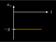](mechanics/free-fall-a/free-fall-a_inverted.svg) [[PDF]](mechanics/free-fall-a/free-fall-a_inverted.pdf) [[PNG]](mechanics/free-fall-a/free-fall-a_inverted.png) [[SVG]](mechanics/free-fall-a/free-fall-a_inverted.svg)
~~~.tex
\documentclass[crop,tikz]{standalone}
\usetikzlibrary{backgrounds}
\colorlet{blue}{cyan}
\tikzset{
  inverted/.style = {
    color=white,
    background rectangle/.style={fill},
    show background rectangle
  }
}

\tikzset{>=latex}
\definecolor{orange}{RGB}{250,194,25}

\begin{document}
\begin{tikzpicture}[inverted,scale=2.5,thick]
  \draw[->] (0,0) -- (1,0) node[right] {$t$};
  \draw[->] (0,-0.8) -- (0,0.2) node[left] {$a_z$};
  \draw[orange] (0,-0.5) -- (0.8,-0.5);
  \draw (-0.05,-0.5) node[left] {$-g$} -- (0.05,-0.5);
\end{tikzpicture}
\end{document}
~~~
## free-fall_inverted.svg
 [[PDF]](mechanics/free-fall/free-fall_inverted.pdf) [[PNG]](mechanics/free-fall/free-fall_inverted.png) [[SVG]](mechanics/free-fall/free-fall_inverted.svg)
~~~.tex
\documentclass[crop,tikz]{standalone}
\usetikzlibrary{backgrounds}
\colorlet{blue}{cyan}
\tikzset{
  inverted/.style = {
    color=white,
    background rectangle/.style={fill},
    show background rectangle
  }
}

\tikzset{>=latex}
\usetikzlibrary{patterns}

\begin{document}
\begin{tikzpicture}[inverted,scale=1.5]
  \draw[->] (1,0) -- (1,2) node[left] {$z$};
  \coordinate (r) at (1.1,1.5);
  \draw[] (r) -- ++(-0.2,0) node[left] {$h$};
  \draw[red,->] (r) -- ++(0,-1);
  \draw[red,fill] (r) circle (0.05);
  \draw (0,0) -- (2,0);
  \pattern[pattern=north east lines] (0,0)--(2,0)--(2,-0.2)--(0,-0.2)--cycle;
\end{tikzpicture}
\end{document}
~~~
## free-fall-v_inverted.svg
[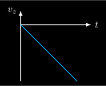](mechanics/free-fall-v/free-fall-v_inverted.svg) [[PDF]](mechanics/free-fall-v/free-fall-v_inverted.pdf) [[PNG]](mechanics/free-fall-v/free-fall-v_inverted.png) [[SVG]](mechanics/free-fall-v/free-fall-v_inverted.svg)
~~~.tex
\documentclass[crop,tikz]{standalone}
\usetikzlibrary{backgrounds}
\colorlet{blue}{cyan}
\tikzset{
  inverted/.style = {
    color=white,
    background rectangle/.style={fill},
    show background rectangle
  }
}

\tikzset{>=latex}

\begin{document}
\begin{tikzpicture}[inverted,scale=2.5,thick]
  \draw[->] (0,0) -- (1,0) node[right] {$t$};
  \draw[->] (0,-0.8) -- (0,0.2) node[left] {$v_z$};
  \draw[blue] (0,0) -- (0.8,-0.8);
\end{tikzpicture}
\end{document}
~~~
## free-fall-z_inverted.svg
[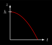](mechanics/free-fall-z/free-fall-z_inverted.svg) [[PDF]](mechanics/free-fall-z/free-fall-z_inverted.pdf) [[PNG]](mechanics/free-fall-z/free-fall-z_inverted.png) [[SVG]](mechanics/free-fall-z/free-fall-z_inverted.svg)
~~~.tex
\documentclass[crop,tikz]{standalone}
\usetikzlibrary{backgrounds}
\colorlet{blue}{cyan}
\tikzset{
  inverted/.style = {
    color=white,
    background rectangle/.style={fill},
    show background rectangle
  }
}

\tikzset{>=latex}

\begin{document}
\begin{tikzpicture}[inverted,scale=2.5,thick]
  \draw[->] (0,0) -- (1,0) node[right] {$t$};
  \draw[->] (0,0) -- (0,1) node[left] {$z$};
  \draw[red] (0,0.8) parabola bend (0,0.8) (0.8,0);
  \draw (-0.05,0.8) node[left] {$h$} -- (0.05,0.8);
\end{tikzpicture}
\end{document}
~~~
## friction_inverted.svg
 [[PDF]](mechanics/friction/friction_inverted.pdf) [[PNG]](mechanics/friction/friction_inverted.png) [[SVG]](mechanics/friction/friction_inverted.svg)
~~~.tex
\documentclass[crop,tikz]{standalone}
\usetikzlibrary{backgrounds}
\colorlet{blue}{cyan}
\tikzset{
  inverted/.style = {
    color=white,
    background rectangle/.style={fill},
    show background rectangle
  }
}

\usepackage{amsmath}
\newcommand{\F}{\vec{F}}
\tikzset{>=latex}
\usetikzlibrary{patterns,decorations.pathmorphing}

\begin{document}
\begin{tikzpicture}[inverted,scale=1.4]
  \pattern[pattern=north east lines,pattern color=white] (-1,0)--++(0,-0.2)--++(4,0)--++(0,0.2)--cycle;
  \draw (-1,0) -- ++(4,0);
  \draw[fill=gray!60] (0,0) rectangle (2,1);
  \draw[->,thick,blue] (1,0.05) -- ++(2,0) node[above] {$\F_S$};
  \draw[->,thick,red] (1,0.05) -- ++(-1.5,0) node[above] {$\F_R$};
\end{tikzpicture}
\end{document}
~~~
## gravitational-force-earth_inverted.svg
 [[PDF]](mechanics/gravitational-force-earth/gravitational-force-earth_inverted.pdf) [[PNG]](mechanics/gravitational-force-earth/gravitational-force-earth_inverted.png) [[SVG]](mechanics/gravitational-force-earth/gravitational-force-earth_inverted.svg)
~~~.tex
\documentclass[crop,tikz]{standalone}
\usetikzlibrary{backgrounds}
\colorlet{blue}{cyan}
\tikzset{
  inverted/.style = {
    color=white,
    background rectangle/.style={fill},
    show background rectangle
  }
}

\tikzset{>=latex}
\newcommand{\place}{\vec{r}}
\newcommand{\F}{\vec{F}}

\begin{document}
\begin{tikzpicture}[inverted,inverted]
  \draw[] (0,0) circle (2);
  \draw[fill,white] (45:2.1) circle (0.1) node[right] {$m$};
  \draw[->] (0,0) -- node[above,xshift=-0.5em] {$\place_1$} (45:2);
  \node[below] at (0,0) {$0$};
  \begin{scope}[shift={(0.05,-0.05)}]
    \draw[->,red,thick] (45:2) -- node[below,xshift=0.5em] {$\F_g$} (45:1);
  \end{scope}
\end{tikzpicture}
\end{document}
~~~
## gravitational-force_inverted.svg
 [[PDF]](mechanics/gravitational-force/gravitational-force_inverted.pdf) [[PNG]](mechanics/gravitational-force/gravitational-force_inverted.png) [[SVG]](mechanics/gravitational-force/gravitational-force_inverted.svg)
~~~.tex
\documentclass[crop,tikz]{standalone}
\usetikzlibrary{backgrounds}
\colorlet{blue}{cyan}
\tikzset{
  inverted/.style = {
    color=white,
    background rectangle/.style={fill},
    show background rectangle
  }
}

\tikzset{>=latex}
\newcommand{\place}{\vec{r}}
\newcommand{\F}{\vec{F}}
\colorlet{green}{green}

\begin{document}
\begin{tikzpicture}[inverted,scale=2]
  \draw[->] (0,0) node[below] {$0$} -- node[left] {$\place_1$} (-1,1);
  \draw[->] (0,0) -- node[right] {$\place_2$} (1,1);
  \draw[fill,white] (-1,1)+(-0.1,0.1) circle (0.08);
  \draw[fill,white] (1,1)+(0.1,0.1) circle (0.08);
  \draw[->,blue] (-1,1.15) -- node[above] {$\place_2-\place_1$} (+1,1.15);
  \draw[->,red]  (+1,1.05) -- node[below] {$\place_1-\place_2$} (-1,1.05);
  \draw (-1.2,1.1) node[left] {$m_1$};
  \draw (1.2,1.1) node[right] {$m_2$};
  \draw[->,blue] (-1.1,1.25) -- node[above] {$\F_{G,2\to 1}$} +(+0.5,0);
  \draw[->,red]  (+1.1,1.25) -- node[above] {$\F_{G,1\to 2}$} +(-0.5,0);
\end{tikzpicture}
\end{document}
~~~
## halfpipe-1_inverted.svg
 [[PDF]](mechanics/halfpipe-1/halfpipe-1_inverted.pdf) [[PNG]](mechanics/halfpipe-1/halfpipe-1_inverted.png) [[SVG]](mechanics/halfpipe-1/halfpipe-1_inverted.svg)
~~~.tex
\documentclass[crop,tikz]{standalone}
\usetikzlibrary{backgrounds}
\colorlet{blue}{cyan}
\tikzset{
  inverted/.style = {
    color=white,
    background rectangle/.style={fill},
    show background rectangle
  }
}

\tikzset{>=latex}

\begin{document}
\begin{tikzpicture}[inverted,inverted]
  \pgfmathsetmacro{\angl}{45}
  \pgfmathsetmacro{\radius}{2}
  \pgfmathsetmacro{\circleRadius}{0.2}
  \coordinate (ball) at (-\angl:\radius);
  % track
  \draw[thick] (ball) arc (-\angl:-180+\angl:\radius);
  % ball
  \draw[fill,red] (ball)+(0,\circleRadius) circle (\circleRadius);
  % height
  \draw[<->,thick] (ball) -- node[right] {$h$} ++(0,{\radius*(-1+cos(\angl))});
\end{tikzpicture}%
\end{document}
~~~
## halpipe-2_inverted.svg
 [[PDF]](mechanics/halfpipe-2/halpipe-2_inverted.pdf) [[PNG]](mechanics/halfpipe-2/halpipe-2_inverted.png) [[SVG]](mechanics/halfpipe-2/halpipe-2_inverted.svg)
~~~.tex
\documentclass[crop,tikz]{standalone}
\usetikzlibrary{backgrounds}
\colorlet{blue}{cyan}
\tikzset{
  inverted/.style = {
    color=white,
    background rectangle/.style={fill},
    show background rectangle
  }
}

\begin{document}
\begin{tikzpicture}[inverted,inverted]
  \pgfmathsetmacro{\angl}{45}
  \pgfmathsetmacro{\radius}{2}
  \pgfmathsetmacro{\circleRadius}{0.2}
  % track
  \draw[thick] (-\angl:\radius) arc (-\angl:-180+\angl:\radius);
  % ball
  \draw[fill,red] (0,-\radius)+(0,\circleRadius) circle (\circleRadius);
\end{tikzpicture}%
\end{document}
~~~
## harmonic-oscillator_inverted.svg
 [[PDF]](mechanics/harmonic-oscillator/harmonic-oscillator_inverted.pdf) [[PNG]](mechanics/harmonic-oscillator/harmonic-oscillator_inverted.png) [[SVG]](mechanics/harmonic-oscillator/harmonic-oscillator_inverted.svg)
~~~.tex
\documentclass[crop,tikz]{standalone}
\usetikzlibrary{backgrounds}
\colorlet{blue}{cyan}
\tikzset{
  inverted/.style = {
    color=white,
    background rectangle/.style={fill},
    show background rectangle
  }
}

\usepackage{pgfplots}
\usepackage{siunitx}
\tikzset{>=latex}

\pgfplotsset{
  inverted/.style = {
    every axis legend/.append style={
      draw=white,
      fill=black,
      text=white
    }
  },
  every non boxed x axis/.append style={
    axis line style={-latex}
  },
  every non boxed y axis/.append style={
    axis line style={-latex}
  }
}

\begin{document}
\begin{tikzpicture}[inverted,inverted]
\begin{axis}[inverted,
  thick,
  width=7cm,
  height=6cm,
  domain={0}:{6*pi},
  samples=100,
  smooth,
  axis y line=middle,
  axis x line=middle,
  xlabel={$t/\si{\s}$},
  ylabel={$x/\si{\m}$},
  xlabel style={right},
  ylabel style={above},
  xmin=0, xmax={6.3*pi},
  ymin=-2.2, ymax=2.4,
  extra y ticks={0},
  legend cell align={right},
  legend style={at={(1,0)},anchor=north east}
  ]
  \addplot[red] { 2*cos(deg(x)) };
  \addlegendentry{$x(t)=\SI{2}{\m}\cos(\SI{1}{\per\s} t)$};
\end{axis}
\end{tikzpicture}
\end{document}
~~~
## ISS-human_inverted.svg
 [[PDF]](mechanics/ISS-human/ISS-human_inverted.pdf) [[PNG]](mechanics/ISS-human/ISS-human_inverted.png) [[SVG]](mechanics/ISS-human/ISS-human_inverted.svg)
~~~.tex
\documentclass[crop,tikz]{standalone}
\usetikzlibrary{backgrounds}
\colorlet{blue}{cyan}
\tikzset{
  inverted/.style = {
    color=white,
    background rectangle/.style={fill},
    show background rectangle
  }
}

\usepackage{amsmath,marvosym}
\tikzset{>=latex}
\usetikzlibrary{decorations.markings,positioning,arrows}

\begin{document}
\begin{tikzpicture}[inverted,scale=2]
  \draw[fill] (0,0) circle (0.05) node[below] {Erde};
  \draw[thick,
        decoration={markings, mark=at position 0.1 with {\arrow{>}}},
        postaction={decorate}
        ] (0,0) circle (1);
  \coordinate (P) at (1,0);
  \node at (P) {\LARGE\Gentsroom};
  \draw[->,blue,thick] (P) -- ++(0,0.5) node[above] {$\vec{v}(t)$};
  \draw[->,red,thick] (P) -- ++(-0.5,0) node[above] {$\vec{F}_\text{Zp}(t)$};
\end{tikzpicture}
\end{document}
~~~
## ISS-station-human_inverted.svg
 [[PDF]](mechanics/ISS-station-human/ISS-station-human_inverted.pdf) [[PNG]](mechanics/ISS-station-human/ISS-station-human_inverted.png) [[SVG]](mechanics/ISS-station-human/ISS-station-human_inverted.svg)
~~~.tex
\documentclass[crop,tikz]{standalone}
\usetikzlibrary{backgrounds}
\colorlet{blue}{cyan}
\tikzset{
  inverted/.style = {
    color=white,
    background rectangle/.style={fill},
    show background rectangle
  }
}

\usepackage{amsmath,marvosym}
\tikzset{>=latex}
\usetikzlibrary{decorations.markings,positioning,arrows}

\begin{document}
\begin{tikzpicture}[inverted,scale=2]
  \draw[fill] (0,0) circle (0.05) node[below] {Erde};
  \draw[thick,
        decoration={markings, mark=at position 0.1 with {\arrow{>}}},
        postaction={decorate}
        ] (0,0) circle (1);
  \pgfmathsetmacro{\cx}{1};
  \pgfmathsetmacro{\cy}{0};
  \pgfmathsetmacro{\cw}{0.2};
  \pgfmathsetmacro{\ch}{0.3};
  \coordinate (P) at (\cx,\cy);
  \draw[fill=white,thick] (\cx-\cw/2,\cy-\ch/2) rectangle (\cx+\cw/2,\cy+\ch/2);
  \node at (P) {\LARGE\Gentsroom};
  \draw[->,blue,thick] (P) -- ++(0,0.5) node[above] {$\vec{v}(t)$};
  \draw[->,red,thick] (P) -- ++(-0.5,0) node[above] {$\vec{F}_\text{Zp}(t)$};
\end{tikzpicture}
\end{document}
~~~
## ISS-station_inverted.svg
 [[PDF]](mechanics/ISS-station/ISS-station_inverted.pdf) [[PNG]](mechanics/ISS-station/ISS-station_inverted.png) [[SVG]](mechanics/ISS-station/ISS-station_inverted.svg)
~~~.tex
\documentclass[crop,tikz]{standalone}
\usetikzlibrary{backgrounds}
\colorlet{blue}{cyan}
\tikzset{
  inverted/.style = {
    color=white,
    background rectangle/.style={fill},
    show background rectangle
  }
}

\usepackage{amsmath}
\tikzset{>=latex}
\usetikzlibrary{decorations.markings,positioning,arrows}

\begin{document}
\begin{tikzpicture}[inverted,scale=2]
  \draw[fill] (0,0) circle (0.05) node[below] {Erde};
  \draw[thick,
        decoration={markings, mark=at position 0.1 with {\arrow{>}}},
        postaction={decorate}
        ] (0,0) circle (1);
  \pgfmathsetmacro{\cx}{1};
  \pgfmathsetmacro{\cy}{0};
  \pgfmathsetmacro{\cw}{0.2};
  \pgfmathsetmacro{\ch}{0.3};
  \coordinate (P) at (\cx,\cy);
  \draw[fill=white,thick] (\cx-\cw/2,\cy-\ch/2) rectangle (\cx+\cw/2,\cy+\ch/2);
  \draw[->,blue,thick] (P) -- ++(0,0.5) node[above] {$\vec{v}(t)$};
  \draw[->,red,thick] (P) -- ++(-0.5,0) node[above] {$\vec{F}_\text{Zp}(t)$};
\end{tikzpicture}
\end{document}
~~~
## oscillations_inverted.svg
 [[PDF]](mechanics/oscillations/oscillations_inverted.pdf) [[PNG]](mechanics/oscillations/oscillations_inverted.png) [[SVG]](mechanics/oscillations/oscillations_inverted.svg)
~~~.tex
\documentclass[crop,tikz]{standalone}
\usetikzlibrary{backgrounds}
\colorlet{blue}{cyan}
\tikzset{
  inverted/.style = {
    color=white,
    background rectangle/.style={fill},
    show background rectangle
  }
}

\usepackage{pgfplots}
\tikzset{>=latex}
\colorlet{green}{green}

\pgfplotsset{
  inverted/.style = {
    every axis legend/.append style={
      draw=white,
      fill=black,
      text=white
    }
  }
}

\begin{document}
\begin{tikzpicture}[inverted,inverted]
\begin{axis}[inverted,
  thick,
  width=6cm,
  height=3cm,
  domain={0}:{4*pi},
  samples=50,
  axis y line=middle,
  axis x line=middle,
  xlabel={$t$},
  ylabel={$x$},
  xlabel style={right},
  ylabel style={left},
  xmin=0, xmax={4.2*pi},
  ymin=-1.1, ymax=1.1,
  xtick={\empty},
  xticklabels={\empty},
  ytick={\empty},
  yticklabels={\empty},
  ]
  \addplot[red,smooth] { sin(deg(x)) };
\end{axis}
%
\begin{axis}[inverted,
  thick,
  width=6cm,
  height=3cm,
  samples=50,
  axis y line=middle,
  axis x line=middle,
  xlabel={$t$},
  ylabel={$x$},
  xlabel style={right},
  ylabel style={left},
  xmin=0, xmax={4.2*pi},
  ymin=-1.1, ymax=1.1,
  xtick={\empty},
  xticklabels={\empty},
  ytick={\empty},
  yticklabels={\empty},
  at={(0,-1.5cm)},
  ]
  \addplot[blue,smooth,domain=0:{2*pi}] { x/(pi)-1 };
  \draw[blue,dashed] (axis cs:2*pi,-1) -- (axis cs:2*pi,1);
  \addplot[blue,smooth,domain={2*pi}:{4*pi}] { (x-2*pi)/(pi)-1 };
  \draw[blue,dashed] (axis cs:4*pi,-1) -- (axis cs:4*pi,1);
\end{axis}
%
\begin{axis}[inverted,
  thick,
  width=6cm,
  height=3cm,
  samples=50,
  axis y line=middle,
  axis x line=middle,
  xlabel={$t$},
  ylabel={$x$},
  xlabel style={right},
  ylabel style={left},
  xmin=0, xmax={4.2*pi},
  ymin=-1.1, ymax=1.1,
  xtick={\empty},
  xticklabels={\empty},
  ytick={\empty},
  yticklabels={\empty},
  at={(0,-3cm)},
  ]
  \addplot[green,smooth,domain=0:{pi}] { 1 };
  \draw[green,dashed] (axis cs:pi,-1) -- (axis cs:pi,1);
  \addplot[green,smooth,domain={pi}:{2*pi}] { -1 };
  \draw[green,dashed] (axis cs:2*pi,-1) -- (axis cs:2*pi,1);
  \addplot[green,smooth,domain={2*pi}:{3*pi}] { 1 };
  \draw[green,dashed] (axis cs:3*pi,-1) -- (axis cs:3*pi,1);
  \addplot[green,smooth,domain={3*pi}:{4*pi}] { -1 };
  \draw[green,dashed] (axis cs:4*pi,-1) -- (axis cs:4*pi,1);
\end{axis}
%
\begin{axis}[inverted,
  thick,
  width=6cm,
  height=3cm,
  samples=50,
  axis y line=middle,
  axis x line=middle,
  xlabel={$t$},
  ylabel={$x$},
  xlabel style={right},
  ylabel style={left},
  xmin=0, xmax={4.2*pi},
  ymin=-1.1, ymax=1.1,
  xtick={\empty},
  xticklabels={\empty},
  ytick={\empty},
  yticklabels={\empty},
  at={(0,-4.5cm)},
  ]
  \addplot[brown,smooth,domain=0:{pi/2}         ] { +x/(pi/2)+0 };
  \addplot[brown,smooth,domain={pi/2}:{3/2*pi}  ] { -x/(pi/2)+2 };
  \addplot[brown,smooth,domain={3/2*pi}:{5/2*pi}] { +x/(pi/2)-4 };
  \addplot[brown,smooth,domain={5/2*pi}:{7/2*pi}] { -x/(pi/2)+6 };
  \addplot[brown,smooth,domain={7/2*pi}:{4*pi}  ] { +x/(pi/2)-8 };
\end{axis}
\end{tikzpicture}
\end{document}
~~~
## oscillations-r-v-a_inverted.svg
 [[PDF]](mechanics/oscillations-r-v-a/oscillations-r-v-a_inverted.pdf) [[PNG]](mechanics/oscillations-r-v-a/oscillations-r-v-a_inverted.png) [[SVG]](mechanics/oscillations-r-v-a/oscillations-r-v-a_inverted.svg)
~~~.tex
\documentclass[crop,tikz]{standalone}
\usetikzlibrary{backgrounds}
\colorlet{blue}{cyan}
\tikzset{
  inverted/.style = {
    color=white,
    background rectangle/.style={fill},
    show background rectangle
  }
}

\usepackage{pgfplots}
\tikzset{>=latex}
\colorlet{green}{green}

\pgfplotsset{
  inverted/.style = {
    every axis legend/.append style={
      draw=white,
      fill=black,
      text=white
    }
  },
  every non boxed x axis/.append style={
    axis line style={-latex}
  },
  every non boxed y axis/.append style={
    axis line style={-latex}
  }
}

\begin{document}
\begin{tikzpicture}[inverted,inverted]
\begin{axis}[inverted,
  very thick,
  width=7cm,
  height=6cm,
  domain={0}:{2*pi},
  samples=50,
  axis y line=middle,
  axis x line=middle,
  xlabel={$t$},
  ylabel={$x$},
  xlabel style={right},
  ylabel style={above},
  xmin=0, xmax={2.1*pi},
  ymin=-1.1, ymax=1.5,
  xtick={\empty},
  xticklabels={\empty},
  ytick={\empty},
  yticklabels={\empty},
  legend cell align={left},
  legend style={at={(1,1)},anchor=north east},
  legend columns=-1,
  ]
  \addplot[red,smooth] { sin(deg(x)) };
  \addlegendentry{$x(t)$};
  \addplot[blue,smooth,densely dashed] { 0.5*sin(deg(x+pi/2)) };
  \addlegendentry{$\dot{x}(t)$};
  \addplot[green,smooth,densely dotted] { 0.25*sin(deg(x+pi)) };
  \addlegendentry{$\ddot{x}(t)$};
\end{axis}
\end{tikzpicture}
\end{document}
~~~
## resonance_inverted.svg
 [[PDF]](mechanics/resonance/resonance_inverted.pdf) [[PNG]](mechanics/resonance/resonance_inverted.png) [[SVG]](mechanics/resonance/resonance_inverted.svg)
~~~.tex
\documentclass[crop,tikz]{standalone}
\usetikzlibrary{backgrounds}
\colorlet{blue}{cyan}
\tikzset{
  inverted/.style = {
    color=white,
    background rectangle/.style={fill},
    show background rectangle
  }
}

\usepackage[decimalsymbol=comma]{siunitx}
\usepackage{pgfplots}
\tikzset{>=latex}

\pgfplotsset{
  inverted/.style = {
    every axis legend/.append style={
      draw=white,
      fill=black,
      text=white
    }
  }
}

\begin{document}
\begin{tikzpicture}[inverted,
      every pin/.style={
        font=\scriptsize,
        pin distance=3ex},
      small dot/.style={
        fill=gray,
        circle,
        scale=0.1}]
    \begin{axis}[inverted,
      thick,
      samples=100,
      axis y line=middle,
      axis x line=middle,
      xlabel style={at=(current axis.right of origin), anchor=west},
      ylabel style={at=(current axis.above origin), anchor=south},
      % labels
      % tick label style={font=\scriptsize},
      xlabel={$\omega_e/\omega_0$},
      ylabel={$A(\omega_e)/A(\omega_0)$},
      ytick={0,1,2,3,4,5},
      xtick={0,1,2,3},
      xticklabels={0,$1$,$2$,},
      % plot lines property
      no markers,
      cycle list={{white,solid}},
      % dominio 2D
      samples=200,
      smooth,
      domain=0:2.8,
      xmin=-0.1, xmax=2.9,
      ymin=-0.4, ymax=5.2,
      % canvas dimensions
      width=11cm, 
      height=8cm
      ]

      % horizontal help line
      \draw[help lines] (axis cs:0,1) -- (axis cs:2.5,1);
      % vertical help line
      \draw[help lines] (axis cs:1,0) -- (axis cs:1,5.2);

      % curves
      \addplot [color=red    , smooth, thick]{1/sqrt((1-x^2)^2+4*0.05^2*x^2)};
      \addplot [color=blue   , smooth, thick]{1/sqrt((1-x^2)^2+4*0.10^2*x^2)};
      \addplot [color=blue!80, smooth, thick]{1/sqrt((1-x^2)^2+4*0.20^2*x^2)};
      \addplot [color=blue!70, smooth, thick]{1/sqrt((1-x^2)^2+4*0.30^2*x^2)};
      \addplot [color=blue!60, smooth, thick]{1/sqrt((1-x^2)^2+4*0.40^2*x^2)};
      \addplot [color=blue!50, smooth, thick]{1/sqrt((1-x^2)^2+4*0.50^2*x^2)};
      \addplot [color=blue!40, smooth, thick]{1/sqrt((1-x^2)^2+4*1.00^2*x^2)};
      \addplot [color=blue!30, smooth, thick]{1/sqrt((1-x^2)^2+4*2.00^2*x^2)};

      % resonance
      \addplot[dashed,domain=0:0.99] {1/sqrt(1-x^4)};

      % pins
      \node[small dot,pin=30:{$\delta=\num{0,05}$}] at (axis cs:1.10,4.22) {};
      \node[small dot,pin=30:{$\delta=\num{0,10}$}] at (axis cs:1.10,3.29) {};
      \node[small dot,pin=30:{$\delta=\num{0,20}$}] at (axis cs:1.10,2.05) {};
      \node[small dot,pin=30:{$\delta=\num{0,30}$}] at (axis cs:1.20,1.19) {};
      \node[small dot,pin=30:{$\delta=\num{0,40}$}] at (axis cs:1.28,0.83) {};
      \node[small dot,pin=20:{$\delta=\num{0,50}$}] at (axis cs:1.50,0.51) {};
      \node[small dot,pin=210:{$\delta=\num{1,00}$}] at (axis cs:0.52,0.79) {};
      \node[small dot,pin=195:{$\delta=\num{2,00}$}] at (axis cs:0.60,0.40) {};
      \node[white] at (axis cs:0.4,-0.28) {$\omega_e\ll\omega_0$};
      \node[white] at (axis cs:2.5,-0.28) {$\omega_e\gg\omega_0$};
    \end{axis}
\end{tikzpicture}
\end{document}
~~~
## rotating-sphere_inverted.svg
 [[PDF]](mechanics/rotating-sphere/rotating-sphere_inverted.pdf) [[PNG]](mechanics/rotating-sphere/rotating-sphere_inverted.png) [[SVG]](mechanics/rotating-sphere/rotating-sphere_inverted.svg)
~~~.tex
\documentclass[crop,tikz]{standalone}
\usetikzlibrary{backgrounds}
\colorlet{blue}{cyan}
\tikzset{
  inverted/.style = {
    color=white,
    background rectangle/.style={fill},
    show background rectangle
  }
}

\tikzset{>=latex}
\usetikzlibrary{shapes}
\colorlet{gray}{gray!50}

\begin{document}
\begin{tikzpicture}[inverted,inverted]
  \shade[ball color = gray, opacity = 0.4] (0,0) circle (2cm);
  \draw[thick] (0,0) circle (2cm);
  \draw[thick] (-2,0) arc (180:360:2 and 0.6);
  \draw[thick,dashed] (2,0) arc (0:180:2 and 0.6);
  \fill[fill=white] (0,0) circle (1pt);
  \draw[<->,blue,thick] (0,0 ) -- node[above]{$R$} (2,0);
  \draw[dashed,thick] (0,-2) -- +(0,4);
  \draw[->,thick] (0,2) -- +(0,0.5) node[above] {$\vec{\omega}$};
\end{tikzpicture}
\end{document}
~~~
## rotating-stick_inverted.svg
 [[PDF]](mechanics/rotating-stick/rotating-stick_inverted.pdf) [[PNG]](mechanics/rotating-stick/rotating-stick_inverted.png) [[SVG]](mechanics/rotating-stick/rotating-stick_inverted.svg)
~~~.tex
\documentclass[crop,tikz]{standalone}
\usetikzlibrary{backgrounds}
\colorlet{blue}{cyan}
\tikzset{
  inverted/.style = {
    color=white,
    background rectangle/.style={fill},
    show background rectangle
  }
}

\tikzset{>=latex}
\usetikzlibrary{shapes}
\colorlet{gray}{gray!50}

\begin{document}
\begin{tikzpicture}[inverted,inverted]
  % cylinder
  \node (Z) at (0,0) [thick, cylinder, aspect=1, shape border rotate=0, draw, minimum height=5cm, minimum width=0.1cm, cylinder body fill=gray!60, cylinder uses custom fill, cylinder end fill=gray] {};
  % rotation axis
  \draw[->,thick] (0,-0.75) -- +(0,1.5) node[above] {$\vec{\omega}$};
  % radius
  \draw[<->,thick,blue] (-2.4,-0.5) -- node[below,xshift=2em] {$\ell$} +(5,0);
\end{tikzpicture}
\end{document}
~~~
## rotating-thin-zylinder_inverted.svg
 [[PDF]](mechanics/rotating-thin-zylinder/rotating-thin-zylinder_inverted.pdf) [[PNG]](mechanics/rotating-thin-zylinder/rotating-thin-zylinder_inverted.png) [[SVG]](mechanics/rotating-thin-zylinder/rotating-thin-zylinder_inverted.svg)
~~~.tex
\documentclass[crop,tikz]{standalone}
\usetikzlibrary{backgrounds}
\colorlet{blue}{cyan}
\tikzset{
  inverted/.style = {
    color=white,
    background rectangle/.style={fill},
    show background rectangle
  }
}

\tikzset{>=latex}
\usetikzlibrary{shapes}
\colorlet{gray}{gray!50}

\begin{document}
\begin{tikzpicture}[inverted,inverted]
  % thin cylinder
  \node (Z) at (0,0) [thick, cylinder, aspect=2, shape border rotate=90, draw, minimum height=3cm, minimum width=2cm, cylinder body fill=gray!60, cylinder uses custom fill, cylinder end fill=gray] {};
  \draw[thick,fill=gray!60] (0,1.45) ellipse (0.8 and 0.15);
  % rotation axis
  \draw[dashed,thick] (0,-1.5) -- +(0,3);
  \draw[->,thick] (0,1.5) -- +(0,0.8) node[above] {$\vec{\omega}$};
  % radius
  \draw[<->,thick,blue] (0,1.45) -- node[above,yshift=0.4em] {$R$} +(0.8,0);
\end{tikzpicture}
\end{document}
~~~
## rotating-zylinder_inverted.svg
 [[PDF]](mechanics/rotating-zylinder/rotating-zylinder_inverted.pdf) [[PNG]](mechanics/rotating-zylinder/rotating-zylinder_inverted.png) [[SVG]](mechanics/rotating-zylinder/rotating-zylinder_inverted.svg)
~~~.tex
\documentclass[crop,tikz]{standalone}
\usetikzlibrary{backgrounds}
\colorlet{blue}{cyan}
\tikzset{
  inverted/.style = {
    color=white,
    background rectangle/.style={fill},
    show background rectangle
  }
}

\tikzset{>=latex}
\usetikzlibrary{shapes}
\colorlet{gray}{gray!50}

\begin{document}
\begin{tikzpicture}[inverted,inverted]
  % cylinder
  \node (Z) at (0,0) [thick, cylinder, aspect=2, shape border rotate=90, draw, minimum height=3cm, minimum width=2cm, cylinder body fill=gray!60, cylinder uses custom fill, cylinder end fill=gray] {};
  % rotation axis
  \draw[dashed,thick] (0,-1.5) -- +(0,3);
  \draw[->,thick] (0,1.5) -- +(0,0.8) node[above] {$\vec{\omega}$};
  % radius
  \draw[<->,thick,blue] (0,1.5) -- node[above,yshift=0.4em] {$R$} +(1,0);
\end{tikzpicture}
\end{document}
~~~
## rotation-angular-momentum_inverted.svg
 [[PDF]](mechanics/rotation-angular-momentum/rotation-angular-momentum_inverted.pdf) [[PNG]](mechanics/rotation-angular-momentum/rotation-angular-momentum_inverted.png) [[SVG]](mechanics/rotation-angular-momentum/rotation-angular-momentum_inverted.svg)
~~~.tex
\documentclass[crop,tikz]{standalone}
\usetikzlibrary{backgrounds}
\colorlet{blue}{cyan}
\tikzset{
  inverted/.style = {
    color=white,
    background rectangle/.style={fill},
    show background rectangle
  }
}

\tikzset{>=latex}
\usetikzlibrary{decorations.markings}
\colorlet{green}{green}

\begin{document}
\begin{tikzpicture}[inverted,scale=1.3]
  \draw[dashed,thick] (0,1) -- (0,2);
  \draw[->,thick] (0,2) -- +(0,1) node[right] {$\vec{\omega}(t)$};
  \draw[->,brown,thick] (-0.05,2) -- +(0,1.5) node[left] {$\vec{L}(t)$};
  \fill (0,2) circle (0.03);
  \draw[thick,
        decoration={markings, mark=at position 0.4 with {\arrow{>}}},
        postaction={decorate},
        green
  ] (0,2) ellipse (2 and 0.5);
  \fill (1.5,1.67) circle (0.05);
  \draw[->,red ,thick] (0,2) -- node[above] {$\vec{r}(t)$} (1.5,1.65);
  \draw[->,blue,thick] (1.5,1.65) -- +(20:1) node[below] {$\vec{v}(t)$};
\end{tikzpicture}
\end{document}
~~~
## rotation-axis_inverted.svg
 [[PDF]](mechanics/rotation-axis/rotation-axis_inverted.pdf) [[PNG]](mechanics/rotation-axis/rotation-axis_inverted.png) [[SVG]](mechanics/rotation-axis/rotation-axis_inverted.svg)
~~~.tex
\documentclass[crop,tikz]{standalone}
\usetikzlibrary{backgrounds}
\colorlet{blue}{cyan}
\tikzset{
  inverted/.style = {
    color=white,
    background rectangle/.style={fill},
    show background rectangle
  }
}

\tikzset{>=latex}
\usetikzlibrary{decorations.markings}
\colorlet{green}{green}

\begin{document}
\begin{tikzpicture}[inverted,scale=1.3]
  \draw[dashed,thick] (0,1) -- (0,2);
  \draw[->,thick] (0,2) -- +(0,1) node[right] {$\vec{\omega}(t)$};
  \fill (0,2) circle (0.03);
  \draw[thick,
        decoration={markings, mark=at position 0.4 with {\arrow{>}}},
        postaction={decorate},
        green
  ] (0,2) ellipse (2 and 0.5);
  \fill (1.5,1.67) circle (0.05);
  \draw[->,red ,thick] (0,2) -- node[above] {$\vec{r}(t)$} (1.5,1.65);
  \draw[->,blue,thick] (1.5,1.65) -- +(20:1) node[below] {$\vec{v}(t)$};
\end{tikzpicture}
\end{document}
~~~
## rotation-turning-momentum_inverted.svg
 [[PDF]](mechanics/rotation-turning-momentum/rotation-turning-momentum_inverted.pdf) [[PNG]](mechanics/rotation-turning-momentum/rotation-turning-momentum_inverted.png) [[SVG]](mechanics/rotation-turning-momentum/rotation-turning-momentum_inverted.svg)
~~~.tex
\documentclass[crop,tikz]{standalone}
\usetikzlibrary{backgrounds}
\colorlet{blue}{cyan}
\tikzset{
  inverted/.style = {
    color=white,
    background rectangle/.style={fill},
    show background rectangle
  }
}

\tikzset{>=latex}
\usetikzlibrary{calc,decorations.markings,shapes}
\colorlet{gray}{gray!60}
\colorlet{green}{green}

\begin{document}
\begin{tikzpicture}[inverted,inverted]
  \coordinate (C) at (0,-1);
  \coordinate (R) at ($(C)+(-2cm,-0.5cm)$);
  % plate
  \draw[thick] (-3.5cm,-2.3cm) -- ++(4.5cm,0) -- ++(45:2.5) -- ++(-4.5cm,0) -- cycle;
  % cylinder
  \node (A) at (0,0) [thick, cylinder, aspect=2, shape border rotate=90, draw, minimum height=3cm, minimum width=2cm, cylinder body fill=gray!60, cylinder uses custom fill, cylinder end fill=gray] {};
  % turning momentum
  \draw[dashed,red,thick] (C) -- ++(0,3-1/2) coordinate (M);
  \draw[->,red,thick] (M) -- +(0,0.7cm) node[above] {$\vec{M}(t)$};
  \draw[->,blue,thick] (C) -- node[above,xshift=-0.5cm,yshift=-0.2em] {$\vec{r}(t)$} (R);
  \draw[->,green,thick] (R) -- +(1cm,-0.4cm) node[right] {$\vec{F}(t)$};
  \draw[fill] (C) circle (0.05cm) node[right] {$P$};
\end{tikzpicture}
\end{document}
~~~
## rotation-zylinder_inverted.svg
 [[PDF]](mechanics/rotation-zylinder/rotation-zylinder_inverted.pdf) [[PNG]](mechanics/rotation-zylinder/rotation-zylinder_inverted.png) [[SVG]](mechanics/rotation-zylinder/rotation-zylinder_inverted.svg)
~~~.tex
\documentclass[crop,tikz]{standalone}
\usetikzlibrary{backgrounds}
\colorlet{blue}{cyan}
\tikzset{
  inverted/.style = {
    color=white,
    background rectangle/.style={fill},
    show background rectangle
  }
}

\tikzset{>=latex}
\usetikzlibrary{calc,decorations.markings,shapes}
\colorlet{gray}{gray!60}
\colorlet{green}{green}

\begin{document}
\begin{tikzpicture}[inverted,scale=1.5]
  % cylinder
  \node (Z) at (0,0) [thick, cylinder, aspect=2, shape border rotate=90, draw, minimum height=4.5cm, minimum width=3cm, cylinder body fill=gray!60, cylinder uses custom fill, cylinder end fill=gray] {};
  % circular curve
  \draw[densely dashed,
        green,
        decoration={markings, mark=at position 0.9 with {\pgftransformscale{0.6}\arrow{>}}},
        postaction={decorate},
        ] (0,0.5) ellipse (0.5 and 0.125);
  % L
  \draw[dashed,brown,thick] (0,-1.5) -- +(0,3);
  \draw[->,brown,thick] (0,1.5) -- +(0,1) node[above] {$\vec{L}(t)$};
  % omega
  \draw[dashed,thick] (-0.05,-1.5) -- +(0,3);
  \draw[->,thick] (-0.05,1.5) -- +(0,0.5) node[left] {$\vec{\omega}(t)$};
  % center of mass
  \coordinate (CMS) at (0,0);
  \draw[fill] (CMS) circle (0.05) node[right] {$S$};
  % little piece of mass
  \coordinate (R) at ($(CMS)+(-0.5,0.5)$);
  % cube
  \pgfmathsetmacro{\cubex}{0.1}
  \pgfmathsetmacro{\cubey}{0.1}
  \pgfmathsetmacro{\cubez}{0.1}
  \coordinate (C) at ($(R)+(\cubex/2,\cubey/2,\cubez/2)$);
  \draw[fill=blue!50] (C) -- ++(-\cubex,0,0) -- ++(0,-\cubey,0) -- ++(\cubex,0,0) -- cycle;
  \draw[fill=blue!70] (C) -- ++(0,0,-\cubez) -- ++(0,-\cubey,0) -- ++(0,0,\cubez) -- cycle
                      (C) -- ++(-\cubex,0,0) -- ++(0,0,-\cubez) -- ++(\cubex,0,0) -- cycle;
  \node[above] at (C) {$m_i$};
  % arrows
  \draw[->,red,thick] (CMS) -- node[below,xshift=-0.5em] {$\vec{r}_i(t)$} (R);
  \draw[->,blue,thick] (R) -- +(220:0.5) node[left,xshift=-0.3em] {$\vec{v}_i(t)$};
\end{tikzpicture}
\end{document}
~~~
## schanze_inverted.svg
 [[PDF]](mechanics/schanze/schanze_inverted.pdf) [[PNG]](mechanics/schanze/schanze_inverted.png) [[SVG]](mechanics/schanze/schanze_inverted.svg)
~~~.tex
\documentclass[crop,tikz]{standalone}
\usetikzlibrary{backgrounds}
\colorlet{blue}{cyan}
\tikzset{
  inverted/.style = {
    color=white,
    background rectangle/.style={fill},
    show background rectangle
  }
}

\tikzset{>=latex}
\usetikzlibrary{patterns}
\colorlet{gray}{gray!60}
\colorlet{green}{green}

\begin{document}
\begin{tikzpicture}[inverted,scale=2]
  \pgfmathsetmacro{\del}{0.05}
  \pgfmathsetmacro{\height}{1.5}
  % table
  \draw[fill=brown]
    (1/2,-\del) -- ++(\del,0) -- ++(0,-\height+\del) -- ++(-\del,0) -- cycle;
  \draw[fill=brown]
    (3/2,-\del) -- ++(\del,0) -- ++(0,-\height+\del) -- ++(-\del,0) -- cycle;
  \draw[fill=brown]
    (0,0) -- ++(2,0) -- ++(0,-\del) -- ++(-2,0) -- cycle;
  % track
  \draw[line width=1pt] (1,0) arc (270:360:1);
  % circle
  \coordinate (c) at (2-\del,1);
  \draw[fill,red] (c) circle (\del);
  % arrows
  \draw[blue,<->] (2.05,1) -- node[right] {$h_B$} ++(0,-1);
  \draw[blue,<->] (-\del,0) -- node[left] {$h_T$} ++(0,-\height);
  \draw[blue,<->] (-\del,-\height) -- node[above] {$s$} ++(-2,0);
\end{tikzpicture}
\end{document}
~~~
## ship-forces_inverted.svg
 [[PDF]](mechanics/ship-forces/ship-forces_inverted.pdf) [[PNG]](mechanics/ship-forces/ship-forces_inverted.png) [[SVG]](mechanics/ship-forces/ship-forces_inverted.svg)
~~~.tex
\documentclass[crop,tikz]{standalone}
\usetikzlibrary{backgrounds}
\colorlet{blue}{cyan}
\tikzset{
  inverted/.style = {
    color=white,
    background rectangle/.style={fill},
    show background rectangle
  }
}

\usepackage{amsmath}
\usetikzlibrary{calc}
\tikzset{>=latex}
\newcommand{\F}{\vec{F}}

\newcommand{\bigship}[3]{%
  \begin{scope}[shift={#1}, scale={#2/10}, rotate=#3, xscale=-1]
    \draw[fill=white, rounded corners=1] (0,0) -- ++(1,-1) -- ++(9,0) -- ++(0,1) -- cycle;%
    \draw[fill=white, rounded corners=1] (7,0.1) rectangle ++(2,0.7);%
  \end{scope}
}

\newcommand{\smallship}[3]{%
  \begin{scope}[shift={#1}, scale={#2/2}, rotate=#3, xscale=-1]
    \draw[fill=white, rounded corners=1] (0,0) -- ++(0.7,-1) -- ++(2,0) -- ++(0,1) -- cycle;%
    \draw[fill=white, rounded corners=1] (1.6,0) rectangle ++(1,0.4);%
  \end{scope}
}

\begin{document}
\begin{tikzpicture}[inverted,inverted]
  \bigship{(0,0)}{3}{0}
  \smallship{(-42:2.3)}{0.6}{-45}
  \smallship{(29:3.1)}{0.6}{30}
  % arrows
  \draw[->, blue, thick] (0,0) -- node[above left] {$\F_1$} (2,1) coordinate (F1);
  \draw[->, blue, thick] (0,0) -- node[below left] {$\F_2$} (1,-1) coordinate (F2);
  \draw[->, red , thick] (0,0) -- node[above right] {$\F_\text{res}$} ($(F1)+(F2)$);
\end{tikzpicture}
\end{document}
~~~
## shot-put-fci_inverted.svg
 [[PDF]](mechanics/shot-put-fci/shot-put-fci_inverted.pdf) [[PNG]](mechanics/shot-put-fci/shot-put-fci_inverted.png) [[SVG]](mechanics/shot-put-fci/shot-put-fci_inverted.svg)
~~~.tex
\documentclass[crop,tikz]{standalone}
\usetikzlibrary{backgrounds}
\colorlet{blue}{cyan}
\tikzset{
  inverted/.style = {
    color=white,
    background rectangle/.style={fill},
    show background rectangle
  }
}

\usetikzlibrary{decorations.markings}
\tikzset{>=latex}

\begin{document}
\begin{tikzpicture}[inverted,scale=2]
  \draw[
    decoration={markings, mark=at position 0.4 with {\arrow{>}}},
    postaction={decorate},
    thick
  ] (0,0) circle (1);
  \draw[fill] (0:1) circle (0.05);
  \draw[->,red,very thick] (0:1) -- +(0:1) node[right]{A};
  \draw[->,red,very thick] (0:1) -- +(45:1) node[right]{B};
  \draw[->,red,very thick] (0:1) -- +(90:1) node[right]{C};
  \draw[->,red,very thick] (0:1) arc (0:60:1 and 1.4) node[above]{D};
  \draw[->,red,very thick] (0:1) arc (0:90:1) node[above]{E};
\end{tikzpicture}
\end{document}
~~~
## sine-amp_inverted.svg
[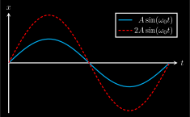](mechanics/sine-amp/sine-amp_inverted.svg) [[PDF]](mechanics/sine-amp/sine-amp_inverted.pdf) [[PNG]](mechanics/sine-amp/sine-amp_inverted.png) [[SVG]](mechanics/sine-amp/sine-amp_inverted.svg)
~~~.tex
\documentclass[crop,tikz]{standalone}
\usetikzlibrary{backgrounds}
\colorlet{blue}{cyan}
\tikzset{
  inverted/.style = {
    color=white,
    background rectangle/.style={fill},
    show background rectangle
  }
}

\usepackage{pgfplots}
\tikzset{>=latex}

\pgfplotsset{
  inverted/.style = {
    every axis legend/.append style={
      draw=white,
      fill=black,
      text=white
    }
  }
}

\begin{document}
\begin{tikzpicture}[inverted,inverted]
\begin{axis}[inverted,
  very thick,
  width=9cm,
  height=6cm,
  domain={0}:{2*pi},
  samples=50,
  axis y line=middle,
  axis x line=middle,
  xlabel={$t$},
  ylabel={$x$},
  xlabel style={right},
  ylabel style={above},
  xmin=0, xmax={2.1*pi},
  ymin=-2.1, ymax=2.1,
  xtick={\empty},
  xticklabels={\empty},
  ytick={\empty},
  yticklabels={\empty},
  legend cell align={right},
  legend style={at={(1,1)},anchor=north east}
  ]
  \addplot[blue,smooth] { sin(deg(x)) };
  \addlegendentry{$A\sin(\omega_0 t)$};
  \addplot[red,smooth,densely dashed] { 2*sin(deg(x)) };
  \addlegendentry{$2A\sin(\omega_0 t)$};
\end{axis}
\end{tikzpicture}
\end{document}
~~~
## sine-frequency_inverted.svg
 [[PDF]](mechanics/sine-frequency/sine-frequency_inverted.pdf) [[PNG]](mechanics/sine-frequency/sine-frequency_inverted.png) [[SVG]](mechanics/sine-frequency/sine-frequency_inverted.svg)
~~~.tex
\documentclass[crop,tikz]{standalone}
\usetikzlibrary{backgrounds}
\colorlet{blue}{cyan}
\tikzset{
  inverted/.style = {
    color=white,
    background rectangle/.style={fill},
    show background rectangle
  }
}

\usepackage{pgfplots}
\tikzset{>=latex}

\pgfplotsset{
  inverted/.style = {
    every axis legend/.append style={
      draw=white,
      fill=black,
      text=white
    }
  }
}

\begin{document}
\begin{tikzpicture}[inverted,inverted]
\begin{axis}[inverted,
  very thick,
  width=9cm,
  height=6cm,
  domain={0}:{2*pi},
  samples=50,
  axis y line=middle,
  axis x line=middle,
  xlabel={$t$},
  ylabel={$x$},
  xlabel style={right},
  ylabel style={above},
  xmin=0, xmax={2.1*pi},
  ymin=-2.1, ymax=2.1,
  xtick={\empty},
  xticklabels={\empty},
  ytick={\empty},
  yticklabels={\empty},
  legend cell align={left},
  legend style={at={(1,1)},anchor=north east}
  ]
  \addplot[blue,smooth] { sin(deg(x)) };
  \addlegendentry{$A\sin(\omega_0 t)$};
  \addplot[red,smooth,densely dashed] { sin(deg(2*x)) };
  \addlegendentry{$A\sin(2\omega_0 t)$};
\end{axis}
\end{tikzpicture}
\end{document}
~~~
## sine-phase_inverted.svg
 [[PDF]](mechanics/sine-phase/sine-phase_inverted.pdf) [[PNG]](mechanics/sine-phase/sine-phase_inverted.png) [[SVG]](mechanics/sine-phase/sine-phase_inverted.svg)
~~~.tex
\documentclass[crop,tikz]{standalone}
\usetikzlibrary{backgrounds}
\colorlet{blue}{cyan}
\tikzset{
  inverted/.style = {
    color=white,
    background rectangle/.style={fill},
    show background rectangle
  }
}

\usepackage{pgfplots}
\tikzset{>=latex}

\pgfplotsset{
  inverted/.style = {
    every axis legend/.append style={
      draw=white,
      fill=black,
      text=white
    }
  }
}

\begin{document}
\begin{tikzpicture}[inverted,inverted]
\begin{axis}[inverted,
  very thick,
  width=9cm,
  height=6cm,
  domain={0}:{2*pi},
  samples=50,
  axis y line=middle,
  axis x line=middle,
  xlabel={$t$},
  ylabel={$x$},
  xlabel style={right},
  ylabel style={above},
  xmin=0, xmax={2.1*pi},
  ymin=-2.1, ymax=2.1,
  xtick={\empty},
  xticklabels={\empty},
  ytick={\empty},
  yticklabels={\empty},
  legend cell align={left},
  legend style={at={(1,1)},anchor=north east}
  ]
  \addplot[blue,smooth] { sin(deg(x)) };
  \addlegendentry{$A\sin(\omega_0 t)$};
  \addplot[red,smooth,densely dashed] { sin(deg(x+pi/2)) };
  \addlegendentry{$A\sin(\omega_0 t + \pi/2)$};
\end{axis}
\end{tikzpicture}
\end{document}
~~~
## sine_inverted.svg
 [[PDF]](mechanics/sine/sine_inverted.pdf) [[PNG]](mechanics/sine/sine_inverted.png) [[SVG]](mechanics/sine/sine_inverted.svg)
~~~.tex
\documentclass[crop,tikz]{standalone}
\usetikzlibrary{backgrounds}
\colorlet{blue}{cyan}
\tikzset{
  inverted/.style = {
    color=white,
    background rectangle/.style={fill},
    show background rectangle
  }
}

\usepackage{pgfplots}
\tikzset{>=latex}

\pgfplotsset{
  inverted/.style = {
    every axis legend/.append style={
      draw=white,
      fill=black,
      text=white
    }
  }
}

\begin{document}
\begin{tikzpicture}[inverted,inverted]
\begin{axis}[inverted,
  thick,
  width=6cm,
  height=4cm,
  domain={0}:{2*pi},
  samples=50,
  axis y line=middle,
  axis x line=middle,
  xlabel={$t$},
  ylabel={$x$},
  xlabel style={right},
  ylabel style={above},
  xmin=0, xmax={2.1*pi},
  ymin=-2.1, ymax=1.1,
  xtick={\empty},
  xticklabels={\empty},
  ytick={\empty},
  yticklabels={\empty},
  legend cell align={right},
  legend style={at={(1,1)},anchor=north east},
  ]
  \addplot[red,smooth] { sin(deg(x)) };
  \draw[<->] (axis cs:0,-2) -- node[above] {$T$} (axis cs:2*pi,-2);
  \draw[<->,blue] (axis cs:pi/2,0) -- node[right] {$A$} (axis cs:pi/2,1);
\end{axis}
\end{tikzpicture}
\end{document}
~~~
## solar-system-incorrect_inverted.svg
 [[PDF]](mechanics/solar-system-incorrect/solar-system-incorrect_inverted.pdf) [[PNG]](mechanics/solar-system-incorrect/solar-system-incorrect_inverted.png) [[SVG]](mechanics/solar-system-incorrect/solar-system-incorrect_inverted.svg)
~~~.tex
\documentclass[crop,tikz]{standalone}
\usetikzlibrary{backgrounds}
\colorlet{blue}{cyan}
\tikzset{
  inverted/.style = {
    color=white,
    background rectangle/.style={fill},
    show background rectangle
  }
}

\tikzset{>=latex}
\usetikzlibrary{decorations.markings,calc}
\colorlet{green}{green}

\begin{document}
\begin{tikzpicture}[inverted,scale=2,thick]
  \pgfmathsetmacro{\ra}{2}
  \pgfmathsetmacro{\rb}{1}
  \coordinate (C) at (0,0); % center of ellipse
  \coordinate (E) at (1,0); % Earth
  \coordinate (S) at (-1,{\rb*sqrt(1 - (-1)^2/\ra^2)}); % Satellite
  % Ellipse
  \draw[decoration={markings, mark=at position 0.4 with {\arrow{>}}},
        postaction={decorate}] (C) ellipse ({\ra} and {\rb});
  % Earth
  \draw[fill,blue] (E) circle (0.1) node[below=0.3cm,white] {Erde};
  % Sattelite
  \draw[fill] (S) circle (0.05) node[below=0.2cm,white] {Sonde};
  % Gravity
  \coordinate (FG) at ($(S)!0.3!(E)$);
  \draw[->,red] (S) -- (FG) node[below] {$\vec{F}_G$};
  % incorrect centrifugal force
  \coordinate (FZ) at ($(S)+0.6*({\rb*((-1)/\ra^2)/sqrt(1 - (-1)^2/\ra^2)},1)$);
  \draw[->,green] (S) -- (FZ) node[left] {$\vec{F}_{\rm Zf}$};
\end{tikzpicture}
\end{document}
~~~
## solar-system-IS-all-forces_inverted.svg
[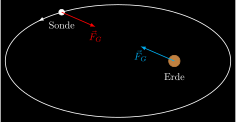](mechanics/solar-system-IS-all-forces/solar-system-IS-all-forces_inverted.svg) [[PDF]](mechanics/solar-system-IS-all-forces/solar-system-IS-all-forces_inverted.pdf) [[PNG]](mechanics/solar-system-IS-all-forces/solar-system-IS-all-forces_inverted.png) [[SVG]](mechanics/solar-system-IS-all-forces/solar-system-IS-all-forces_inverted.svg)
~~~.tex
\documentclass[crop,tikz]{standalone}
\usetikzlibrary{backgrounds}
\colorlet{blue}{cyan}
\tikzset{
  inverted/.style = {
    color=white,
    background rectangle/.style={fill},
    show background rectangle
  }
}

\tikzset{>=latex}
\usetikzlibrary{decorations.markings,calc}

\begin{document}
\begin{tikzpicture}[inverted,scale=2,thick]
  \pgfmathsetmacro{\ra}{2}
  \pgfmathsetmacro{\rb}{1}
  \coordinate (C) at (0,0); % center of ellipse
  \coordinate (E) at (1,0); % Earth
  \coordinate (S) at (-1,{\rb*sqrt(1 - (-1)^2/\ra^2)}); % Satellite
  % Ellipse
  \draw[decoration={markings, mark=at position 0.4 with {\arrow{>}}},
        postaction={decorate}] (C) ellipse ({\ra} and {\rb});
  % Earth
  \draw[fill,blue] (E) circle (0.1) node[below=0.3cm,white] {Erde};
  % Sattelite
  \draw[fill] (S) circle (0.05) node[below=0.2cm,white] {Sonde};
  % Gravity
  \coordinate (FS) at ($(S)!0.3!(E)$);
  \draw[->,red] (S) -- (FS) node[below] {$\vec{F}_{G}$};
  \coordinate (FE) at ($(E)!0.3!(S)$);
  \draw[->,blue] (E) -- (FE) node[below] {$\vec{F}_{G}$};
\end{tikzpicture}
\end{document}
~~~
## solar-system-IS-no-forces_inverted.svg
[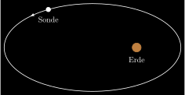](mechanics/solar-system-IS-no-forces/solar-system-IS-no-forces_inverted.svg) [[PDF]](mechanics/solar-system-IS-no-forces/solar-system-IS-no-forces_inverted.pdf) [[PNG]](mechanics/solar-system-IS-no-forces/solar-system-IS-no-forces_inverted.png) [[SVG]](mechanics/solar-system-IS-no-forces/solar-system-IS-no-forces_inverted.svg)
~~~.tex
\documentclass[crop,tikz]{standalone}
\usetikzlibrary{backgrounds}
\colorlet{blue}{cyan}
\tikzset{
  inverted/.style = {
    color=white,
    background rectangle/.style={fill},
    show background rectangle
  }
}

\tikzset{>=latex}
\usetikzlibrary{decorations.markings,calc}

\begin{document}
\begin{tikzpicture}[inverted,scale=2,thick]
  \pgfmathsetmacro{\ra}{2}
  \pgfmathsetmacro{\rb}{1}
  \coordinate (C) at (0,0); % center of ellipse
  \coordinate (E) at (1,0); % Earth
  \coordinate (S) at (-1,{\rb*sqrt(1 - (-1)^2/\ra^2)}); % Satellite
  % Ellipse
  \draw[decoration={markings, mark=at position 0.4 with {\arrow{>}}},
        postaction={decorate}] (C) ellipse ({\ra} and {\rb});
  % Earth
  \draw[fill,blue] (E) circle (0.1) node[below=0.3cm,white] {Erde};
  % Sattelite
  \draw[fill] (S) circle (0.05) node[below=0.2cm,white] {Sonde};
\end{tikzpicture}
\end{document}
~~~
## solar-system-IS_inverted.svg
[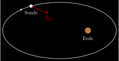](mechanics/solar-system-IS/solar-system-IS_inverted.svg) [[PDF]](mechanics/solar-system-IS/solar-system-IS_inverted.pdf) [[PNG]](mechanics/solar-system-IS/solar-system-IS_inverted.png) [[SVG]](mechanics/solar-system-IS/solar-system-IS_inverted.svg)
~~~.tex
\documentclass[crop,tikz]{standalone}
\usetikzlibrary{backgrounds}
\colorlet{blue}{cyan}
\tikzset{
  inverted/.style = {
    color=white,
    background rectangle/.style={fill},
    show background rectangle
  }
}

\tikzset{>=latex}
\usetikzlibrary{decorations.markings,calc}

\begin{document}
\begin{tikzpicture}[inverted,scale=2,thick]
  \pgfmathsetmacro{\ra}{2}
  \pgfmathsetmacro{\rb}{1}
  \coordinate (C) at (0,0); % center of ellipse
  \coordinate (E) at (1,0); % Earth
  \coordinate (S) at (-1,{\rb*sqrt(1 - (-1)^2/\ra^2)}); % Satellite
  % Ellipse
  \draw[decoration={markings, mark=at position 0.4 with {\arrow{>}}},
        postaction={decorate}] (C) ellipse ({\ra} and {\rb});
  % Earth
  \draw[fill,blue] (E) circle (0.1) node[below=0.3cm,white] {Erde};
  % Sattelite
  \draw[fill] (S) circle (0.05) node[below=0.2cm,white] {Sonde};
  % Gravity
  \coordinate (FG) at ($(S)!0.3!(E)$);
  \draw[->,red] (S) -- (FG) node[below] {$\vec{F}_G$};
\end{tikzpicture}
\end{document}
~~~
## space-point-2-delta_inverted.svg
 [[PDF]](mechanics/space-point-2-delta/space-point-2-delta_inverted.pdf) [[PNG]](mechanics/space-point-2-delta/space-point-2-delta_inverted.png) [[SVG]](mechanics/space-point-2-delta/space-point-2-delta_inverted.svg)
~~~.tex
\documentclass[crop,tikz]{standalone}
\usetikzlibrary{backgrounds}
\colorlet{blue}{cyan}
\tikzset{
  inverted/.style = {
    color=white,
    background rectangle/.style={fill},
    show background rectangle
  }
}

\tikzset{>=latex}
\usetikzlibrary{calc,decorations.markings}
\colorlet{green}{green}
\newcommand{\place}{\vec{r}}

\begin{document}
\begin{tikzpicture}[inverted,scale=1.3]
  % axes
  \draw[->,thick] (xyz cs:x=-0.5) -- (xyz cs:x=4)  node[below] {$x$};
  \draw[->,thick] (xyz cs:y=-0.5) -- (xyz cs:y=3)  node[left] {$z$};
  \draw[->,thick] (xyz cs:z=1)    -- (xyz cs:z=-4) node[above] {$y$};
  % path
  \draw[thick,
        decoration={markings, mark=at position 0.5 with {\arrow{>}}},
        postaction={decorate},
        green]
       (xyz cs:x=1,y=2.5,z=0) arc (90:0:2);
  % space point
  \coordinate (r1) at ($(1,0.5)+(70:2)$);
  \coordinate (r2) at ($(1,0.5)+(20:2)$);
  \draw[->,thick,red] (xyz cs:x=0) -- node[above,xshift=-1em]{$\place(t_1)$} (r1);
  \draw[->,thick,red] (xyz cs:x=0) -- node[below,xshift=+1em]{$\place(t_2)$} (r2);
  % delta r
  \draw[->,thick,dashed] (r1) -- node[below,anchor=east,xshift=0.5em,yshift=-1em]{$\Delta\place$} (r2);
\end{tikzpicture}
\end{document}
~~~
## space-point-2_inverted.svg
 [[PDF]](mechanics/space-point-2/space-point-2_inverted.pdf) [[PNG]](mechanics/space-point-2/space-point-2_inverted.png) [[SVG]](mechanics/space-point-2/space-point-2_inverted.svg)
~~~.tex
\documentclass[crop,tikz]{standalone}
\usetikzlibrary{backgrounds}
\colorlet{blue}{cyan}
\tikzset{
  inverted/.style = {
    color=white,
    background rectangle/.style={fill},
    show background rectangle
  }
}

\tikzset{>=latex}
\usetikzlibrary{calc,decorations.markings}
\colorlet{green}{green}
\newcommand{\place}{\vec{r}}

\begin{document}
\begin{tikzpicture}[inverted,scale=1.3]
  % axes
  \draw[->,thick] (xyz cs:x=-0.5) -- (xyz cs:x=4)  node[below] {$x$};
  \draw[->,thick] (xyz cs:y=-0.5) -- (xyz cs:y=3)  node[left] {$z$};
  \draw[->,thick] (xyz cs:z=1)    -- (xyz cs:z=-4) node[above] {$y$};
  % path
  \draw[thick,
        decoration={markings, mark=at position 0.5 with {\arrow{>}}},
        postaction={decorate},
        green]
       (xyz cs:x=1,y=2.5,z=0) arc (90:0:2);
  % space point
  \coordinate (r1) at ($(1,0.5)+(70:2)$);
  \coordinate (r2) at ($(1,0.5)+(20:2)$);
  \draw[->,thick,red] (xyz cs:x=0) -- node[above,xshift=-1em]{$\place(t_1)$} (r1);
  \draw[->,thick,red] (xyz cs:x=0) -- node[below,xshift=+1em]{$\place(t_2)$} (r2);
\end{tikzpicture}
\end{document}
~~~
## space-point_inverted.svg
 [[PDF]](mechanics/space-point/space-point_inverted.pdf) [[PNG]](mechanics/space-point/space-point_inverted.png) [[SVG]](mechanics/space-point/space-point_inverted.svg)
~~~.tex
\documentclass[crop,tikz]{standalone}
\usetikzlibrary{backgrounds}
\colorlet{blue}{cyan}
\tikzset{
  inverted/.style = {
    color=white,
    background rectangle/.style={fill},
    show background rectangle
  }
}

\tikzset{>=latex}
\newcommand{\place}{\vec{r}}
\newcommand{\ex}{\vec{e}_x}
\newcommand{\ey}{\vec{e}_y}
\newcommand{\ez}{\vec{e}_z}

\begin{document}
\begin{tikzpicture}[inverted,scale=1.3]
  % axes
  \draw[->,thick] (xyz cs:x=-0.5) -- (xyz cs:x=4)  node[below] {$x$};
  \draw[->,thick] (xyz cs:y=-0.5) -- (xyz cs:y=3)  node[left]  {$z$};
  \draw[->,thick] (xyz cs:z=1)    -- (xyz cs:z=-4) node[above] {$y$};
  % dashed lines
  \draw[dashed] (xyz cs:x=3)  -- ++(xyz cs:z=-2) -- ++(xyz cs:y=2) coordinate (p) node[above] {$P(x,y,z)$};
  \draw[dashed] (xyz cs:z=-2) -- ++(xyz cs:x=3);
  \draw[dashed] (xyz cs:x=0,y=2,z=0) -- ++(xyz cs:x=3) -- ++(xyz cs:z=-2) -- ++(xyz cs:x=-3) -- ++(xyz cs:z=2);
  \draw[dashed] (xyz cs:x=3)  -- ++(xyz cs:y=2);
  \draw[dashed] (xyz cs:z=-2) -- ++(xyz cs:y=2);
  \node[fill,circle,inner sep=1.5pt] at (p) {};
  % point
  \draw[->,very thick,red,shorten >= 0.5mm] (xyz cs:x=0) -- node[below]{$\place$} (xyz cs:x=3,y=2,z=-2);
  % unit vectors
  \draw[->,very thick,blue] (xyz cs:x=0) -- node[below]{$\ex$} (xyz cs:x=1);
  \draw[->,very thick,blue] (xyz cs:x=0) -- (xyz cs:z=-1) node[left,yshift=0.6em,xshift=0.3em]{$\ey$};
  \draw[->,very thick,blue] (xyz cs:x=0) -- node[left]{$\ez$} (xyz cs:y=1);
\end{tikzpicture}
\end{document}
~~~
## spring-2_inverted.svg
 [[PDF]](mechanics/spring-2/spring-2_inverted.pdf) [[PNG]](mechanics/spring-2/spring-2_inverted.png) [[SVG]](mechanics/spring-2/spring-2_inverted.svg)
~~~.tex
\documentclass[crop,tikz]{standalone}
\usetikzlibrary{backgrounds}
\colorlet{blue}{cyan}
\tikzset{
  inverted/.style = {
    color=white,
    background rectangle/.style={fill},
    show background rectangle
  }
}

\usepackage{amsmath}
\tikzset{>=latex}
\usetikzlibrary{calc,patterns,decorations.pathmorphing}

\begin{document}
\begin{tikzpicture}[inverted,scale=2]
  % wall
  \draw (-1,0.5) -- (-1,0) -- (1,0);
  \pattern[pattern=north east lines,pattern color=white] (-1.2,0.5)--++(0.2,0)--++(0,-0.5)
    --++(2,0)--++(0,-0.2)--++(-2,0)--++(-0.2,0)--cycle;
  % circle
  \coordinate (c) at (0,0.25);
  \draw[decoration={aspect=0.3, segment length=2mm, amplitude=2mm,coil},decorate] (-1,0.25) -- (c);
  \draw[red,fill] (c) circle (0.25);
  % spring force
  \draw[->,blue] ($(c)+(0,0.1)$) -- ++(0.5,0) node[above]{$\vec{F}$};
  \coordinate (o) at ($(c)+(1,0)$);
  % space vector
  \draw[->] (o) -- node[below, xshift=1em] {$\vec{r}$} (c);
  \draw ($(o)+(0,-0.1)$) -- ++(0,0.2) node[above] {$0$};
\end{tikzpicture}
\end{document}
~~~
## spring-damping-motor_inverted.svg
 [[PDF]](mechanics/spring-damping-motor/spring-damping-motor_inverted.pdf) [[PNG]](mechanics/spring-damping-motor/spring-damping-motor_inverted.png) [[SVG]](mechanics/spring-damping-motor/spring-damping-motor_inverted.svg)
~~~.tex
\documentclass[crop,tikz]{standalone}
\usetikzlibrary{backgrounds}
\colorlet{blue}{cyan}
\tikzset{
  inverted/.style = {
    color=white,
    background rectangle/.style={fill},
    show background rectangle
  }
}

\usepackage{amsmath}
\tikzset{>=latex}
\usetikzlibrary{patterns,decorations.pathmorphing}

\begin{document}
\begin{tikzpicture}[inverted,scale=2]
  \pgfmathsetmacro{\basinh}{0.3}
  \pgfmathsetmacro{\basinw}{0.1}
  \pgfmathsetmacro{\wall}{0.2}
  \draw[fill=cyan!20,very thick] (-1-\wall,1+\basinh) -- ++(0,-1-\wall-\basinh) -- ++(2+\wall,0) -- ++(0,1+\wall+\basinh);
  \draw[->] (-0.8,1) -- (0.8,1) node[above] {$x$};
  \draw (0,0.9) -- (0,1.1) node[above] {$0$};
  \draw (-1.2,1) -- (-1,1) -- (-1,0) -- (1,0);
  \pattern[pattern=north east lines,pattern color=white] (-1.2,1)--++(0.2,0)--++(0,-1)
  --++(2,0)--++(0,-0.2)--++(-2,0)--++(-0.2,0)--cycle;
  % motor
  \draw[fill=gray!60] (-1,0) rectangle node {M} (-0.5,0.5);
  \draw[decoration={aspect=0.3, segment length=2mm, amplitude=2mm,coil},decorate] (-0.5,0.25) -- (0.5,0.25);
  \draw[red,fill] (0.5,0.25) circle (0.25);
  \draw[->] (0.5,0.75) node[right]{$\vec{F}_\text{rück}$} -- (0,0.75);
\end{tikzpicture}
\end{document}
~~~
## spring-damping_inverted.svg
 [[PDF]](mechanics/spring-damping/spring-damping_inverted.pdf) [[PNG]](mechanics/spring-damping/spring-damping_inverted.png) [[SVG]](mechanics/spring-damping/spring-damping_inverted.svg)
~~~.tex
\documentclass[crop,tikz]{standalone}
\usetikzlibrary{backgrounds}
\colorlet{blue}{cyan}
\tikzset{
  inverted/.style = {
    color=white,
    background rectangle/.style={fill},
    show background rectangle
  }
}

\usepackage{amsmath}
\tikzset{>=latex}
\usetikzlibrary{patterns,decorations.pathmorphing}

\begin{document}
\begin{tikzpicture}[inverted,scale=2]
  \pgfmathsetmacro{\basinh}{0.3}
  \pgfmathsetmacro{\basinw}{0.1}
  \pgfmathsetmacro{\wall}{0.2}
  \draw[fill=cyan!20,very thick] (-1-\wall,1+\basinh) -- ++(0,-1-\wall-\basinh) -- ++(2+\wall,0) -- ++(0,1+\wall+\basinh);
  \draw[->] (-0.8,1) -- (0.8,1) node[above] {$x$};
  \draw (0,0.9) -- (0,1.1) node[above] {$0$};
  \draw (-1.2,1) -- (-1,1) -- (-1,0) -- (1,0);
  \pattern[pattern=north east lines,pattern color=white] (-1.2,1)--++(0.2,0)--++(0,-1)
  --++(2,0)--++(0,-0.2)--++(-2,0)--++(-0.2,0)--cycle;
  \draw[decoration={aspect=0.3, segment length=2mm, amplitude=2mm,coil},decorate] (-1,0.25) -- (0.5,0.25);
  \draw[red,fill] (0.5,0.25) circle (0.25);
  \draw[->] (0.5,0.75) node[right]{$\vec{F}_\text{rück}$} -- (0,0.75);
\end{tikzpicture}
\end{document}
~~~
## spring_inverted.svg
 [[PDF]](mechanics/spring/spring_inverted.pdf) [[PNG]](mechanics/spring/spring_inverted.png) [[SVG]](mechanics/spring/spring_inverted.svg)
~~~.tex
\documentclass[crop,tikz]{standalone}
\usetikzlibrary{backgrounds}
\colorlet{blue}{cyan}
\tikzset{
  inverted/.style = {
    color=white,
    background rectangle/.style={fill},
    show background rectangle
  }
}

\usepackage{amsmath}
\tikzset{>=latex}
\usetikzlibrary{patterns,decorations.pathmorphing}

\begin{document}
\begin{tikzpicture}[inverted,scale=2]
  \draw[->] (-0.9,1) -- (1,1) node[right] {$x$};
  \draw (0,0.9) -- (0,1.1) node[above] {$0$};
  \draw (-1,1) -- (-1,0) -- (1,0);
  \pattern[pattern=north east lines,pattern color=white] (-1.2,1)--++(0.2,0)--++(0,-1)
  --++(2,0)--++(0,-0.2)--++(-2,0)--++(-0.2,0)--cycle;
  \draw[decoration={aspect=0.3, segment length=2mm, amplitude=2mm,coil},decorate] (-1,0.25) -- (0.5,0.25);
  \draw[red,fill] (0.5,0.25) circle (0.25);
  \draw[->] (0.5,0.75) node[right]{$\vec{F}_\text{rück}$} -- (0,0.75);
\end{tikzpicture}
\end{document}
~~~
## straight-curve_inverted.svg
 [[PDF]](mechanics/straight-curve/straight-curve_inverted.pdf) [[PNG]](mechanics/straight-curve/straight-curve_inverted.png) [[SVG]](mechanics/straight-curve/straight-curve_inverted.svg)
~~~.tex
\documentclass[crop,tikz]{standalone}
\usetikzlibrary{backgrounds}
\colorlet{blue}{cyan}
\tikzset{
  inverted/.style = {
    color=white,
    background rectangle/.style={fill},
    show background rectangle
  }
}

\tikzset{>=latex}
\usetikzlibrary{decorations.markings}
\colorlet{green}{green}

\begin{document}
\begin{tikzpicture}[inverted,scale=1.3]
  % axes
  \draw[->,thick] (xyz cs:x=-0.5) -- (xyz cs:x=4)  node[below] {$x$};
  \draw[->,thick] (xyz cs:y=-0.5) -- (xyz cs:y=3)  node[left]  {$z$};
  \draw[->,thick] (xyz cs:z=1)    -- (xyz cs:z=-4) node[above] {$y$};
  % path
  \draw[red,very thick,
        decoration={markings, mark=at position 0.8 with {\arrow{>}}},
        postaction={decorate},
        green]
       (xyz cs:x=-1) -- (xyz cs:x=4,y=3,z=2);
\end{tikzpicture}
\end{document}
~~~
## three-body-system-external-force_inverted.svg
 [[PDF]](mechanics/three-body-system-external-force/three-body-system-external-force_inverted.pdf) [[PNG]](mechanics/three-body-system-external-force/three-body-system-external-force_inverted.png) [[SVG]](mechanics/three-body-system-external-force/three-body-system-external-force_inverted.svg)
~~~.tex
\documentclass[crop,tikz]{standalone}
\usetikzlibrary{backgrounds}
\colorlet{blue}{cyan}
\tikzset{
  inverted/.style = {
    color=white,
    background rectangle/.style={fill},
    show background rectangle
  }
}

\usepackage{amsmath}
\tikzset{>=latex}
\colorlet{green}{green}
\newcommand{\F}{\vec{F}}

\begin{document}
\begin{tikzpicture}[inverted,scale=1.2]
  \draw[thick] (-2,-2) -- ++(4,0) -- ++(0,4) -- ++(-4,0) -- cycle;
  \pgfmathsetmacro{\radi}{0.06};
  \pgfmathsetmacro{\xone}{0.2};
  \pgfmathsetmacro{\yone}{0.6};
  \pgfmathsetmacro{\xtwo}{-0.8};
  \pgfmathsetmacro{\ytwo}{0.2};
  \pgfmathsetmacro{\xthr}{0};
  \pgfmathsetmacro{\ythr}{-0.5};
  % coordinates
  \coordinate (r1) at (\xone,\yone);
  \coordinate (r2) at (\xtwo,\ytwo);
  \coordinate (r3) at (\xthr,\ythr);
  % distances
  \pgfmathsetmacro{\donetwo}{(\xone-\xtwo)^2 + (\yone-\ytwo)^(3/2)};
  \pgfmathsetmacro{\donethr}{(\xone-\xthr)^2 + (\yone-\ythr)^(3/2)};
  \pgfmathsetmacro{\dtwothr}{(\xtwo-\xthr)^2 + (\ytwo-\ythr)^(3/2)};
  % 1
  \draw[fill] (r1) circle (\radi) node[left] {$1$};
  \draw[->,blue] (r1) -- ++({(\xone-\xtwo)/\donetwo}, {(\yone-\ytwo)/\donetwo}) node[right] {$\F_{2\to 1}$};
  \draw[->,red]  (r1) -- ++({(\xone-\xthr)/\donethr}, {(\yone-\ythr)/\donethr}) node[above] {$\F_{3\to 1}$};
  % 2
  \draw[fill] (r2) circle (\radi) node[below] {$2$};
  \draw[->,blue]  (r2) -- ++({(\xtwo-\xone)/\donetwo}, {(\ytwo-\yone)/\donetwo}) node[below] {$\F_{1\to 2}$};
  \draw[->,green] (r2) -- ++({(\xtwo-\xthr)/\dtwothr}, {(\ytwo-\ythr)/\dtwothr}) node[above] {$\F_{3\to 2}$};
  % 3
  \draw[fill] (r3) circle (\radi) node[left] {$3$};
  \draw[->,red]   (r3) -- ++({(\xthr-\xone)/\donethr}, {(\ythr-\yone)/\donethr}) node[below] {$\F_{1\to 3}$};
  \draw[->,green] (r3) -- ++({(\xthr-\xtwo)/\dtwothr}, {(\ythr-\ytwo)/\dtwothr}) node[right] {$\F_{2\to 3}$};
  % external forces
  \pgfmathsetmacro{\Fextx}{0.8};
  \pgfmathsetmacro{\Fexty}{-0.2};
  \draw[->,dashed] (r1) -- ++(\Fextx, \Fexty) node[right] {$\F_{\text{ext},1}$};
  \draw[->,dashed] (r2) -- ++(\Fextx, \Fexty) node[right] {$\F_{\text{ext},2}$};
  \draw[->,dashed] (r3) -- ++(\Fextx, \Fexty) node[right] {$\F_{\text{ext},3}$};
\end{tikzpicture}
\end{document}
~~~
## three-body-system_inverted.svg
 [[PDF]](mechanics/three-body-system/three-body-system_inverted.pdf) [[PNG]](mechanics/three-body-system/three-body-system_inverted.png) [[SVG]](mechanics/three-body-system/three-body-system_inverted.svg)
~~~.tex
\documentclass[crop,tikz]{standalone}
\usetikzlibrary{backgrounds}
\colorlet{blue}{cyan}
\tikzset{
  inverted/.style = {
    color=white,
    background rectangle/.style={fill},
    show background rectangle
  }
}

\tikzset{>=latex}
\colorlet{green}{green}
\newcommand{\F}{\vec{F}}

\begin{document}
\begin{tikzpicture}[inverted,scale=1.2]
  \draw[thick] (-2,-2) -- ++(4,0) -- ++(0,4) -- ++(-4,0) -- cycle;
  \pgfmathsetmacro{\radi}{0.06};
  \pgfmathsetmacro{\xone}{0.4};
  \pgfmathsetmacro{\yone}{0.6};
  \pgfmathsetmacro{\xtwo}{-0.8};
  \pgfmathsetmacro{\ytwo}{0.2};
  \pgfmathsetmacro{\xthr}{0.2};
  \pgfmathsetmacro{\ythr}{-0.5};
  % coordinates
  \coordinate (r1) at (\xone,\yone);
  \coordinate (r2) at (\xtwo,\ytwo);
  \coordinate (r3) at (\xthr,\ythr);
  % distances
  \pgfmathsetmacro{\donetwo}{(\xone-\xtwo)^2 + (\yone-\ytwo)^(3/2)};
  \pgfmathsetmacro{\donethr}{(\xone-\xthr)^2 + (\yone-\ythr)^(3/2)};
  \pgfmathsetmacro{\dtwothr}{(\xtwo-\xthr)^2 + (\ytwo-\ythr)^(3/2)};
  % 1
  \draw[fill] (r1) circle (\radi) node[below] {$1$};
  \draw[->,blue] (r1) -- ++({(\xone-\xtwo)/\donetwo}, {(\yone-\ytwo)/\donetwo}) node[right] {$\F_{2\to 1}$};
  \draw[->,red]  (r1) -- ++({(\xone-\xthr)/\donethr}, {(\yone-\ythr)/\donethr}) node[above] {$\F_{3\to 1}$};
  % 2
  \draw[fill] (r2) circle (\radi) node[right] {$2$};
  \draw[->,blue]  (r2) -- ++({(\xtwo-\xone)/\donetwo}, {(\ytwo-\yone)/\donetwo}) node[below] {$\F_{1\to 2}$};
  \draw[->,green] (r2) -- ++({(\xtwo-\xthr)/\dtwothr}, {(\ytwo-\ythr)/\dtwothr}) node[above] {$\F_{3\to 2}$};
  % 3
  \draw[fill] (r3) circle (\radi) node[above] {$3$};
  \draw[->,red]   (r3) -- ++({(\xthr-\xone)/\donethr}, {(\ythr-\yone)/\donethr}) node[below] {$\F_{1\to 3}$};
  \draw[->,green] (r3) -- ++({(\xthr-\xtwo)/\dtwothr}, {(\ythr-\ytwo)/\dtwothr}) node[right] {$\F_{2\to 3}$};
\end{tikzpicture}
\end{document}
~~~
## velocity-2-delta_inverted.svg
 [[PDF]](mechanics/velocity-2-delta/velocity-2-delta_inverted.pdf) [[PNG]](mechanics/velocity-2-delta/velocity-2-delta_inverted.png) [[SVG]](mechanics/velocity-2-delta/velocity-2-delta_inverted.svg)
~~~.tex
\documentclass[crop,tikz]{standalone}
\usetikzlibrary{backgrounds}
\colorlet{blue}{cyan}
\tikzset{
  inverted/.style = {
    color=white,
    background rectangle/.style={fill},
    show background rectangle
  }
}

\tikzset{>=latex}
\usetikzlibrary{calc,decorations.markings}
\colorlet{green}{green}
\definecolor{orange}{RGB}{250,194,25}
\newcommand{\place}{\vec{r}}
\newcommand{\velocity}{\vec{v}}

\begin{document}
\begin{tikzpicture}[inverted,scale=1.3]
  % axes
  \draw[->,thick] (xyz cs:x=-0.5) -- (xyz cs:x=4)  node[below] {$x$};
  \draw[->,thick] (xyz cs:y=-0.5) -- (xyz cs:y=3)  node[left] {$z$};
  \draw[->,thick] (xyz cs:z=1)    -- (xyz cs:z=-4);
  % path
  \draw[thick,
        decoration={markings, mark=at position 0.5 with {\arrow{>}}},
        postaction={decorate},
        green!20!white]
       (xyz cs:x=1,y=2.5,z=0) arc (90:0:2);
  % space point
  \coordinate (r1) at ($(1,0.5)+(70:2)$);
  \coordinate (r2) at ($(1,0.5)+(20:2)$);
  % velocities
  \draw[->,thick,blue] (r1) -- node[above,xshift=0.5em]{$\velocity(t_1)$} ++(-20:1.5) coordinate (v1);
  \draw[->,thick,blue] (r1) -- node[left]{$\velocity(t_2)$} ++(-70:0.8) coordinate (v2);
  % delta
  \draw[->,thick,orange] (v1) -- node[below, xshift=-0.5em]{$\Delta\velocity$} (v2);
\end{tikzpicture}
\end{document}
~~~
## velocity-2_inverted.svg
 [[PDF]](mechanics/velocity-2/velocity-2_inverted.pdf) [[PNG]](mechanics/velocity-2/velocity-2_inverted.png) [[SVG]](mechanics/velocity-2/velocity-2_inverted.svg)
~~~.tex
\documentclass[crop,tikz]{standalone}
\usetikzlibrary{backgrounds}
\colorlet{blue}{cyan}
\tikzset{
  inverted/.style = {
    color=white,
    background rectangle/.style={fill},
    show background rectangle
  }
}

\tikzset{>=latex}
\usetikzlibrary{calc,decorations.markings}
\colorlet{green}{green}
\newcommand{\place}{\vec{r}}
\newcommand{\velocity}{\vec{v}}

\begin{document}
\begin{tikzpicture}[inverted,scale=1.3]
  % axes
  \draw[->,thick] (xyz cs:x=-0.5) -- (xyz cs:x=4)  node[below] {$x$};
  \draw[->,thick] (xyz cs:y=-0.5) -- (xyz cs:y=3)  node[left] {$z$};
  \draw[->,thick] (xyz cs:z=1)    -- (xyz cs:z=-4) node[above] {$y$};
  % path
  \draw[thick,
        decoration={markings, mark=at position 0.5 with {\arrow{>}}},
        postaction={decorate},
        green]
       (xyz cs:x=1,y=2.5,z=0) arc (90:0:2);
  % space point
  \coordinate (r1) at ($(1,0.5)+(70:2)$);
  \coordinate (r2) at ($(1,0.5)+(20:2)$);
  \draw[->,thick,red] (xyz cs:x=0) -- node[above,xshift=-1em]{$\place(t_1)$} (r1);
  \draw[->,thick,red] (xyz cs:x=0) -- node[below,xshift=+1em]{$\place(t_2)$} (r2);
  % velocities
  \draw[->,thick,blue] (r1) -- node[above,xshift=0.5em]{$\velocity(t_1)$} ++(-20:1.5);
  \draw[->,thick,blue] (r2) -- node[right]{$\velocity(t_2)$} ++(-70:0.8);
\end{tikzpicture}
\end{document}
~~~
## velocity-average_inverted.svg
 [[PDF]](mechanics/velocity-average/velocity-average_inverted.pdf) [[PNG]](mechanics/velocity-average/velocity-average_inverted.png) [[SVG]](mechanics/velocity-average/velocity-average_inverted.svg)
~~~.tex
\documentclass[crop,tikz]{standalone}
\usetikzlibrary{backgrounds}
\colorlet{blue}{cyan}
\tikzset{
  inverted/.style = {
    color=white,
    background rectangle/.style={fill},
    show background rectangle
  }
}

\tikzset{>=latex}
\usetikzlibrary{calc}
\colorlet{green}{green}
\newcommand{\place}{\vec{r}}
\newcommand{\velocity}{\vec{v}}

\begin{document}
\begin{tikzpicture}[inverted,scale=1.3]
  % axes
  \draw[->,thick] (xyz cs:x=-0.5) -- (xyz cs:x=4)  node[below] {$x$};
  \draw[->,thick] (xyz cs:y=-0.5) -- (xyz cs:y=3)  node[left] {$z$};
  \draw[->,thick] (xyz cs:z=1)    -- (xyz cs:z=-4) node[above] {$y$};
  % space point
  \coordinate (r1) at ($(1,0.5)+(70:2)$);
  \coordinate (r2) at ($(1,0.5)+(20:2)$);
  % path
  \draw[thick,green] (r1) arc (70:20:2);
  \node[right,xshift=0.5em,green] at ($(1,0.5)+(50:2)$) {$s(t_1,t_2)$};
  % space-point vectors
  \draw[->,thick,red] (xyz cs:x=0) -- node[above,xshift=-1em]{$\place(t_1)$} (r1);
  \draw[->,thick,red] (xyz cs:x=0) -- node[below,xshift=+1em]{$\place(t_2)$} (r2);
  % delta r
  \draw[->,thick,blue] (r1) -- (r2) node[right,yshift=1em]{$\langle\velocity\rangle\cdot(t_2-t_1)$};
\end{tikzpicture}
\end{document}
~~~
## velocity-drdt_inverted.svg
 [[PDF]](mechanics/velocity-drdt/velocity-drdt_inverted.pdf) [[PNG]](mechanics/velocity-drdt/velocity-drdt_inverted.png) [[SVG]](mechanics/velocity-drdt/velocity-drdt_inverted.svg)
~~~.tex
\documentclass[crop,tikz]{standalone}
\usetikzlibrary{backgrounds}
\colorlet{blue}{cyan}
\tikzset{
  inverted/.style = {
    color=white,
    background rectangle/.style={fill},
    show background rectangle
  }
}

\tikzset{>=latex}
\usetikzlibrary{calc,decorations.markings}
\colorlet{green}{green}
\newcommand{\place}{\vec{r}}

\begin{document}
\begin{tikzpicture}[inverted,scale=1.3]
  % axes
  \draw[->,thick] (xyz cs:x=-0.5) -- (xyz cs:x=4)  node[below] {$x$};
  \draw[->,thick] (xyz cs:y=-0.5) -- (xyz cs:y=3)  node[left] {$z$};
  \draw[->,thick] (xyz cs:z=1)    -- (xyz cs:z=-4) node[above] {$y$};
  % path
  \draw[thick,
        decoration={markings, mark=at position 0.5 with {\arrow{>}}},
        postaction={decorate},
        green]
       (xyz cs:x=1,y=2.5,z=0) arc (90:0:2);
  % space point
  \coordinate (r1) at ($(1,0.5)+(70:2)$);
  \draw[->,thick,red]  (xyz cs:x=0) -- node[above,xshift=-1em]{$\place(t)$} (r1);
  % velocity
  \draw[->,thick,blue] (r1) -- node[above,xshift=0.5em]{$\displaystyle\frac{\Delta\place}{\Delta t}$} ++(-20:1.5);
\end{tikzpicture}
\end{document}
~~~
## velocity_inverted.svg
 [[PDF]](mechanics/velocity/velocity_inverted.pdf) [[PNG]](mechanics/velocity/velocity_inverted.png) [[SVG]](mechanics/velocity/velocity_inverted.svg)
~~~.tex
\documentclass[crop,tikz]{standalone}
\usetikzlibrary{backgrounds}
\colorlet{blue}{cyan}
\tikzset{
  inverted/.style = {
    color=white,
    background rectangle/.style={fill},
    show background rectangle
  }
}

\tikzset{>=latex}
\usetikzlibrary{calc,decorations.markings}
\colorlet{green}{green}
\newcommand{\place}{\vec{r}}
\newcommand{\velocity}{\vec{v}}

\begin{document}
\begin{tikzpicture}[inverted,scale=1.3]
  % axes
  \draw[->,thick] (xyz cs:x=-0.5) -- (xyz cs:x=4)  node[below] {$x$};
  \draw[->,thick] (xyz cs:y=-0.5) -- (xyz cs:y=3)  node[left] {$z$};
  \draw[->,thick] (xyz cs:z=1)    -- (xyz cs:z=-4) node[above] {$y$};
  % path
  \draw[thick,
        decoration={markings, mark=at position 0.5 with {\arrow{>}}},
        postaction={decorate},
        green]
       (xyz cs:x=1,y=2.5,z=0) arc (90:0:2);
  % space point
  \coordinate (r1) at ($(1,0.5)+(70:2)$);
  \draw[->,thick,red]  (xyz cs:x=0) -- node[above,xshift=-1em]{$\place(t)$} (r1);
  % velocity
  \draw[->,thick,blue] (r1) -- node[above,xshift=0.5em]{$\velocity(t)$} ++(-20:1.5);
\end{tikzpicture}
\end{document}
~~~
## wagon_inverted.svg
 [[PDF]](mechanics/wagon/wagon_inverted.pdf) [[PNG]](mechanics/wagon/wagon_inverted.png) [[SVG]](mechanics/wagon/wagon_inverted.svg)
~~~.tex
\documentclass[crop,tikz]{standalone}
\usetikzlibrary{backgrounds}
\colorlet{blue}{cyan}
\tikzset{
  inverted/.style = {
    color=white,
    background rectangle/.style={fill},
    show background rectangle
  }
}

\usepackage{amsmath}
\tikzset{>=latex}
\colorlet{gray}{gray!60}
\usetikzlibrary{calc,patterns}
\newcommand{\F}{\vec{F}}
\newcommand{\ort}{\vec{r}}
\newcommand{\vs}{\vec{s}}

\begin{document}
\begin{tikzpicture}[inverted,scale=1.5]
  \pgfmathsetmacro{\angl}{30}
  \pgfmathsetmacro{\wheel}{0.2}
  \pattern[pattern=north east lines] (-1,0)--++(0,-0.2)--++(4,0)--++(0,0.2)--cycle;
  \draw (-1,0) -- ++(4,0);
  \draw[fill=gray] (0.5,\wheel) circle (\wheel);
  \draw[fill=gray] (1.5,\wheel) circle (\wheel);
  \draw[fill=gray] (0,2*\wheel) rectangle (2,1+2*\wheel);
  \coordinate (C) at (1,2*\wheel+0.5);
  \coordinate (Z) at (3,2*\wheel+0.5);
  \draw[->,blue] (C) -- ++(\angl:1.5) node[right] {$\F$};
  \draw[->,red]  (C) -- (Z) node[below] {$\vs$};
  \draw (C)+(0:0.7) arc (0:\angl:0.7);
  \node at ($(C)+({\angl/2}:0.55)$) {$\vartheta$};
  \draw[<->] (1,-0.4) -- node[below] {$\ell$} +(2,0);
  \coordinate (O) at (2.5,3);
  \node[above] at (O) {$O$};
  \draw[->] (O) -- node[left] {$\ort_1$} (C);
  \draw[->] (O) -- node[right] {$\ort_2$} (Z);
\end{tikzpicture}
\end{document}
~~~
## wave-packets_inverted.svg
 [[PDF]](mechanics/wave-packets/wave-packets_inverted.pdf) [[PNG]](mechanics/wave-packets/wave-packets_inverted.png) [[SVG]](mechanics/wave-packets/wave-packets_inverted.svg)
~~~.tex
\documentclass[crop,tikz]{standalone}
\usetikzlibrary{backgrounds}
\colorlet{blue}{cyan}
\tikzset{
  inverted/.style = {
    color=white,
    background rectangle/.style={fill},
    show background rectangle
  }
}

\usepackage{pgfplots}
\tikzset{>=latex}
\colorlet{green}{green}

\pgfplotsset{
  inverted/.style = {
    every axis legend/.append style={
      draw=white,
      fill=black,
      text=white
    }
  }
}

\newcommand{\axisstyle}{%
  thick,
  width=8cm,
  height=2.5cm,
  domain=0:10,
  samples=50,
  axis y line=middle,
  axis x line=middle,
  axis line style={draw=none},
  xlabel style={right},
  ylabel style={left},
  xmin=0, xmax=10,
  xticklabels={\empty},
  yticklabels={\empty},
  tick style={draw=none},
  samples=100,
  clip=false,%
}

\newcommand{\yshift}{-1.5cm}
\newcommand{\toz}{-2} % initical position of red wave packet
\newcommand{\ttz}{-8} % initical position of blue wave packet
\newcommand{\dt}{-2}  % time duration

\begin{document}
\begin{tikzpicture}[inverted,inverted]
\begin{axis}[inverted,
  \axisstyle
  ]
  \addplot[white,smooth] { exp(-(x+\toz)^2) + exp(-(x+\ttz)^2) };
  \addplot[red  ,smooth, densely dashed] { exp(-(x+\toz)^2) };
  \addplot[blue ,smooth, densely dashed] { exp(-(x+\ttz)^2) };
  \node at (axis cs: 0,1) {$t$};
  \draw[red ,->] (axis cs: 2,1.1) -- (axis cs: 3,1.1);
  \draw[blue,->] (axis cs: 8,1.1) -- (axis cs: 7,1.1);
\end{axis}
%
\begin{axis}[inverted,
  \axisstyle
  at={(0,\yshift)},
  ]
  \addplot[white,smooth] { exp(-(x+\toz+\dt)^2) + exp(-(x+\ttz-\dt)^2) };
  \addplot[red ,smooth, densely dashed] { exp(-(x+\toz+\dt)^2) };
  \addplot[blue,smooth, densely dashed] { exp(-(x+\ttz-\dt)^2) };
  \node at (axis cs: 0,1) {$2t$};
  \draw[red ,->] (axis cs: 4,1.1) -- (axis cs: 5,1.1);
  \draw[blue,->] (axis cs: 6,1.1) -- (axis cs: 5,1.1);
\end{axis}
%
\begin{axis}[inverted,
  \axisstyle
  at={(0,2*\yshift)},
  ]
  \addplot[white,smooth] { exp(-(x+\toz+2*\dt)^2) + exp(-(x+\ttz-2*\dt)^2) };
  \addplot[red ,smooth, densely dashed] { exp(-(x+\toz+2*\dt)^2) };
  \addplot[blue,smooth, densely dashed] { exp(-(x+\ttz-2*\dt)^2) };
  \node at (axis cs: 0,1) {$3t$};
  \draw[red ,->] (axis cs: 6,1.1) -- (axis cs: 7,1.1);
  \draw[blue,->] (axis cs: 4,1.1) -- (axis cs: 3,1.1);
\end{axis}
%
\begin{axis}[inverted,
  \axisstyle
  at={(0,3*\yshift)},
  ]
  \addplot[white,smooth] { exp(-(x+\toz+3*\dt)^2) + exp(-(x+\ttz-3*\dt)^2) };
  \addplot[red ,smooth, densely dashed] { exp(-(x+\toz+3*\dt)^2) };
  \addplot[blue,smooth, densely dashed] { exp(-(x+\ttz-3*\dt)^2) };
  \node at (axis cs: 0,1) {$4t$};
  \draw[red ,->] (axis cs: 8,1.1) -- (axis cs: 9,1.1);
  \draw[blue,->] (axis cs: 2,1.1) -- (axis cs: 1,1.1);
\end{axis}
\end{tikzpicture}
\end{document}
~~~
## wave_inverted.svg
[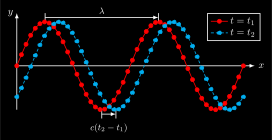](mechanics/wave/wave_inverted.svg) [[PDF]](mechanics/wave/wave_inverted.pdf) [[PNG]](mechanics/wave/wave_inverted.png) [[SVG]](mechanics/wave/wave_inverted.svg)
~~~.tex
\documentclass[crop,tikz]{standalone}
\usetikzlibrary{backgrounds}
\colorlet{blue}{cyan}
\tikzset{
  inverted/.style = {
    color=white,
    background rectangle/.style={fill},
    show background rectangle
  }
}

\usepackage{pgfplots}
\tikzset{>=latex}

\pgfplotsset{
  compat=1.16,
  every non boxed x axis/.append style={
    axis line style={-latex}
  },
  every non boxed y axis/.append style={
    axis line style={-latex}
  },
  inverted/.style = {
    every axis legend/.append style={
      draw=white,
      fill=black,
      text=white
    }
  }
}

\begin{document}
  \begin{tikzpicture}[inverted,inverted]
    \begin{axis}[inverted,
      thick,
      width=10cm,
      height=5cm,
      domain=0:{4*pi},
      samples=50,
      axis y line=middle,
      axis x line=middle,
      xmax={4.2*pi},
      ymax=1.2,
      xlabel={$x$},
      ylabel={$y$},
      xlabel style={right},
      ylabel style={left},
      ticks=none,
      legend cell align={left},
      legend style={at={(0.8,1)},anchor=north west},
      clip=false,
      ]
      \addplot[red,mark=*,smooth] {sin(deg(x))};
      \addplot[blue,mark=*,smooth,densely dashed] {sin(deg(x - pi/4))};
      \legend{$t=t_1$, $t=t_2$};
      \draw[thick,->] (axis cs:1.5*pi,-1.1) -- node[below,yshift=-0.2cm] {\small $c(t_2-t_1)$} (axis cs:7*pi/4,-1.1);
      \draw[] (axis cs:1.5*pi,-1) -- (axis cs:1.5*pi,-1.2);
      \draw[] (axis cs:7*pi/4,-1) -- (axis cs:7*pi/4,-1.2);
      \draw[thick,->] (axis cs:pi/2,1.1) -- node[above] {\small $\lambda$} (axis cs:2.5*pi,1.1);
      \draw[] (axis cs:pi/2,1) -- (axis cs:pi/2,1.2);
      \draw[] (axis cs:2.5*pi,1) -- (axis cs:2.5*pi,1.2);
    \end{axis}
  \end{tikzpicture}
\end{document}
~~~
## work-hub_inverted.svg
 [[PDF]](mechanics/work-hub/work-hub_inverted.pdf) [[PNG]](mechanics/work-hub/work-hub_inverted.png) [[SVG]](mechanics/work-hub/work-hub_inverted.svg)
~~~.tex
\documentclass[crop,tikz]{standalone}
\usetikzlibrary{backgrounds}
\colorlet{blue}{cyan}
\tikzset{
  inverted/.style = {
    color=white,
    background rectangle/.style={fill},
    show background rectangle
  }
}

\usepackage{amsmath}
\tikzset{>=latex}
\usetikzlibrary{calc,patterns}
\colorlet{green}{green}
\newcommand{\Fg}{\vec{F}_g}
\newcommand{\vs}{\vec{s}}

\begin{document}
\begin{tikzpicture}[inverted,scale=1.5]
  \draw[->] (1,0) -- (1,2) node[left] {$z$};
  \draw[] (0.95,1) node[left] {$h$} -- +(0.1,0);
  \coordinate (K) at (1.4,0.1);
  \draw[fill=gray!60] ($(K)+(-0.2,-0.1)$) rectangle ($(K)+(+0.2,0.1)$) node[above right] {$m$};
  \draw[red,->] (K) -- +(0,0.9) node[right] {$\vs$};
  \draw[blue,->] (K) -- +(0,-1) node[right] {$\Fg$};
  \draw (0,0) -- (2,0);
  \pattern[pattern=north east lines] (0,0)--(2,0)--(2,-0.2)--(0,-0.2)--cycle;
\end{tikzpicture}
\end{document}
~~~
## work_inverted.svg
 [[PDF]](mechanics/work/work_inverted.pdf) [[PNG]](mechanics/work/work_inverted.png) [[SVG]](mechanics/work/work_inverted.svg)
~~~.tex
\documentclass[crop,tikz]{standalone}
\usetikzlibrary{backgrounds}
\colorlet{blue}{cyan}
\tikzset{
  inverted/.style = {
    color=white,
    background rectangle/.style={fill},
    show background rectangle
  }
}

\usepackage{amsmath}
\tikzset{>=latex}
\colorlet{green}{green}
\newcommand{\F}{\vec{F}}
\newcommand{\ort}{\vec{r}}
\newcommand{\vs}{\vec{s}}
\newcommand{\dvr}{\text{d}\ort}

\begin{document}
\begin{tikzpicture}[inverted,inverted]
  \coordinate (a) at (230:4);
  \coordinate (c) at (260:4);
  \coordinate (o) at (260:8);
  \draw (a) arc (230:290:4) coordinate (e);
  \draw[fill] (a) circle (0.05);
  \draw[fill] (e) circle (0.05);
  \draw[fill] (c) circle (0.05);
  \draw[fill] (o) circle (0.05) node[below] {$O$};
  \draw[->,shorten >= 1mm] (o) -- node[left]  {$\ort_1$} (a);
  \draw[->,shorten >= 1mm] (o) -- node[right] {$\ort(t)$} (c);
  \draw[->,shorten >= 1mm] (o) -- node[right] {$\ort_2$} (e);
  \draw[->,blue,very thick]  (c) -- node[above] {$\F$} +(30:2);
  \draw[->,green,very thick] (c) -- node[below right] {$\F_s$} +(350:1.5);
  \draw[->,red ,very thick]  (c) -- node[below] {$\dvr$} +(350:0.7);
  \draw[->,red,densely dashed,thick,shorten <= 1mm,shorten >= 1mm] (a) -- (e);
  \node[red,above,xshift=1em] at (a) {$\vs$};
\end{tikzpicture}
\end{document}
~~~
## zentrifugal_inverted.svg
 [[PDF]](mechanics/zentrifugal/zentrifugal_inverted.pdf) [[PNG]](mechanics/zentrifugal/zentrifugal_inverted.png) [[SVG]](mechanics/zentrifugal/zentrifugal_inverted.svg)
~~~.tex
\documentclass[crop,tikz]{standalone}
\usetikzlibrary{backgrounds}
\colorlet{blue}{cyan}
\tikzset{
  inverted/.style = {
    color=white,
    background rectangle/.style={fill},
    show background rectangle
  }
}

\usepackage{amsmath}
\usetikzlibrary{decorations.markings}
\tikzset{>=latex}
\colorlet{green}{green}
\newcommand{\FZf}{\vec{F}_\text{Zf}}
\newcommand{\FZp}{\vec{F}_\text{Zp}}

\begin{document}
\begin{tikzpicture}[inverted,scale=2]
  \draw[->,thick] (-1.2,0) -- (1.2,0) node[below] {$x$};
  \draw[->,thick] (0,-1.2) -- (0,1.2) node[left] {$y$};
  \draw[->,red,thick] (0,0) -- (45:0.4) node[right] {$x'$};
  \draw[->,red,thick] (0,0) -- (90+45:0.4) node[left] {$y'$};
  \draw[
    decoration={markings, mark=at position 0.4 with {\arrow{>}}},
    postaction={decorate},
    green,
    thick
  ] (0,0) circle (1);
  \draw[fill] (45:1) circle (0.03);
  \draw[->,red,thick]  (45:1) -- +(45:0.4) node[above]{$\FZf(t)$};
  \draw[->,blue,thick] (45:1) -- node[left,xshift=0.2em,yshift=0.5em]{$\FZp(t)$} +(-135:0.4);
  \node at (1.2,0.2) {$\Sigma$};
  \node at (110:0.5) {\textcolor{red}{$\Sigma'$}};
\end{tikzpicture}
\end{document}
~~~
## zentripetal_inverted.svg
 [[PDF]](mechanics/zentripetal/zentripetal_inverted.pdf) [[PNG]](mechanics/zentripetal/zentripetal_inverted.png) [[SVG]](mechanics/zentripetal/zentripetal_inverted.svg)
~~~.tex
\documentclass[crop,tikz]{standalone}
\usetikzlibrary{backgrounds}
\colorlet{blue}{cyan}
\tikzset{
  inverted/.style = {
    color=white,
    background rectangle/.style={fill},
    show background rectangle
  }
}

\usepackage{amsmath}
\usetikzlibrary{decorations.markings}
\tikzset{>=latex}
\colorlet{green}{green}
\newcommand{\vel}{\vec{v}}
\newcommand{\FZp}{\vec{F}_\text{Zp}}

\begin{document}
\begin{tikzpicture}[inverted,scale=2]
  \draw[->,thick] (-1.2,0) -- (1.2,0) node[below] {$x$};
  \draw[->,thick] (0,-1.2) -- (0,1.2) node[left] {$y$};
  \draw[
    decoration={markings, mark=at position 0.4 with {\arrow{>}}},
    postaction={decorate},
    green,
    thick
  ] (0,0) circle (1);
  \draw[fill] (45:1) circle (0.03);
  \draw[->,blue,thick] (45:1) -- +(+135:0.5) node[above]{$\vel(t)$};
  \draw[->,red,thick]   (45:1) -- +(-135:0.5) node[below]{$\FZp(t)$};
\end{tikzpicture}
\end{document}
~~~
