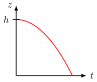

# Mechanics
## actio-reactio.svg
 [[PDF]](mechanics/actio-reactio/actio-reactio.pdf) [[PNG]](mechanics/actio-reactio/actio-reactio.png) [[SVG]](mechanics/actio-reactio/actio-reactio.svg)
~~~.tex
\documentclass[crop,tikz]{standalone}

\usepackage{amsmath}
\tikzset{>=latex}

\begin{document}
\begin{tikzpicture}
  \draw[gray!50,fill] (-2.5,0) circle (1)   coordinate (c1);
  \draw[gray!50,fill] (+2.5,0) circle (0.5) coordinate (c2);
  \node[blue,yshift=1.2cm] at (c1) {1};
  \node[red, yshift=0.7cm] at (c2) {2};
  \draw[->,blue] (c1) -- ++(+1.5,0) node[below] {$\vec{F}_{2\to 1}$};
  \draw[->,red]  (c2) -- ++(-1.5,0) node[below] {$\vec{F}_{1\to 2}$};
\end{tikzpicture}
\end{document}
~~~
## circular-motion-acceleration.svg
 [[PDF]](mechanics/circular-motion-acceleration/circular-motion-acceleration.pdf) [[PNG]](mechanics/circular-motion-acceleration/circular-motion-acceleration.png) [[SVG]](mechanics/circular-motion-acceleration/circular-motion-acceleration.svg)
~~~.tex
\documentclass[crop,tikz]{standalone}

\tikzset{>=latex}
\usetikzlibrary{decorations.markings}
\colorlet{green}{black!40!green}
\definecolor{orange}{RGB}{250,194,25}
\newcommand{\place}{\vec{r}}
\newcommand{\acceleration}{\vec{a}}

\begin{document}
\begin{tikzpicture}[scale=2]
  \draw[->,thick] (-1.2,0) -- (1.2,0) node[below] {$x$};
  \draw[->,thick] (0,-1.2) -- (0,1.2) node[left] {$y$};
  \draw[
    decoration={markings, mark=at position 0.4 with {\arrow{>}}},
    postaction={decorate},
    green,
    thick
  ] (0,0) circle (1);
  \draw[->,thick,red] (0,0) -- (45:1) node[right]{$\place(t)$};
  \begin{scope}[shift={(-0.03,0.03)}]
    \draw[->,thick,orange,dashed] (45:1) -- +(135:0.6) node[left,anchor=south west]{$\acceleration_T(t)$};
    \draw[->,thick,orange,dashed] (45:1) -- +(225:0.6) node[right,anchor=north west]{$\acceleration_R(t)$};
    \draw[->,thick,orange] (45:1) -- +(180:0.84) node[left]{$\acceleration(t)$};
  \end{scope}
\end{tikzpicture}
\end{document}
~~~
## circular-motion.svg
 [[PDF]](mechanics/circular-motion/circular-motion.pdf) [[PNG]](mechanics/circular-motion/circular-motion.png) [[SVG]](mechanics/circular-motion/circular-motion.svg)
~~~.tex
\documentclass[crop,tikz]{standalone}

\tikzset{>=latex}
\colorlet{green}{black!40!green}
\newcommand{\place}{\vec{r}}

\begin{document}
\begin{tikzpicture}[scale=2]
    \draw[->,thick] (-1.2,0) -- (1.2,0) node[below] {$x$};
    \draw[->,thick] (0,-1.2) -- (0,1.2) node[left] {$y$};
    \draw[green, thick] (0,0) circle (1);
    \draw[->,thick,red] (0,0) -- (45:1) node[right,anchor=south west]{$\place(t)$};
    \draw[->,thick] (0.6,0) arc (0:45:0.6);
    \draw (0.4,0) node[above] {$\varphi(t)$};
    \draw (-0.5,0) node[above] {$R$};
    \draw[dashed] (0.707,0.707) -- (0.707,0) node[below] {$x(t)$};
    \draw[dashed] (45:1) -- (0,0.707) node[left] {$y(t)$};
\end{tikzpicture}
\end{document}
~~~
## circular-motion-non-uniform.svg
 [[PDF]](mechanics/circular-motion-non-uniform/circular-motion-non-uniform.pdf) [[PNG]](mechanics/circular-motion-non-uniform/circular-motion-non-uniform.png) [[SVG]](mechanics/circular-motion-non-uniform/circular-motion-non-uniform.svg)
~~~.tex
\documentclass[crop,tikz]{standalone}

\tikzset{>=latex}
\usetikzlibrary{decorations.markings}
\colorlet{green}{black!40!green}
\definecolor{orange}{RGB}{250,194,25}
\newcommand{\place}{\vec{r}}
\newcommand{\velocity}{\vec{v}}
\newcommand{\acceleration}{\vec{a}}

\begin{document}
\begin{tikzpicture}[scale=2]
  % axes
  \draw[->,thick] (-1.2,0) -- (1.2,0) node[below] {$x$};
  \draw[->,thick] (0,-1.2) -- (0,1.2) node[left] {$y$};
  % circle
  \draw[
    decoration={markings, mark=at position 0.4 with {\arrow{>}}},
    postaction={decorate},
    green,
    thick
  ] (0,0) circle (1);
  % place, velocity, acceleration
  \draw[->,thick,red] (0,0) -- node[left,anchor=south east,yshift=-0.2em]{$\place(t)$} (20:1);
  \draw[->,thick,blue] (20:1) -- node[right,anchor=west]{$\velocity(t)$} +(20+90:0.7);
  \draw[->,thick,orange] (20:1) -- ++(160:0.5) node[left,xshift=0.4em,yshift=0.6em] {$\acceleration(t)$};
\end{tikzpicture}
\end{document}
~~~
## circular-motion-non-uniform-velocity-2.svg
 [[PDF]](mechanics/circular-motion-non-uniform-velocity-2/circular-motion-non-uniform-velocity-2.pdf) [[PNG]](mechanics/circular-motion-non-uniform-velocity-2/circular-motion-non-uniform-velocity-2.png) [[SVG]](mechanics/circular-motion-non-uniform-velocity-2/circular-motion-non-uniform-velocity-2.svg)
~~~.tex
\documentclass[crop,tikz]{standalone}

\tikzset{>=latex}
\usetikzlibrary{decorations.markings}
\colorlet{green}{black!40!green}
\newcommand{\place}{\vec{r}}
\newcommand{\velocity}{\vec{v}}
\newcommand{\acceleration}{\vec{a}}

\begin{document}
\begin{tikzpicture}[scale=2]
  % axes
  \draw[->,thick] (-1.2,0) -- (1.2,0) node[below] {$x$};
  \draw[->,thick] (0,-1.2) -- (0,1.2) node[left] {$y$};
  % circle
  \draw[
    decoration={markings, mark=at position 0.4 with {\arrow{>}}},
    postaction={decorate},
    green,
    thick
  ] (0,0) circle (1);
  % place, velocity
  \draw[->,thick,red] (0,0) -- node[anchor=north west,yshift=0.5em]{$\place(t_1)$} (20:1);
  \draw[->,thick,blue] (20:1) -- +(20+90:0.7) node[right]{$\velocity(t_1)$};
  % place, velocity
  \draw[->,thick,red] (0,0) -- node[anchor=south,yshift=0.3em]{$\place(t_2)$} (30:1);
  \draw[->,thick,blue] (30:1) -- +(30+90:0.9) node[above left,yshift=-0.5em]{$\velocity(t_2)$};
\end{tikzpicture}
\end{document}
~~~
## circular-motion-non-uniform-velocity-2-delta.svg
 [[PDF]](mechanics/circular-motion-non-uniform-velocity-2-delta/circular-motion-non-uniform-velocity-2-delta.pdf) [[PNG]](mechanics/circular-motion-non-uniform-velocity-2-delta/circular-motion-non-uniform-velocity-2-delta.png) [[SVG]](mechanics/circular-motion-non-uniform-velocity-2-delta/circular-motion-non-uniform-velocity-2-delta.svg)
~~~.tex
\documentclass[crop,tikz]{standalone}

\tikzset{>=latex}
\usetikzlibrary{decorations.markings}
\colorlet{green}{black!40!green}
\definecolor{orange}{RGB}{250,194,25}
\newcommand{\place}{\vec{r}}
\newcommand{\velocity}{\vec{v}}
\newcommand{\acceleration}{\vec{a}}

\begin{document}
\begin{tikzpicture}[scale=2]
  % axes
  \draw[->,thick] (-1.2,0) -- (1.2,0) node[below] {$x$};
  \draw[->,thick] (0,-1.2) -- (0,1.2) node[left] {$y$};
  % circle
  \draw[
    decoration={markings, mark=at position 0.4 with {\arrow{>}}},
    postaction={decorate},
    green,
    thick
  ] (0,0) circle (1);
  % place, velocity
  \draw[->,thick,blue] (20:1) -- node[right]{$\velocity(t_1)$} ++(20+90:0.7) coordinate (v1);
  % place, velocity
  \draw[->,thick,blue] (20:1) -- node[left]{$\velocity(t_2)$} ++(30+90:0.9) coordinate (v2);
  \draw[->,thick,orange] (v1) -- node[above] {$\Delta\velocity$} (v2);
\end{tikzpicture}
\end{document}
~~~
## circular-motion-uniform.svg
 [[PDF]](mechanics/circular-motion-uniform/circular-motion-uniform.pdf) [[PNG]](mechanics/circular-motion-uniform/circular-motion-uniform.png) [[SVG]](mechanics/circular-motion-uniform/circular-motion-uniform.svg)
~~~.tex
\documentclass[crop,tikz]{standalone}

\tikzset{>=latex}
\usetikzlibrary{decorations.markings}
\colorlet{green}{black!40!green}
\definecolor{orange}{RGB}{250,194,25}
\newcommand{\place}{\vec{r}}
\newcommand{\velocity}{\vec{v}}
\newcommand{\acceleration}{\vec{a}}

\begin{document}
\begin{tikzpicture}[scale=2]
  % axes
  \draw[->,thick] (-1.2,0) -- (1.2,0) node[below] {$x$};
  \draw[->,thick] (0,-1.2) -- (0,1.2) node[left] {$y$};
  % circle
  \draw[
    decoration={markings, mark=at position 0.4 with {\arrow{>}}},
    postaction={decorate},
    green,
    thick
  ] (0,0) circle (1);
  % place, velocity, acceleration
  \draw[->,thick,red] (0,0) -- node[left,anchor=south east,yshift=-0.2em]{$\place(t)$} (20:1);
  \draw[->,thick,blue] (20:1) -- node[right,anchor=west]{$\velocity(t)$} +(20+90:0.7);
  \begin{scope}[shift={(-0.03,0.03)}]
    \draw[->,thick,orange] (20:1) -- node[left, anchor=south east] {$\acceleration(t)$} (20:0.8);
  \end{scope}
\end{tikzpicture}
\end{document}
~~~
## circular-motion-uniform-velocity-2.svg
 [[PDF]](mechanics/circular-motion-uniform-velocity-2/circular-motion-uniform-velocity-2.pdf) [[PNG]](mechanics/circular-motion-uniform-velocity-2/circular-motion-uniform-velocity-2.png) [[SVG]](mechanics/circular-motion-uniform-velocity-2/circular-motion-uniform-velocity-2.svg)
~~~.tex
\documentclass[crop,tikz]{standalone}

\tikzset{>=latex}
\usetikzlibrary{decorations.markings}
\colorlet{green}{black!40!green}
\newcommand{\place}{\vec{r}}
\newcommand{\velocity}{\vec{v}}
\newcommand{\acceleration}{\vec{a}}

\begin{document}
\begin{tikzpicture}[scale=2]
  % axes
  \draw[->,thick] (-1.2,0) -- (1.2,0) node[below] {$x$};
  \draw[->,thick] (0,-1.2) -- (0,1.2) node[left] {$y$};
  % circle
  \draw[
    decoration={markings, mark=at position 0.4 with {\arrow{>}}},
    postaction={decorate},
    green,
    thick
  ] (0,0) circle (1);
  % place, velocity
  \draw[->,thick,red] (0,0) -- node[anchor=north west,yshift=0.5em]{$\place(t_1)$} (20:1);
  \draw[->,thick,blue] (20:1) -- +(20+90:0.7) node[right]{$\velocity(t_1)$};
  % place, velocity
  \draw[->,thick,red] (0,0) -- node[anchor=south,yshift=0.3em]{$\place(t_2)$} (30:1);
  \draw[->,thick,blue] (30:1) -- +(30+90:0.7) node[above left,yshift=-0.5em]{$\velocity(t_2)$};
\end{tikzpicture}
\end{document}
~~~
## circular-motion-uniform-velocity-2-delta.svg
 [[PDF]](mechanics/circular-motion-uniform-velocity-2-delta/circular-motion-uniform-velocity-2-delta.pdf) [[PNG]](mechanics/circular-motion-uniform-velocity-2-delta/circular-motion-uniform-velocity-2-delta.png) [[SVG]](mechanics/circular-motion-uniform-velocity-2-delta/circular-motion-uniform-velocity-2-delta.svg)
~~~.tex
\documentclass[crop,tikz]{standalone}

\tikzset{>=latex}
\usetikzlibrary{decorations.markings}
\colorlet{green}{black!40!green}
\definecolor{orange}{RGB}{250,194,25}
\newcommand{\velocity}{\vec{v}}
\newcommand{\acceleration}{\vec{a}}

\begin{document}
\begin{tikzpicture}[scale=2]
  % axes
  \draw[->,thick] (-1.2,0) -- (1.2,0) node[below] {$x$};
  \draw[->,thick] (0,-1.2) -- (0,1.2) node[left] {$y$};
  % circle
  \draw[
    decoration={markings, mark=at position 0.4 with {\arrow{>}}},
    postaction={decorate},
    green,
    thick
  ] (0,0) circle (1);
  % place, velocity
  \draw[->,thick,blue] (20:1) -- node[right]{$\velocity(t_1)$} ++(20+90:0.7) coordinate (v1);
  % place, velocity
  \draw[->,thick,blue] (20:1) -- node[left]{$\velocity(t_2)$} ++(30+90:0.7) coordinate (v2);
  \draw[->,thick,orange] (v1) -- node[above] {$\Delta\velocity$} (v2);
\end{tikzpicture}
\end{document}
~~~
## circular-motion-velocity-2.svg
 [[PDF]](mechanics/circular-motion-velocity-2/circular-motion-velocity-2.pdf) [[PNG]](mechanics/circular-motion-velocity-2/circular-motion-velocity-2.png) [[SVG]](mechanics/circular-motion-velocity-2/circular-motion-velocity-2.svg)
~~~.tex
\documentclass[crop,tikz]{standalone}

\tikzset{>=latex}
\usetikzlibrary{decorations.markings}
\colorlet{green}{black!40!green}
\newcommand{\place}{\vec{r}}
\newcommand{\velocity}{\vec{v}}

\begin{document}
\begin{tikzpicture}[scale=2]
  \draw[->,thick] (-1.2,0) -- (1.2,0) node[below] {$x$};
  \draw[->,thick] (0,-1.2) -- (0,1.2) node[left] {$y$};
  \draw[
    decoration={markings, mark=at position 0.3 with {\arrow{>}}},
    postaction={decorate},
    green,
    thick
  ] (0,0) circle (1);
  % 1
  \draw[->,thick,red] (0,0) -- node[left,yshift=1em,xshift=0.5em] {$\place(t)$} (45:1);
  \draw[->,thick,blue] (45:1) -- node[right,yshift=0.5em]{$\velocity(t)$} +(135:0.6);
  % 2
  \draw[->,thick,red] (0,0) -- node[right,yshift=1em,xshift=-0.5em] {$\place(t)$} (135:1);
  \draw[->,thick,blue] (135:1) -- node[left,yshift=0.5em]{$\velocity(t)$} +(225:0.6);
\end{tikzpicture}
\end{document}
~~~
## circular-motion-velocity.svg
 [[PDF]](mechanics/circular-motion-velocity/circular-motion-velocity.pdf) [[PNG]](mechanics/circular-motion-velocity/circular-motion-velocity.png) [[SVG]](mechanics/circular-motion-velocity/circular-motion-velocity.svg)
~~~.tex
\documentclass[crop,tikz]{standalone}

\tikzset{>=latex}
\usetikzlibrary{decorations.markings}
\colorlet{green}{black!40!green}
\newcommand{\place}{\vec{r}}
\newcommand{\velocity}{\vec{v}}

\begin{document}
\begin{tikzpicture}[scale=2]
    \draw[->,thick] (-1.2,0) -- (1.2,0) node[below] {$x$};
    \draw[->,thick] (0,-1.2) -- (0,1.2) node[left] {$y$};
    \draw[
      decoration={markings, mark=at position 0.4 with {\arrow{>}}},
      postaction={decorate},
      green,
      thick
    ] (0,0) circle (1);
    \draw[->,thick,red] (0,0) -- node[right,anchor=north west]{$\place(t)$} (45:1);
    \draw[->,thick,blue] (45:1) -- +(135:0.6) node[right,anchor=south west]{$\velocity(t)$};
\end{tikzpicture}
\end{document}
~~~
## constraint-force-inclined-plane.svg
 [[PDF]](mechanics/constraint-force-inclined-plane/constraint-force-inclined-plane.pdf) [[PNG]](mechanics/constraint-force-inclined-plane/constraint-force-inclined-plane.png) [[SVG]](mechanics/constraint-force-inclined-plane/constraint-force-inclined-plane.svg)
~~~.tex
\documentclass[crop,tikz]{standalone}

\usetikzlibrary{calc}
\tikzset{>=latex}
\colorlet{green}{black!40!green}
\colorlet{gray}{gray!20}
\newcommand{\F}{\vec{F}}
\newcommand{\Z}{\vec{Z}}

\begin{document}
\begin{tikzpicture}[scale=2.5]
  \draw[fill=gray] (0,0) -- (2,0) -- (0,1) -- cycle;
  \draw (2,0) -- (0,1);
  \draw ([shift={(153.4:0.6)}]2,0) arc (153.4:180:0.6);
  \draw (1.6,0) node[above] {$\alpha$};
  \coordinate (a) at (1,0.55);
  \draw[fill,black] (a) circle (0.04);
  \draw[->,thick,red] (a) -- +(0,-1) node[below] {$\F_g$};
  \pgfmathsetmacro{\al}{atan(0.5)} % angle
  \pgfmathsetmacro{\sa}{sin(\al)}; % sin(angle)
  \pgfmathsetmacro{\ca}{cos(\al)}; % cos(angle)
  \draw[->,thick,green] (a) -- +($(\sa*\ca,-\sa*\sa)$) node[above] {$\F_H$};
  \draw[->,thick,green,dashed] (a) -- +($(-\sa*\ca,-\ca*\ca)$) node[below] {$\F_N$};
  \draw[->,thick,blue] (a) -- +($(\sa*\ca,\ca*\ca)$) node[above] {$\Z$};
\end{tikzpicture}
\end{document}
~~~
## constraint-force-table.svg
 [[PDF]](mechanics/constraint-force-table/constraint-force-table.pdf) [[PNG]](mechanics/constraint-force-table/constraint-force-table.png) [[SVG]](mechanics/constraint-force-table/constraint-force-table.svg)
~~~.tex
\documentclass[crop,tikz]{standalone}

\tikzset{>=latex}
\colorlet{gray}{gray!20}
\newcommand{\F}{\vec{F}}
\newcommand{\Z}{\vec{Z}}

\begin{document}
\begin{tikzpicture}[scale=1.5]
  \draw[fill,gray] (xyz cs:x=0.1,z=-0.2) -- ++(xyz cs:x=2.6) -- ++(xyz cs:z=-3) -- ++(xyz cs:x=-2.6) -- cycle;
  \draw[->] (xyz cs:x=-0.5) -- (xyz cs:x=3) node[below] {$x$};
  \draw[->] (xyz cs:y=-0.5) -- (xyz cs:y=2) node[left] {$z$};
  \draw[->] (xyz cs:z=1) -- (xyz cs:z=-3) node[above] {$y$};
  \draw[fill,black] (xyz cs:x=1.5,z=-1.5) circle (0.1);
  \draw[->,red] (xyz cs:x=1.5,z=-1.5) -- ++(0,-1) node[below] {$\F_g$};
  \draw[->,blue] (xyz cs:x=1.5,z=-1.5) -- ++(0,+1) node[above] {$\Z$};
\end{tikzpicture}
\end{document}
~~~
## curve-length.svg
 [[PDF]](mechanics/curve-length/curve-length.pdf) [[PNG]](mechanics/curve-length/curve-length.png) [[SVG]](mechanics/curve-length/curve-length.svg)
~~~.tex
\documentclass[crop,tikz]{standalone}

\tikzset{>=latex}
\usetikzlibrary{calc}
\colorlet{green}{black!40!green}
\newcommand{\place}{\vec{r}}

\begin{document}
\begin{tikzpicture}[scale=1.3]
  % axes
  \draw[->,thick] (xyz cs:x=-0.5) -- (xyz cs:x=4)  node[below] {$x$};
  \draw[->,thick] (xyz cs:y=-0.5) -- (xyz cs:y=3)  node[left] {$z$};
  \draw[->,thick] (xyz cs:z=1)    -- (xyz cs:z=-4) node[above] {$y$};
  % space point
  \coordinate (r1) at ($(1,0.5)+(70:2)$);
  \coordinate (r2) at ($(1,0.5)+(20:2)$);
  % path
  \draw[thick,green] (r1) arc (70:20:2);
  \node[right,xshift=0.5em,green] at ($(1,0.5)+(50:2)$) {$s(t_1,t_2)$};
  % space-point vectors
  \draw[->,thick,red] (xyz cs:x=0) -- node[above,xshift=-1em]{$\place(t_1)$} (r1);
  \draw[->,thick,red] (xyz cs:x=0) -- node[below,xshift=+1em]{$\place(t_2)$} (r2);
\end{tikzpicture}
\end{document}
~~~
## curve-length-parts.svg
 [[PDF]](mechanics/curve-length-parts/curve-length-parts.pdf) [[PNG]](mechanics/curve-length-parts/curve-length-parts.png) [[SVG]](mechanics/curve-length-parts/curve-length-parts.svg)
~~~.tex
\documentclass[crop,tikz]{standalone}

\tikzset{>=latex}
\usetikzlibrary{calc}
\colorlet{green}{black!40!green}
\newcommand{\place}{\vec{r}}

\begin{document}
\begin{tikzpicture}[scale=1.3]
  % axes
  \draw[->,thick] (xyz cs:x=-0.5) -- (xyz cs:x=4)  node[below] {$x$};
  \draw[->,thick] (xyz cs:y=-0.5) -- (xyz cs:y=3)  node[left] {$z$};
  \draw[->,thick] (xyz cs:z=1)    -- (xyz cs:z=-4) node[above] {$y$};
  % space point
  \coordinate (r1) at ($(1,0.5)+(70:2)$);
  \coordinate (r2) at ($(1,0.5)+(20:2)$);
  % path
  \draw[thick,green] (r1) arc (70:20:2);
  \node[right,xshift=0.5em,green] at ($(1,0.5)+(50:2)$) {$s(t_1,t_2)$};
  % space-point vectors
  \foreach \r/\n in { 70/1, 53.3333/2, 36.6667/3 } {%
    \draw[->,gray] (0,0) -- ($(1,0.5)+({\r-50/3}:2)$);
    \draw[->] ($(1,0.5)+(\r:2)$) -- ($(1,0.5)+({\r-50/3}:2)$);
    \node[scale=0.7] at ($(1,0.5)+({\r-50/6}:1.8)$) {$\Delta\place_{\n}$};
  }
  % main space-point vectors
  \draw[->,thick,red] (xyz cs:x=0) -- node[above,xshift=-1em]{$\place(t_1)$} (r1);
  \draw[->,thick,red] (xyz cs:x=0) -- node[below,xshift=+1em]{$\place(t_2)$} (r2);
\end{tikzpicture}
\end{document}
~~~
## force-addition.svg
 [[PDF]](mechanics/force-addition/force-addition.pdf) [[PNG]](mechanics/force-addition/force-addition.png) [[SVG]](mechanics/force-addition/force-addition.svg)
~~~.tex
\documentclass[crop,tikz]{standalone}

\usepackage{amsmath}
\tikzset{>=latex}
\newcommand{\F}{\vec{F}}

\begin{document}
\begin{tikzpicture}
  \draw[step=1.0,gray!50,very thin] (-1,-2) grid (4,2);
  \draw[->] (-1,0) -- (4,0) node[right] {$F_x/\text{N}$};
  \draw[->] (0,-2) -- (0,2) node[above] {$F_y/\text{N}$};
  % 
  \draw[->,blue] (0,0) -- node[above] {$\F_1$} (2,1);
  \draw[->,blue] (0,0) -- node[below] {$\F_2$} (1,-1);
  \draw[->,red,thick] (0,0) -- node[above,xshift=1em] {$\F_\text{res}$} (3,0);
  \draw[->,blue,dashed] (2,1) -- (3,0);
  \draw[->,blue,dashed] (1,-1) -- (3,0);
\end{tikzpicture}
\end{document}
~~~
## free-fall-a.svg
 [[PDF]](mechanics/free-fall-a/free-fall-a.pdf) [[PNG]](mechanics/free-fall-a/free-fall-a.png) [[SVG]](mechanics/free-fall-a/free-fall-a.svg)
~~~.tex
\documentclass[crop,tikz]{standalone}

\tikzset{>=latex}

\begin{document}
\begin{tikzpicture}[scale=2.5]
  \draw[->] (0,0) -- (1,0) node[right] {$t$};
  \draw[->] (0,-0.8) -- (0,0.2) node[left] {$a_z$};
  \draw[red] (0,-0.5) -- (0.8,-0.5);
  \draw (-0.05,-0.5) node[left] {$-g$} -- (0.05,-0.5);
\end{tikzpicture}
\end{document}
~~~
## free-fall.svg
 [[PDF]](mechanics/free-fall-v/free-fall/free-fall.pdf) [[PNG]](mechanics/free-fall-v/free-fall/free-fall.png) [[SVG]](mechanics/free-fall-v/free-fall/free-fall.svg)
~~~.tex
\documentclass[crop,tikz]{standalone}

\tikzset{>=latex}
\usetikzlibrary{patterns}

\begin{document}
\begin{tikzpicture}[scale=1.5]
  \draw[->] (1,0) -- (1,2) node[left] {$z$};
  \coordinate (r) at (1.1,1.5);
  \draw[red,->] (r) -- ++(0,-1);
  \draw[red,fill] (r) circle (0.05);
  \draw (0,0) -- (2,0);
  \pattern[pattern=north east lines] (0,0)--(2,0)--(2,-0.2)--(0,-0.2)--cycle;
\end{tikzpicture}
\end{document}
~~~
## free-fall-v.svg
 [[PDF]](mechanics/free-fall-v/free-fall-v.pdf) [[PNG]](mechanics/free-fall-v/free-fall-v.png) [[SVG]](mechanics/free-fall-v/free-fall-v.svg)
~~~.tex
\documentclass[crop,tikz]{standalone}

\tikzset{>=latex}

\begin{document}
\begin{tikzpicture}[scale=2.5]
  \draw[->] (0,0) -- (1,0) node[right] {$t$};
  \draw[->] (0,-0.8) -- (0,0.2) node[left] {$v_z$};
  \draw[red] (0,0) -- (0.8,-0.8);
\end{tikzpicture}
\end{document}
~~~
## free-fall-z.svg
 [[PDF]](mechanics/free-fall-z/free-fall-z.pdf) [[PNG]](mechanics/free-fall-z/free-fall-z.png) [[SVG]](mechanics/free-fall-z/free-fall-z.svg)
~~~.tex
\documentclass[crop,tikz]{standalone}

\tikzset{>=latex}

\begin{document}
\begin{tikzpicture}[scale=2.5]
  \draw[->] (0,0) -- (1,0) node[right] {$t$};
  \draw[->] (0,0) -- (0,1) node[left] {$z$};
  \draw[red] (0,0.8) parabola bend (0,0.8) (0.8,0);
  \draw (-0.05,0.8) node[left] {$h$} -- (0.05,0.8);
\end{tikzpicture}
\end{document}
~~~
## friction.svg
 [[PDF]](mechanics/friction/friction.pdf) [[PNG]](mechanics/friction/friction.png) [[SVG]](mechanics/friction/friction.svg)
~~~.tex
\documentclass[crop,tikz]{standalone}

\usepackage{amsmath}
\newcommand{\F}{\vec{F}}
\tikzset{>=latex}
\usetikzlibrary{patterns,decorations.pathmorphing}

\begin{document}
\begin{tikzpicture}[scale=1.4]
  \pattern[pattern=north east lines,pattern color=black] (-1,0)--++(0,-0.2)--++(4,0)--++(0,0.2)--cycle;
  \draw (-1,0) -- ++(4,0);
  \draw[fill=gray!20] (0,0) rectangle (2,1);
  \draw[->,thick,blue] (1,0.05) -- ++(2,0) node[above] {$\F_S$};
  \draw[->,thick,red] (1,0.05) -- ++(-1.5,0) node[above] {$\F_R$};
\end{tikzpicture}
\end{document}
~~~
## gravitational-force-earth.svg
 [[PDF]](mechanics/gravitational-force-earth/gravitational-force-earth.pdf) [[PNG]](mechanics/gravitational-force-earth/gravitational-force-earth.png) [[SVG]](mechanics/gravitational-force-earth/gravitational-force-earth.svg)
~~~.tex
\documentclass[crop,tikz]{standalone}

\tikzset{>=latex}
\newcommand{\place}{\vec{r}}
\newcommand{\F}{\vec{F}}

\begin{document}
\begin{tikzpicture}
  \draw[] (0,0) circle (2);
  \draw[fill,black] (45:2.1) circle (0.1) node[right] {$m$};
  \draw[->] (0,0) -- node[above,xshift=-0.5em] {$\place_1$} (45:2);
  \node[below] at (0,0) {$0$};
  \begin{scope}[shift={(0.05,-0.05)}]
    \draw[->,red,thick] (45:2) -- node[below,xshift=0.5em] {$\F_g$} (45:1);
  \end{scope}
\end{tikzpicture}
\end{document}
~~~
## gravitational-force.svg
 [[PDF]](mechanics/gravitational-force/gravitational-force.pdf) [[PNG]](mechanics/gravitational-force/gravitational-force.png) [[SVG]](mechanics/gravitational-force/gravitational-force.svg)
~~~.tex
\documentclass[crop,tikz]{standalone}

\tikzset{>=latex}
\newcommand{\place}{\vec{r}}
\newcommand{\F}{\vec{F}}
\colorlet{green}{black!40!green}

\begin{document}
\begin{tikzpicture}[scale=2]
  \draw[->] (0,0) node[below] {$0$} -- node[left] {$\place_1$} (-1,1);
  \draw[->] (0,0) -- node[right] {$\place_2$} (1,1);
  \draw[fill,black] (-1,1)+(-0.1,0.1) circle (0.08);
  \draw[fill,black] (1,1)+(0.1,0.1) circle (0.08);
  \draw[->,green] (-1,1.15) -- node[above] {$\place_2-\place_1$} (1,1.15);
  \draw[->,blue] (1,1.05) -- node[below] {$\place_1-\place_2$} (-1,1.05);
  \draw (-1.2,1.1) node[left] {$m_1$};
  \draw (1.2,1.1) node[right] {$m_2$};
  \draw[->,red] (-1.1,1.25) -- node[above] {$\F_{G,2\to 1}$} +(0.5,0);
  \draw[->,red] (1.1,1.25) -- node[above] {$\F_{G,1\to 2}$} +(-0.5,0);
\end{tikzpicture}
\end{document}
~~~
## ship-forces.svg
 [[PDF]](mechanics/ship-forces/ship-forces.pdf) [[PNG]](mechanics/ship-forces/ship-forces.png) [[SVG]](mechanics/ship-forces/ship-forces.svg)
~~~.tex
\documentclass[crop,tikz]{standalone}

\usepackage{amsmath}
\usetikzlibrary{calc}
\tikzset{>=latex}
\newcommand{\F}{\vec{F}}

\newcommand{\bigship}[3]{%
  \begin{scope}[shift={#1}, scale={#2/10}, rotate=#3, xscale=-1]
    \draw[fill=black, rounded corners=1] (0,0) -- ++(1,-1) -- ++(9,0) -- ++(0,1) -- cycle;%
    \draw[fill=black, rounded corners=1] (7,0.1) rectangle ++(2,0.7);%
  \end{scope}
}

\newcommand{\smallship}[3]{%
  \begin{scope}[shift={#1}, scale={#2/2}, rotate=#3, xscale=-1]
    \draw[fill=black, rounded corners=1] (0,0) -- ++(0.7,-1) -- ++(2,0) -- ++(0,1) -- cycle;%
    \draw[fill=black, rounded corners=1] (1.6,0) rectangle ++(1,0.4);%
  \end{scope}
}

\begin{document}
\begin{tikzpicture}
  \bigship{(0,0)}{3}{0}
  \smallship{(-42:2.3)}{0.6}{-45}
  \smallship{(29:3.1)}{0.6}{30}
  % arrows
  \draw[->, blue, thick] (0,0) -- node[above left] {$\F_1$} (2,1) coordinate (F1);
  \draw[->, blue, thick] (0,0) -- node[below left] {$\F_2$} (1,-1) coordinate (F2);
  \draw[->, red , thick] (0,0) -- node[above right] {$\F_\text{res}$} ($(F1)+(F2)$);
\end{tikzpicture}
\end{document}
~~~
## space-point-2-delta.svg
 [[PDF]](mechanics/space-point-2-delta/space-point-2-delta.pdf) [[PNG]](mechanics/space-point-2-delta/space-point-2-delta.png) [[SVG]](mechanics/space-point-2-delta/space-point-2-delta.svg)
~~~.tex
\documentclass[crop,tikz]{standalone}

\tikzset{>=latex}
\usetikzlibrary{calc,decorations.markings}
\colorlet{green}{black!40!green}
\newcommand{\place}{\vec{r}}

\begin{document}
\begin{tikzpicture}[scale=1.3]
  % axes
  \draw[->,thick] (xyz cs:x=-0.5) -- (xyz cs:x=4)  node[below] {$x$};
  \draw[->,thick] (xyz cs:y=-0.5) -- (xyz cs:y=3)  node[left] {$z$};
  \draw[->,thick] (xyz cs:z=1)    -- (xyz cs:z=-4) node[above] {$y$};
  % path
  \draw[thick,
        decoration={markings, mark=at position 0.5 with {\arrow{>}}},
        postaction={decorate},
        green]
       (xyz cs:x=1,y=2.5,z=0) arc (90:0:2);
  % space point
  \coordinate (r1) at ($(1,0.5)+(70:2)$);
  \coordinate (r2) at ($(1,0.5)+(20:2)$);
  \draw[->,thick,red] (xyz cs:x=0) -- node[above,xshift=-1em]{$\place(t_1)$} (r1);
  \draw[->,thick,red] (xyz cs:x=0) -- node[below,xshift=+1em]{$\place(t_2)$} (r2);
  % delta r
  \draw[->,thick,dashed] (r1) -- node[below,anchor=east,xshift=0.5em,yshift=-1em]{$\Delta\place$} (r2);
\end{tikzpicture}
\end{document}
~~~
## space-point-2.svg
 [[PDF]](mechanics/space-point-2/space-point-2.pdf) [[PNG]](mechanics/space-point-2/space-point-2.png) [[SVG]](mechanics/space-point-2/space-point-2.svg)
~~~.tex
\documentclass[crop,tikz]{standalone}

\tikzset{>=latex}
\usetikzlibrary{calc,decorations.markings}
\colorlet{green}{black!40!green}
\newcommand{\place}{\vec{r}}

\begin{document}
\begin{tikzpicture}[scale=1.3]
  % axes
  \draw[->,thick] (xyz cs:x=-0.5) -- (xyz cs:x=4)  node[below] {$x$};
  \draw[->,thick] (xyz cs:y=-0.5) -- (xyz cs:y=3)  node[left] {$z$};
  \draw[->,thick] (xyz cs:z=1)    -- (xyz cs:z=-4) node[above] {$y$};
  % path
  \draw[thick,
        decoration={markings, mark=at position 0.5 with {\arrow{>}}},
        postaction={decorate},
        green]
       (xyz cs:x=1,y=2.5,z=0) arc (90:0:2);
  % space point
  \coordinate (r1) at ($(1,0.5)+(70:2)$);
  \coordinate (r2) at ($(1,0.5)+(20:2)$);
  \draw[->,thick,red] (xyz cs:x=0) -- node[above,xshift=-1em]{$\place(t_1)$} (r1);
  \draw[->,thick,red] (xyz cs:x=0) -- node[below,xshift=+1em]{$\place(t_2)$} (r2);
\end{tikzpicture}
\end{document}
~~~
## space-point.svg
 [[PDF]](mechanics/space-point/space-point.pdf) [[PNG]](mechanics/space-point/space-point.png) [[SVG]](mechanics/space-point/space-point.svg)
~~~.tex
\documentclass[crop,tikz]{standalone}

\tikzset{>=latex}
\newcommand{\place}{\vec{r}}
\newcommand{\ex}{\vec{e}_x}
\newcommand{\ey}{\vec{e}_y}
\newcommand{\ez}{\vec{e}_z}

\begin{document}
\begin{tikzpicture}[scale=1.3]
  % axes
  \draw[->,thick] (xyz cs:x=-0.5) -- (xyz cs:x=4)  node[below] {$x$};
  \draw[->,thick] (xyz cs:y=-0.5) -- (xyz cs:y=3)  node[left]  {$z$};
  \draw[->,thick] (xyz cs:z=1)    -- (xyz cs:z=-4) node[above] {$y$};
  % dashed lines
  \draw[dashed] (xyz cs:x=3)  -- ++(xyz cs:z=-2) -- ++(xyz cs:y=2) coordinate (p) node[above] {$P(x,y,z)$};
  \draw[dashed] (xyz cs:z=-2) -- ++(xyz cs:x=3);
  \draw[dashed] (xyz cs:x=0,y=2,z=0) -- ++(xyz cs:x=3) -- ++(xyz cs:z=-2) -- ++(xyz cs:x=-3) -- ++(xyz cs:z=2);
  \draw[dashed] (xyz cs:x=3)  -- ++(xyz cs:y=2);
  \draw[dashed] (xyz cs:z=-2) -- ++(xyz cs:y=2);
  \node[fill,circle,inner sep=1.5pt] at (p) {};
  % point
  \draw[->,very thick,red,shorten >= 0.5mm] (xyz cs:x=0) -- node[below]{$\place$} (xyz cs:x=3,y=2,z=-2);
  % unit vectors
  \draw[->,very thick,blue] (xyz cs:x=0) -- node[below]{$\ex$} (xyz cs:x=1);
  \draw[->,very thick,blue] (xyz cs:x=0) -- (xyz cs:z=-1) node[left,yshift=0.6em,xshift=0.3em]{$\ey$};
  \draw[->,very thick,blue] (xyz cs:x=0) -- node[left]{$\ez$} (xyz cs:y=1);
\end{tikzpicture}
\end{document}
~~~
## spring-2.svg
 [[PDF]](mechanics/spring-2/spring-2.pdf) [[PNG]](mechanics/spring-2/spring-2.png) [[SVG]](mechanics/spring-2/spring-2.svg)
~~~.tex
\documentclass[crop,tikz]{standalone}

\usepackage{amsmath}
\tikzset{>=latex}
\usetikzlibrary{calc,patterns,decorations.pathmorphing}

\begin{document}
\begin{tikzpicture}[scale=2]
  % wall
  \draw (-1,0.5) -- (-1,0) -- (1,0);
  \pattern[pattern=north east lines,pattern color=black] (-1.2,0.5)--++(0.2,0)--++(0,-0.5)
    --++(2,0)--++(0,-0.2)--++(-2,0)--++(-0.2,0)--cycle;
  % circle
  \coordinate (c) at (0,0.25);
  \draw[decoration={aspect=0.3, segment length=2mm, amplitude=2mm,coil},decorate] (-1,0.25) -- (c);
  \draw[red,fill] (c) circle (0.25);
  % spring force
  \draw[->,blue] ($(c)+(0,0.1)$) -- ++(0.5,0) node[above]{$\vec{F}$};
  \coordinate (o) at ($(c)+(1,0)$);
  % space vector
  \draw[->] (o) -- node[below, xshift=1em] {$\vec{r}$} (c);
  \draw ($(o)+(0,-0.1)$) -- ++(0,0.2) node[above] {$0$};
\end{tikzpicture}
\end{document}
~~~
## spring.svg
 [[PDF]](mechanics/spring/spring.pdf) [[PNG]](mechanics/spring/spring.png) [[SVG]](mechanics/spring/spring.svg)
~~~.tex
\documentclass[crop,tikz]{standalone}

\usepackage{amsmath}
\tikzset{>=latex}
\usetikzlibrary{patterns,decorations.pathmorphing}

\begin{document}
\begin{tikzpicture}[scale=2]
  \draw[->] (-0.9,1) -- (1,1) node[right] {$x$};
  \draw (0,0.9) -- (0,1.1) node[above] {$0$};
  \draw (-1,1) -- (-1,0) -- (1,0);
  \pattern[pattern=north east lines,pattern color=black] (-1.2,1)--++(0.2,0)--++(0,-1)
  --++(2,0)--++(0,-0.2)--++(-2,0)--++(-0.2,0)--cycle;
  \draw[decoration={aspect=0.3, segment length=2mm, amplitude=2mm,coil},decorate] (-1,0.25) -- (0.5,0.25);
  \draw[red,fill] (0.5,0.25) circle (0.25);
  \draw[->] (0.5,0.75) node[right]{$\vec{F}$} -- (0,0.75);
\end{tikzpicture}
\end{document}
~~~
## straight-curve.svg
 [[PDF]](mechanics/straight-curve/straight-curve.pdf) [[PNG]](mechanics/straight-curve/straight-curve.png) [[SVG]](mechanics/straight-curve/straight-curve.svg)
~~~.tex
\documentclass[crop,tikz]{standalone}

\tikzset{>=latex}
\usetikzlibrary{decorations.markings}
\colorlet{green}{black!40!green}

\begin{document}
\begin{tikzpicture}[scale=1.3]
  % axes
  \draw[->,thick] (xyz cs:x=-0.5) -- (xyz cs:x=4)  node[below] {$x$};
  \draw[->,thick] (xyz cs:y=-0.5) -- (xyz cs:y=3)  node[left]  {$z$};
  \draw[->,thick] (xyz cs:z=1)    -- (xyz cs:z=-4) node[above] {$y$};
  % path
  \draw[red,very thick,
        decoration={markings, mark=at position 0.8 with {\arrow{>}}},
        postaction={decorate},
        green]
       (xyz cs:x=-1) -- (xyz cs:x=4,y=3,z=2);
\end{tikzpicture}
\end{document}
~~~
## velocity-2-delta.svg
 [[PDF]](mechanics/velocity-2-delta/velocity-2-delta.pdf) [[PNG]](mechanics/velocity-2-delta/velocity-2-delta.png) [[SVG]](mechanics/velocity-2-delta/velocity-2-delta.svg)
~~~.tex
\documentclass[crop,tikz]{standalone}

\tikzset{>=latex}
\usetikzlibrary{calc,decorations.markings}
\colorlet{green}{black!40!green}
\definecolor{orange}{RGB}{250,194,25}
\newcommand{\place}{\vec{r}}
\newcommand{\velocity}{\vec{v}}

\begin{document}
\begin{tikzpicture}[scale=1.3]
  % axes
  \draw[->,thick] (xyz cs:x=-0.5) -- (xyz cs:x=4)  node[below] {$x$};
  \draw[->,thick] (xyz cs:y=-0.5) -- (xyz cs:y=3)  node[left] {$z$};
  \draw[->,thick] (xyz cs:z=1)    -- (xyz cs:z=-4);
  % path
  \draw[thick,
        decoration={markings, mark=at position 0.5 with {\arrow{>}}},
        postaction={decorate},
        green!20!white]
       (xyz cs:x=1,y=2.5,z=0) arc (90:0:2);
  % space point
  \coordinate (r1) at ($(1,0.5)+(70:2)$);
  \coordinate (r2) at ($(1,0.5)+(20:2)$);
  % velocities
  \draw[->,thick,blue] (r1) -- node[above,xshift=0.5em]{$\velocity(t_1)$} ++(-20:1.5) coordinate (v1);
  \draw[->,thick,blue] (r1) -- node[left]{$\velocity(t_2)$} ++(-70:0.8) coordinate (v2);
  % delta
  \draw[->,thick,orange] (v1) -- node[below, xshift=-0.5em]{$\Delta\velocity$} (v2);
\end{tikzpicture}
\end{document}
~~~
## velocity-2.svg
 [[PDF]](mechanics/velocity-2/velocity-2.pdf) [[PNG]](mechanics/velocity-2/velocity-2.png) [[SVG]](mechanics/velocity-2/velocity-2.svg)
~~~.tex
\documentclass[crop,tikz]{standalone}

\tikzset{>=latex}
\usetikzlibrary{calc,decorations.markings}
\colorlet{green}{black!40!green}
\newcommand{\place}{\vec{r}}
\newcommand{\velocity}{\vec{v}}

\begin{document}
\begin{tikzpicture}[scale=1.3]
  % axes
  \draw[->,thick] (xyz cs:x=-0.5) -- (xyz cs:x=4)  node[below] {$x$};
  \draw[->,thick] (xyz cs:y=-0.5) -- (xyz cs:y=3)  node[left] {$z$};
  \draw[->,thick] (xyz cs:z=1)    -- (xyz cs:z=-4) node[above] {$y$};
  % path
  \draw[thick,
        decoration={markings, mark=at position 0.5 with {\arrow{>}}},
        postaction={decorate},
        green]
       (xyz cs:x=1,y=2.5,z=0) arc (90:0:2);
  % space point
  \coordinate (r1) at ($(1,0.5)+(70:2)$);
  \coordinate (r2) at ($(1,0.5)+(20:2)$);
  \draw[->,thick,red] (xyz cs:x=0) -- node[above,xshift=-1em]{$\place(t_1)$} (r1);
  \draw[->,thick,red] (xyz cs:x=0) -- node[below,xshift=+1em]{$\place(t_2)$} (r2);
  % velocities
  \draw[->,thick,blue] (r1) -- node[above,xshift=0.5em]{$\velocity(t_1)$} ++(-20:1.5);
  \draw[->,thick,blue] (r2) -- node[right]{$\velocity(t_2)$} ++(-70:0.8);
\end{tikzpicture}
\end{document}
~~~
## velocity-average.svg
 [[PDF]](mechanics/velocity-average/velocity-average.pdf) [[PNG]](mechanics/velocity-average/velocity-average.png) [[SVG]](mechanics/velocity-average/velocity-average.svg)
~~~.tex
\documentclass[crop,tikz]{standalone}

\tikzset{>=latex}
\usetikzlibrary{calc}
\colorlet{green}{black!40!green}
\newcommand{\place}{\vec{r}}
\newcommand{\velocity}{\vec{v}}

\begin{document}
\begin{tikzpicture}[scale=1.3]
  % axes
  \draw[->,thick] (xyz cs:x=-0.5) -- (xyz cs:x=4)  node[below] {$x$};
  \draw[->,thick] (xyz cs:y=-0.5) -- (xyz cs:y=3)  node[left] {$z$};
  \draw[->,thick] (xyz cs:z=1)    -- (xyz cs:z=-4) node[above] {$y$};
  % space point
  \coordinate (r1) at ($(1,0.5)+(70:2)$);
  \coordinate (r2) at ($(1,0.5)+(20:2)$);
  % path
  \draw[thick,green] (r1) arc (70:20:2);
  \node[right,xshift=0.5em,green] at ($(1,0.5)+(50:2)$) {$s(t_1,t_2)$};
  % space-point vectors
  \draw[->,thick,red] (xyz cs:x=0) -- node[above,xshift=-1em]{$\place(t_1)$} (r1);
  \draw[->,thick,red] (xyz cs:x=0) -- node[below,xshift=+1em]{$\place(t_2)$} (r2);
  % delta r
  \draw[->,thick,blue] (r1) -- (r2) node[right,yshift=1em]{$\langle\velocity\rangle\cdot(t_2-t_1)$};
\end{tikzpicture}
\end{document}
~~~
## velocity-drdt.svg
 [[PDF]](mechanics/velocity-drdt/velocity-drdt.pdf) [[PNG]](mechanics/velocity-drdt/velocity-drdt.png) [[SVG]](mechanics/velocity-drdt/velocity-drdt.svg)
~~~.tex
\documentclass[crop,tikz]{standalone}

\tikzset{>=latex}
\usetikzlibrary{calc,decorations.markings}
\colorlet{green}{black!40!green}
\newcommand{\place}{\vec{r}}

\begin{document}
\begin{tikzpicture}[scale=1.3]
  % axes
  \draw[->,thick] (xyz cs:x=-0.5) -- (xyz cs:x=4)  node[below] {$x$};
  \draw[->,thick] (xyz cs:y=-0.5) -- (xyz cs:y=3)  node[left] {$z$};
  \draw[->,thick] (xyz cs:z=1)    -- (xyz cs:z=-4) node[above] {$y$};
  % path
  \draw[thick,
        decoration={markings, mark=at position 0.5 with {\arrow{>}}},
        postaction={decorate},
        green]
       (xyz cs:x=1,y=2.5,z=0) arc (90:0:2);
  % space point
  \coordinate (r1) at ($(1,0.5)+(70:2)$);
  \draw[->,thick,red]  (xyz cs:x=0) -- node[above,xshift=-1em]{$\place(t)$} (r1);
  % velocity
  \draw[->,thick,blue] (r1) -- node[above,xshift=0.5em]{$\displaystyle\frac{\Delta\place}{\Delta t}$} ++(-20:1.5);
\end{tikzpicture}
\end{document}
~~~
## velocity.svg
 [[PDF]](mechanics/velocity/velocity.pdf) [[PNG]](mechanics/velocity/velocity.png) [[SVG]](mechanics/velocity/velocity.svg)
~~~.tex
\documentclass[crop,tikz]{standalone}

\tikzset{>=latex}
\usetikzlibrary{calc,decorations.markings}
\colorlet{green}{black!40!green}
\newcommand{\place}{\vec{r}}
\newcommand{\velocity}{\vec{v}}

\begin{document}
\begin{tikzpicture}[scale=1.3]
  % axes
  \draw[->,thick] (xyz cs:x=-0.5) -- (xyz cs:x=4)  node[below] {$x$};
  \draw[->,thick] (xyz cs:y=-0.5) -- (xyz cs:y=3)  node[left] {$z$};
  \draw[->,thick] (xyz cs:z=1)    -- (xyz cs:z=-4) node[above] {$y$};
  % path
  \draw[thick,
        decoration={markings, mark=at position 0.5 with {\arrow{>}}},
        postaction={decorate},
        green]
       (xyz cs:x=1,y=2.5,z=0) arc (90:0:2);
  % space point
  \coordinate (r1) at ($(1,0.5)+(70:2)$);
  \draw[->,thick,red]  (xyz cs:x=0) -- node[above,xshift=-1em]{$\place(t)$} (r1);
  % velocity
  \draw[->,thick,blue] (r1) -- node[above,xshift=0.5em]{$\velocity(t)$} ++(-20:1.5);
\end{tikzpicture}
\end{document}
~~~
## actio-reactio_inverted.svg
 [[PDF]](mechanics/actio-reactio/actio-reactio_inverted.pdf) [[PNG]](mechanics/actio-reactio/actio-reactio_inverted.png) [[SVG]](mechanics/actio-reactio/actio-reactio_inverted.svg)
~~~.tex
\documentclass[crop,tikz]{standalone}
\usetikzlibrary{backgrounds}
\colorlet{blue}{cyan}
\tikzset{
  inverted/.style = {
    every path/.style = {draw=white,text=white},
    background rectangle/.style={fill},
    show background rectangle
  }
}

\usepackage{amsmath}
\tikzset{>=latex}

\begin{document}
\begin{tikzpicture}[inverted,inverted]
  \draw[gray!50,fill] (-2.5,0) circle (1)   coordinate (c1);
  \draw[gray!50,fill] (+2.5,0) circle (0.5) coordinate (c2);
  \node[blue,yshift=1.2cm] at (c1) {1};
  \node[red, yshift=0.7cm] at (c2) {2};
  \draw[->,blue] (c1) -- ++(+1.5,0) node[below] {$\vec{F}_{2\to 1}$};
  \draw[->,red]  (c2) -- ++(-1.5,0) node[below] {$\vec{F}_{1\to 2}$};
\end{tikzpicture}
\end{document}
~~~
## circular-motion-acceleration_inverted.svg
 [[PDF]](mechanics/circular-motion-acceleration/circular-motion-acceleration_inverted.pdf) [[PNG]](mechanics/circular-motion-acceleration/circular-motion-acceleration_inverted.png) [[SVG]](mechanics/circular-motion-acceleration/circular-motion-acceleration_inverted.svg)
~~~.tex
\documentclass[crop,tikz]{standalone}
\usetikzlibrary{backgrounds}
\colorlet{blue}{cyan}
\tikzset{
  inverted/.style = {
    every path/.style = {draw=white,text=white},
    background rectangle/.style={fill},
    show background rectangle
  }
}

\tikzset{>=latex}
\usetikzlibrary{decorations.markings}
\colorlet{green}{green}
\definecolor{orange}{RGB}{250,194,25}
\newcommand{\place}{\vec{r}}
\newcommand{\acceleration}{\vec{a}}

\begin{document}
\begin{tikzpicture}[inverted,scale=2]
  \draw[->,thick] (-1.2,0) -- (1.2,0) node[below] {$x$};
  \draw[->,thick] (0,-1.2) -- (0,1.2) node[left] {$y$};
  \draw[
    decoration={markings, mark=at position 0.4 with {\arrow{>}}},
    postaction={decorate},
    green,
    thick
  ] (0,0) circle (1);
  \draw[->,thick,red] (0,0) -- (45:1) node[right]{$\place(t)$};
  \begin{scope}[shift={(-0.03,0.03)}]
    \draw[->,thick,orange,dashed] (45:1) -- +(135:0.6) node[left,anchor=south west]{$\acceleration_T(t)$};
    \draw[->,thick,orange,dashed] (45:1) -- +(225:0.6) node[right,anchor=north west]{$\acceleration_R(t)$};
    \draw[->,thick,orange] (45:1) -- +(180:0.84) node[left]{$\acceleration(t)$};
  \end{scope}
\end{tikzpicture}
\end{document}
~~~
## circular-motion_inverted.svg
 [[PDF]](mechanics/circular-motion/circular-motion_inverted.pdf) [[PNG]](mechanics/circular-motion/circular-motion_inverted.png) [[SVG]](mechanics/circular-motion/circular-motion_inverted.svg)
~~~.tex
\documentclass[crop,tikz]{standalone}
\usetikzlibrary{backgrounds}
\colorlet{blue}{cyan}
\tikzset{
  inverted/.style = {
    every path/.style = {draw=white,text=white},
    background rectangle/.style={fill},
    show background rectangle
  }
}

\tikzset{>=latex}
\colorlet{green}{green}
\newcommand{\place}{\vec{r}}

\begin{document}
\begin{tikzpicture}[inverted,scale=2]
    \draw[->,thick] (-1.2,0) -- (1.2,0) node[below] {$x$};
    \draw[->,thick] (0,-1.2) -- (0,1.2) node[left] {$y$};
    \draw[green, thick] (0,0) circle (1);
    \draw[->,thick,red] (0,0) -- (45:1) node[right,anchor=south west]{$\place(t)$};
    \draw[->,thick] (0.6,0) arc (0:45:0.6);
    \draw (0.4,0) node[above] {$\varphi(t)$};
    \draw (-0.5,0) node[above] {$R$};
    \draw[dashed] (0.707,0.707) -- (0.707,0) node[below] {$x(t)$};
    \draw[dashed] (45:1) -- (0,0.707) node[left] {$y(t)$};
\end{tikzpicture}
\end{document}
~~~
## circular-motion-non-uniform_inverted.svg
 [[PDF]](mechanics/circular-motion-non-uniform/circular-motion-non-uniform_inverted.pdf) [[PNG]](mechanics/circular-motion-non-uniform/circular-motion-non-uniform_inverted.png) [[SVG]](mechanics/circular-motion-non-uniform/circular-motion-non-uniform_inverted.svg)
~~~.tex
\documentclass[crop,tikz]{standalone}
\usetikzlibrary{backgrounds}
\colorlet{blue}{cyan}
\tikzset{
  inverted/.style = {
    every path/.style = {draw=white,text=white},
    background rectangle/.style={fill},
    show background rectangle
  }
}

\tikzset{>=latex}
\usetikzlibrary{decorations.markings}
\colorlet{green}{green}
\definecolor{orange}{RGB}{250,194,25}
\newcommand{\place}{\vec{r}}
\newcommand{\velocity}{\vec{v}}
\newcommand{\acceleration}{\vec{a}}

\begin{document}
\begin{tikzpicture}[inverted,scale=2]
  % axes
  \draw[->,thick] (-1.2,0) -- (1.2,0) node[below] {$x$};
  \draw[->,thick] (0,-1.2) -- (0,1.2) node[left] {$y$};
  % circle
  \draw[
    decoration={markings, mark=at position 0.4 with {\arrow{>}}},
    postaction={decorate},
    green,
    thick
  ] (0,0) circle (1);
  % place, velocity, acceleration
  \draw[->,thick,red] (0,0) -- node[left,anchor=south east,yshift=-0.2em]{$\place(t)$} (20:1);
  \draw[->,thick,blue] (20:1) -- node[right,anchor=west]{$\velocity(t)$} +(20+90:0.7);
  \draw[->,thick,orange] (20:1) -- ++(160:0.5) node[left,xshift=0.4em,yshift=0.6em] {$\acceleration(t)$};
\end{tikzpicture}
\end{document}
~~~
## circular-motion-non-uniform-velocity-2_inverted.svg
 [[PDF]](mechanics/circular-motion-non-uniform-velocity-2/circular-motion-non-uniform-velocity-2_inverted.pdf) [[PNG]](mechanics/circular-motion-non-uniform-velocity-2/circular-motion-non-uniform-velocity-2_inverted.png) [[SVG]](mechanics/circular-motion-non-uniform-velocity-2/circular-motion-non-uniform-velocity-2_inverted.svg)
~~~.tex
\documentclass[crop,tikz]{standalone}
\usetikzlibrary{backgrounds}
\colorlet{blue}{cyan}
\tikzset{
  inverted/.style = {
    every path/.style = {draw=white,text=white},
    background rectangle/.style={fill},
    show background rectangle
  }
}

\tikzset{>=latex}
\usetikzlibrary{decorations.markings}
\colorlet{green}{green}
\newcommand{\place}{\vec{r}}
\newcommand{\velocity}{\vec{v}}
\newcommand{\acceleration}{\vec{a}}

\begin{document}
\begin{tikzpicture}[inverted,scale=2]
  % axes
  \draw[->,thick] (-1.2,0) -- (1.2,0) node[below] {$x$};
  \draw[->,thick] (0,-1.2) -- (0,1.2) node[left] {$y$};
  % circle
  \draw[
    decoration={markings, mark=at position 0.4 with {\arrow{>}}},
    postaction={decorate},
    green,
    thick
  ] (0,0) circle (1);
  % place, velocity
  \draw[->,thick,red] (0,0) -- node[anchor=north west,yshift=0.5em]{$\place(t_1)$} (20:1);
  \draw[->,thick,blue] (20:1) -- +(20+90:0.7) node[right]{$\velocity(t_1)$};
  % place, velocity
  \draw[->,thick,red] (0,0) -- node[anchor=south,yshift=0.3em]{$\place(t_2)$} (30:1);
  \draw[->,thick,blue] (30:1) -- +(30+90:0.9) node[above left,yshift=-0.5em]{$\velocity(t_2)$};
\end{tikzpicture}
\end{document}
~~~
## circular-motion-non-uniform-velocity-2-delta_inverted.svg
 [[PDF]](mechanics/circular-motion-non-uniform-velocity-2-delta/circular-motion-non-uniform-velocity-2-delta_inverted.pdf) [[PNG]](mechanics/circular-motion-non-uniform-velocity-2-delta/circular-motion-non-uniform-velocity-2-delta_inverted.png) [[SVG]](mechanics/circular-motion-non-uniform-velocity-2-delta/circular-motion-non-uniform-velocity-2-delta_inverted.svg)
~~~.tex
\documentclass[crop,tikz]{standalone}
\usetikzlibrary{backgrounds}
\colorlet{blue}{cyan}
\tikzset{
  inverted/.style = {
    every path/.style = {draw=white,text=white},
    background rectangle/.style={fill},
    show background rectangle
  }
}

\tikzset{>=latex}
\usetikzlibrary{decorations.markings}
\colorlet{green}{green}
\definecolor{orange}{RGB}{250,194,25}
\newcommand{\place}{\vec{r}}
\newcommand{\velocity}{\vec{v}}
\newcommand{\acceleration}{\vec{a}}

\begin{document}
\begin{tikzpicture}[inverted,scale=2]
  % axes
  \draw[->,thick] (-1.2,0) -- (1.2,0) node[below] {$x$};
  \draw[->,thick] (0,-1.2) -- (0,1.2) node[left] {$y$};
  % circle
  \draw[
    decoration={markings, mark=at position 0.4 with {\arrow{>}}},
    postaction={decorate},
    green,
    thick
  ] (0,0) circle (1);
  % place, velocity
  \draw[->,thick,blue] (20:1) -- node[right]{$\velocity(t_1)$} ++(20+90:0.7) coordinate (v1);
  % place, velocity
  \draw[->,thick,blue] (20:1) -- node[left]{$\velocity(t_2)$} ++(30+90:0.9) coordinate (v2);
  \draw[->,thick,orange] (v1) -- node[above] {$\Delta\velocity$} (v2);
\end{tikzpicture}
\end{document}
~~~
## circular-motion-uniform_inverted.svg
 [[PDF]](mechanics/circular-motion-uniform/circular-motion-uniform_inverted.pdf) [[PNG]](mechanics/circular-motion-uniform/circular-motion-uniform_inverted.png) [[SVG]](mechanics/circular-motion-uniform/circular-motion-uniform_inverted.svg)
~~~.tex
\documentclass[crop,tikz]{standalone}
\usetikzlibrary{backgrounds}
\colorlet{blue}{cyan}
\tikzset{
  inverted/.style = {
    every path/.style = {draw=white,text=white},
    background rectangle/.style={fill},
    show background rectangle
  }
}

\tikzset{>=latex}
\usetikzlibrary{decorations.markings}
\colorlet{green}{green}
\definecolor{orange}{RGB}{250,194,25}
\newcommand{\place}{\vec{r}}
\newcommand{\velocity}{\vec{v}}
\newcommand{\acceleration}{\vec{a}}

\begin{document}
\begin{tikzpicture}[inverted,scale=2]
  % axes
  \draw[->,thick] (-1.2,0) -- (1.2,0) node[below] {$x$};
  \draw[->,thick] (0,-1.2) -- (0,1.2) node[left] {$y$};
  % circle
  \draw[
    decoration={markings, mark=at position 0.4 with {\arrow{>}}},
    postaction={decorate},
    green,
    thick
  ] (0,0) circle (1);
  % place, velocity, acceleration
  \draw[->,thick,red] (0,0) -- node[left,anchor=south east,yshift=-0.2em]{$\place(t)$} (20:1);
  \draw[->,thick,blue] (20:1) -- node[right,anchor=west]{$\velocity(t)$} +(20+90:0.7);
  \begin{scope}[shift={(-0.03,0.03)}]
    \draw[->,thick,orange] (20:1) -- node[left, anchor=south east] {$\acceleration(t)$} (20:0.8);
  \end{scope}
\end{tikzpicture}
\end{document}
~~~
## circular-motion-uniform-velocity-2_inverted.svg
 [[PDF]](mechanics/circular-motion-uniform-velocity-2/circular-motion-uniform-velocity-2_inverted.pdf) [[PNG]](mechanics/circular-motion-uniform-velocity-2/circular-motion-uniform-velocity-2_inverted.png) [[SVG]](mechanics/circular-motion-uniform-velocity-2/circular-motion-uniform-velocity-2_inverted.svg)
~~~.tex
\documentclass[crop,tikz]{standalone}
\usetikzlibrary{backgrounds}
\colorlet{blue}{cyan}
\tikzset{
  inverted/.style = {
    every path/.style = {draw=white,text=white},
    background rectangle/.style={fill},
    show background rectangle
  }
}

\tikzset{>=latex}
\usetikzlibrary{decorations.markings}
\colorlet{green}{green}
\newcommand{\place}{\vec{r}}
\newcommand{\velocity}{\vec{v}}
\newcommand{\acceleration}{\vec{a}}

\begin{document}
\begin{tikzpicture}[inverted,scale=2]
  % axes
  \draw[->,thick] (-1.2,0) -- (1.2,0) node[below] {$x$};
  \draw[->,thick] (0,-1.2) -- (0,1.2) node[left] {$y$};
  % circle
  \draw[
    decoration={markings, mark=at position 0.4 with {\arrow{>}}},
    postaction={decorate},
    green,
    thick
  ] (0,0) circle (1);
  % place, velocity
  \draw[->,thick,red] (0,0) -- node[anchor=north west,yshift=0.5em]{$\place(t_1)$} (20:1);
  \draw[->,thick,blue] (20:1) -- +(20+90:0.7) node[right]{$\velocity(t_1)$};
  % place, velocity
  \draw[->,thick,red] (0,0) -- node[anchor=south,yshift=0.3em]{$\place(t_2)$} (30:1);
  \draw[->,thick,blue] (30:1) -- +(30+90:0.7) node[above left,yshift=-0.5em]{$\velocity(t_2)$};
\end{tikzpicture}
\end{document}
~~~
## circular-motion-uniform-velocity-2-delta_inverted.svg
 [[PDF]](mechanics/circular-motion-uniform-velocity-2-delta/circular-motion-uniform-velocity-2-delta_inverted.pdf) [[PNG]](mechanics/circular-motion-uniform-velocity-2-delta/circular-motion-uniform-velocity-2-delta_inverted.png) [[SVG]](mechanics/circular-motion-uniform-velocity-2-delta/circular-motion-uniform-velocity-2-delta_inverted.svg)
~~~.tex
\documentclass[crop,tikz]{standalone}
\usetikzlibrary{backgrounds}
\colorlet{blue}{cyan}
\tikzset{
  inverted/.style = {
    every path/.style = {draw=white,text=white},
    background rectangle/.style={fill},
    show background rectangle
  }
}

\tikzset{>=latex}
\usetikzlibrary{decorations.markings}
\colorlet{green}{green}
\definecolor{orange}{RGB}{250,194,25}
\newcommand{\velocity}{\vec{v}}
\newcommand{\acceleration}{\vec{a}}

\begin{document}
\begin{tikzpicture}[inverted,scale=2]
  % axes
  \draw[->,thick] (-1.2,0) -- (1.2,0) node[below] {$x$};
  \draw[->,thick] (0,-1.2) -- (0,1.2) node[left] {$y$};
  % circle
  \draw[
    decoration={markings, mark=at position 0.4 with {\arrow{>}}},
    postaction={decorate},
    green,
    thick
  ] (0,0) circle (1);
  % place, velocity
  \draw[->,thick,blue] (20:1) -- node[right]{$\velocity(t_1)$} ++(20+90:0.7) coordinate (v1);
  % place, velocity
  \draw[->,thick,blue] (20:1) -- node[left]{$\velocity(t_2)$} ++(30+90:0.7) coordinate (v2);
  \draw[->,thick,orange] (v1) -- node[above] {$\Delta\velocity$} (v2);
\end{tikzpicture}
\end{document}
~~~
## circular-motion-velocity-2_inverted.svg
 [[PDF]](mechanics/circular-motion-velocity-2/circular-motion-velocity-2_inverted.pdf) [[PNG]](mechanics/circular-motion-velocity-2/circular-motion-velocity-2_inverted.png) [[SVG]](mechanics/circular-motion-velocity-2/circular-motion-velocity-2_inverted.svg)
~~~.tex
\documentclass[crop,tikz]{standalone}
\usetikzlibrary{backgrounds}
\colorlet{blue}{cyan}
\tikzset{
  inverted/.style = {
    every path/.style = {draw=white,text=white},
    background rectangle/.style={fill},
    show background rectangle
  }
}

\tikzset{>=latex}
\usetikzlibrary{decorations.markings}
\colorlet{green}{green}
\newcommand{\place}{\vec{r}}
\newcommand{\velocity}{\vec{v}}

\begin{document}
\begin{tikzpicture}[inverted,scale=2]
  \draw[->,thick] (-1.2,0) -- (1.2,0) node[below] {$x$};
  \draw[->,thick] (0,-1.2) -- (0,1.2) node[left] {$y$};
  \draw[
    decoration={markings, mark=at position 0.3 with {\arrow{>}}},
    postaction={decorate},
    green,
    thick
  ] (0,0) circle (1);
  % 1
  \draw[->,thick,red] (0,0) -- node[left,yshift=1em,xshift=0.5em] {$\place(t)$} (45:1);
  \draw[->,thick,blue] (45:1) -- node[right,yshift=0.5em]{$\velocity(t)$} +(135:0.6);
  % 2
  \draw[->,thick,red] (0,0) -- node[right,yshift=1em,xshift=-0.5em] {$\place(t)$} (135:1);
  \draw[->,thick,blue] (135:1) -- node[left,yshift=0.5em]{$\velocity(t)$} +(225:0.6);
\end{tikzpicture}
\end{document}
~~~
## circular-motion-velocity_inverted.svg
 [[PDF]](mechanics/circular-motion-velocity/circular-motion-velocity_inverted.pdf) [[PNG]](mechanics/circular-motion-velocity/circular-motion-velocity_inverted.png) [[SVG]](mechanics/circular-motion-velocity/circular-motion-velocity_inverted.svg)
~~~.tex
\documentclass[crop,tikz]{standalone}
\usetikzlibrary{backgrounds}
\colorlet{blue}{cyan}
\tikzset{
  inverted/.style = {
    every path/.style = {draw=white,text=white},
    background rectangle/.style={fill},
    show background rectangle
  }
}

\tikzset{>=latex}
\usetikzlibrary{decorations.markings}
\colorlet{green}{green}
\newcommand{\place}{\vec{r}}
\newcommand{\velocity}{\vec{v}}

\begin{document}
\begin{tikzpicture}[inverted,scale=2]
    \draw[->,thick] (-1.2,0) -- (1.2,0) node[below] {$x$};
    \draw[->,thick] (0,-1.2) -- (0,1.2) node[left] {$y$};
    \draw[
      decoration={markings, mark=at position 0.4 with {\arrow{>}}},
      postaction={decorate},
      green,
      thick
    ] (0,0) circle (1);
    \draw[->,thick,red] (0,0) -- node[right,anchor=north west]{$\place(t)$} (45:1);
    \draw[->,thick,blue] (45:1) -- +(135:0.6) node[right,anchor=south west]{$\velocity(t)$};
\end{tikzpicture}
\end{document}
~~~
## constraint-force-inclined-plane_inverted.svg
 [[PDF]](mechanics/constraint-force-inclined-plane/constraint-force-inclined-plane_inverted.pdf) [[PNG]](mechanics/constraint-force-inclined-plane/constraint-force-inclined-plane_inverted.png) [[SVG]](mechanics/constraint-force-inclined-plane/constraint-force-inclined-plane_inverted.svg)
~~~.tex
\documentclass[crop,tikz]{standalone}
\usetikzlibrary{backgrounds}
\colorlet{blue}{cyan}
\tikzset{
  inverted/.style = {
    every path/.style = {draw=white,text=white},
    background rectangle/.style={fill},
    show background rectangle
  }
}

\usetikzlibrary{calc}
\tikzset{>=latex}
\colorlet{green}{green}
\colorlet{gray}{gray}
\newcommand{\F}{\vec{F}}
\newcommand{\Z}{\vec{Z}}

\begin{document}
\begin{tikzpicture}[inverted,scale=2.5]
  \draw[fill=gray] (0,0) -- (2,0) -- (0,1) -- cycle;
  \draw (2,0) -- (0,1);
  \draw ([shift={(153.4:0.6)}]2,0) arc (153.4:180:0.6);
  \draw (1.6,0) node[above] {$\alpha$};
  \coordinate (a) at (1,0.55);
  \draw[fill,white] (a) circle (0.04);
  \draw[->,thick,red] (a) -- +(0,-1) node[below] {$\F_g$};
  \pgfmathsetmacro{\al}{atan(0.5)} % angle
  \pgfmathsetmacro{\sa}{sin(\al)}; % sin(angle)
  \pgfmathsetmacro{\ca}{cos(\al)}; % cos(angle)
  \draw[->,thick,green] (a) -- +($(\sa*\ca,-\sa*\sa)$) node[above] {$\F_H$};
  \draw[->,thick,green,dashed] (a) -- +($(-\sa*\ca,-\ca*\ca)$) node[below] {$\F_N$};
  \draw[->,thick,blue] (a) -- +($(\sa*\ca,\ca*\ca)$) node[above] {$\Z$};
\end{tikzpicture}
\end{document}
~~~
## constraint-force-table_inverted.svg
 [[PDF]](mechanics/constraint-force-table/constraint-force-table_inverted.pdf) [[PNG]](mechanics/constraint-force-table/constraint-force-table_inverted.png) [[SVG]](mechanics/constraint-force-table/constraint-force-table_inverted.svg)
~~~.tex
\documentclass[crop,tikz]{standalone}
\usetikzlibrary{backgrounds}
\colorlet{blue}{cyan}
\tikzset{
  inverted/.style = {
    every path/.style = {draw=white,text=white},
    background rectangle/.style={fill},
    show background rectangle
  }
}

\tikzset{>=latex}
\colorlet{gray}{gray}
\newcommand{\F}{\vec{F}}
\newcommand{\Z}{\vec{Z}}

\begin{document}
\begin{tikzpicture}[inverted,scale=1.5]
  \draw[fill,gray] (xyz cs:x=0.1,z=-0.2) -- ++(xyz cs:x=2.6) -- ++(xyz cs:z=-3) -- ++(xyz cs:x=-2.6) -- cycle;
  \draw[->] (xyz cs:x=-0.5) -- (xyz cs:x=3) node[below] {$x$};
  \draw[->] (xyz cs:y=-0.5) -- (xyz cs:y=2) node[left] {$z$};
  \draw[->] (xyz cs:z=1) -- (xyz cs:z=-3) node[above] {$y$};
  \draw[fill,white] (xyz cs:x=1.5,z=-1.5) circle (0.1);
  \draw[->,red] (xyz cs:x=1.5,z=-1.5) -- ++(0,-1) node[below] {$\F_g$};
  \draw[->,blue] (xyz cs:x=1.5,z=-1.5) -- ++(0,+1) node[above] {$\Z$};
\end{tikzpicture}
\end{document}
~~~
## curve-length_inverted.svg
 [[PDF]](mechanics/curve-length/curve-length_inverted.pdf) [[PNG]](mechanics/curve-length/curve-length_inverted.png) [[SVG]](mechanics/curve-length/curve-length_inverted.svg)
~~~.tex
\documentclass[crop,tikz]{standalone}
\usetikzlibrary{backgrounds}
\colorlet{blue}{cyan}
\tikzset{
  inverted/.style = {
    every path/.style = {draw=white,text=white},
    background rectangle/.style={fill},
    show background rectangle
  }
}

\tikzset{>=latex}
\usetikzlibrary{calc}
\colorlet{green}{green}
\newcommand{\place}{\vec{r}}

\begin{document}
\begin{tikzpicture}[inverted,scale=1.3]
  % axes
  \draw[->,thick] (xyz cs:x=-0.5) -- (xyz cs:x=4)  node[below] {$x$};
  \draw[->,thick] (xyz cs:y=-0.5) -- (xyz cs:y=3)  node[left] {$z$};
  \draw[->,thick] (xyz cs:z=1)    -- (xyz cs:z=-4) node[above] {$y$};
  % space point
  \coordinate (r1) at ($(1,0.5)+(70:2)$);
  \coordinate (r2) at ($(1,0.5)+(20:2)$);
  % path
  \draw[thick,green] (r1) arc (70:20:2);
  \node[right,xshift=0.5em,green] at ($(1,0.5)+(50:2)$) {$s(t_1,t_2)$};
  % space-point vectors
  \draw[->,thick,red] (xyz cs:x=0) -- node[above,xshift=-1em]{$\place(t_1)$} (r1);
  \draw[->,thick,red] (xyz cs:x=0) -- node[below,xshift=+1em]{$\place(t_2)$} (r2);
\end{tikzpicture}
\end{document}
~~~
## curve-length-parts_inverted.svg
 [[PDF]](mechanics/curve-length-parts/curve-length-parts_inverted.pdf) [[PNG]](mechanics/curve-length-parts/curve-length-parts_inverted.png) [[SVG]](mechanics/curve-length-parts/curve-length-parts_inverted.svg)
~~~.tex
\documentclass[crop,tikz]{standalone}
\usetikzlibrary{backgrounds}
\colorlet{blue}{cyan}
\tikzset{
  inverted/.style = {
    every path/.style = {draw=white,text=white},
    background rectangle/.style={fill},
    show background rectangle
  }
}

\tikzset{>=latex}
\usetikzlibrary{calc}
\colorlet{green}{green}
\newcommand{\place}{\vec{r}}

\begin{document}
\begin{tikzpicture}[inverted,scale=1.3]
  % axes
  \draw[->,thick] (xyz cs:x=-0.5) -- (xyz cs:x=4)  node[below] {$x$};
  \draw[->,thick] (xyz cs:y=-0.5) -- (xyz cs:y=3)  node[left] {$z$};
  \draw[->,thick] (xyz cs:z=1)    -- (xyz cs:z=-4) node[above] {$y$};
  % space point
  \coordinate (r1) at ($(1,0.5)+(70:2)$);
  \coordinate (r2) at ($(1,0.5)+(20:2)$);
  % path
  \draw[thick,green] (r1) arc (70:20:2);
  \node[right,xshift=0.5em,green] at ($(1,0.5)+(50:2)$) {$s(t_1,t_2)$};
  % space-point vectors
  \foreach \r/\n in { 70/1, 53.3333/2, 36.6667/3 } {%
    \draw[->,gray] (0,0) -- ($(1,0.5)+({\r-50/3}:2)$);
    \draw[->] ($(1,0.5)+(\r:2)$) -- ($(1,0.5)+({\r-50/3}:2)$);
    \node[scale=0.7] at ($(1,0.5)+({\r-50/6}:1.8)$) {$\Delta\place_{\n}$};
  }
  % main space-point vectors
  \draw[->,thick,red] (xyz cs:x=0) -- node[above,xshift=-1em]{$\place(t_1)$} (r1);
  \draw[->,thick,red] (xyz cs:x=0) -- node[below,xshift=+1em]{$\place(t_2)$} (r2);
\end{tikzpicture}
\end{document}
~~~
## force-addition_inverted.svg
 [[PDF]](mechanics/force-addition/force-addition_inverted.pdf) [[PNG]](mechanics/force-addition/force-addition_inverted.png) [[SVG]](mechanics/force-addition/force-addition_inverted.svg)
~~~.tex
\documentclass[crop,tikz]{standalone}
\usetikzlibrary{backgrounds}
\colorlet{blue}{cyan}
\tikzset{
  inverted/.style = {
    every path/.style = {draw=white,text=white},
    background rectangle/.style={fill},
    show background rectangle
  }
}

\usepackage{amsmath}
\tikzset{>=latex}
\newcommand{\F}{\vec{F}}

\begin{document}
\begin{tikzpicture}[inverted,inverted]
  \draw[step=1.0,gray!50,very thin] (-1,-2) grid (4,2);
  \draw[->] (-1,0) -- (4,0) node[right] {$F_x/\text{N}$};
  \draw[->] (0,-2) -- (0,2) node[above] {$F_y/\text{N}$};
  % 
  \draw[->,blue] (0,0) -- node[above] {$\F_1$} (2,1);
  \draw[->,blue] (0,0) -- node[below] {$\F_2$} (1,-1);
  \draw[->,red,thick] (0,0) -- node[above,xshift=1em] {$\F_\text{res}$} (3,0);
  \draw[->,blue,dashed] (2,1) -- (3,0);
  \draw[->,blue,dashed] (1,-1) -- (3,0);
\end{tikzpicture}
\end{document}
~~~
## free-fall-a_inverted.svg
 [[PDF]](mechanics/free-fall-a/free-fall-a_inverted.pdf) [[PNG]](mechanics/free-fall-a/free-fall-a_inverted.png) [[SVG]](mechanics/free-fall-a/free-fall-a_inverted.svg)
~~~.tex
\documentclass[crop,tikz]{standalone}
\usetikzlibrary{backgrounds}
\colorlet{blue}{cyan}
\tikzset{
  inverted/.style = {
    every path/.style = {draw=white,text=white},
    background rectangle/.style={fill},
    show background rectangle
  }
}

\tikzset{>=latex}

\begin{document}
\begin{tikzpicture}[inverted,scale=2.5]
  \draw[->] (0,0) -- (1,0) node[right] {$t$};
  \draw[->] (0,-0.8) -- (0,0.2) node[left] {$a_z$};
  \draw[red] (0,-0.5) -- (0.8,-0.5);
  \draw (-0.05,-0.5) node[left] {$-g$} -- (0.05,-0.5);
\end{tikzpicture}
\end{document}
~~~
## free-fall_inverted.svg
 [[PDF]](mechanics/free-fall-v/free-fall/free-fall_inverted.pdf) [[PNG]](mechanics/free-fall-v/free-fall/free-fall_inverted.png) [[SVG]](mechanics/free-fall-v/free-fall/free-fall_inverted.svg)
~~~.tex
\documentclass[crop,tikz]{standalone}
\usetikzlibrary{backgrounds}
\colorlet{blue}{cyan}
\tikzset{
  inverted/.style = {
    every path/.style = {draw=white,text=white},
    background rectangle/.style={fill},
    show background rectangle
  }
}

\tikzset{>=latex}
\usetikzlibrary{patterns}

\begin{document}
\begin{tikzpicture}[inverted,scale=1.5]
  \draw[->] (1,0) -- (1,2) node[left] {$z$};
  \coordinate (r) at (1.1,1.5);
  \draw[red,->] (r) -- ++(0,-1);
  \draw[red,fill] (r) circle (0.05);
  \draw (0,0) -- (2,0);
  \pattern[pattern=north east lines] (0,0)--(2,0)--(2,-0.2)--(0,-0.2)--cycle;
\end{tikzpicture}
\end{document}
~~~
## free-fall-v_inverted.svg
 [[PDF]](mechanics/free-fall-v/free-fall-v_inverted.pdf) [[PNG]](mechanics/free-fall-v/free-fall-v_inverted.png) [[SVG]](mechanics/free-fall-v/free-fall-v_inverted.svg)
~~~.tex
\documentclass[crop,tikz]{standalone}
\usetikzlibrary{backgrounds}
\colorlet{blue}{cyan}
\tikzset{
  inverted/.style = {
    every path/.style = {draw=white,text=white},
    background rectangle/.style={fill},
    show background rectangle
  }
}

\tikzset{>=latex}

\begin{document}
\begin{tikzpicture}[inverted,scale=2.5]
  \draw[->] (0,0) -- (1,0) node[right] {$t$};
  \draw[->] (0,-0.8) -- (0,0.2) node[left] {$v_z$};
  \draw[red] (0,0) -- (0.8,-0.8);
\end{tikzpicture}
\end{document}
~~~
## free-fall-z_inverted.svg
 [[PDF]](mechanics/free-fall-z/free-fall-z_inverted.pdf) [[PNG]](mechanics/free-fall-z/free-fall-z_inverted.png) [[SVG]](mechanics/free-fall-z/free-fall-z_inverted.svg)
~~~.tex
\documentclass[crop,tikz]{standalone}
\usetikzlibrary{backgrounds}
\colorlet{blue}{cyan}
\tikzset{
  inverted/.style = {
    every path/.style = {draw=white,text=white},
    background rectangle/.style={fill},
    show background rectangle
  }
}

\tikzset{>=latex}

\begin{document}
\begin{tikzpicture}[inverted,scale=2.5]
  \draw[->] (0,0) -- (1,0) node[right] {$t$};
  \draw[->] (0,0) -- (0,1) node[left] {$z$};
  \draw[red] (0,0.8) parabola bend (0,0.8) (0.8,0);
  \draw (-0.05,0.8) node[left] {$h$} -- (0.05,0.8);
\end{tikzpicture}
\end{document}
~~~
## friction_inverted.svg
 [[PDF]](mechanics/friction/friction_inverted.pdf) [[PNG]](mechanics/friction/friction_inverted.png) [[SVG]](mechanics/friction/friction_inverted.svg)
~~~.tex
\documentclass[crop,tikz]{standalone}
\usetikzlibrary{backgrounds}
\colorlet{blue}{cyan}
\tikzset{
  inverted/.style = {
    every path/.style = {draw=white,text=white},
    background rectangle/.style={fill},
    show background rectangle
  }
}

\usepackage{amsmath}
\newcommand{\F}{\vec{F}}
\tikzset{>=latex}
\usetikzlibrary{patterns,decorations.pathmorphing}

\begin{document}
\begin{tikzpicture}[inverted,scale=1.4]
  \pattern[pattern=north east lines,pattern color=white] (-1,0)--++(0,-0.2)--++(4,0)--++(0,0.2)--cycle;
  \draw (-1,0) -- ++(4,0);
  \draw[fill=gray] (0,0) rectangle (2,1);
  \draw[->,thick,blue] (1,0.05) -- ++(2,0) node[above] {$\F_S$};
  \draw[->,thick,red] (1,0.05) -- ++(-1.5,0) node[above] {$\F_R$};
\end{tikzpicture}
\end{document}
~~~
## gravitational-force-earth_inverted.svg
 [[PDF]](mechanics/gravitational-force-earth/gravitational-force-earth_inverted.pdf) [[PNG]](mechanics/gravitational-force-earth/gravitational-force-earth_inverted.png) [[SVG]](mechanics/gravitational-force-earth/gravitational-force-earth_inverted.svg)
~~~.tex
\documentclass[crop,tikz]{standalone}
\usetikzlibrary{backgrounds}
\colorlet{blue}{cyan}
\tikzset{
  inverted/.style = {
    every path/.style = {draw=white,text=white},
    background rectangle/.style={fill},
    show background rectangle
  }
}

\tikzset{>=latex}
\newcommand{\place}{\vec{r}}
\newcommand{\F}{\vec{F}}

\begin{document}
\begin{tikzpicture}[inverted,inverted]
  \draw[] (0,0) circle (2);
  \draw[fill,white] (45:2.1) circle (0.1) node[right] {$m$};
  \draw[->] (0,0) -- node[above,xshift=-0.5em] {$\place_1$} (45:2);
  \node[below] at (0,0) {$0$};
  \begin{scope}[shift={(0.05,-0.05)}]
    \draw[->,red,thick] (45:2) -- node[below,xshift=0.5em] {$\F_g$} (45:1);
  \end{scope}
\end{tikzpicture}
\end{document}
~~~
## gravitational-force_inverted.svg
 [[PDF]](mechanics/gravitational-force/gravitational-force_inverted.pdf) [[PNG]](mechanics/gravitational-force/gravitational-force_inverted.png) [[SVG]](mechanics/gravitational-force/gravitational-force_inverted.svg)
~~~.tex
\documentclass[crop,tikz]{standalone}
\usetikzlibrary{backgrounds}
\colorlet{blue}{cyan}
\tikzset{
  inverted/.style = {
    every path/.style = {draw=white,text=white},
    background rectangle/.style={fill},
    show background rectangle
  }
}

\tikzset{>=latex}
\newcommand{\place}{\vec{r}}
\newcommand{\F}{\vec{F}}
\colorlet{green}{green}

\begin{document}
\begin{tikzpicture}[inverted,scale=2]
  \draw[->] (0,0) node[below] {$0$} -- node[left] {$\place_1$} (-1,1);
  \draw[->] (0,0) -- node[right] {$\place_2$} (1,1);
  \draw[fill,white] (-1,1)+(-0.1,0.1) circle (0.08);
  \draw[fill,white] (1,1)+(0.1,0.1) circle (0.08);
  \draw[->,green] (-1,1.15) -- node[above] {$\place_2-\place_1$} (1,1.15);
  \draw[->,blue] (1,1.05) -- node[below] {$\place_1-\place_2$} (-1,1.05);
  \draw (-1.2,1.1) node[left] {$m_1$};
  \draw (1.2,1.1) node[right] {$m_2$};
  \draw[->,red] (-1.1,1.25) -- node[above] {$\F_{G,2\to 1}$} +(0.5,0);
  \draw[->,red] (1.1,1.25) -- node[above] {$\F_{G,1\to 2}$} +(-0.5,0);
\end{tikzpicture}
\end{document}
~~~
## ship-forces_inverted.svg
 [[PDF]](mechanics/ship-forces/ship-forces_inverted.pdf) [[PNG]](mechanics/ship-forces/ship-forces_inverted.png) [[SVG]](mechanics/ship-forces/ship-forces_inverted.svg)
~~~.tex
\documentclass[crop,tikz]{standalone}
\usetikzlibrary{backgrounds}
\colorlet{blue}{cyan}
\tikzset{
  inverted/.style = {
    every path/.style = {draw=white,text=white},
    background rectangle/.style={fill},
    show background rectangle
  }
}

\usepackage{amsmath}
\usetikzlibrary{calc}
\tikzset{>=latex}
\newcommand{\F}{\vec{F}}

\newcommand{\bigship}[3]{%
  \begin{scope}[shift={#1}, scale={#2/10}, rotate=#3, xscale=-1]
    \draw[fill=white, rounded corners=1] (0,0) -- ++(1,-1) -- ++(9,0) -- ++(0,1) -- cycle;%
    \draw[fill=white, rounded corners=1] (7,0.1) rectangle ++(2,0.7);%
  \end{scope}
}

\newcommand{\smallship}[3]{%
  \begin{scope}[shift={#1}, scale={#2/2}, rotate=#3, xscale=-1]
    \draw[fill=white, rounded corners=1] (0,0) -- ++(0.7,-1) -- ++(2,0) -- ++(0,1) -- cycle;%
    \draw[fill=white, rounded corners=1] (1.6,0) rectangle ++(1,0.4);%
  \end{scope}
}

\begin{document}
\begin{tikzpicture}[inverted,inverted]
  \bigship{(0,0)}{3}{0}
  \smallship{(-42:2.3)}{0.6}{-45}
  \smallship{(29:3.1)}{0.6}{30}
  % arrows
  \draw[->, blue, thick] (0,0) -- node[above left] {$\F_1$} (2,1) coordinate (F1);
  \draw[->, blue, thick] (0,0) -- node[below left] {$\F_2$} (1,-1) coordinate (F2);
  \draw[->, red , thick] (0,0) -- node[above right] {$\F_\text{res}$} ($(F1)+(F2)$);
\end{tikzpicture}
\end{document}
~~~
## space-point-2-delta_inverted.svg
 [[PDF]](mechanics/space-point-2-delta/space-point-2-delta_inverted.pdf) [[PNG]](mechanics/space-point-2-delta/space-point-2-delta_inverted.png) [[SVG]](mechanics/space-point-2-delta/space-point-2-delta_inverted.svg)
~~~.tex
\documentclass[crop,tikz]{standalone}
\usetikzlibrary{backgrounds}
\colorlet{blue}{cyan}
\tikzset{
  inverted/.style = {
    every path/.style = {draw=white,text=white},
    background rectangle/.style={fill},
    show background rectangle
  }
}

\tikzset{>=latex}
\usetikzlibrary{calc,decorations.markings}
\colorlet{green}{green}
\newcommand{\place}{\vec{r}}

\begin{document}
\begin{tikzpicture}[inverted,scale=1.3]
  % axes
  \draw[->,thick] (xyz cs:x=-0.5) -- (xyz cs:x=4)  node[below] {$x$};
  \draw[->,thick] (xyz cs:y=-0.5) -- (xyz cs:y=3)  node[left] {$z$};
  \draw[->,thick] (xyz cs:z=1)    -- (xyz cs:z=-4) node[above] {$y$};
  % path
  \draw[thick,
        decoration={markings, mark=at position 0.5 with {\arrow{>}}},
        postaction={decorate},
        green]
       (xyz cs:x=1,y=2.5,z=0) arc (90:0:2);
  % space point
  \coordinate (r1) at ($(1,0.5)+(70:2)$);
  \coordinate (r2) at ($(1,0.5)+(20:2)$);
  \draw[->,thick,red] (xyz cs:x=0) -- node[above,xshift=-1em]{$\place(t_1)$} (r1);
  \draw[->,thick,red] (xyz cs:x=0) -- node[below,xshift=+1em]{$\place(t_2)$} (r2);
  % delta r
  \draw[->,thick,dashed] (r1) -- node[below,anchor=east,xshift=0.5em,yshift=-1em]{$\Delta\place$} (r2);
\end{tikzpicture}
\end{document}
~~~
## space-point-2_inverted.svg
 [[PDF]](mechanics/space-point-2/space-point-2_inverted.pdf) [[PNG]](mechanics/space-point-2/space-point-2_inverted.png) [[SVG]](mechanics/space-point-2/space-point-2_inverted.svg)
~~~.tex
\documentclass[crop,tikz]{standalone}
\usetikzlibrary{backgrounds}
\colorlet{blue}{cyan}
\tikzset{
  inverted/.style = {
    every path/.style = {draw=white,text=white},
    background rectangle/.style={fill},
    show background rectangle
  }
}

\tikzset{>=latex}
\usetikzlibrary{calc,decorations.markings}
\colorlet{green}{green}
\newcommand{\place}{\vec{r}}

\begin{document}
\begin{tikzpicture}[inverted,scale=1.3]
  % axes
  \draw[->,thick] (xyz cs:x=-0.5) -- (xyz cs:x=4)  node[below] {$x$};
  \draw[->,thick] (xyz cs:y=-0.5) -- (xyz cs:y=3)  node[left] {$z$};
  \draw[->,thick] (xyz cs:z=1)    -- (xyz cs:z=-4) node[above] {$y$};
  % path
  \draw[thick,
        decoration={markings, mark=at position 0.5 with {\arrow{>}}},
        postaction={decorate},
        green]
       (xyz cs:x=1,y=2.5,z=0) arc (90:0:2);
  % space point
  \coordinate (r1) at ($(1,0.5)+(70:2)$);
  \coordinate (r2) at ($(1,0.5)+(20:2)$);
  \draw[->,thick,red] (xyz cs:x=0) -- node[above,xshift=-1em]{$\place(t_1)$} (r1);
  \draw[->,thick,red] (xyz cs:x=0) -- node[below,xshift=+1em]{$\place(t_2)$} (r2);
\end{tikzpicture}
\end{document}
~~~
## space-point_inverted.svg
 [[PDF]](mechanics/space-point/space-point_inverted.pdf) [[PNG]](mechanics/space-point/space-point_inverted.png) [[SVG]](mechanics/space-point/space-point_inverted.svg)
~~~.tex
\documentclass[crop,tikz]{standalone}
\usetikzlibrary{backgrounds}
\colorlet{blue}{cyan}
\tikzset{
  inverted/.style = {
    every path/.style = {draw=white,text=white},
    background rectangle/.style={fill},
    show background rectangle
  }
}

\tikzset{>=latex}
\newcommand{\place}{\vec{r}}
\newcommand{\ex}{\vec{e}_x}
\newcommand{\ey}{\vec{e}_y}
\newcommand{\ez}{\vec{e}_z}

\begin{document}
\begin{tikzpicture}[inverted,scale=1.3]
  % axes
  \draw[->,thick] (xyz cs:x=-0.5) -- (xyz cs:x=4)  node[below] {$x$};
  \draw[->,thick] (xyz cs:y=-0.5) -- (xyz cs:y=3)  node[left]  {$z$};
  \draw[->,thick] (xyz cs:z=1)    -- (xyz cs:z=-4) node[above] {$y$};
  % dashed lines
  \draw[dashed] (xyz cs:x=3)  -- ++(xyz cs:z=-2) -- ++(xyz cs:y=2) coordinate (p) node[above] {$P(x,y,z)$};
  \draw[dashed] (xyz cs:z=-2) -- ++(xyz cs:x=3);
  \draw[dashed] (xyz cs:x=0,y=2,z=0) -- ++(xyz cs:x=3) -- ++(xyz cs:z=-2) -- ++(xyz cs:x=-3) -- ++(xyz cs:z=2);
  \draw[dashed] (xyz cs:x=3)  -- ++(xyz cs:y=2);
  \draw[dashed] (xyz cs:z=-2) -- ++(xyz cs:y=2);
  \node[fill,circle,inner sep=1.5pt] at (p) {};
  % point
  \draw[->,very thick,red,shorten >= 0.5mm] (xyz cs:x=0) -- node[below]{$\place$} (xyz cs:x=3,y=2,z=-2);
  % unit vectors
  \draw[->,very thick,blue] (xyz cs:x=0) -- node[below]{$\ex$} (xyz cs:x=1);
  \draw[->,very thick,blue] (xyz cs:x=0) -- (xyz cs:z=-1) node[left,yshift=0.6em,xshift=0.3em]{$\ey$};
  \draw[->,very thick,blue] (xyz cs:x=0) -- node[left]{$\ez$} (xyz cs:y=1);
\end{tikzpicture}
\end{document}
~~~
## spring-2_inverted.svg
 [[PDF]](mechanics/spring-2/spring-2_inverted.pdf) [[PNG]](mechanics/spring-2/spring-2_inverted.png) [[SVG]](mechanics/spring-2/spring-2_inverted.svg)
~~~.tex
\documentclass[crop,tikz]{standalone}
\usetikzlibrary{backgrounds}
\colorlet{blue}{cyan}
\tikzset{
  inverted/.style = {
    every path/.style = {draw=white,text=white},
    background rectangle/.style={fill},
    show background rectangle
  }
}

\usepackage{amsmath}
\tikzset{>=latex}
\usetikzlibrary{calc,patterns,decorations.pathmorphing}

\begin{document}
\begin{tikzpicture}[inverted,scale=2]
  % wall
  \draw (-1,0.5) -- (-1,0) -- (1,0);
  \pattern[pattern=north east lines,pattern color=white] (-1.2,0.5)--++(0.2,0)--++(0,-0.5)
    --++(2,0)--++(0,-0.2)--++(-2,0)--++(-0.2,0)--cycle;
  % circle
  \coordinate (c) at (0,0.25);
  \draw[decoration={aspect=0.3, segment length=2mm, amplitude=2mm,coil},decorate] (-1,0.25) -- (c);
  \draw[red,fill] (c) circle (0.25);
  % spring force
  \draw[->,blue] ($(c)+(0,0.1)$) -- ++(0.5,0) node[above]{$\vec{F}$};
  \coordinate (o) at ($(c)+(1,0)$);
  % space vector
  \draw[->] (o) -- node[below, xshift=1em] {$\vec{r}$} (c);
  \draw ($(o)+(0,-0.1)$) -- ++(0,0.2) node[above] {$0$};
\end{tikzpicture}
\end{document}
~~~
## spring_inverted.svg
 [[PDF]](mechanics/spring/spring_inverted.pdf) [[PNG]](mechanics/spring/spring_inverted.png) [[SVG]](mechanics/spring/spring_inverted.svg)
~~~.tex
\documentclass[crop,tikz]{standalone}
\usetikzlibrary{backgrounds}
\colorlet{blue}{cyan}
\tikzset{
  inverted/.style = {
    every path/.style = {draw=white,text=white},
    background rectangle/.style={fill},
    show background rectangle
  }
}

\usepackage{amsmath}
\tikzset{>=latex}
\usetikzlibrary{patterns,decorations.pathmorphing}

\begin{document}
\begin{tikzpicture}[inverted,scale=2]
  \draw[->] (-0.9,1) -- (1,1) node[right] {$x$};
  \draw (0,0.9) -- (0,1.1) node[above] {$0$};
  \draw (-1,1) -- (-1,0) -- (1,0);
  \pattern[pattern=north east lines,pattern color=white] (-1.2,1)--++(0.2,0)--++(0,-1)
  --++(2,0)--++(0,-0.2)--++(-2,0)--++(-0.2,0)--cycle;
  \draw[decoration={aspect=0.3, segment length=2mm, amplitude=2mm,coil},decorate] (-1,0.25) -- (0.5,0.25);
  \draw[red,fill] (0.5,0.25) circle (0.25);
  \draw[->] (0.5,0.75) node[right]{$\vec{F}$} -- (0,0.75);
\end{tikzpicture}
\end{document}
~~~
## straight-curve_inverted.svg
 [[PDF]](mechanics/straight-curve/straight-curve_inverted.pdf) [[PNG]](mechanics/straight-curve/straight-curve_inverted.png) [[SVG]](mechanics/straight-curve/straight-curve_inverted.svg)
~~~.tex
\documentclass[crop,tikz]{standalone}
\usetikzlibrary{backgrounds}
\colorlet{blue}{cyan}
\tikzset{
  inverted/.style = {
    every path/.style = {draw=white,text=white},
    background rectangle/.style={fill},
    show background rectangle
  }
}

\tikzset{>=latex}
\usetikzlibrary{decorations.markings}
\colorlet{green}{green}

\begin{document}
\begin{tikzpicture}[inverted,scale=1.3]
  % axes
  \draw[->,thick] (xyz cs:x=-0.5) -- (xyz cs:x=4)  node[below] {$x$};
  \draw[->,thick] (xyz cs:y=-0.5) -- (xyz cs:y=3)  node[left]  {$z$};
  \draw[->,thick] (xyz cs:z=1)    -- (xyz cs:z=-4) node[above] {$y$};
  % path
  \draw[red,very thick,
        decoration={markings, mark=at position 0.8 with {\arrow{>}}},
        postaction={decorate},
        green]
       (xyz cs:x=-1) -- (xyz cs:x=4,y=3,z=2);
\end{tikzpicture}
\end{document}
~~~
## velocity-2-delta_inverted.svg
 [[PDF]](mechanics/velocity-2-delta/velocity-2-delta_inverted.pdf) [[PNG]](mechanics/velocity-2-delta/velocity-2-delta_inverted.png) [[SVG]](mechanics/velocity-2-delta/velocity-2-delta_inverted.svg)
~~~.tex
\documentclass[crop,tikz]{standalone}
\usetikzlibrary{backgrounds}
\colorlet{blue}{cyan}
\tikzset{
  inverted/.style = {
    every path/.style = {draw=white,text=white},
    background rectangle/.style={fill},
    show background rectangle
  }
}

\tikzset{>=latex}
\usetikzlibrary{calc,decorations.markings}
\colorlet{green}{green}
\definecolor{orange}{RGB}{250,194,25}
\newcommand{\place}{\vec{r}}
\newcommand{\velocity}{\vec{v}}

\begin{document}
\begin{tikzpicture}[inverted,scale=1.3]
  % axes
  \draw[->,thick] (xyz cs:x=-0.5) -- (xyz cs:x=4)  node[below] {$x$};
  \draw[->,thick] (xyz cs:y=-0.5) -- (xyz cs:y=3)  node[left] {$z$};
  \draw[->,thick] (xyz cs:z=1)    -- (xyz cs:z=-4);
  % path
  \draw[thick,
        decoration={markings, mark=at position 0.5 with {\arrow{>}}},
        postaction={decorate},
        green!20!white]
       (xyz cs:x=1,y=2.5,z=0) arc (90:0:2);
  % space point
  \coordinate (r1) at ($(1,0.5)+(70:2)$);
  \coordinate (r2) at ($(1,0.5)+(20:2)$);
  % velocities
  \draw[->,thick,blue] (r1) -- node[above,xshift=0.5em]{$\velocity(t_1)$} ++(-20:1.5) coordinate (v1);
  \draw[->,thick,blue] (r1) -- node[left]{$\velocity(t_2)$} ++(-70:0.8) coordinate (v2);
  % delta
  \draw[->,thick,orange] (v1) -- node[below, xshift=-0.5em]{$\Delta\velocity$} (v2);
\end{tikzpicture}
\end{document}
~~~
## velocity-2_inverted.svg
 [[PDF]](mechanics/velocity-2/velocity-2_inverted.pdf) [[PNG]](mechanics/velocity-2/velocity-2_inverted.png) [[SVG]](mechanics/velocity-2/velocity-2_inverted.svg)
~~~.tex
\documentclass[crop,tikz]{standalone}
\usetikzlibrary{backgrounds}
\colorlet{blue}{cyan}
\tikzset{
  inverted/.style = {
    every path/.style = {draw=white,text=white},
    background rectangle/.style={fill},
    show background rectangle
  }
}

\tikzset{>=latex}
\usetikzlibrary{calc,decorations.markings}
\colorlet{green}{green}
\newcommand{\place}{\vec{r}}
\newcommand{\velocity}{\vec{v}}

\begin{document}
\begin{tikzpicture}[inverted,scale=1.3]
  % axes
  \draw[->,thick] (xyz cs:x=-0.5) -- (xyz cs:x=4)  node[below] {$x$};
  \draw[->,thick] (xyz cs:y=-0.5) -- (xyz cs:y=3)  node[left] {$z$};
  \draw[->,thick] (xyz cs:z=1)    -- (xyz cs:z=-4) node[above] {$y$};
  % path
  \draw[thick,
        decoration={markings, mark=at position 0.5 with {\arrow{>}}},
        postaction={decorate},
        green]
       (xyz cs:x=1,y=2.5,z=0) arc (90:0:2);
  % space point
  \coordinate (r1) at ($(1,0.5)+(70:2)$);
  \coordinate (r2) at ($(1,0.5)+(20:2)$);
  \draw[->,thick,red] (xyz cs:x=0) -- node[above,xshift=-1em]{$\place(t_1)$} (r1);
  \draw[->,thick,red] (xyz cs:x=0) -- node[below,xshift=+1em]{$\place(t_2)$} (r2);
  % velocities
  \draw[->,thick,blue] (r1) -- node[above,xshift=0.5em]{$\velocity(t_1)$} ++(-20:1.5);
  \draw[->,thick,blue] (r2) -- node[right]{$\velocity(t_2)$} ++(-70:0.8);
\end{tikzpicture}
\end{document}
~~~
## velocity-average_inverted.svg
 [[PDF]](mechanics/velocity-average/velocity-average_inverted.pdf) [[PNG]](mechanics/velocity-average/velocity-average_inverted.png) [[SVG]](mechanics/velocity-average/velocity-average_inverted.svg)
~~~.tex
\documentclass[crop,tikz]{standalone}
\usetikzlibrary{backgrounds}
\colorlet{blue}{cyan}
\tikzset{
  inverted/.style = {
    every path/.style = {draw=white,text=white},
    background rectangle/.style={fill},
    show background rectangle
  }
}

\tikzset{>=latex}
\usetikzlibrary{calc}
\colorlet{green}{green}
\newcommand{\place}{\vec{r}}
\newcommand{\velocity}{\vec{v}}

\begin{document}
\begin{tikzpicture}[inverted,scale=1.3]
  % axes
  \draw[->,thick] (xyz cs:x=-0.5) -- (xyz cs:x=4)  node[below] {$x$};
  \draw[->,thick] (xyz cs:y=-0.5) -- (xyz cs:y=3)  node[left] {$z$};
  \draw[->,thick] (xyz cs:z=1)    -- (xyz cs:z=-4) node[above] {$y$};
  % space point
  \coordinate (r1) at ($(1,0.5)+(70:2)$);
  \coordinate (r2) at ($(1,0.5)+(20:2)$);
  % path
  \draw[thick,green] (r1) arc (70:20:2);
  \node[right,xshift=0.5em,green] at ($(1,0.5)+(50:2)$) {$s(t_1,t_2)$};
  % space-point vectors
  \draw[->,thick,red] (xyz cs:x=0) -- node[above,xshift=-1em]{$\place(t_1)$} (r1);
  \draw[->,thick,red] (xyz cs:x=0) -- node[below,xshift=+1em]{$\place(t_2)$} (r2);
  % delta r
  \draw[->,thick,blue] (r1) -- (r2) node[right,yshift=1em]{$\langle\velocity\rangle\cdot(t_2-t_1)$};
\end{tikzpicture}
\end{document}
~~~
## velocity-drdt_inverted.svg
 [[PDF]](mechanics/velocity-drdt/velocity-drdt_inverted.pdf) [[PNG]](mechanics/velocity-drdt/velocity-drdt_inverted.png) [[SVG]](mechanics/velocity-drdt/velocity-drdt_inverted.svg)
~~~.tex
\documentclass[crop,tikz]{standalone}
\usetikzlibrary{backgrounds}
\colorlet{blue}{cyan}
\tikzset{
  inverted/.style = {
    every path/.style = {draw=white,text=white},
    background rectangle/.style={fill},
    show background rectangle
  }
}

\tikzset{>=latex}
\usetikzlibrary{calc,decorations.markings}
\colorlet{green}{green}
\newcommand{\place}{\vec{r}}

\begin{document}
\begin{tikzpicture}[inverted,scale=1.3]
  % axes
  \draw[->,thick] (xyz cs:x=-0.5) -- (xyz cs:x=4)  node[below] {$x$};
  \draw[->,thick] (xyz cs:y=-0.5) -- (xyz cs:y=3)  node[left] {$z$};
  \draw[->,thick] (xyz cs:z=1)    -- (xyz cs:z=-4) node[above] {$y$};
  % path
  \draw[thick,
        decoration={markings, mark=at position 0.5 with {\arrow{>}}},
        postaction={decorate},
        green]
       (xyz cs:x=1,y=2.5,z=0) arc (90:0:2);
  % space point
  \coordinate (r1) at ($(1,0.5)+(70:2)$);
  \draw[->,thick,red]  (xyz cs:x=0) -- node[above,xshift=-1em]{$\place(t)$} (r1);
  % velocity
  \draw[->,thick,blue] (r1) -- node[above,xshift=0.5em]{$\displaystyle\frac{\Delta\place}{\Delta t}$} ++(-20:1.5);
\end{tikzpicture}
\end{document}
~~~
## velocity_inverted.svg
 [[PDF]](mechanics/velocity/velocity_inverted.pdf) [[PNG]](mechanics/velocity/velocity_inverted.png) [[SVG]](mechanics/velocity/velocity_inverted.svg)
~~~.tex
\documentclass[crop,tikz]{standalone}
\usetikzlibrary{backgrounds}
\colorlet{blue}{cyan}
\tikzset{
  inverted/.style = {
    every path/.style = {draw=white,text=white},
    background rectangle/.style={fill},
    show background rectangle
  }
}

\tikzset{>=latex}
\usetikzlibrary{calc,decorations.markings}
\colorlet{green}{green}
\newcommand{\place}{\vec{r}}
\newcommand{\velocity}{\vec{v}}

\begin{document}
\begin{tikzpicture}[inverted,scale=1.3]
  % axes
  \draw[->,thick] (xyz cs:x=-0.5) -- (xyz cs:x=4)  node[below] {$x$};
  \draw[->,thick] (xyz cs:y=-0.5) -- (xyz cs:y=3)  node[left] {$z$};
  \draw[->,thick] (xyz cs:z=1)    -- (xyz cs:z=-4) node[above] {$y$};
  % path
  \draw[thick,
        decoration={markings, mark=at position 0.5 with {\arrow{>}}},
        postaction={decorate},
        green]
       (xyz cs:x=1,y=2.5,z=0) arc (90:0:2);
  % space point
  \coordinate (r1) at ($(1,0.5)+(70:2)$);
  \draw[->,thick,red]  (xyz cs:x=0) -- node[above,xshift=-1em]{$\place(t)$} (r1);
  % velocity
  \draw[->,thick,blue] (r1) -- node[above,xshift=0.5em]{$\velocity(t)$} ++(-20:1.5);
\end{tikzpicture}
\end{document}
~~~
