# Optics
## aperture.svg
[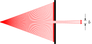](optics/aperture/aperture.svg) [[PDF]](optics/aperture/aperture.pdf) [[PNG]](optics/aperture/aperture.png) [[SVG]](optics/aperture/aperture.svg)
~~~.tex
\documentclass[crop,tikz]{standalone}

\tikzset{>=latex}
\usetikzlibrary{calc}

\begin{document}
\begin{tikzpicture}
  % rays
  \foreach \d in { -20,-19,...,-2 } { \draw[->,red] (0,0) -- +(\d:{4/cos(\d)}); };
  \foreach \d in {  20, 19,..., 2 } { \draw[->,red] (0,0) -- +(\d:{4/cos(\d)}); };
  \foreach \d in { -1, 0, 1       } { \draw[->,red] (0,0) -- +(\d:6); };
  % aperture
  \draw[fill] (4-0.05,-1.6) rectangle (4+0.05,-0.1);
  \draw[fill] (4-0.05, 0.1) rectangle (4+0.05, 1.6);
  % description
  \draw[]   ($( 1:6)+(0.1,0)$) -- +(0.2,0);
  \draw[]   ($(-1:6)+(0.1,0)$) -- +(0.2,0);
  \draw[->] ($( 1:6)+(0.2, 0.5)$) -- +(0,-0.5);
  \draw[->] ($(-1:6)+(0.2,-0.5)$) -- +(0, 0.5);
  \node[right] at (0:6.3) {$b$};
\end{tikzpicture}
\end{document}
~~~
## circular-wave-fronts.svg
[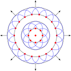](optics/circular-wave-fronts/circular-wave-fronts.svg) [[PDF]](optics/circular-wave-fronts/circular-wave-fronts.pdf) [[PNG]](optics/circular-wave-fronts/circular-wave-fronts.png) [[SVG]](optics/circular-wave-fronts/circular-wave-fronts.svg)
~~~.tex
\documentclass[crop,tikz]{standalone}

\tikzset{>=latex}

\begin{document}
\begin{tikzpicture}
  \foreach \R in {0.5,1,1.5,2} { \draw (0,0) circle (\R); }
  \foreach \R in {0.5} {%
    \foreach \A in {0,45,...,315} {%
      \draw[blue] (\A:\R)+(\A-120:0.5) arc (\A-120:\A+120:0.5);
      \draw[fill,red] (\A:\R) circle (0.05);
    }
  }
  \foreach \R in {1.5} {%
    \foreach \A in {0,20,...,340} {%
      \draw[blue] (\A:\R)+(\A-100:0.5) arc (\A-100:\A+100:0.5);
      \draw[fill,red] (\A:\R) circle (0.05);
    }
  }
  \foreach \X in {0,45,...,315} { \draw[->] (\X:2) -- +(\X:0.5); }
  \draw[fill,red] (0,0) circle (0.05);
\end{tikzpicture}
\end{document}
~~~
## diffraction-single-slit.svg
[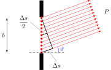](optics/diffraction-single-slit/diffraction-single-slit.svg) [[PDF]](optics/diffraction-single-slit/diffraction-single-slit.pdf) [[PNG]](optics/diffraction-single-slit/diffraction-single-slit.png) [[SVG]](optics/diffraction-single-slit/diffraction-single-slit.svg)
~~~.tex
\documentclass[crop,tikz]{standalone}

\tikzset{>=latex}
\usetikzlibrary{calc}

\begin{document}
\begin{tikzpicture}
  % slit
  \draw[fill] (-0.1, 1.05) rectangle (0.1, 2.0);
  \draw[fill] (-0.1,-1.05) rectangle (0.1,-2.0);
  % rays
  \foreach \Y in {-1,-0.8,...,1} {%
    \draw[fill,red] (0,\Y) circle (0.05);
    \draw[->,red] (0,\Y) -- +(20:{3+(1-\Y)*sin(20)});
  };
  \node at (20:4) {$P$};
  \draw[dashed] (-0.7,-1) -- (1.3,-1);
  \draw[blue] (0,-1)+(0:1) arc (0:20:1);
  \node[blue] at ($(0,-1)+(10:1.2)$) {$\vartheta$};
  \draw[<->] (-2,-1) -- node[left] {$b$} +(0,2);
  % triangle
  \draw[thick] (0,1) -- +(-70:{2*cos(20)}) -- (0,-1);
  \draw[thick] (0,1)+(-70:{cos(20)}) -- (0,0);
  \draw[gray] (0,-1)+(20:0.4) -- +(-30:1) node[below,black] {$\Delta s$};
  \draw[gray] (0,0)+(20:0.2) -- +(130:1) node[left,black] {$\displaystyle\frac{\Delta s}{2}$};
\end{tikzpicture}
\end{document}
~~~
## diffraction-single-slit-overview.svg
[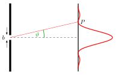](optics/diffraction-single-slit-overview/diffraction-single-slit-overview.svg) [[PDF]](optics/diffraction-single-slit-overview/diffraction-single-slit-overview.pdf) [[PNG]](optics/diffraction-single-slit-overview/diffraction-single-slit-overview.png) [[SVG]](optics/diffraction-single-slit-overview/diffraction-single-slit-overview.svg)
~~~.tex
\documentclass[crop,tikz]{standalone}

\usepackage{pgfplots}

\pgfplotsset{
  inverted/.style = {
    every axis legend/.append style={
      draw=white,
      fill=hardblack,
      text=white
    }
  }
}

\tikzset{>=latex}
\colorlet{green}{black!40!green}

\begin{document}
\begin{tikzpicture}
  \pgfmathsetlengthmacro{\slitmax}{2cm}
  \pgfmathsetlengthmacro{\slitx}{0cm}
  \pgfmathsetlengthmacro{\slity}{0cm}
  \pgfmathsetlengthmacro{\slitheight}{0.3cm}
  \pgfmathsetlengthmacro{\slitwidth}{0.1cm}
  \pgfmathsetlengthmacro{\distance}{4cm}
  \pgfmathsetmacro{\angl}{13}
  \pgfmathsetlengthmacro{\boffset}{0.2cm}
  \pgfmathsetlengthmacro{\radius}{2cm}
  % slit
  \draw[fill] ({\slitx-\slitwidth/2},{\slity+\slitheight/2}) rectangle ({\slitwidth/2},{\slitmax});
  \draw[fill] ({\slitx-\slitwidth/2},{\slity-\slitheight/2}) rectangle ({\slitwidth/2},{-\slitmax});
  \draw[->] ({\slitx-\boffset},{\slity-2*\slitheight}) -- ++ (0,{ 3*\slitheight/2});
  \draw[->] ({\slitx-\boffset},{\slity+2*\slitheight}) -- ++ (0,{-3*\slitheight/2});
  \node[left] at ({\slitx-\boffset},{\slity}) {$b$};
  % ray
  \draw[dashed] ({\slitx},{\slity}) -- ++ ({\distance},0);
  \draw[red] ({\slitx},{\slity}) -- ({\angl}:{\distance/cos(\angl)}) coordinate (P);
  \draw[green,thick] (\radius,0) arc (0:\angl:\radius);
  \node[green] at ({\angl/2}:{0.8*\radius}) { $\vartheta$ };
  % projection
  \draw[very thick] ({\slitx + \distance},{-\slitmax}) -- ({\slitx + \distance},{\slitmax});
  \node[right] at (P) {$P$};
  % intensity
  \begin{axis}[
    width={3*\slitmax},
    height={2*\slitmax},
    anchor=origin,
    rotate around={-90:(current axis.origin)},
    domain={-2*pi}:{2*pi},
    samples=100,
    smooth,
    axis x line=none,
    axis y line=none,
    yshift={\distance},
    declare function = { S(\x) = sin(deg(\x))^2/\x^2; },
    ]
    \addplot[red,very thick,smooth] { S(x) };
  \end{axis}
\end{tikzpicture}
\end{document}
~~~
## huygens-aperture.svg
[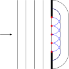](optics/huygens-aperture/huygens-aperture.svg) [[PDF]](optics/huygens-aperture/huygens-aperture.pdf) [[PNG]](optics/huygens-aperture/huygens-aperture.png) [[SVG]](optics/huygens-aperture/huygens-aperture.svg)
~~~.tex
\documentclass[crop,tikz]{standalone}

\tikzset{>=latex}

\begin{document}
\begin{tikzpicture}
  \foreach\X in {-2,-1.5,-1,-0.5,0} {\draw(\X,-2)--(\X,2);}
  \draw[->] (-3,0) -- +(0.7,0);
  \draw[fill] (0.05,-2) rectangle (-0.05,-1);
  \draw[fill] (0.05,2)  rectangle (-0.05,1);
  \foreach\Y in {-1,-0.5,...,1} {%
    \draw[fill,red] (0,\Y) circle (0.05);
    \draw[blue] (0,\Y)+(-90:0.5) arc (-90:+90:0.5);
  }
  \draw (0,-1.5) arc (-90:0:0.5) -- (0.5,1) arc (0:90:0.5);
  \draw (0,-2)   arc (-90:0:1)   -- (1,1)   arc (0:90:1);
\end{tikzpicture}
\end{document}
~~~
## huygens-double-slit-2.svg
[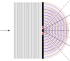](optics/huygens-double-slit-2/huygens-double-slit-2.svg) [[PDF]](optics/huygens-double-slit-2/huygens-double-slit-2.pdf) [[PNG]](optics/huygens-double-slit-2/huygens-double-slit-2.png) [[SVG]](optics/huygens-double-slit-2/huygens-double-slit-2.svg)
~~~.tex
\documentclass[crop,tikz]{standalone}

\tikzset{>=latex}

\def\wavelength{0.2}
\def\slitdistance{0.4}

\begin{document}
\begin{tikzpicture}
  % direction
  \draw[->] (-3,0) -- +(0.7,0);
  % coordinates of slits
  \coordinate (a) at (0,\slitdistance/2);
  \coordinate (b) at (0,-\slitdistance/2);
  % plain waves
  \foreach \X in {-2,-1.8,...,-0.2} {
    \draw[blue] (\X,-2) -- (\X,2);
    \draw[orange] (\X + \wavelength/2,-2) -- (\X + \wavelength/2,2);
  }
  % circular waves
  \foreach \r in {0.1,0.3,...,1.8} {
    \draw[blue] (a)+(-90:\r) arc (-90:90:\r);
    \draw[blue] (b)+(-90:\r) arc (-90:90:\r);
  }
  \foreach \r in {\wavelength,0.4,...,1.8} {
    \draw[orange] (a)+(-90:\r) arc (-90:90:\r);
    \draw[orange] (b)+(-90:\r) arc (-90:90:\r);
  }
  % lines of constructive interference
  \foreach \N in {-1,0,1} {
    \draw[domain=0:1.9,smooth,variable=\t] plot (\t,{(\N*\wavelength/2)*sqrt(1 + \t*\t/((\slitdistance/2)^2 - (\N*\wavelength/2)^2))});
  }
  % lines of destructive interference
  \foreach \N in {-2,-1,0,1} {
    \draw[domain=0:1.9,smooth,variable=\t,dashed] plot (\t,{((\N + 1/2)*\wavelength/2)*sqrt(1 + \t*\t/((\slitdistance/2)^2 - ((\N + 1/2)*\wavelength/2)^2))});
  }
  % aperture
  \draw[fill] (0.05,-2) rectangle (-0.05,-0.3);
  \draw[fill] (0.05,-0.1) rectangle (-0.05,0.1);
  \draw[fill] (0.05,2)  rectangle (-0.05,0.3);
  % red dots
  \draw[fill,red] (a) circle (0.05);
  \draw[fill,red] (b) circle (0.05);
\end{tikzpicture}
\end{document}
~~~
## huygens-double-slit.svg
[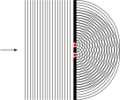](optics/huygens-double-slit/huygens-double-slit.svg) [[PDF]](optics/huygens-double-slit/huygens-double-slit.pdf) [[PNG]](optics/huygens-double-slit/huygens-double-slit.png) [[SVG]](optics/huygens-double-slit/huygens-double-slit.svg)
~~~.tex
\documentclass[crop,tikz]{standalone}

\tikzset{>=latex}

\begin{document}
\begin{tikzpicture}
  % direction
  \draw[->] (-3,0) -- +(0.7,0);
  % plain waves
  \foreach\X in {-2,-1.9,...,-0.1} {\draw(\X,-2)--(\X,2);}
  % aperture
  \draw[fill] (0.05,-2) rectangle (-0.05,-0.3);
  \draw[fill] (0.05,-0.1) rectangle (-0.05,0.1);
  \draw[fill] (0.05,2)  rectangle (-0.05,0.3);
  % coordinates
  \coordinate (a) at (0,0.2);
  \coordinate (b) at (0,-0.2);
  % red dots
  \draw[fill,red] (a) circle (0.05);
  \draw[fill,red] (b) circle (0.05);
  % circular waves
  \foreach \r in {0.1,0.2,...,1.8} {
    \draw (a)+(-90:\r) arc (-90:90:\r);
    \draw (b)+(-90:\r) arc (-90:90:\r);
  }
\end{tikzpicture}
\end{document}
~~~
## lens-diacaustic.svg
[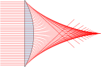](optics/lens-diacaustic/lens-diacaustic.svg) [[PDF]](optics/lens-diacaustic/lens-diacaustic.pdf) [[PNG]](optics/lens-diacaustic/lens-diacaustic.png) [[SVG]](optics/lens-diacaustic/lens-diacaustic.svg)
~~~.tex
\documentclass[crop,tikz]{standalone}

\begin{document}
\begin{tikzpicture}
  \pgfmathsetmacro{\radius}{4}
  \pgfmathsetmacro{\refractiveindex}{2}
  \draw[fill=cyan!20] (-30:\radius) arc (-30:30:\radius) -- cycle;
  \foreach \Y in { -1.9,-1.8,...,1.9 } {%
    \pgfmathsetmacro{\X}{sqrt(\radius*\radius-\Y*\Y)}
    \pgfmathsetmacro{\angle}{atan(\Y/\X)}
    \draw[red] (2, \Y) -- ({\X}, \Y) -- +({\angle - asin(\refractiveindex*sin(\angle))}:4);
  }
\end{tikzpicture}
\end{document}
~~~
## lens-paraxial.svg
[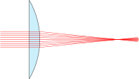](optics/lens-paraxial/lens-paraxial.svg) [[PDF]](optics/lens-paraxial/lens-paraxial.pdf) [[PNG]](optics/lens-paraxial/lens-paraxial.png) [[SVG]](optics/lens-paraxial/lens-paraxial.svg)
~~~.tex
\documentclass[crop,tikz]{standalone}

\begin{document}
\begin{tikzpicture}
  \pgfmathsetmacro{\radius}{4}
  \pgfmathsetmacro{\refractiveindex}{2}
  \draw[fill=cyan!20] (-30:\radius) arc (-30:30:\radius) -- cycle;
  \foreach \Y in { -0.4,-0.3,...,0.4 } {%
    \pgfmathsetmacro{\X}{sqrt(\radius*\radius-\Y*\Y)}
    \pgfmathsetmacro{\angle}{atan(\Y/\X)}
    \draw[red] (2, \Y) -- ({\X}, \Y) -- +({\angle - asin(\refractiveindex*sin(\angle))}:5);
  }
\end{tikzpicture}
\end{document}
~~~
## mirror-catacaustic.svg
 [[PDF]](optics/mirror-catacaustic/mirror-catacaustic.pdf) [[PNG]](optics/mirror-catacaustic/mirror-catacaustic.png) [[SVG]](optics/mirror-catacaustic/mirror-catacaustic.svg)
~~~.tex
\documentclass[crop,tikz]{standalone}

\begin{document}
\begin{tikzpicture}
  \pgfmathsetmacro{\radius}{4}
  \draw (-90:\radius) arc (-90:90:\radius);
  \foreach \Y in { -3.7,-3.6,...,3.7 } {%
    \pgfmathsetmacro{\X}{sqrt(\radius*\radius-\Y*\Y)}
    \draw[red] (-\radius/2, \Y) -- ({\X}, \Y) -- +({180+2*atan(\Y/\X)}:3);
  }
\end{tikzpicture}
\end{document}
~~~
## mirror-parabolic.svg
[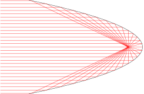](optics/mirror-parabolic/mirror-parabolic.svg) [[PDF]](optics/mirror-parabolic/mirror-parabolic.pdf) [[PNG]](optics/mirror-parabolic/mirror-parabolic.png) [[SVG]](optics/mirror-parabolic/mirror-parabolic.svg)
~~~.tex
\documentclass[crop,tikz]{standalone}

\usepackage{pgfplots}
\pgfplotsset{compat=1.16}

\begin{document}
\begin{tikzpicture}
  \begin{axis}[
    domain={-sqrt(2)}:{sqrt(2)},
    samples=100,
    axis y line=middle,
    axis x line=middle,
    axis line style={draw=none},
    tick style={draw=none},
    xticklabels=\empty,
    yticklabels=\empty,
    clip=false
    ]
    \addplot[smooth] (-x*x,x);
    \pgfplotsinvokeforeach{1.4,1.3,...,-1.4}{%
      \draw[red] (axis cs:-2.5,#1) -- (axis cs:{-#1*#1},#1) -- (axis cs:-0.25,0);
    }
  \end{axis}
\end{tikzpicture}
\end{document}
~~~
## plancks-law.svg
[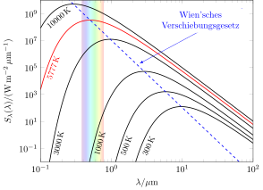](optics/plancks-law/plancks-law.svg) [[PDF]](optics/plancks-law/plancks-law.pdf) [[PNG]](optics/plancks-law/plancks-law.png) [[SVG]](optics/plancks-law/plancks-law.svg)
~~~.tex
\documentclass[crop,tikz]{standalone}

\usepackage{amsmath}
\usepackage{pgfplots}
\usepackage{pgfplotstable}
\tikzset{>=latex}
\pgfplotsset{compat=1.16}

% rainbow line
\pgfdeclareverticalshading{rainbow}{100bp}
{color(0bp)=(red); color(25bp)=(red); color(35bp)=(yellow);
color(45bp)=(green); color(55bp)=(cyan); color(65bp)=(blue);
color(75bp)=(violet); color(100bp)=(violet)}

\begin{document}
\begin{tikzpicture}
  % data generated with: data/strahlungsspektrum.m
  \pgfplotstableread{data/T300K.dat}\tableThreeHoundred
  \pgfplotstableread{data/T500K.dat}\tableFiveHoundred
  \pgfplotstableread{data/T1000K.dat}\tableOneThousand
  \pgfplotstableread{data/T3000K.dat}\tableThreeThousand
  \pgfplotstableread{data/T5777K.dat}\tableFiveThousand
  \pgfplotstableread{data/T10000K.dat}\tableTenThousand
  \pgfplotstableread{data/wien.dat}\tableWien
  \begin{loglogaxis}[
    axis on top, % axis before the rectangle
    width=10cm,
    height=8cm,
    xmin=0.1, xmax=100,
    ymin=1e-2, ymax=1e10,
    xlabel={$\lambda/\mu\text{m}$},
    ylabel={$S_\lambda(\lambda)/(\text{W}\,\text{m}^{-2}\,\mu\text{m}^{-1})$}
    ]
    % light band
    \shade[shading=rainbow,shading angle=90,opacity=0.2] (axis cs:0.38,1e-2) rectangle (axis cs:0.78,1e10);
    % intensities
    \addplot[thick]     table [x index=0, y index=1] {\tableThreeHoundred};
    \addplot[thick]     table [x index=0, y index=1] {\tableFiveHoundred};
    \addplot[thick]     table [x index=0, y index=1] {\tableOneThousand};
    \addplot[thick]     table [x index=0, y index=1] {\tableThreeThousand};
    \addplot[thick,red] table [x index=0, y index=1] {\tableFiveThousand};
    \addplot[thick]     table [x index=0, y index=1] {\tableTenThousand};
    % temperatures
    \node[rotate=66,font=\small,anchor=west] at (2.8 ,2e-2) {$300\,\text{K}$};
    \node[rotate=70,font=\small,anchor=west] at (1.4 ,2e-2) {$500\,\text{K}$};
    \node[rotate=75,font=\small,anchor=west] at (0.6 ,2e-2) {$1000\,\text{K}$};
    \node[rotate=77,font=\small,anchor=west] at (0.16,2e-2) {$3000\,\text{K}$};
    \node[rotate=70,font=\small,red]         at (0.15,1e+5) {$5777\,\text{K}$};
    \node[rotate=40,font=\small]             at (0.18,5e+8) {$10000\,\text{K}$};
    % Wien's displacement law
    \addplot[blue,thick,dashed] table [x index=0, y index=1] {\tableWien};
    \draw[->,blue] (rel axis cs: 0.95,0.95) node[above,anchor=north east,align=center,fill=white] {Wien'sches\\ Verschiebungsgesetz} -- (2.5,2e5);
  \end{loglogaxis}
\end{tikzpicture}
\end{document}
~~~
## plane-wave-fronts.svg
[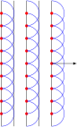](optics/plane-wave-fronts/plane-wave-fronts.svg) [[PDF]](optics/plane-wave-fronts/plane-wave-fronts.pdf) [[PNG]](optics/plane-wave-fronts/plane-wave-fronts.png) [[SVG]](optics/plane-wave-fronts/plane-wave-fronts.svg)
~~~.tex
\documentclass[crop,tikz]{standalone}

\tikzset{>=latex}

\begin{document}
\begin{tikzpicture}
  \foreach \X in {0,0.5,1,1.5,2} { \draw (\X,0) -- +(0,5); }
  \foreach \X in {0,1,2} {%
    \foreach \Y in {0.5,1,...,4.5} {%
      \draw[blue] (\X,\Y)+(-90:0.5) arc (-90:90:0.5);
      \draw[fill,red] (\X,\Y) circle (0.05);
    }
  }
  \draw[->] (2,2.5) -- +(1,0);
\end{tikzpicture}
\end{document}
~~~
## reflection-law.svg
[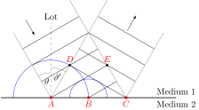](optics/reflection-law/reflection-law.svg) [[PDF]](optics/reflection-law/reflection-law.pdf) [[PNG]](optics/reflection-law/reflection-law.png) [[SVG]](optics/reflection-law/reflection-law.svg)
~~~.tex
\documentclass[crop,tikz]{standalone}

\tikzset{>=latex}
\usetikzlibrary{calc}

% Centered arc
% Syntax: [draw options] (center) (initial angle:final angle:radius)
\def\centerarc[#1](#2)(#3:#4:#5);%
{
  \draw[#1]([shift=(#3:#5)]#2) arc (#3:#4:#5);
}

\begin{document}
\begin{tikzpicture}
  \coordinate (a) at (1,0);
  \coordinate (b) at (2.5,0);
  \coordinate (c) at (4,0);
  % boundary
  \draw[thick] (-1,0) -- +(7,0) node[above] {Medium $1$} node[below] {Medium $2$};
  % plumb
  \draw[gray,dashed] (a) -- +(0,3) node[above,black] {Lot};
  \centerarc[gray](a)(90:120:1);
  \node[below] at ($(a)+(100:1)+(0,-0.08)$) {$\vartheta$};
  \centerarc[gray](a)(60:90:1.2);
  \node[below] at ($(a)+(80:1.2)+(0.05,-0.1)$) {$\vartheta'$};
  % elementary wave
  \draw[fill,red] (a) circle (0.05) node[below] {$A$};
  \centerarc[blue](a)(180:0:0.5*3);
  % elementary wave
  \draw[fill,red] (b) circle (0.05) node[below] {$B$};
  \centerarc[blue](b)(180:0:0.5*1.5);
  % elementary wave
  \draw[fill,red] (c) circle (0.05) node[below] {$C$};
  % wave fronts
  \draw[] (a) -- +(30:0.866*3);
  \draw[] (b) -- +(30:0.866*1.5);
  \foreach \X in {1,2,3} { \draw ($(a)+(120:0.5*1.5*\X)$) -- +(30:0.866*3); };
  \foreach \X in {0,1,2,3} { \draw ($(c)+(60:0.5*1.5*\X)$) -- +(150:0.866*3); };
  % boundary
  \draw[gray] (a) -- +(120:3);
  \draw[gray] (a) -- +(60:3+0.5*3);
  \draw[gray] (c) -- +(120:3+0.5*3);
  \draw[gray] (c) -- +(60:3+0);
  % arrows
  \draw[->] (0,3.1) -- +(-60:0.7);
  \draw[->] ($(b)+(60:3.1)$) -- +(60:0.7);
  % points
  \coordinate (d) at ($(c)+(150:0.866*3)$);
  \coordinate (e) at ($(a)+(30:0.866*3)$);
  \draw[fill] (d) circle (0.04);
  \draw[fill] (e) circle (0.04);
  \node[above,red] at (d) {$D$};
  \node[above,red] at (e) {$E$};
\end{tikzpicture}
\end{document}
~~~
## refraction-law.svg
[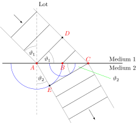](optics/refraction-law/refraction-law.svg) [[PDF]](optics/refraction-law/refraction-law.pdf) [[PNG]](optics/refraction-law/refraction-law.png) [[SVG]](optics/refraction-law/refraction-law.svg)
~~~.tex
\documentclass[crop,tikz]{standalone}

\tikzset{>=latex}
\usetikzlibrary{calc}

% Centered arc
% Syntax: [draw options] (center) (initial angle:final angle:radius)
\def\centerarc[#1](#2)(#3:#4:#5);%
{
  \draw[#1]([shift=(#3:#5)]#2) arc (#3:#4:#5);
}

\begin{document}
\begin{tikzpicture}
  \coordinate (a) at (1,0);
  \coordinate (b) at (2.5,0);
  \coordinate (c) at (4,0);
  % boundary
  \draw[thick] (-1,0) -- +(7,0) node[above] {Medium $1$} node[below] {Medium $2$};
  % plumb
  \draw[gray,dashed] (a) -- +(0,3.2) node[above right,black] {Lot} -- +(0,-3);
  \centerarc[gray](a)(90:135:1);
  \node[below] at ($(a)+(105:1)+(0,-0.1)$) {$\vartheta_1$};
  \centerarc[gray](a)(0:45:1);
  \node[left] at ($(a)+(20:1)+(0,-0.1)$) {$\vartheta_1$};
  \centerarc[gray](a)(-60:-90:1.2);
  \node[above] at ($(a)+(-75:1.3)+(-0.08,0.1)$) {$\vartheta_2$};
  \centerarc[gray](c)(180:210:1.2);
  \draw[green] ($(c)+(200:0.6)$) -- +(-20:2) node[right,black] {$\vartheta_2$};
  % elementary wave
  \draw[fill,red] (a) circle (0.05) node[below left] {$A$};
  \centerarc[blue](a)(180:360:0.5*3);
  % elementary wave
  \draw[fill,red] (b) circle (0.05) node[below] {$B$};
  \centerarc[blue](b)(180:360:0.5*1.5);
  % elementary wave
  \draw[fill,red] (c) circle (0.05) node[above] {$C$};
  % wave fronts
  \draw[] (a) -- +(45:0.707*3);
  \draw[] (b) -- +(45:0.707*1.5);
  \foreach \X in {1,2} { \draw ($(a)+(135:0.707*1.5*\X)$) -- +(45:0.707*3); };
  \foreach \X in {0,1,2,3} { \draw ($(c)+(-60:0.5*1.5*\X)$) -- +(-150:0.866*3); };
  % border
  \draw[gray] (a) -- +(135:3);
  \draw[gray] (a) -- +(-60:3+0.5*2);
  \draw[gray] (c) -- +(135:3+0.5*3);
  \draw[gray] (c) -- +(-60:3);
  % arrows
  \draw[->] ($(b)+(135:4)$) -- +(-45:0.7);
  \draw[->] ($(b)+(-60:3.1)$) -- +(-60:0.7);
  % points
  \coordinate (d) at ($(c)+(135:0.707*3)$);
  \coordinate (e) at ($(a)+(-60:1.5*0.5*2)$);
  \draw[fill] (d) circle (0.04);
  \draw[fill] (e) circle (0.04);
  \node[above right,red] at (d) {$D$};
  \node[below,red] at (e) {$E$};
\end{tikzpicture}
\end{document}
~~~
## thin-layer.svg
 [[PDF]](optics/thin-layer/thin-layer.pdf) [[PNG]](optics/thin-layer/thin-layer.png) [[SVG]](optics/thin-layer/thin-layer.svg)
~~~.tex
\documentclass[crop,tikz]{standalone}

\tikzset{>=latex}
\usetikzlibrary{calc}

\begin{document}
\begin{tikzpicture}
  \draw[fill,cyan!20] (110:10) arc (110:70:10) -- (70:9) arc (70:110:9) -- cycle;
  \coordinate (a) at (92:10);
  \coordinate (b) at (90:9);
  \coordinate (c) at (88:10);
  \draw[->,red] (a)+(135:1) -- (a) -- ($(a)+(45:1)$);
  \draw[->,red] (a) -- (b);
  \draw[->,red] (b) -- (c);
  \draw[->,red] (c) -- ($(c)+(45:1)$);
  \draw[->,red,dashed] (b) -- ($(b)+(-45:1)$);
  \draw[->,red,dashed] (c) -- (86:9);
\end{tikzpicture}
\end{document}
~~~
## aperture_inverted.svg
[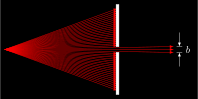](optics/aperture/aperture_inverted.svg) [[PDF]](optics/aperture/aperture_inverted.pdf) [[PNG]](optics/aperture/aperture_inverted.png) [[SVG]](optics/aperture/aperture_inverted.svg)
~~~.tex
\documentclass[crop,tikz]{standalone}
\usetikzlibrary{backgrounds}
\colorlet{blue}{cyan}
\tikzset{
  inverted/.style = {
    color=white,
    background rectangle/.style={fill},
    show background rectangle
  }
}

\tikzset{>=latex}
\usetikzlibrary{calc}

\begin{document}
\begin{tikzpicture}[inverted,inverted]
  % rays
  \foreach \d in { -20,-19,...,-2 } { \draw[->,red] (0,0) -- +(\d:{4/cos(\d)}); };
  \foreach \d in {  20, 19,..., 2 } { \draw[->,red] (0,0) -- +(\d:{4/cos(\d)}); };
  \foreach \d in { -1, 0, 1       } { \draw[->,red] (0,0) -- +(\d:6); };
  % aperture
  \draw[fill] (4-0.05,-1.6) rectangle (4+0.05,-0.1);
  \draw[fill] (4-0.05, 0.1) rectangle (4+0.05, 1.6);
  % description
  \draw[]   ($( 1:6)+(0.1,0)$) -- +(0.2,0);
  \draw[]   ($(-1:6)+(0.1,0)$) -- +(0.2,0);
  \draw[->] ($( 1:6)+(0.2, 0.5)$) -- +(0,-0.5);
  \draw[->] ($(-1:6)+(0.2,-0.5)$) -- +(0, 0.5);
  \node[right] at (0:6.3) {$b$};
\end{tikzpicture}
\end{document}
~~~
## circular-wave-fronts_inverted.svg
[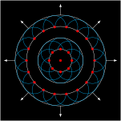](optics/circular-wave-fronts/circular-wave-fronts_inverted.svg) [[PDF]](optics/circular-wave-fronts/circular-wave-fronts_inverted.pdf) [[PNG]](optics/circular-wave-fronts/circular-wave-fronts_inverted.png) [[SVG]](optics/circular-wave-fronts/circular-wave-fronts_inverted.svg)
~~~.tex
\documentclass[crop,tikz]{standalone}
\usetikzlibrary{backgrounds}
\colorlet{blue}{cyan}
\tikzset{
  inverted/.style = {
    color=white,
    background rectangle/.style={fill},
    show background rectangle
  }
}

\tikzset{>=latex}

\begin{document}
\begin{tikzpicture}[inverted,inverted]
  \foreach \R in {0.5,1,1.5,2} { \draw (0,0) circle (\R); }
  \foreach \R in {0.5} {%
    \foreach \A in {0,45,...,315} {%
      \draw[blue] (\A:\R)+(\A-120:0.5) arc (\A-120:\A+120:0.5);
      \draw[fill,red] (\A:\R) circle (0.05);
    }
  }
  \foreach \R in {1.5} {%
    \foreach \A in {0,20,...,340} {%
      \draw[blue] (\A:\R)+(\A-100:0.5) arc (\A-100:\A+100:0.5);
      \draw[fill,red] (\A:\R) circle (0.05);
    }
  }
  \foreach \X in {0,45,...,315} { \draw[->] (\X:2) -- +(\X:0.5); }
  \draw[fill,red] (0,0) circle (0.05);
\end{tikzpicture}
\end{document}
~~~
## diffraction-single-slit_inverted.svg
[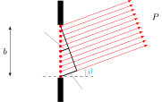](optics/diffraction-single-slit/diffraction-single-slit_inverted.svg) [[PDF]](optics/diffraction-single-slit/diffraction-single-slit_inverted.pdf) [[PNG]](optics/diffraction-single-slit/diffraction-single-slit_inverted.png) [[SVG]](optics/diffraction-single-slit/diffraction-single-slit_inverted.svg)
~~~.tex
\documentclass[crop,tikz]{standalone}
\usetikzlibrary{backgrounds}
\colorlet{blue}{cyan}
\tikzset{
  inverted/.style = {
    color=white,
    background rectangle/.style={fill},
    show background rectangle
  }
}

\tikzset{>=latex}
\usetikzlibrary{calc}

\begin{document}
\begin{tikzpicture}[inverted,inverted]
  % slit
  \draw[fill] (-0.1, 1.05) rectangle (0.1, 2.0);
  \draw[fill] (-0.1,-1.05) rectangle (0.1,-2.0);
  % rays
  \foreach \Y in {-1,-0.8,...,1} {%
    \draw[fill,red] (0,\Y) circle (0.05);
    \draw[->,red] (0,\Y) -- +(20:{3+(1-\Y)*sin(20)});
  };
  \node at (20:4) {$P$};
  \draw[dashed] (-0.7,-1) -- (1.3,-1);
  \draw[blue] (0,-1)+(0:1) arc (0:20:1);
  \node[blue] at ($(0,-1)+(10:1.2)$) {$\vartheta$};
  \draw[<->] (-2,-1) -- node[left] {$b$} +(0,2);
  % triangle
  \draw[thick] (0,1) -- +(-70:{2*cos(20)}) -- (0,-1);
  \draw[thick] (0,1)+(-70:{cos(20)}) -- (0,0);
  \draw[gray] (0,-1)+(20:0.4) -- +(-30:1) node[below,white] {$\Delta s$};
  \draw[gray] (0,0)+(20:0.2) -- +(130:1) node[left,white] {$\displaystyle\frac{\Delta s}{2}$};
\end{tikzpicture}
\end{document}
~~~
## diffraction-single-slit-overview_inverted.svg
[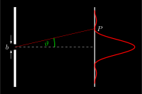](optics/diffraction-single-slit-overview/diffraction-single-slit-overview_inverted.svg) [[PDF]](optics/diffraction-single-slit-overview/diffraction-single-slit-overview_inverted.pdf) [[PNG]](optics/diffraction-single-slit-overview/diffraction-single-slit-overview_inverted.png) [[SVG]](optics/diffraction-single-slit-overview/diffraction-single-slit-overview_inverted.svg)
~~~.tex
\documentclass[crop,tikz]{standalone}
\usetikzlibrary{backgrounds}
\colorlet{blue}{cyan}
\tikzset{
  inverted/.style = {
    color=white,
    background rectangle/.style={fill},
    show background rectangle
  }
}

\usepackage{pgfplots}

\pgfplotsset{
  inverted/.style = {
    every axis legend/.append style={
      draw=white,
      fill=black,
      text=white
    }
  }
}

\tikzset{>=latex}
\colorlet{green}{green}

\begin{document}
\begin{tikzpicture}[inverted,inverted]
  \pgfmathsetlengthmacro{\slitmax}{2cm}
  \pgfmathsetlengthmacro{\slitx}{0cm}
  \pgfmathsetlengthmacro{\slity}{0cm}
  \pgfmathsetlengthmacro{\slitheight}{0.3cm}
  \pgfmathsetlengthmacro{\slitwidth}{0.1cm}
  \pgfmathsetlengthmacro{\distance}{4cm}
  \pgfmathsetmacro{\angl}{13}
  \pgfmathsetlengthmacro{\boffset}{0.2cm}
  \pgfmathsetlengthmacro{\radius}{2cm}
  % slit
  \draw[fill] ({\slitx-\slitwidth/2},{\slity+\slitheight/2}) rectangle ({\slitwidth/2},{\slitmax});
  \draw[fill] ({\slitx-\slitwidth/2},{\slity-\slitheight/2}) rectangle ({\slitwidth/2},{-\slitmax});
  \draw[->] ({\slitx-\boffset},{\slity-2*\slitheight}) -- ++ (0,{ 3*\slitheight/2});
  \draw[->] ({\slitx-\boffset},{\slity+2*\slitheight}) -- ++ (0,{-3*\slitheight/2});
  \node[left] at ({\slitx-\boffset},{\slity}) {$b$};
  % ray
  \draw[dashed] ({\slitx},{\slity}) -- ++ ({\distance},0);
  \draw[red] ({\slitx},{\slity}) -- ({\angl}:{\distance/cos(\angl)}) coordinate (P);
  \draw[green,thick] (\radius,0) arc (0:\angl:\radius);
  \node[green] at ({\angl/2}:{0.8*\radius}) { $\vartheta$ };
  % projection
  \draw[very thick] ({\slitx + \distance},{-\slitmax}) -- ({\slitx + \distance},{\slitmax});
  \node[right] at (P) {$P$};
  % intensity
  \begin{axis}[inverted,
    width={3*\slitmax},
    height={2*\slitmax},
    anchor=origin,
    rotate around={-90:(current axis.origin)},
    domain={-2*pi}:{2*pi},
    samples=100,
    smooth,
    axis x line=none,
    axis y line=none,
    yshift={\distance},
    declare function = { S(\x) = sin(deg(\x))^2/\x^2; },
    ]
    \addplot[red,very thick,smooth] { S(x) };
  \end{axis}
\end{tikzpicture}
\end{document}
~~~
## huygens-aperture_inverted.svg
[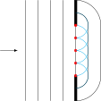](optics/huygens-aperture/huygens-aperture_inverted.svg) [[PDF]](optics/huygens-aperture/huygens-aperture_inverted.pdf) [[PNG]](optics/huygens-aperture/huygens-aperture_inverted.png) [[SVG]](optics/huygens-aperture/huygens-aperture_inverted.svg)
~~~.tex
\documentclass[crop,tikz]{standalone}
\usetikzlibrary{backgrounds}
\colorlet{blue}{cyan}
\tikzset{
  inverted/.style = {
    color=white,
    background rectangle/.style={fill},
    show background rectangle
  }
}

\tikzset{>=latex}

\begin{document}
\begin{tikzpicture}[inverted,inverted]
  \foreach\X in {-2,-1.5,-1,-0.5,0} {\draw(\X,-2)--(\X,2);}
  \draw[->] (-3,0) -- +(0.7,0);
  \draw[fill] (0.05,-2) rectangle (-0.05,-1);
  \draw[fill] (0.05,2)  rectangle (-0.05,1);
  \foreach\Y in {-1,-0.5,...,1} {%
    \draw[fill,red] (0,\Y) circle (0.05);
    \draw[blue] (0,\Y)+(-90:0.5) arc (-90:+90:0.5);
  }
  \draw (0,-1.5) arc (-90:0:0.5) -- (0.5,1) arc (0:90:0.5);
  \draw (0,-2)   arc (-90:0:1)   -- (1,1)   arc (0:90:1);
\end{tikzpicture}
\end{document}
~~~
## huygens-double-slit-2_inverted.svg
[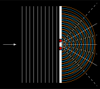](optics/huygens-double-slit-2/huygens-double-slit-2_inverted.svg) [[PDF]](optics/huygens-double-slit-2/huygens-double-slit-2_inverted.pdf) [[PNG]](optics/huygens-double-slit-2/huygens-double-slit-2_inverted.png) [[SVG]](optics/huygens-double-slit-2/huygens-double-slit-2_inverted.svg)
~~~.tex
\documentclass[crop,tikz]{standalone}
\usetikzlibrary{backgrounds}
\colorlet{blue}{cyan}
\tikzset{
  inverted/.style = {
    color=white,
    background rectangle/.style={fill},
    show background rectangle
  }
}

\tikzset{>=latex}

\def\wavelength{0.2}
\def\slitdistance{0.4}

\begin{document}
\begin{tikzpicture}[inverted,inverted]
  % direction
  \draw[->] (-3,0) -- +(0.7,0);
  % coordinates of slits
  \coordinate (a) at (0,\slitdistance/2);
  \coordinate (b) at (0,-\slitdistance/2);
  % plain waves
  \foreach \X in {-2,-1.8,...,-0.2} {
    \draw[blue] (\X,-2) -- (\X,2);
    \draw[orange] (\X + \wavelength/2,-2) -- (\X + \wavelength/2,2);
  }
  % circular waves
  \foreach \r in {0.1,0.3,...,1.8} {
    \draw[blue] (a)+(-90:\r) arc (-90:90:\r);
    \draw[blue] (b)+(-90:\r) arc (-90:90:\r);
  }
  \foreach \r in {\wavelength,0.4,...,1.8} {
    \draw[orange] (a)+(-90:\r) arc (-90:90:\r);
    \draw[orange] (b)+(-90:\r) arc (-90:90:\r);
  }
  % lines of constructive interference
  \foreach \N in {-1,0,1} {
    \draw[domain=0:1.9,smooth,variable=\t] plot (\t,{(\N*\wavelength/2)*sqrt(1 + \t*\t/((\slitdistance/2)^2 - (\N*\wavelength/2)^2))});
  }
  % lines of destructive interference
  \foreach \N in {-2,-1,0,1} {
    \draw[domain=0:1.9,smooth,variable=\t,dashed] plot (\t,{((\N + 1/2)*\wavelength/2)*sqrt(1 + \t*\t/((\slitdistance/2)^2 - ((\N + 1/2)*\wavelength/2)^2))});
  }
  % aperture
  \draw[fill] (0.05,-2) rectangle (-0.05,-0.3);
  \draw[fill] (0.05,-0.1) rectangle (-0.05,0.1);
  \draw[fill] (0.05,2)  rectangle (-0.05,0.3);
  % red dots
  \draw[fill,red] (a) circle (0.05);
  \draw[fill,red] (b) circle (0.05);
\end{tikzpicture}
\end{document}
~~~
## huygens-double-slit_inverted.svg
[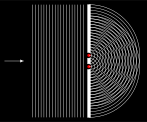](optics/huygens-double-slit/huygens-double-slit_inverted.svg) [[PDF]](optics/huygens-double-slit/huygens-double-slit_inverted.pdf) [[PNG]](optics/huygens-double-slit/huygens-double-slit_inverted.png) [[SVG]](optics/huygens-double-slit/huygens-double-slit_inverted.svg)
~~~.tex
\documentclass[crop,tikz]{standalone}
\usetikzlibrary{backgrounds}
\colorlet{blue}{cyan}
\tikzset{
  inverted/.style = {
    color=white,
    background rectangle/.style={fill},
    show background rectangle
  }
}

\tikzset{>=latex}

\begin{document}
\begin{tikzpicture}[inverted,inverted]
  % direction
  \draw[->] (-3,0) -- +(0.7,0);
  % plain waves
  \foreach\X in {-2,-1.9,...,-0.1} {\draw(\X,-2)--(\X,2);}
  % aperture
  \draw[fill] (0.05,-2) rectangle (-0.05,-0.3);
  \draw[fill] (0.05,-0.1) rectangle (-0.05,0.1);
  \draw[fill] (0.05,2)  rectangle (-0.05,0.3);
  % coordinates
  \coordinate (a) at (0,0.2);
  \coordinate (b) at (0,-0.2);
  % red dots
  \draw[fill,red] (a) circle (0.05);
  \draw[fill,red] (b) circle (0.05);
  % circular waves
  \foreach \r in {0.1,0.2,...,1.8} {
    \draw (a)+(-90:\r) arc (-90:90:\r);
    \draw (b)+(-90:\r) arc (-90:90:\r);
  }
\end{tikzpicture}
\end{document}
~~~
## lens-diacaustic_inverted.svg
[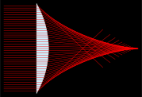](optics/lens-diacaustic/lens-diacaustic_inverted.svg) [[PDF]](optics/lens-diacaustic/lens-diacaustic_inverted.pdf) [[PNG]](optics/lens-diacaustic/lens-diacaustic_inverted.png) [[SVG]](optics/lens-diacaustic/lens-diacaustic_inverted.svg)
~~~.tex
\documentclass[crop,tikz]{standalone}
\usetikzlibrary{backgrounds}
\colorlet{blue}{cyan}
\tikzset{
  inverted/.style = {
    color=white,
    background rectangle/.style={fill},
    show background rectangle
  }
}

\begin{document}
\begin{tikzpicture}[inverted,inverted]
  \pgfmathsetmacro{\radius}{4}
  \pgfmathsetmacro{\refractiveindex}{2}
  \draw[fill=cyan!20] (-30:\radius) arc (-30:30:\radius) -- cycle;
  \foreach \Y in { -1.9,-1.8,...,1.9 } {%
    \pgfmathsetmacro{\X}{sqrt(\radius*\radius-\Y*\Y)}
    \pgfmathsetmacro{\angle}{atan(\Y/\X)}
    \draw[red] (2, \Y) -- ({\X}, \Y) -- +({\angle - asin(\refractiveindex*sin(\angle))}:4);
  }
\end{tikzpicture}
\end{document}
~~~
## lens-paraxial_inverted.svg
 [[PDF]](optics/lens-paraxial/lens-paraxial_inverted.pdf) [[PNG]](optics/lens-paraxial/lens-paraxial_inverted.png) [[SVG]](optics/lens-paraxial/lens-paraxial_inverted.svg)
~~~.tex
\documentclass[crop,tikz]{standalone}
\usetikzlibrary{backgrounds}
\colorlet{blue}{cyan}
\tikzset{
  inverted/.style = {
    color=white,
    background rectangle/.style={fill},
    show background rectangle
  }
}

\begin{document}
\begin{tikzpicture}[inverted,inverted]
  \pgfmathsetmacro{\radius}{4}
  \pgfmathsetmacro{\refractiveindex}{2}
  \draw[fill=cyan!20] (-30:\radius) arc (-30:30:\radius) -- cycle;
  \foreach \Y in { -0.4,-0.3,...,0.4 } {%
    \pgfmathsetmacro{\X}{sqrt(\radius*\radius-\Y*\Y)}
    \pgfmathsetmacro{\angle}{atan(\Y/\X)}
    \draw[red] (2, \Y) -- ({\X}, \Y) -- +({\angle - asin(\refractiveindex*sin(\angle))}:5);
  }
\end{tikzpicture}
\end{document}
~~~
## mirror-catacaustic_inverted.svg
[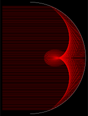](optics/mirror-catacaustic/mirror-catacaustic_inverted.svg) [[PDF]](optics/mirror-catacaustic/mirror-catacaustic_inverted.pdf) [[PNG]](optics/mirror-catacaustic/mirror-catacaustic_inverted.png) [[SVG]](optics/mirror-catacaustic/mirror-catacaustic_inverted.svg)
~~~.tex
\documentclass[crop,tikz]{standalone}
\usetikzlibrary{backgrounds}
\colorlet{blue}{cyan}
\tikzset{
  inverted/.style = {
    color=white,
    background rectangle/.style={fill},
    show background rectangle
  }
}

\begin{document}
\begin{tikzpicture}[inverted,inverted]
  \pgfmathsetmacro{\radius}{4}
  \draw (-90:\radius) arc (-90:90:\radius);
  \foreach \Y in { -3.7,-3.6,...,3.7 } {%
    \pgfmathsetmacro{\X}{sqrt(\radius*\radius-\Y*\Y)}
    \draw[red] (-\radius/2, \Y) -- ({\X}, \Y) -- +({180+2*atan(\Y/\X)}:3);
  }
\end{tikzpicture}
\end{document}
~~~
## mirror-parabolic_inverted.svg
[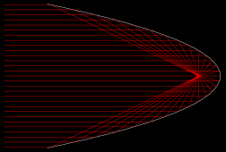](optics/mirror-parabolic/mirror-parabolic_inverted.svg) [[PDF]](optics/mirror-parabolic/mirror-parabolic_inverted.pdf) [[PNG]](optics/mirror-parabolic/mirror-parabolic_inverted.png) [[SVG]](optics/mirror-parabolic/mirror-parabolic_inverted.svg)
~~~.tex
\documentclass[crop,tikz]{standalone}
\usetikzlibrary{backgrounds}
\colorlet{blue}{cyan}
\tikzset{
  inverted/.style = {
    color=white,
    background rectangle/.style={fill},
    show background rectangle
  }
}

\usepackage{pgfplots}
\pgfplotsset{compat=1.16}

\begin{document}
\begin{tikzpicture}[inverted,inverted]
  \begin{axis}[inverted,
    domain={-sqrt(2)}:{sqrt(2)},
    samples=100,
    axis y line=middle,
    axis x line=middle,
    axis line style={draw=none},
    tick style={draw=none},
    xticklabels=\empty,
    yticklabels=\empty,
    clip=false
    ]
    \addplot[smooth] (-x*x,x);
    \pgfplotsinvokeforeach{1.4,1.3,...,-1.4}{%
      \draw[red] (axis cs:-2.5,#1) -- (axis cs:{-#1*#1},#1) -- (axis cs:-0.25,0);
    }
  \end{axis}
\end{tikzpicture}
\end{document}
~~~
## plancks-law_inverted.svg
[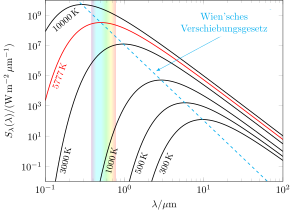](optics/plancks-law/plancks-law_inverted.svg) [[PDF]](optics/plancks-law/plancks-law_inverted.pdf) [[PNG]](optics/plancks-law/plancks-law_inverted.png) [[SVG]](optics/plancks-law/plancks-law_inverted.svg)
~~~.tex
\documentclass[crop,tikz]{standalone}
\usetikzlibrary{backgrounds}
\colorlet{blue}{cyan}
\tikzset{
  inverted/.style = {
    color=white,
    background rectangle/.style={fill},
    show background rectangle
  }
}

\usepackage{amsmath}
\usepackage{pgfplots}
\usepackage{pgfplotstable}
\tikzset{>=latex}
\pgfplotsset{compat=1.16}

% rainbow line
\pgfdeclareverticalshading{rainbow}{100bp}
{color(0bp)=(red); color(25bp)=(red); color(35bp)=(yellow);
color(45bp)=(green); color(55bp)=(cyan); color(65bp)=(blue);
color(75bp)=(violet); color(100bp)=(violet)}

\begin{document}
\begin{tikzpicture}[inverted,inverted]
  % data generated with: data/strahlungsspektrum.m
  \pgfplotstableread{data/T300K.dat}\tableThreeHoundred
  \pgfplotstableread{data/T500K.dat}\tableFiveHoundred
  \pgfplotstableread{data/T1000K.dat}\tableOneThousand
  \pgfplotstableread{data/T3000K.dat}\tableThreeThousand
  \pgfplotstableread{data/T5777K.dat}\tableFiveThousand
  \pgfplotstableread{data/T10000K.dat}\tableTenThousand
  \pgfplotstableread{data/wien.dat}\tableWien
  \begin{loglogaxis}[
    axis on top, % axis before the rectangle
    width=10cm,
    height=8cm,
    xmin=0.1, xmax=100,
    ymin=1e-2, ymax=1e10,
    xlabel={$\lambda/\mu\text{m}$},
    ylabel={$S_\lambda(\lambda)/(\text{W}\,\text{m}^{-2}\,\mu\text{m}^{-1})$}
    ]
    % light band
    \shade[shading=rainbow,shading angle=90,opacity=0.2] (axis cs:0.38,1e-2) rectangle (axis cs:0.78,1e10);
    % intensities
    \addplot[thick]     table [x index=0, y index=1] {\tableThreeHoundred};
    \addplot[thick]     table [x index=0, y index=1] {\tableFiveHoundred};
    \addplot[thick]     table [x index=0, y index=1] {\tableOneThousand};
    \addplot[thick]     table [x index=0, y index=1] {\tableThreeThousand};
    \addplot[thick,red] table [x index=0, y index=1] {\tableFiveThousand};
    \addplot[thick]     table [x index=0, y index=1] {\tableTenThousand};
    % temperatures
    \node[rotate=66,font=\small,anchor=west] at (2.8 ,2e-2) {$300\,\text{K}$};
    \node[rotate=70,font=\small,anchor=west] at (1.4 ,2e-2) {$500\,\text{K}$};
    \node[rotate=75,font=\small,anchor=west] at (0.6 ,2e-2) {$1000\,\text{K}$};
    \node[rotate=77,font=\small,anchor=west] at (0.16,2e-2) {$3000\,\text{K}$};
    \node[rotate=70,font=\small,red]         at (0.15,1e+5) {$5777\,\text{K}$};
    \node[rotate=40,font=\small]             at (0.18,5e+8) {$10000\,\text{K}$};
    % Wien's displacement law
    \addplot[blue,thick,dashed] table [x index=0, y index=1] {\tableWien};
    \draw[->,blue] (rel axis cs: 0.95,0.95) node[above,anchor=north east,align=center,fill=white] {Wien'sches\\ Verschiebungsgesetz} -- (2.5,2e5);
  \end{loglogaxis}
\end{tikzpicture}
\end{document}
~~~
## plane-wave-fronts_inverted.svg
[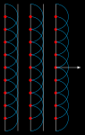](optics/plane-wave-fronts/plane-wave-fronts_inverted.svg) [[PDF]](optics/plane-wave-fronts/plane-wave-fronts_inverted.pdf) [[PNG]](optics/plane-wave-fronts/plane-wave-fronts_inverted.png) [[SVG]](optics/plane-wave-fronts/plane-wave-fronts_inverted.svg)
~~~.tex
\documentclass[crop,tikz]{standalone}
\usetikzlibrary{backgrounds}
\colorlet{blue}{cyan}
\tikzset{
  inverted/.style = {
    color=white,
    background rectangle/.style={fill},
    show background rectangle
  }
}

\tikzset{>=latex}

\begin{document}
\begin{tikzpicture}[inverted,inverted]
  \foreach \X in {0,0.5,1,1.5,2} { \draw (\X,0) -- +(0,5); }
  \foreach \X in {0,1,2} {%
    \foreach \Y in {0.5,1,...,4.5} {%
      \draw[blue] (\X,\Y)+(-90:0.5) arc (-90:90:0.5);
      \draw[fill,red] (\X,\Y) circle (0.05);
    }
  }
  \draw[->] (2,2.5) -- +(1,0);
\end{tikzpicture}
\end{document}
~~~
## reflection-law_inverted.svg
[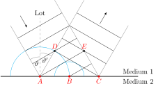](optics/reflection-law/reflection-law_inverted.svg) [[PDF]](optics/reflection-law/reflection-law_inverted.pdf) [[PNG]](optics/reflection-law/reflection-law_inverted.png) [[SVG]](optics/reflection-law/reflection-law_inverted.svg)
~~~.tex
\documentclass[crop,tikz]{standalone}
\usetikzlibrary{backgrounds}
\colorlet{blue}{cyan}
\tikzset{
  inverted/.style = {
    color=white,
    background rectangle/.style={fill},
    show background rectangle
  }
}

\tikzset{>=latex}
\usetikzlibrary{calc}

% Centered arc
% Syntax: [draw options] (center) (initial angle:final angle:radius)
\def\centerarc[#1](#2)(#3:#4:#5);%
{
  \draw[#1]([shift=(#3:#5)]#2) arc (#3:#4:#5);
}

\begin{document}
\begin{tikzpicture}[inverted,inverted]
  \coordinate (a) at (1,0);
  \coordinate (b) at (2.5,0);
  \coordinate (c) at (4,0);
  % boundary
  \draw[thick] (-1,0) -- +(7,0) node[above] {Medium $1$} node[below] {Medium $2$};
  % plumb
  \draw[gray,dashed] (a) -- +(0,3) node[above,white] {Lot};
  \centerarc[gray](a)(90:120:1);
  \node[below] at ($(a)+(100:1)+(0,-0.08)$) {$\vartheta$};
  \centerarc[gray](a)(60:90:1.2);
  \node[below] at ($(a)+(80:1.2)+(0.05,-0.1)$) {$\vartheta'$};
  % elementary wave
  \draw[fill,red] (a) circle (0.05) node[below] {$A$};
  \centerarc[blue](a)(180:0:0.5*3);
  % elementary wave
  \draw[fill,red] (b) circle (0.05) node[below] {$B$};
  \centerarc[blue](b)(180:0:0.5*1.5);
  % elementary wave
  \draw[fill,red] (c) circle (0.05) node[below] {$C$};
  % wave fronts
  \draw[] (a) -- +(30:0.866*3);
  \draw[] (b) -- +(30:0.866*1.5);
  \foreach \X in {1,2,3} { \draw ($(a)+(120:0.5*1.5*\X)$) -- +(30:0.866*3); };
  \foreach \X in {0,1,2,3} { \draw ($(c)+(60:0.5*1.5*\X)$) -- +(150:0.866*3); };
  % boundary
  \draw[gray] (a) -- +(120:3);
  \draw[gray] (a) -- +(60:3+0.5*3);
  \draw[gray] (c) -- +(120:3+0.5*3);
  \draw[gray] (c) -- +(60:3+0);
  % arrows
  \draw[->] (0,3.1) -- +(-60:0.7);
  \draw[->] ($(b)+(60:3.1)$) -- +(60:0.7);
  % points
  \coordinate (d) at ($(c)+(150:0.866*3)$);
  \coordinate (e) at ($(a)+(30:0.866*3)$);
  \draw[fill] (d) circle (0.04);
  \draw[fill] (e) circle (0.04);
  \node[above,red] at (d) {$D$};
  \node[above,red] at (e) {$E$};
\end{tikzpicture}
\end{document}
~~~
## refraction-law_inverted.svg
[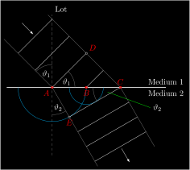](optics/refraction-law/refraction-law_inverted.svg) [[PDF]](optics/refraction-law/refraction-law_inverted.pdf) [[PNG]](optics/refraction-law/refraction-law_inverted.png) [[SVG]](optics/refraction-law/refraction-law_inverted.svg)
~~~.tex
\documentclass[crop,tikz]{standalone}
\usetikzlibrary{backgrounds}
\colorlet{blue}{cyan}
\tikzset{
  inverted/.style = {
    color=white,
    background rectangle/.style={fill},
    show background rectangle
  }
}

\tikzset{>=latex}
\usetikzlibrary{calc}

% Centered arc
% Syntax: [draw options] (center) (initial angle:final angle:radius)
\def\centerarc[#1](#2)(#3:#4:#5);%
{
  \draw[#1]([shift=(#3:#5)]#2) arc (#3:#4:#5);
}

\begin{document}
\begin{tikzpicture}[inverted,inverted]
  \coordinate (a) at (1,0);
  \coordinate (b) at (2.5,0);
  \coordinate (c) at (4,0);
  % boundary
  \draw[thick] (-1,0) -- +(7,0) node[above] {Medium $1$} node[below] {Medium $2$};
  % plumb
  \draw[gray,dashed] (a) -- +(0,3.2) node[above right,white] {Lot} -- +(0,-3);
  \centerarc[gray](a)(90:135:1);
  \node[below] at ($(a)+(105:1)+(0,-0.1)$) {$\vartheta_1$};
  \centerarc[gray](a)(0:45:1);
  \node[left] at ($(a)+(20:1)+(0,-0.1)$) {$\vartheta_1$};
  \centerarc[gray](a)(-60:-90:1.2);
  \node[above] at ($(a)+(-75:1.3)+(-0.08,0.1)$) {$\vartheta_2$};
  \centerarc[gray](c)(180:210:1.2);
  \draw[green] ($(c)+(200:0.6)$) -- +(-20:2) node[right,white] {$\vartheta_2$};
  % elementary wave
  \draw[fill,red] (a) circle (0.05) node[below left] {$A$};
  \centerarc[blue](a)(180:360:0.5*3);
  % elementary wave
  \draw[fill,red] (b) circle (0.05) node[below] {$B$};
  \centerarc[blue](b)(180:360:0.5*1.5);
  % elementary wave
  \draw[fill,red] (c) circle (0.05) node[above] {$C$};
  % wave fronts
  \draw[] (a) -- +(45:0.707*3);
  \draw[] (b) -- +(45:0.707*1.5);
  \foreach \X in {1,2} { \draw ($(a)+(135:0.707*1.5*\X)$) -- +(45:0.707*3); };
  \foreach \X in {0,1,2,3} { \draw ($(c)+(-60:0.5*1.5*\X)$) -- +(-150:0.866*3); };
  % border
  \draw[gray] (a) -- +(135:3);
  \draw[gray] (a) -- +(-60:3+0.5*2);
  \draw[gray] (c) -- +(135:3+0.5*3);
  \draw[gray] (c) -- +(-60:3);
  % arrows
  \draw[->] ($(b)+(135:4)$) -- +(-45:0.7);
  \draw[->] ($(b)+(-60:3.1)$) -- +(-60:0.7);
  % points
  \coordinate (d) at ($(c)+(135:0.707*3)$);
  \coordinate (e) at ($(a)+(-60:1.5*0.5*2)$);
  \draw[fill] (d) circle (0.04);
  \draw[fill] (e) circle (0.04);
  \node[above right,red] at (d) {$D$};
  \node[below,red] at (e) {$E$};
\end{tikzpicture}
\end{document}
~~~
## thin-layer_inverted.svg
[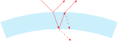](optics/thin-layer/thin-layer_inverted.svg) [[PDF]](optics/thin-layer/thin-layer_inverted.pdf) [[PNG]](optics/thin-layer/thin-layer_inverted.png) [[SVG]](optics/thin-layer/thin-layer_inverted.svg)
~~~.tex
\documentclass[crop,tikz]{standalone}
\usetikzlibrary{backgrounds}
\colorlet{blue}{cyan}
\tikzset{
  inverted/.style = {
    color=white,
    background rectangle/.style={fill},
    show background rectangle
  }
}

\tikzset{>=latex}
\usetikzlibrary{calc}

\begin{document}
\begin{tikzpicture}[inverted,inverted]
  \draw[fill,cyan!20] (110:10) arc (110:70:10) -- (70:9) arc (70:110:9) -- cycle;
  \coordinate (a) at (92:10);
  \coordinate (b) at (90:9);
  \coordinate (c) at (88:10);
  \draw[->,red] (a)+(135:1) -- (a) -- ($(a)+(45:1)$);
  \draw[->,red] (a) -- (b);
  \draw[->,red] (b) -- (c);
  \draw[->,red] (c) -- ($(c)+(45:1)$);
  \draw[->,red,dashed] (b) -- ($(b)+(-45:1)$);
  \draw[->,red,dashed] (c) -- (86:9);
\end{tikzpicture}
\end{document}
~~~
