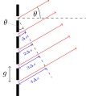
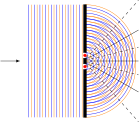
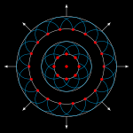
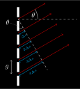
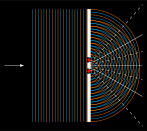
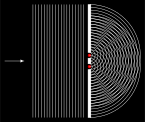
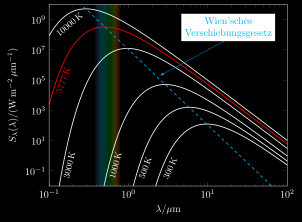
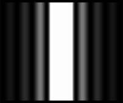

# Optics
## aperture.svg
 [[PDF]](optics/aperture/aperture.pdf) [[PNG]](optics/aperture/aperture.png) [[SVG]](optics/aperture/aperture.svg) [[TEX]](optics/aperture/aperture.tex)
## circular-wave-fronts.svg
 [[PDF]](optics/circular-wave-fronts/circular-wave-fronts.pdf) [[PNG]](optics/circular-wave-fronts/circular-wave-fronts.png) [[SVG]](optics/circular-wave-fronts/circular-wave-fronts.svg) [[TEX]](optics/circular-wave-fronts/circular-wave-fronts.tex)
## diffraction-grating-schematic-2.svg
 [[PDF]](optics/diffraction-grating-schematic-2/diffraction-grating-schematic-2.pdf) [[PNG]](optics/diffraction-grating-schematic-2/diffraction-grating-schematic-2.png) [[SVG]](optics/diffraction-grating-schematic-2/diffraction-grating-schematic-2.svg) [[TEX]](optics/diffraction-grating-schematic-2/diffraction-grating-schematic-2.tex)
## diffraction-grating-schematic.svg
 [[PDF]](optics/diffraction-grating-schematic/diffraction-grating-schematic.pdf) [[PNG]](optics/diffraction-grating-schematic/diffraction-grating-schematic.png) [[SVG]](optics/diffraction-grating-schematic/diffraction-grating-schematic.svg) [[TEX]](optics/diffraction-grating-schematic/diffraction-grating-schematic.tex)
## diffraction-grating-wavelength-2.svg
 [[PDF]](optics/diffraction-grating-wavelength-2/diffraction-grating-wavelength-2.pdf) [[PNG]](optics/diffraction-grating-wavelength-2/diffraction-grating-wavelength-2.png) [[SVG]](optics/diffraction-grating-wavelength-2/diffraction-grating-wavelength-2.svg) [[TEX]](optics/diffraction-grating-wavelength-2/diffraction-grating-wavelength-2.tex)
## diffraction-grating-wavelength.svg
 [[PDF]](optics/diffraction-grating-wavelength/diffraction-grating-wavelength.pdf) [[PNG]](optics/diffraction-grating-wavelength/diffraction-grating-wavelength.png) [[SVG]](optics/diffraction-grating-wavelength/diffraction-grating-wavelength.svg) [[TEX]](optics/diffraction-grating-wavelength/diffraction-grating-wavelength.tex)
## diffraction-single-slit.svg
 [[PDF]](optics/diffraction-single-slit/diffraction-single-slit.pdf) [[PNG]](optics/diffraction-single-slit/diffraction-single-slit.png) [[SVG]](optics/diffraction-single-slit/diffraction-single-slit.svg) [[TEX]](optics/diffraction-single-slit/diffraction-single-slit.tex)
## diffraction-single-slit-overview.svg
 [[PDF]](optics/diffraction-single-slit-overview/diffraction-single-slit-overview.pdf) [[PNG]](optics/diffraction-single-slit-overview/diffraction-single-slit-overview.png) [[SVG]](optics/diffraction-single-slit-overview/diffraction-single-slit-overview.svg) [[TEX]](optics/diffraction-single-slit-overview/diffraction-single-slit-overview.tex)
## huygens-aperture.svg
 [[PDF]](optics/huygens-aperture/huygens-aperture.pdf) [[PNG]](optics/huygens-aperture/huygens-aperture.png) [[SVG]](optics/huygens-aperture/huygens-aperture.svg) [[TEX]](optics/huygens-aperture/huygens-aperture.tex)
## huygens-double-slit-2.svg
 [[PDF]](optics/huygens-double-slit-2/huygens-double-slit-2.pdf) [[PNG]](optics/huygens-double-slit-2/huygens-double-slit-2.png) [[SVG]](optics/huygens-double-slit-2/huygens-double-slit-2.svg) [[TEX]](optics/huygens-double-slit-2/huygens-double-slit-2.tex)
## huygens-double-slit.svg
 [[PDF]](optics/huygens-double-slit/huygens-double-slit.pdf) [[PNG]](optics/huygens-double-slit/huygens-double-slit.png) [[SVG]](optics/huygens-double-slit/huygens-double-slit.svg) [[TEX]](optics/huygens-double-slit/huygens-double-slit.tex)
## lens-diacaustic.svg
 [[PDF]](optics/lens-diacaustic/lens-diacaustic.pdf) [[PNG]](optics/lens-diacaustic/lens-diacaustic.png) [[SVG]](optics/lens-diacaustic/lens-diacaustic.svg) [[TEX]](optics/lens-diacaustic/lens-diacaustic.tex)
## lens-paraxial.svg
 [[PDF]](optics/lens-paraxial/lens-paraxial.pdf) [[PNG]](optics/lens-paraxial/lens-paraxial.png) [[SVG]](optics/lens-paraxial/lens-paraxial.svg) [[TEX]](optics/lens-paraxial/lens-paraxial.tex)
## mirror-catacaustic.svg
 [[PDF]](optics/mirror-catacaustic/mirror-catacaustic.pdf) [[PNG]](optics/mirror-catacaustic/mirror-catacaustic.png) [[SVG]](optics/mirror-catacaustic/mirror-catacaustic.svg) [[TEX]](optics/mirror-catacaustic/mirror-catacaustic.tex)
## mirror-parabolic.svg
 [[PDF]](optics/mirror-parabolic/mirror-parabolic.pdf) [[PNG]](optics/mirror-parabolic/mirror-parabolic.png) [[SVG]](optics/mirror-parabolic/mirror-parabolic.svg) [[TEX]](optics/mirror-parabolic/mirror-parabolic.tex)
## plancks-law.svg
 [[PDF]](optics/plancks-law/plancks-law.pdf) [[PNG]](optics/plancks-law/plancks-law.png) [[SVG]](optics/plancks-law/plancks-law.svg) [[TEX]](optics/plancks-law/plancks-law.tex)
## plane-wave-fronts.svg
 [[PDF]](optics/plane-wave-fronts/plane-wave-fronts.pdf) [[PNG]](optics/plane-wave-fronts/plane-wave-fronts.png) [[SVG]](optics/plane-wave-fronts/plane-wave-fronts.svg) [[TEX]](optics/plane-wave-fronts/plane-wave-fronts.tex)
## reflection-law.svg
 [[PDF]](optics/reflection-law/reflection-law.pdf) [[PNG]](optics/reflection-law/reflection-law.png) [[SVG]](optics/reflection-law/reflection-law.svg) [[TEX]](optics/reflection-law/reflection-law.tex)
## refraction-law.svg
 [[PDF]](optics/refraction-law/refraction-law.pdf) [[PNG]](optics/refraction-law/refraction-law.png) [[SVG]](optics/refraction-law/refraction-law.svg) [[TEX]](optics/refraction-law/refraction-law.tex)
## single-slit-interference-and-intensity.svg
 [[PDF]](optics/single-slit-interference-and-intensity/single-slit-interference-and-intensity.pdf) [[PNG]](optics/single-slit-interference-and-intensity/single-slit-interference-and-intensity.png) [[SVG]](optics/single-slit-interference-and-intensity/single-slit-interference-and-intensity.svg) [[TEX]](optics/single-slit-interference-and-intensity/single-slit-interference-and-intensity.tex)
## single-slit-interference.svg
 [[PDF]](optics/single-slit-interference/single-slit-interference.pdf) [[PNG]](optics/single-slit-interference/single-slit-interference.png) [[SVG]](optics/single-slit-interference/single-slit-interference.svg) [[TEX]](optics/single-slit-interference/single-slit-interference.tex)
## thin-layer.svg
 [[PDF]](optics/thin-layer/thin-layer.pdf) [[PNG]](optics/thin-layer/thin-layer.png) [[SVG]](optics/thin-layer/thin-layer.svg) [[TEX]](optics/thin-layer/thin-layer.tex)
## aperture_inverted.svg
 [[PDF]](optics/aperture/aperture_inverted.pdf) [[PNG]](optics/aperture/aperture_inverted.png) [[SVG]](optics/aperture/aperture_inverted.svg) [[TEX]](optics/aperture/aperture_inverted.tex)
## circular-wave-fronts_inverted.svg
 [[PDF]](optics/circular-wave-fronts/circular-wave-fronts_inverted.pdf) [[PNG]](optics/circular-wave-fronts/circular-wave-fronts_inverted.png) [[SVG]](optics/circular-wave-fronts/circular-wave-fronts_inverted.svg) [[TEX]](optics/circular-wave-fronts/circular-wave-fronts_inverted.tex)
## diffraction-grating-schematic-2_inverted.svg
 [[PDF]](optics/diffraction-grating-schematic-2/diffraction-grating-schematic-2_inverted.pdf) [[PNG]](optics/diffraction-grating-schematic-2/diffraction-grating-schematic-2_inverted.png) [[SVG]](optics/diffraction-grating-schematic-2/diffraction-grating-schematic-2_inverted.svg) [[TEX]](optics/diffraction-grating-schematic-2/diffraction-grating-schematic-2_inverted.tex)
## diffraction-grating-schematic_inverted.svg
 [[PDF]](optics/diffraction-grating-schematic/diffraction-grating-schematic_inverted.pdf) [[PNG]](optics/diffraction-grating-schematic/diffraction-grating-schematic_inverted.png) [[SVG]](optics/diffraction-grating-schematic/diffraction-grating-schematic_inverted.svg) [[TEX]](optics/diffraction-grating-schematic/diffraction-grating-schematic_inverted.tex)
## diffraction-grating-wavelength-2_inverted.svg
 [[PDF]](optics/diffraction-grating-wavelength-2/diffraction-grating-wavelength-2_inverted.pdf) [[PNG]](optics/diffraction-grating-wavelength-2/diffraction-grating-wavelength-2_inverted.png) [[SVG]](optics/diffraction-grating-wavelength-2/diffraction-grating-wavelength-2_inverted.svg) [[TEX]](optics/diffraction-grating-wavelength-2/diffraction-grating-wavelength-2_inverted.tex)
## diffraction-grating-wavelength_inverted.svg
 [[PDF]](optics/diffraction-grating-wavelength/diffraction-grating-wavelength_inverted.pdf) [[PNG]](optics/diffraction-grating-wavelength/diffraction-grating-wavelength_inverted.png) [[SVG]](optics/diffraction-grating-wavelength/diffraction-grating-wavelength_inverted.svg) [[TEX]](optics/diffraction-grating-wavelength/diffraction-grating-wavelength_inverted.tex)
## diffraction-single-slit_inverted.svg
 [[PDF]](optics/diffraction-single-slit/diffraction-single-slit_inverted.pdf) [[PNG]](optics/diffraction-single-slit/diffraction-single-slit_inverted.png) [[SVG]](optics/diffraction-single-slit/diffraction-single-slit_inverted.svg) [[TEX]](optics/diffraction-single-slit/diffraction-single-slit_inverted.tex)
## diffraction-single-slit-overview_inverted.svg
 [[PDF]](optics/diffraction-single-slit-overview/diffraction-single-slit-overview_inverted.pdf) [[PNG]](optics/diffraction-single-slit-overview/diffraction-single-slit-overview_inverted.png) [[SVG]](optics/diffraction-single-slit-overview/diffraction-single-slit-overview_inverted.svg) [[TEX]](optics/diffraction-single-slit-overview/diffraction-single-slit-overview_inverted.tex)
## huygens-aperture_inverted.svg
 [[PDF]](optics/huygens-aperture/huygens-aperture_inverted.pdf) [[PNG]](optics/huygens-aperture/huygens-aperture_inverted.png) [[SVG]](optics/huygens-aperture/huygens-aperture_inverted.svg) [[TEX]](optics/huygens-aperture/huygens-aperture_inverted.tex)
## huygens-double-slit-2_inverted.svg
 [[PDF]](optics/huygens-double-slit-2/huygens-double-slit-2_inverted.pdf) [[PNG]](optics/huygens-double-slit-2/huygens-double-slit-2_inverted.png) [[SVG]](optics/huygens-double-slit-2/huygens-double-slit-2_inverted.svg) [[TEX]](optics/huygens-double-slit-2/huygens-double-slit-2_inverted.tex)
## huygens-double-slit_inverted.svg
 [[PDF]](optics/huygens-double-slit/huygens-double-slit_inverted.pdf) [[PNG]](optics/huygens-double-slit/huygens-double-slit_inverted.png) [[SVG]](optics/huygens-double-slit/huygens-double-slit_inverted.svg) [[TEX]](optics/huygens-double-slit/huygens-double-slit_inverted.tex)
## lens-diacaustic_inverted.svg
 [[PDF]](optics/lens-diacaustic/lens-diacaustic_inverted.pdf) [[PNG]](optics/lens-diacaustic/lens-diacaustic_inverted.png) [[SVG]](optics/lens-diacaustic/lens-diacaustic_inverted.svg) [[TEX]](optics/lens-diacaustic/lens-diacaustic_inverted.tex)
## lens-paraxial_inverted.svg
 [[PDF]](optics/lens-paraxial/lens-paraxial_inverted.pdf) [[PNG]](optics/lens-paraxial/lens-paraxial_inverted.png) [[SVG]](optics/lens-paraxial/lens-paraxial_inverted.svg) [[TEX]](optics/lens-paraxial/lens-paraxial_inverted.tex)
## mirror-catacaustic_inverted.svg
 [[PDF]](optics/mirror-catacaustic/mirror-catacaustic_inverted.pdf) [[PNG]](optics/mirror-catacaustic/mirror-catacaustic_inverted.png) [[SVG]](optics/mirror-catacaustic/mirror-catacaustic_inverted.svg) [[TEX]](optics/mirror-catacaustic/mirror-catacaustic_inverted.tex)
## mirror-parabolic_inverted.svg
 [[PDF]](optics/mirror-parabolic/mirror-parabolic_inverted.pdf) [[PNG]](optics/mirror-parabolic/mirror-parabolic_inverted.png) [[SVG]](optics/mirror-parabolic/mirror-parabolic_inverted.svg) [[TEX]](optics/mirror-parabolic/mirror-parabolic_inverted.tex)
## plancks-law_inverted.svg
 [[PDF]](optics/plancks-law/plancks-law_inverted.pdf) [[PNG]](optics/plancks-law/plancks-law_inverted.png) [[SVG]](optics/plancks-law/plancks-law_inverted.svg) [[TEX]](optics/plancks-law/plancks-law_inverted.tex)
## plane-wave-fronts_inverted.svg
 [[PDF]](optics/plane-wave-fronts/plane-wave-fronts_inverted.pdf) [[PNG]](optics/plane-wave-fronts/plane-wave-fronts_inverted.png) [[SVG]](optics/plane-wave-fronts/plane-wave-fronts_inverted.svg) [[TEX]](optics/plane-wave-fronts/plane-wave-fronts_inverted.tex)
## reflection-law_inverted.svg
 [[PDF]](optics/reflection-law/reflection-law_inverted.pdf) [[PNG]](optics/reflection-law/reflection-law_inverted.png) [[SVG]](optics/reflection-law/reflection-law_inverted.svg) [[TEX]](optics/reflection-law/reflection-law_inverted.tex)
## refraction-law_inverted.svg
 [[PDF]](optics/refraction-law/refraction-law_inverted.pdf) [[PNG]](optics/refraction-law/refraction-law_inverted.png) [[SVG]](optics/refraction-law/refraction-law_inverted.svg) [[TEX]](optics/refraction-law/refraction-law_inverted.tex)
## single-slit-interference-and-intensity_inverted.svg
 [[PDF]](optics/single-slit-interference-and-intensity/single-slit-interference-and-intensity_inverted.pdf) [[PNG]](optics/single-slit-interference-and-intensity/single-slit-interference-and-intensity_inverted.png) [[SVG]](optics/single-slit-interference-and-intensity/single-slit-interference-and-intensity_inverted.svg) [[TEX]](optics/single-slit-interference-and-intensity/single-slit-interference-and-intensity_inverted.tex)
## single-slit-interference_inverted.svg
 [[PDF]](optics/single-slit-interference/single-slit-interference_inverted.pdf) [[PNG]](optics/single-slit-interference/single-slit-interference_inverted.png) [[SVG]](optics/single-slit-interference/single-slit-interference_inverted.svg) [[TEX]](optics/single-slit-interference/single-slit-interference_inverted.tex)
## thin-layer_inverted.svg
 [[PDF]](optics/thin-layer/thin-layer_inverted.pdf) [[PNG]](optics/thin-layer/thin-layer_inverted.png) [[SVG]](optics/thin-layer/thin-layer_inverted.svg) [[TEX]](optics/thin-layer/thin-layer_inverted.tex)
