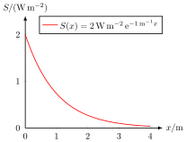
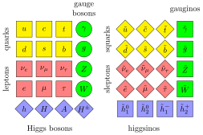
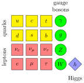
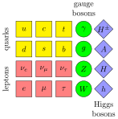
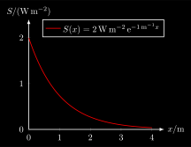
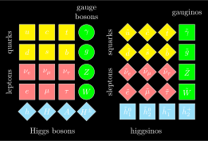
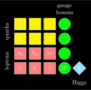

# Quantum Mechanics
## absorption.svg
 [[PDF]](quantum/absorption/absorption.pdf) [[PNG]](quantum/absorption/absorption.png) [[SVG]](quantum/absorption/absorption.svg) [[TEX]](quantum/absorption/absorption.tex)
## mssm.svg
 [[PDF]](quantum/mssm/mssm.pdf) [[PNG]](quantum/mssm/mssm.png) [[SVG]](quantum/mssm/mssm.svg) [[TEX]](quantum/mssm/mssm.tex)
## standard_model.svg
 [[PDF]](quantum/standard_model/standard_model.pdf) [[PNG]](quantum/standard_model/standard_model.png) [[SVG]](quantum/standard_model/standard_model.svg) [[TEX]](quantum/standard_model/standard_model.tex)
## thdm.svg
 [[PDF]](quantum/thdm/thdm.pdf) [[PNG]](quantum/thdm/thdm.png) [[SVG]](quantum/thdm/thdm.svg) [[TEX]](quantum/thdm/thdm.tex)
## absorption_inverted.svg
 [[PDF]](quantum/absorption/absorption_inverted.pdf) [[PNG]](quantum/absorption/absorption_inverted.png) [[SVG]](quantum/absorption/absorption_inverted.svg) [[TEX]](quantum/absorption/absorption_inverted.tex)
## mssm_inverted.svg
 [[PDF]](quantum/mssm/mssm_inverted.pdf) [[PNG]](quantum/mssm/mssm_inverted.png) [[SVG]](quantum/mssm/mssm_inverted.svg) [[TEX]](quantum/mssm/mssm_inverted.tex)
## standard_model_inverted.svg
 [[PDF]](quantum/standard_model/standard_model_inverted.pdf) [[PNG]](quantum/standard_model/standard_model_inverted.png) [[SVG]](quantum/standard_model/standard_model_inverted.svg) [[TEX]](quantum/standard_model/standard_model_inverted.tex)
## thdm_inverted.svg
 [[PDF]](quantum/thdm/thdm_inverted.pdf) [[PNG]](quantum/thdm/thdm_inverted.png) [[SVG]](quantum/thdm/thdm_inverted.svg) [[TEX]](quantum/thdm/thdm_inverted.tex)
