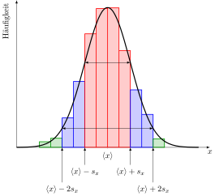
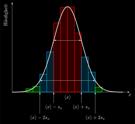

# Statistics
## standarddeviation.svg
 [[PDF]](statistics/standarddeviation/standarddeviation.pdf) [[PNG]](statistics/standarddeviation/standarddeviation.png) [[SVG]](statistics/standarddeviation/standarddeviation.svg) [[TEX]](statistics/standarddeviation/standarddeviation.tex)
## standarddeviation_inverted.svg
 [[PDF]](statistics/standarddeviation/standarddeviation_inverted.pdf) [[PNG]](statistics/standarddeviation/standarddeviation_inverted.png) [[SVG]](statistics/standarddeviation/standarddeviation_inverted.svg) [[TEX]](statistics/standarddeviation/standarddeviation_inverted.tex)
