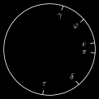

# Technics
## clockface.svg
 [[PDF]](technics/clockface/clockface.pdf) [[PNG]](technics/clockface/clockface.png) [[SVG]](technics/clockface/clockface.svg) [[TEX]](technics/clockface/clockface.tex)
## clockface-math-1.svg
 [[PDF]](technics/clockface-math-1/clockface-math-1.pdf) [[PNG]](technics/clockface-math-1/clockface-math-1.png) [[SVG]](technics/clockface-math-1/clockface-math-1.svg) [[TEX]](technics/clockface-math-1/clockface-math-1.tex)
## gear2.svg
 [[PDF]](technics/gear2/gear2.pdf) [[PNG]](technics/gear2/gear2.png) [[SVG]](technics/gear2/gear2.svg) [[TEX]](technics/gear2/gear2.tex)
## gear3.svg
 [[PDF]](technics/gear3/gear3.pdf) [[PNG]](technics/gear3/gear3.png) [[SVG]](technics/gear3/gear3.svg) [[TEX]](technics/gear3/gear3.tex)
## gear.svg
 [[PDF]](technics/gear/gear.pdf) [[PNG]](technics/gear/gear.png) [[SVG]](technics/gear/gear.svg) [[TEX]](technics/gear/gear.tex)
## clockface_inverted.svg
 [[PDF]](technics/clockface/clockface_inverted.pdf) [[PNG]](technics/clockface/clockface_inverted.png) [[SVG]](technics/clockface/clockface_inverted.svg) [[TEX]](technics/clockface/clockface_inverted.tex)
## clockface-math-1_inverted.svg
 [[PDF]](technics/clockface-math-1/clockface-math-1_inverted.pdf) [[PNG]](technics/clockface-math-1/clockface-math-1_inverted.png) [[SVG]](technics/clockface-math-1/clockface-math-1_inverted.svg) [[TEX]](technics/clockface-math-1/clockface-math-1_inverted.tex)
## gear2_inverted.svg
 [[PDF]](technics/gear2/gear2_inverted.pdf) [[PNG]](technics/gear2/gear2_inverted.png) [[SVG]](technics/gear2/gear2_inverted.svg) [[TEX]](technics/gear2/gear2_inverted.tex)
## gear3_inverted.svg
 [[PDF]](technics/gear3/gear3_inverted.pdf) [[PNG]](technics/gear3/gear3_inverted.png) [[SVG]](technics/gear3/gear3_inverted.svg) [[TEX]](technics/gear3/gear3_inverted.tex)
## gear_inverted.svg
 [[PDF]](technics/gear/gear_inverted.pdf) [[PNG]](technics/gear/gear_inverted.png) [[SVG]](technics/gear/gear_inverted.svg) [[TEX]](technics/gear/gear_inverted.tex)
